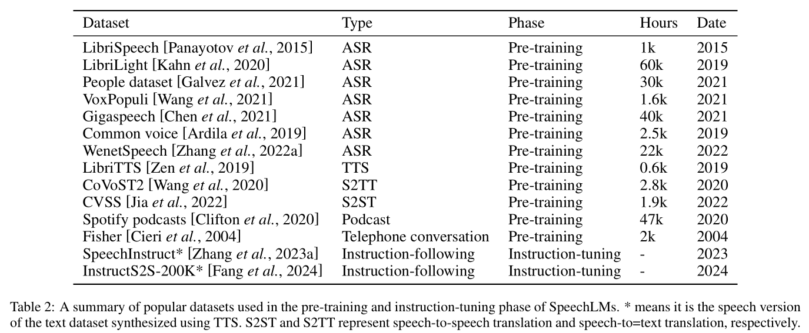
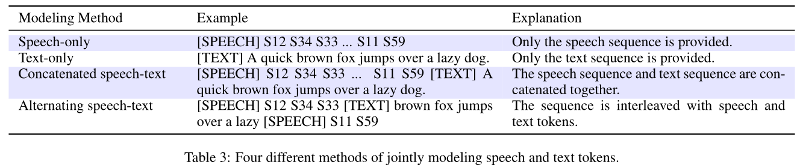

# 4.Training Recipes: 训练方法

展开原文

In this section, we categorize and summarize the commonly used training recipes found in recent SpeechLM papers.
This includes an overview of the types of features modeled in SpeechLMs, the various training stages along with the techniques employed in each stage, and the different paradigms for generating speech.

 

在本节中, 我们分类并总结了最近的语音语言模型论文中常用的训练方法.
这包括对语音语言模型中建模的特征类型, 训练阶段以及每个阶段所采用的技术, 以及用于生成语音的不同范式的概述.

## 4.1.Features Modeled: 特征建模

展开原文

The features modeled refer to the types of features outputted by the speech tokenizer and modeled by the language model component within a SpeechLM.
These features play a crucial role in determining the capabilities and performance of SpeechLMs.
Different features model the speech waveforms from different aspects.
Based on recent developments, we can categorize the features modeled by SpeechLMs into two main types, including discrete features and continuous features.

 

特征建模是指语音语言模型中由语音分词器输出和语言模型组件建模的特征类型.
这些特征在决定语音语言模型的能力和性能方面发挥着重要作用.
根据最近的发展, 我们可以将语音语言模型所建模的特征分为两种主要类型, 包括离散特征和连续特征.

### 4.1.1.Discrete Features: 离散特征

展开原文

Discrete features refer to quantized representations of speech signals that can be represented as distinct, countable units or tokens.
These features are typically derived from speech signals through various encoding and quantization processes, resulting in a finite set of possible values.
Discrete features are the most used features by SpeechLMs as they can be represented as tokens and be modeled exactly the same as the text tokens within a TextLM.
The majority of speech tokenizers produce discrete tokens that better model the **semantic information** within a speech waveform ([semantic understanding speech tokenizers](Sec.03.Components.md#311semantic-understanding-objective-语义理解目标)), such as [W2V-BERT (2021)](../../Models/Speech_Representaion/2021.08.07_W2V-BERT.md); [HuBERT (2021)](../../Models/Speech_Representaion/2021.06.14_HuBERT.md).
This is because they primarily use understanding objectives such as MLM to model the contextual information of the waveforms when training the tokenizer.
We refer to them as **semantic tokens** here.

Most SpeechLMs only employ **semantic tokens** to represent speech.
[GSLM (2021)](../../Models/SpeechLM/2021.02.01_GSLM.md) the first-ever SpeechLM, compares three tokenizers, which include [Contrastive Predictive Coding (CPC) (2018)](../../Models/Speech_Representaion/2018.07.10_CPC.md), [Wav2Vec 2.0 (2020)](../../Models/Speech_Representaion/2020.06.20_Wav2Vec2.0.md), and [HuBERT (2021)](../../Models/Speech_Representaion/2021.06.14_HuBERT.md).
It concludes that HuBERT performs the best on various tasks such as speech resynthesis and speech generation.
A large number of works follow this setting and use HuBERT as the speech tokenizer ([TWIST (2023)](../../Models/Speech_LLM/2023.05.22_TWIST.md); [SpiRit-LM (2024)](../../Models/Speech_LLM/2024.02.08_SpiRit-LM.md); [SpeechGPT (2023)](../../Models/Speech_LLM/2023.05.18_SpeechGPT.md)).
[AudioPaLM (2023)](../../Models/Speech_LLM/2023.06.22_AudioPaLM.md) experiments the choice between [W2V-BERT (2021)](../../Models/Speech_Representaion/2021.08.07_W2V-BERT.md) , USM-v1 ([Google USM (2023)](../../Models/Speech_LLM/2023.03.02_USM.md)), and USM-v2 ([AudioPaLM (2023)](../../Models/Speech_LLM/2023.06.22_AudioPaLM.md)) (which is a modified version of USM-v1), and it concludes that USM-v2 is the best-performing speech tokenizer on ASR and Speech Translation (ST) tasks.

Although semantic tokens excel at generating semantically meaningful speech because of the modeling of the contextual information within speech waveforms, researchers find out that the speech generated solely upon semantic tokens lacks expressive information such as prosody and different pitches or timbres ([Expresso (2023)](../../Datasets/2023.08.10_Expresso.md); [SpiRit-LM (2024)](../../Models/Speech_LLM/2024.02.08_SpiRit-LM.md)).
To conquer this limitation, **paralinguistic tokens** can be integrated into the modeling process to capture expressive information with speeches.
Specifically, [pGSLM (2021)](../../Models/SpeechLM/2021.09.07_pGSLM.md) proposes to use the fundamental frequency (F0) and unit duration as prosody features to complement the HuBERT semantic tokens, and trains a multi-stream transformer language model to predict the semantic tokens, pitch (F0), and unit duration separately.
Similarly, [SpiRit-LM (2024)](../../Models/Speech_LLM/2024.02.08_SpiRit-LM.md) complements the HuBERT semantic tokens with pitch and style tokens ([Sonar Expressive (2023)](../../Models/S2ST/Sonar_Expressive.md)).
This incorporation of extra acoustic tokens allows SpeechLMs to more effectively capture expressive elements without significantly compromising semantic understanding ([SpiRit-LM (2024)](../../Models/Speech_LLM/2024.02.08_SpiRit-LM.md)).

Another type is **acoustic tokens**, which are tokens aiming to capture the essential acoustic features to reconstruct high-fidelity speech, primarily obtained from neural audio codec models (see [Acoustic Generation Speech Tokenizers](Sec.03.Components.md#312acoustic-generation-objective-声学生成目标)).
Codec models aim to learn the compressed representation of audio, so it is anticipated that both the semantic and acoustic information present in a speech waveform can be encoded in the representation.
Some studies attempt to directly model the codec tokens in an autoregressive manner.
[VALL-E (2023)](../../Models/SpeechLM/2023.01.05_VALL-E.md) utilizes codec tokens to achieve zero-shot TTS.
It encodes a 3-second audio clip using [EnCodec (2022)](../../Models/Speech_Neural_Codec/2022.10.24_EnCodec.md) as a prompt, enabling the TTS system to synthesize speech that matches the timbre information of the prompt.
[VioLA (2023)](../../Models/Speech_LLM/2023.05.25_VioLA.md) uses codec tokens in a SpeechLM capable of performing ASR, TTS, and Machine Translation (in text).

 

离散特征是指语音信号的量化表示, 可以表示为不同的可数的单元或 Token.
这些特征通常通过各种编码和量化过程从语音信号中导出, 从而得到一组可能值的有限集合.
离散特征是语音语言模型中最常用的特征, 因为它们可以表示为 Token, 并且可以与文本语言模型中的文本 Token 完全相同的方式建模.
大多数语音分词器能够生成离散 Token 来更好地建模语音波形中的语义信息 ([语义理解语音分词器](Sec.03.Components.md#311semantic-understanding-objective-语义理解目标)), 例如 [W2V-BERT (2021)](../../Models/Speech_Representaion/2021.08.07_W2V-BERT.md); [HuBERT (2021)](../../Models/Speech_Representaion/2021.06.14_HuBERT.md).
这是因为它们主要使用理解目标例如 MLM 在训练分词器是建模波形的上下文信息.
在这里, 我们将它们称为**语义 Token (Semantic Tokens)**.

大多数语音语言模型仅采用语义 Token 来表示语音.
- [GSLM (2021)](../../Models/SpeechLM/2021.02.01_GSLM.md) 是首个语音语言模型, 它比较了三个分词器, 包括 [Contrastive Predictive Coding (CPC) (2018)](../../Models/Speech_Representaion/2018.07.10_CPC.md), [Wav2Vec 2.0 (2020)](../../Models/Speech_Representaion/2020.06.20_Wav2Vec2.0.md), 和 [HuBERT (2021)](../../Models/Speech_Representaion/2021.06.14_HuBERT.md). 它得出结论, HuBERT 在各种任务上都表现最佳, 如语音重建和语音生成. 大量工作都遵循这一设置并使用 HuBERT 作为语音分词器 ([TWIST (2023)](../../Models/Speech_LLM/2023.05.22_TWIST.md); [SpiRit-LM (2024)](../../Models/Speech_LLM/2024.02.08_SpiRit-LM.md); [SpeechGPT (2023)](../../Models/Speech_LLM/2023.05.18_SpeechGPT.md)).
- [AudioPaLM (2023)](../../Models/Speech_LLM/2023.06.22_AudioPaLM.md) 试验了 [W2V-BERT (2021)](../../Models/Speech_Representaion/2021.08.07_W2V-BERT.md) 、USM-v1 ([Google USM (2023)](../../Models/Speech_LLM/2023.03.02_USM.md)) 和 USM-v2 ([AudioPaLM (2023)](../../Models/Speech_LLM/2023.06.22_AudioPaLM.md)) (USM-v1 的修改版), 并得出结论, USM-v2 是语音分词器在 ASR 和 ST 任务上的最佳选择.

尽管语义 Token 由于建模语音波形中的上下文信息而在生成语义意义的语音方面表现优异, 但研究人员发现, 仅仅使用语义 Token 生成的语音缺乏表现力, 如语调和不同的音高或音色 ([Expresso (2023)](../../Datasets/2023.08.10_Expresso.md); [SpiRit-LM (2024)](../../Models/Speech_LLM/2024.02.08_SpiRit-LM.md)).
为了克服这一局限, **副语言 Token (Paralinguistic Tokens)** 可以被集成到建模过程中, 以捕捉表现性信息的语音.
- [pGSLM (2021)](../../Models/SpeechLM/2021.09.07_pGSLM.md) 提出使用基频 (F0) 和单元时长作为语调特征来补充 HuBERT 语义 Token, 并训练多路 Transformer 语言模型来分别预测语义 Token, 声调 (F0) 和单元持续时间.
- [SpiRit-LM (2024)](../../Models/Speech_LLM/2024.02.08_SpiRit-LM.md) 使用声调和风格 Token 补充 HuBERT 语义 Token ([Sonar Expressive (2023)](../../Models/S2ST/Sonar_Expressive.md)).
  这种额外的声学 Token 的整合允许语音语言模型能够有效地捕捉表现力元素而不显著牺牲语义理解 ([SpiRit-LM (2024)](../../Models/Speech_LLM/2024.02.08_SpiRit-LM.md)).

其他类型的 Token 是**声学 Token**, 它们旨在捕捉必要的声学特征以重构高保真度的语音, 主要来自神经音频编解码器模型 (参见 [Sec.3.1.2](Sec.03.Components.md#312acoustic-generation-objective-声学生成目标)).
编解码器模型旨在学习音频的压缩表示, 因此预计语音波形中的语义和声学信息都可以编码在表示中.
一些研究试图直接在自回归方式下对编解码器 Token 建模.
- [VALL-E (2023)](../../Models/SpeechLM/2023.01.05_VALL-E.md) 使用编解码器 Token 实现零样本 TTS.
  它使用 [EnCodec (2022)](../../Models/Speech_Neural_Codec/2022.10.24_EnCodec.md) 编码 3 秒的音频作为提示, 使得 TTS 系统能够合成与提示的音色信息匹配的语音.
- [VioLA (2023)](../../Models/Speech_LLM/2023.05.25_VioLA.md) 使用编解码器 Token 在语音语言模型中实现 ASR, TTS 和机器翻译 (文本).

#### Discussion: 讨论

展开原文

Different types of tokens influence the speech quality of SpeechLMs in different ways, often resulting in trade-offs ([AudioLM (2022)](../../Models/SpeechLM/2022.09.07_AudioLM.md)).
For example, while semantic tokens align well with text and excel in producing semantically coherent speech, the generated speech often lacks acoustic details, such as high-frequency information.
Recovering and enhancing these details typically requires postprocessing, like a diffusion model, which significantly increases the model's latency.
Conversely, acoustic tokens can facilitate the generation of high-fidelity audio but often struggle with inaccuracies in content generation ([SpeechTokenizer (2023)](../../Models/Speech_Neural_Codec/2023.08.31_SpeechTokenizer.md)).
Researchers have tried two ways to balance these trade-offs.
The first involves combining semantic and acoustic tokens into a single sequence.
[AudioLM (2022)](../../Models/SpeechLM/2022.09.07_AudioLM.md) proposes a hierarchical modeling scheme that first models semantic tokens from [W2V-BERT (2021)](../../Models/Speech_Representaion/2021.08.07_W2V-BERT.md)  and then uses these tokens to predict acoustic tokens from [SoundStream (2021)](../../Models/Speech_Neural_Codec/2021.07.07_SoundStream.md), which ultimately generates speech.
However, this kind of approach increases sequence length, which increases modeling complexity.
The second strategy leverages [**mixed tokens**](Sec.03.Components.md#313mixed-objective-混合目标) to jointly model semantic and acoustic information, showing promising results in [Moshi (2024)](../../Models/Speech_LLM/2024.09.17_Moshi.md) and [SpeechGPT-Gen (2024)](../../Models/Speech_LLM/2024.01.24_SpeechGPT-Gen.md).

 

不同类型的 Token 以不同的方式影响语音语言模型的语音质量, 通常需要权衡 ([AudioLM (2022)](../../Models/SpeechLM/2022.09.07_AudioLM.md)).
例如, 虽然语义 Token 与文本能够良好对齐, 并且在生成语义连贯的语音方面表现出色, 但生成的语音通常缺乏声学细节, 如高频信息.
恢复和增强这些细节通常需要后处理, 如扩散模型, 这会显著增加模型的延迟.
相反, 声学 Token 可以促进高保真音频的生成, 但在内容生成方面存在不确定性 ([SpeechTokenizer (2023)](../../Models/Speech_Neural_Codec/2023.08.31_SpeechTokenizer.md)).
研究人员尝试了两种方法来平衡这些权衡.

- 第一种方式: 将语义 Token 与声学 Token 结合为单一序列.
  [AudioLM (2022)](../../Models/SpeechLM/2022.09.07_AudioLM.md) 提出了分层建模方案, 首先建模来自 [W2V-BERT (2021)](../../Models/Speech_Representaion/2021.08.07_W2V-BERT.md) 的语义 Token, 然后使用这些 Token 预测来自 [SoundStream (2021)](../../Models/Speech_Neural_Codec/2021.07.07_SoundStream.md) 的声学 Token, 最后生成语音.
  这种方法可以显著减少序列长度, 但会增加模型的复杂度.
- 第二种方式: 利用[混合 Token](Sec.03.Components.md#313mixed-objective-混合目标) 来同时建模语义和声学信息.
  这种方式在 [Moshi (2024)](../../Models/Speech_LLM/2024.09.17_Moshi.md) 和 [SpeechGPT-Gen (2024)](../../Models/Speech_LLM/2024.01.24_SpeechGPT-Gen.md) 中都取得了良好的结果.

### 4.1.2.Continuous Features: 连续特征

展开原文

Continuous features, in contrast to discrete features, are unquantized, real-valued representations of speech signals that exist on a continuous scale.
These features capture fine-grained, nuanced aspects of speech that may be lost in discretization processes.
Continuous features can include spectral representations like mel-spectrograms or latent representations extracted from neural networks.
The exploration of leveraging continuous features to condition SpeechLMs is still in its infancy.
[Spectron (2023)](../../Models/Speech_LLM/2023.05.24_Spectron.md) performs speech continuation by predicting the spectrograms frame-by-frame.
However, the generation of speech spectrograms still needs to be conditioned on text transcripts, which is not an end-to-end speech generation approach.
[Mini-Omni (2024)](../../Models/MultiModal/2024.08.27_Mini-Omni.md) extracts intermediate representations from a frozen Whisper encoder as input for the SpeechLM, whereas [LauraGPT (2023)](../../Models/Speech_LLM/2023.10.07_LauraGPT.md) employs an audio encoder trained alongside the SpeechLM to derive latent representations from input speech.

 

连续特征与离散特征不同, 是语音信号的未量化的实值表示, 存在于连续尺度上.
这些特征捕获了语音的细粒度微妙的方面, 这些方面在离散化过程中可能丢失.
连续特征可以包括频谱表示 (如梅尔频谱) 或从神经网络中提取的隐表示.
利用连续特征来条件化语音语言模型的探索仍处于初步阶段.
[Spectron (2023)](../../Models/Speech_LLM/2023.05.24_Spectron.md) 通过逐帧预测语谱图来实现语音连续.
然而, 生成语音频谱图仍然需要根据文本转录作为条件, 这不是端到端语音生成方法.
[Mini-Omni (2024)](../../Models/MultiModal/2024.08.27_Mini-Omni.md) 从冻结的 Whisper 编码器中提取中间表示作为语音语言模型的输入.
[LauraGPT (2023)](../../Models/Speech_LLM/2023.10.07_LauraGPT.md) 采用与语音语言模型一起训练的音频编码器, 从输入语音中提取隐表示.

## 4.2.Training Stages: 训练阶段

展开原文

Training a SpeechLM involves training the three main components: speech tokenizer, language model, and vocoder.
Similar to TextLMs, the key to training SpeechLMs lies in effectively modeling speech continuation, which is primarily the responsibility of the language model.
The speech tokenizer and vocoder usually rely on established methods and are trained using distinct training datasets specific to each SpeechLM approach.
Therefore, This section reviews the main techniques used to train the language model component.

Following TextLMs, the training process for SpeechLMs can be divided into three stages: pre-training, instruction-tuning, and alignment.
However, to our knowledge, there is currently no research specifically focused on the alignment process following instruction tuning.
Therefore, we only discuss the works related to the pre-training and instruction-tuning stages of SpeechLMs.

 

训练一个语音语言模型涉及到训练三个主要组件: 语音分词器, 语言模型, 和声码器.
类似于文本语言模型, 训练语音语言模型的关键在于有效地建模语音连续, 这主要是语言模型的责任.
语音分词器和声码器通常依赖于成熟的方法, 并使用特定于每个语音语言模型方法的训练数据进行训练.
因此, 本节回顾了用于训练语言模型组件的主要技术.

与文本语言模型一样, 语音语言模型的训练过程可以分为三个阶段: 预训练, 指令调参, 和对齐.
然而, 目前还没有专门研究关注指令调参之后的对齐过程.
因此, 我们只讨论与语音语言模型预训练和指令调参阶段相关的工作.

### 4.2.1.Language Model Pre-Training: 语言模型预训练

展开原文

The pre-training of the language model in SpeechLMs is a critical phase that significantly influences the model's ability to generate coherent and contextually relevant speech.
This phase typically involves training the language model to autoregressively predict the next token on a large corpus of speech tokens.
The primary objective during this stage is to learn the statistical patterns and dependencies inherent in the speech data, enabling the model to predict the next token in a sequence based on the preceding context.
Table.02 includes popular datasets used in pre-training stage of SpeechLMs.

 

语音语言模型中语言模型的预训练是关键阶段, 它对模型的生成连贯且上下文相关的语音能力有着显著影响.
这一阶段通常涉及训练语言模型在大规模语音 Token 语料库上以自回归的方式预测下一个 Token.
这一阶段的主要目标是学习语音数据中的统计模式和依赖关系, 使模型能够根据前面的上下文预测序列中的下一个 Token.
表格 02 列出了语音语言模型预训练阶段常用的数据集.

#### Training Data: 训练数据

展开原文

SpeechLMs pre-training mainly leverages large-scale open-sourced speech data.
Commonly used datasets include those for ASR ([LibriSpeech (2015)](../../Datasets/2015.04.19_LibriSpeech.md); [Libri-Light (2019)](../../Datasets/2019.12.17_Libri-Light.md); [The People's Speech (2021)](../../Datasets/2021.11.17_The_People's_Speech.md); [VoxPopuli (2021)](../../Datasets/2021.01.02_VoxPopuli.md)), TTS ([LibriTTS (2019)](../../Datasets/2019.04.05_LibriTTS.md)), ST ([CVSS (2022)](../../Datasets/2022.01.11_CVSS.md); [VoxPopuli (2021)](../../Datasets/2021.01.02_VoxPopuli.md)), podcasts ([Spotify Podcast Dataset (2020)](../../Datasets/2020.04.08_Spotify_Podcast_Dataset.md)), and dialogues ([Fisher Corpus (2004)](../../Datasets/Fisher_Corpus.md)).
Some datasets consist solely of speech data, while others include both speech and corresponding text transcripts.
The inclusion of text transcripts can enhance the model's representation by allowing it to learn the relationship between spoken language and its written form, which will be discussed later.

 

语音语言模型预训练主要利用大规模开源语音数据.
常用的数据集包括用于 ASR ([LibriSpeech (2015)](../../Datasets/2015.04.19_LibriSpeech.md); [Libri-Light (2019)](../../Datasets/2019.12.17_Libri-Light.md); [The People's Speech (2021)](../../Datasets/2021.11.17_The_People's_Speech.md); [VoxPopuli (2021)](../../Datasets/2021.01.02_VoxPopuli.md)) 的语料库, 用于 TTS ([LibriTTS (2019)](../../Datasets/2019.04.05_LibriTTS.md)) 的语料库, 用于 ST ([CVSS (2022)](../../Datasets/2022.01.11_CVSS.md); [VoxPopuli (2021)](../../Datasets/2021.01.02_VoxPopuli.md)) 的语料库, 用于播客 ([Spotify Podcast Dataset (2020)](../../Datasets/2020.04.08_Spotify_Podcast_Dataset.md)) 的语料库, 以及用于对话 ([Fisher Corpus (2004)](../../Datasets/Fisher_Corpus.md)) 的语料库.

一些数据集仅包含语音数据, 而另一些数据集既包含语音数据, 也包含相应的文本转录.
包含文本转录可以增强模型的表示能力, 允许模型学习到口头语言与书面形式之间的关系, 后面会讨论到.

#### Cold Initialization: 冷初始化

展开原文

Some SpeechLMs use cold initialization during the pre-training phase, where model parameters are initialized randomly.
The pioneering SpeechLM---[GSLM (2021)](../../Models/SpeechLM/2021.02.01_GSLM.md)--trained a [Transformer (2017)](../../Models/_Transformer/2017.06.12_Transformer.md) from scratch to serve as the language model.
This study demonstrated the effectiveness of the SpeechLM pipeline and compared performance across various speech tokenizer options.
They found that [HuBERT (2021)](../../Models/Speech_Representaion/2021.06.14_HuBERT.md) outperformed [CPC (2018)](../../Models/Speech_Representaion/2018.07.10_CPC.md) and [Wav2vec 2.0 (2020)](../../Models/Speech_Representaion/2020.06.20_Wav2Vec2.0.md) in understanding speech content and generating natural speech.
[SUTLM (2023)](../../Models/Speech_LLM/2023.10.12_SUTLM.md) also uses a transformer as the language model.
They studied the critical problem of jointly modeling speech and text tokens by comparing four different modeling methods: speech-only, text-only, concatenated speech-text, and alternating (interleaving) speech-text.
They showed that the setting of alternating speech-text performs the best in cross-modal evaluations.
Table.03 illustrates the four modeling methods.

 

一些语音语言模型在与训练阶段使用冷初始化, 其中模型参数随机初始化.
- 最早的语音语言模型 [GSLM (2021)](../../Models/SpeechLM/2021.02.01_GSLM.md) 以从头开始训练 [Transformer (2017)](../../Models/_Transformer/2017.06.12_Transformer.md) 作为语言模型.
这一研究说明了语音语言模型流程的有效性, 并对不同的语音分词器选项进行了性能比较.
他们发现 [HuBERT (2021)](../../Models/Speech_Representaion/2021.06.14_HuBERT.md) 在理解语音内容和生成自然语音方面优于 [CPC (2018)](../../Models/Speech_Representaion/2018.07.10_CPC.md) 和 [Wav2vec 2.0 (2020)](../../Models/Speech_Representaion/2020.06.20_Wav2Vec2.0.md).
- [SUTLM (2023)](../../Models/Speech_LLM/2023.10.12_SUTLM.md) 也使用了 Transformer 作为语言模型.
他们研究了联合建模语音和文本 Token 时的关键问题, 通过比较四种不同的建模方法: 仅语音, 仅文本, 连接语音文本, 交替 (交错) 语音文本.
他们发现交替语音文本的设置在跨模态评估中表现最佳.
表 03 总结了四种建模方法.

展开原文

Some works leverage a different architecture from the standard transformer.
Since there are no existing checkpoints for those self-proposed architectures, it is necessary to train them from scratch.
For example, [pGSLM (2021)](../../Models/SpeechLM/2021.09.07_pGSLM.md) proposes a multi-stream transformer language model (MS-TLM) that takes multiple streams of input and predicts multiple streams of output to generate speech units, duration, and pitch embeddings simultaneously.
[dGSLM (2022)](../../Models/SpeechLM/2022.03.30_dGSLM.md) introduced a dialogue transformer language model (DLM) to jointly model the dialogue speech data from the two speakers.
To enable the listening ability of SpeechLMs while speaking, [LSLM (2024)](../../Models/Speech_LLM/2024.08.05_LSLM.md) proposes to attach a streaming self-supervised learning (SSL) Encoder to an autoregressive token-based TTS Model.
[VioLA (2023)](../../Models/Speech_LLM/2023.05.25_VioLA.md) introduced a multi-task auto-regressive codec language model to autoregressively generate codec tokens instead of speech unit tokens.

 

一些工作采用了来自标准 Transformer 的不同架构.
因为对于这些自创的架构没有现有的权重检查点, 因此需要从头开始训练它们.
- [pGSLM (2021)](../../Models/SpeechLM/2021.09.07_pGSLM.md) 提出了多路的 Transformer 语言模型 (MS-TLM), 接受多个输入流, 预测多个输出流, 来同时生成语音单元, 时长, 和音高嵌入.
- [dGSLM (2022)](../../Models/SpeechLM/2022.03.30_dGSLM.md) 引入了对话 Transformer 语言模型 (DLM), 用于联合建模两个发言人的对话语音数据.
- [LSLM (2024)](../../Models/Speech_LLM/2024.08.05_LSLM.md) 为了使得语音语言模型在说话时具有听觉能力, 提出一种流式自监督学习 (SSL) 编码器, 并将其附加到自回归 Token-based TTS 模型.
- [VioLA (2023)](../../Models/Speech_LLM/2023.05.25_VioLA.md) 引入了一个多任务自回归编解码语言模型 (MLAC), 用于自回归生成编解码器 Token, 而不是语音单元 Token.

#### Continued Pre-Training: 继续预训练

展开原文

In contrast to cold initialization, continued Pre-Training involves initializing the language model with pre-trained weights from a TextLM and then adapting it to handle speech tokens.
This approach leverages the linguistic knowledge embedded in TextLMs, allowing for more efficient and effective training of SpeechLMs.
Research by [TWIST (2023)](../../Models/Speech_LLM/2023.05.22_TWIST.md) found that starting with a textually pre-trained language model ([OPT (2022)](../../Models/TextLM/2022.05.02_OPT.md) and [LLaMA (2023)](../../Models/TextLM/2023.02.27_LLaMA.md)) can enhance the model's convergence rate and significantly improve its speech understanding capabilities.
They also demonstrated that while training from text-pretrained checkpoints outperforms cold initialization, training from image-pretrained checkpoints yields poorer results compared to cold initialization.
This indicates that not all pre-trained checkpoints are equally effective.
Additionally, [AudioPaLM (2023)](../../Models/Speech_LLM/2023.06.22_AudioPaLM.md) trained the SpeechLM using [PaLM (2022)](../../Models/TextLM/2022.04.05_PaLM.md) and [PaLM-2 (2023)](../../Models/TextLM/2023.05.17_PaLM2.md), showing that the SpeechLM benefits from both an increased size of the pre-trained checkpoint and a larger training dataset.

The performance of SpeechLMs can be further enhanced by **aligning** the text and speech modality representations.
[SpiRit-LM (2024)](../../Models/Speech_LLM/2024.02.08_SpiRit-LM.md) found that continually pretraining on TextLM checkpoints using interleaving text and speech tokens can significantly boost the model's performance on speech understanding and generation.
Additionally, their visualizations demonstrate that the similarity between text and speech features is notably higher in models trained with interleaved token sequences compared to those trained without this approach.
[AudioChatLLaMA (2023)](../../Models/Speech_LLM/2023.11.12_AudioChatLLaMA.md) aims to ensure that the model produces consistent outputs regardless of whether the input is text or speech.
They address this challenge by treating text data in ASR datasets as prompts, allowing LLaMA to generate the corresponding responses.
Consequently, both text and speech versions of the prompt can be utilized to train the model to provide the appropriate response.
[Spectron (2023)](../../Models/Speech_LLM/2023.05.24_Spectron.md) solves the text-speech representation alignment problem by jointly supervising multiple objectives.
Specifically, the input speech prompt is first transcribed into its text tokens, and then the model predicts the text token response.
Finally, the text response is synthesized to output speech.

 

和冷初始化相比, 继续预训练涉及使用预训练的 TextLM 权重来初始化语言模型, 然后将其修改为处理语音 Token.
这种方法利用 TextLM 中内嵌的语言知识, 允许更有效和高效地训练语音语言模型.
[TWIST (2023)](../../Models/Speech_LLM/2023.05.22_TWIST.md) 的研究发现从文本预训练语言模型 ([OPT (2022)](../../Models/TextLM/2022.05.02_OPT.md) 和 [LLaMA (2023)](../../Models/TextLM/2023.02.27_LLaMA.md)) 开始, 可以增强模型的收敛率并显著提高其语音理解能力.
他们还证明虽然从文本预训练检查点开始训练优于冷初始化训练的结果, 但从图像预训练检查点开始训练得到的结果差于冷初始化训练.
这表明并非所有预训练检查点都具有相同的有效性.
此外, [AudioPaLM (2023)](../../Models/Speech_LLM/2023.06.22_AudioPaLM.md) 使用 [PaLM (2022)](../../Models/TextLM/2022.04.05_PaLM.md) 和 [PaLM-2 (2023)](../../Models/TextLM/2023.05.17_PaLM2.md) 训练语音语言模型, 展示了语音语言模型受到预训练检查点的大小和训练数据集的增大所带来的好处.

语音语言模型的性能可以通过**对齐**文本和语音模态表示来进一步提高.
- [SpiRit-LM (2024)](../../Models/Speech_LLM/2024.02.08_SpiRit-LM.md) 发现继续预训练 TextLM 检查点使用交替的文本和语音 Token 序列可以显著提高模型在语音理解和生成上的性能.
  此外, 他们的可视化表明了文本和语音特征之间的相似性在交替 Token 序列训练的模型中显著高于不使用该方法训练的模型.
- [AudioChatLLaMA (2023)](../../Models/Speech_LLM/2023.11.12_AudioChatLLaMA.md) 旨在确保模型在输入为文本或语音时都能产生一致的输出.
  他们通过将 ASR 数据集中的文本数据用作提示, 使 LLaMA 生成相应的响应来解决这个问题.
  因此, 模型可以利用文本和语音版本的提示来训练, 以提供适当的响应.
- [Spectron (2023)](../../Models/Speech_LLM/2023.05.24_Spectron.md) 通过多目标监督联合训练模型解决了文本-语音表示对齐问题.
  具体地, 输入语音提示首先被转录成文本 Token, 然后模型预测文本 Token 响应.
  最后, 文本响应被合成输出语音.

### 4.2.2.Language Model Instruction-Tuning: 语言模型指令微调

展开原文

Instruction-tuning refers to the process of fine-tuning SpeechLMs to follow specific instructions to perform a wide range of tasks.
This phase is crucial for enhancing the pre-trained model's generalization capabilities and making it more adaptable to diverse applications.
Therefore, the key focus is on creating effective instruction-following datasets.

Several approaches have been proposed to construct instruction-following datasets for SpeechLMs.
[SpeechGPT (2023)](../../Models/Speech_LLM/2023.05.18_SpeechGPT.md) and [SpeechGPT-Gen (2024)](../../Models/Speech_LLM/2024.01.24_SpeechGPT-Gen.md) propose a two-stage instruction-tuning, including cross-modal instruction fine-tuning and chain-of-modality instruction fine-tuning.
In the first stage, instruction data are generated based on ASR datasets by appending the instruction to paired ASR data, asking the model to convert speech into text.
Similarly, paired data is also used to create instruction data for performing TTS.
In the second stage, they construct a speech-in-speech-out dataset by transforming a text-based instruction-following dataset using TTS.
[LLaMA-Omni (2024)](../../Models/MultiModal/2024.09.10_LLaMA-Omni.md) also creates instruction-following data by synthesizing text-based datasets, adhering to specific constraints.
First, they transform the input text prompt into a format that mimics natural speech patterns.
Next, they discard the original text response and employ a TextLM to generate answers to the converted prompts, ensuring these responses also follow natural speech patterns.
Finally, they synthesize the prompt/response pairs using TTS.
[COSMIC (2023)](../../Models/Speech_LLM/2023.11.03_COSMIC.md) constructed speech QA data by asking GPT-3.5 to generate question-answer pairs based on the transcriptions of English TED talk speeches.
They showed the model trained on their proposed speech QA dataset can generalize to unseen tasks such as speech-to-text translation using in-context learning.

 

指令微调是指堆语音语言模型进行微调, 使其遵循特定指令以执行广泛的任务.
这一阶段对于增强预训练模型的泛化能力并使其更适应多样化应用至关重要.
因此, 关键在于创建有效的指令遵循数据集.

已经提出了几种方法来构建语音语言模型的指令遵循数据集.
- [SpeechGPT (2023)](../../Models/Speech_LLM/2023.05.18_SpeechGPT.md) 和 [SpeechGPT-Gen (2024)](../../Models/Speech_LLM/2024.01.24_SpeechGPT-Gen.md) 提出了一种两阶段的指令微调, 包括跨模态指令微调和链式模态指令微调.
第一阶段, 基于 ASR 数据集生成指令数据, 通过将指令附加到配对的 ASR 数据中, 要求模型将语音转换为文本.
类似地, 配对的数据也用于创建 TTS 的指令数据.
第二阶段, 通过使用 TTS 转换基于文本的指令遵循数据集来构造语音-语音的数据集.
- [LLaMA-Omni (2024)](../../Models/MultiModal/2024.09.10_LLaMA-Omni.md) 也通过合成基于文本的数据集来创建指令遵循数据集, 遵循特定约束.
  首先, 将输入文本提示转换为模仿自然语音模式的格式.
  然后, 丢弃原始文本响应, 使用 TextLM 生成转换后提示的答案, 确保这些答案也遵循自然语音模式.
  最后, 使用 TTS 合成提示/响应对.
- [COSMIC (2023)](../../Models/Speech_LLM/2023.11.03_COSMIC.md) 通过询问 GPT-3.5 基于英语 TED 演讲语音的转录来生成问答对, 构建语音问答数据集.
他们展示了在他们提出的语音问答数据集上训练的模型可以使用上下文学习泛化到未见过的任务, 如语音到文本的翻译.

## 4.3.Speech Generation Paradigm: 语音生成范式

展开原文

In the previous sections, we discuss the typical generation paradigm for SpeechLMs, which involves taking a predefined input sequence and generating a complete response.
However, this approach does not reflect the natural flow of voice interactions.
For instance, during a conversation, one person may interrupt another, switching from listening to speaking.
Additionally, a person might choose not to respond if the other is engaged in a conversation with someone else.
Based on these observations, we identify two key aspects of advanced voice interaction skills for SpeechLMs: real-time interaction and silence mode.

 

在先前的章节中, 我们讨论了语音语言模型的典型生成范式, 涉及使用预定义的输入序列并生成完整的响应.
然而, 这种方法并不能反映语音交互的自然流动.
例如, 在对话过程中, 一个人可能会打断另一个, 从而切换从倾听到说话.
此外, 一个人可能选择不作答, 如果另一个正在与其他人进行对话.
基于这些观察, 我们认为语音语言模型的高级语音交互技能有两个关键方面: 实时交互和静默模式.

### Real-time Interaction: 实时交互

展开原文

Real-time Interaction refers to the capability of SpeechLMs to engage with users instantaneously.
This interaction consists of two key components:

- User Interruption: SpeechLMs should be able to be interrupted by users and should respond appropriately to new instructions provided during the conversation.
- Simultaneous Response: SpeechLMs should be capable of generating responses while the user is still speaking.

Both of these abilities require the model to effectively perform speech understanding (processing input) and speech generation (producing output) simultaneously.
The study by [dGSLM (2022)](../../Models/SpeechLM/2022.03.30_dGSLM.md) introduces a dual-transformer architecture to model two-speaker dialogues, using one transformer to handle speech from each speaker.
A cross-attention transformer layer is included to capture the interactions between the speakers' content.
In contrast, [LSLM (2024)](../../Models/Speech_LLM/2024.08.05_LSLM.md) proposes a different approach, utilizing a single decoder-only Transformer to model one speaker's speech in the dialogue.
This model incorporates a streaming SSL encoder that continuously processes input from the listening channel and fuses its embeddings with those from the speaking channel.

 

实时交互是指语音语言模型能够即时与用户进行交互的能力.
这一交互由两个关键组件组成:
- 用户打断: 语音语言模型应该能够被用户打断, 并应适当地响应对话过程中提供新的指令.
- 同时响应: 语音语言模型应该能够在用户仍在说话的情况下生成响应.

这两种能力都需要模型同时有效地执行语音理解 (处理输入) 和语音生成 (产生输出).
- [dGSLM (2022)](../../Models/SpeechLM/2022.03.30_dGSLM.md) 的研究引入了一个双 Transformer 架构, 用于处理两个发言人的对话, 使用一个 Transformer 来处理每个发言人的语音.
引入了一个交叉注意力 Transformer 层, 以捕捉发言人的内容之间的互动.
- [LSLM (2024)](../../Models/Speech_LLM/2024.08.05_LSLM.md) 提出了一个不同的方法, 使用单个的仅解码器的 Transformer 模型来处理对话中的一个发言人的语音.
  该模型包含一个流式 SSL 编码器, 持续处理来自听觉通道的输入, 并将其嵌入和说话通道的嵌入融合.

### Silence Mode: 静默模式

展开原文

Silence Mode refers to the state in which the SpeechLMs remain inactive or silent during periods of non-interaction.
This mode is essential for creating a natural conversational flow, allowing the model to avoid unnecessary interruptions.
It is crucial for situations where a small group of users is having a discussion, as the SpeechLM needs to discern when to join in and when to stay silent.
Additionally, it is important for the model to learn when to disregard instructions when users are not speaking at it.
[VITA (2024)](../../Models/MultiModal/2024.08.09_VITA.md) is currently the only work that integrates silence mode.
This method involves training the model on both query speech and non-query audio, which may include environmental sounds or non-query speech.
As a result, the model learns to output the **end-of-sequence** token to terminate its response when non-query audio is detected.

 

静默模式指的是语音语言模型在非交互期间保持无声或静默的状态.
这一模式对于创建自然的对话流是至关重要的, 允许模型避免不必要的中断.
这在小组用户讨论的情况下尤其重要, 因为语音语言模型需要辨别何时加入, 何时保持沉默.
此外, 对于模型来说, 学习何时忽略指令, 当用户不说话时尤为重要.
目前唯一集成静默模式的方法是 [VITA (2024)](../../Models/MultiModal/2024.08.09_VITA.md).
该方法涉及在查询语音和非查询音频上训练模型, 这可能包括环境声音或非查询语音.
因此, 当检测到非查询音频时, 模型学会输出**终止序列** Token 以终止其响应.