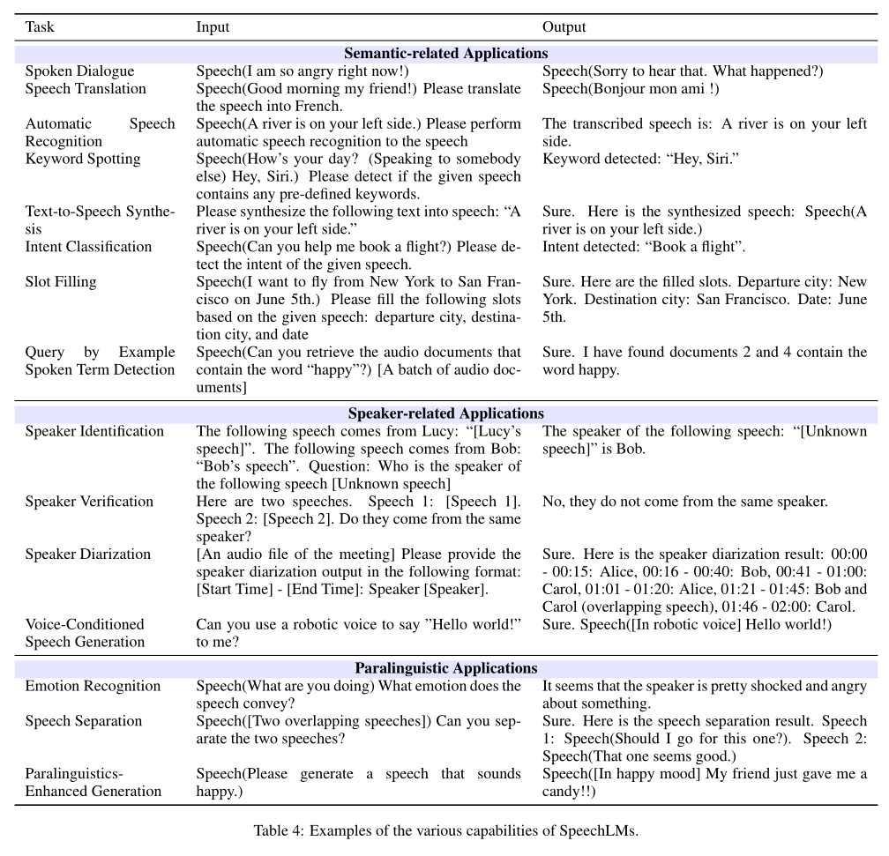

# 5.Downstream Applications: 下游应用

展开原文

Unlike traditional speech systems like ASR and TTS, which usually focus on specific tasks, SpeechLMs function as generative foundation models.
They can handle a diverse array of speech-only, text-only, and multi-modal tasks by following various instructions.
In this section, we explore the primary downstream applications of SpeechLMs.
The tasks discussed here primarily consist of traditional speech-related tasks, along with some that are unique to SpeechLMs.
In contrast to TextLMs, which generate text containing only semantic information, SpeechLMs can model both semantic and paralinguistic information---such as pitch and timbre---making them more powerful models.
We thereby categorize the downstream applications of SpeechLMs into three main classes: semantic-related applications, speaker-related applications, and paralinguistic applications.

 

和传统的语音系统如 ASR 和 TTS 通常关注特定任务不同, 语音语言模型是作为生成基础模型而存在的.
它们可以遵循各种指令来处理仅语音, 仅文本和多模态任务.
本节探讨了语音语言模型的主要下游应用.
讨论的任务主要是传统语音相关任务, 还有一些语音语言模型特有的任务.
与文本语言模型生成仅有语义信息的文本不同, 语音语言模型可以建模语义和副语言信息, 如音高和音色, 因此更为强大.
我们将语音语言模型的下游应用分为三个主要类别: 语义相关应用, 说话人相关应用, 和副语言应用.

## 5.1.Semantic-Related Applications: 语义相关应用

Semantic-related applications encompass key tasks that facilitate meaningful interactions between humans and machines.
These applications require SpeechLMs to understand the semantic meaning of the input and generate responses that are not only contextually relevant but also logically coherent.
The primary Semantic-related applications of SpeechLMs are as follows.

### Spoken Dialogue: 语音对话

Spoken dialogue is the most natural application of SpeechLMs.
Spoken dialogue systems are designed to facilitate natural conversations between humans and machines in spoken format.
They can engage users in interactive exchanges, understanding and generating responses based on the context of the conversation.
Unlike TextLMs, SpeechLMs are able to perform conversations with humans directly in speech, which is a more natural way of communication.
Note that SpeechLMs can not only perform speech-only dialogues but also perform cross-modal dialogues, such as taking texts as input and responding in speech format.

### Speech Translation: 语音翻译

Speech translation (ST) is the process of converting spoken language from one language to another.
Similar to Spoken dialogue, SpeechLMs can perform ST in both single-modal and cross-modal settings.
Specifically, the input and output of the ST task can be either in text or speech format.

### Automated Speech Recognition: 自动语音识别

Automatic speech recognition (ASR) enables systems to convert spoken language into text.
The input of ASR is a speech waveform, and the system outputs the transcription in textual form.
For SpeechLMs, the input would be a combination of the speech waveform and the instruction to tell the model to perform ASR on the given speech.

### Keyword Spotting: 关键字识别

Keyword spotting can be considered a special type of ASR, where its primary objective is to identify specific words or phrases within continuous speech.
While traditional ASR systems aim to transcribe entire spoken utterances into text, keyword spotting focuses specifically on identifying and extracting predefined keywords or phrases within continuous speech.
The primary application of keyword spotting is to build voice-activated assistants in smart home devices.
Those devices are activated when the specific keywords are triggered.
Therefore, although SpeechLMs are capable of spotting and understanding more than just a couple of words, keyword spotting can be used to efficiently trigger SpeechLMs to respond to user inputs.

### Text-to-Speech Synthesis: 文本转语音合成

Text-to-speech synthesis (TTS) enables systems to synthesize written text into spoken language.
In contrast to ASR, TTS takes text as input and outputs the converted speech waveform.
Similarly, the input of the SpeechLMs would be a combination of the text to synthesize and the instruction, and the output is the synthesized speech.

### Intent Classification: 意图分类

Intent classification is a critical task that identifies the underlying intention behind a user's input speech.
The AI system can then perform certain actions based on the identified user intent (e.g., book a flight).
Intent classification is particularly important in applications such as virtual assistants, customer service bots, and interactive voice response systems.
To perform Intent Classification, it is more natural for SpeechLMs to take speech inputs and classify the results in text since it is easier to parse and classify the intent classification result in text than speech.

### Slot Filling: 词槽填充

Slot filling is an important task in spoken language understanding that involves identifying and extracting specific pieces of information from user inputs into predefined classes, such as intents, entities, and parameters that are essential for completing a task.
For example, slot filling extracts the phrase `I want to fly from New York to San Francisco on June 5th.` into distinct slots like `departure city` (New York), `destination city` (San Francisco), and `date` (June 5th).
Similar to Intent Classification, it is more natural for SpeechLMs to take speech inputs and extract the pieces in texts.

### Query by Example Spoken Term Detection: 查询示例语音术语检测

Another spoken term detection task is query by example spoken term detection (QbE-STD), which allows users to identify specific spoken terms or phrases within a larger audio stream by providing an example of the desired term.
Unlike traditional keyword spotting methods that rely on predefined lists of keywords, QbE-STD leverages the flexibility of example-based querying, enabling users to specify their search terms through audio samples.

## 5.2.Speaker-Related Applications: 说话人相关应用

Speaker-related applications refer to the tasks that involve the processing of information related to speaker identity.
It could involve classification tasks such as identifying, verifying, and distinguishing individual speakers based on their unique vocal characteristics, as well as generation tasks such as maintaining or modifying the timbre of a given speech.
While we acknowledge that voice characteristics can be considered paralinguistic information, we believe that speaker-related applications are unique because they enable SpeechLMs to function in complex scenarios such as participating in multi-speaker conversations.
In this section, we survey common speaker-related applications of SpeechLMs.

### Speaker Identification: 说话人识别

Speaker identification is the process of recognizing a person's identity based on their voice characteristics.
It is a multi-class classification of a given speech as input.
SpeechLMs can perform this task by taking an input speech and outputting the classification result in text or speech format.
Moreover, SpeechLMs can also identify different speakers implicitly.
Specifically, it can chat with multiple speakers at the same time, distinguishing the words from different speakers and responding to each speaker appropriately.

### Speaker Verification: 说话人验证

Speaker verification involves determining whether the speakers of a pair of speeches match with each other.
Unlike speaker identification, which is a multi-class classification process, speaker verification is a binary classification process.

### Speaker Diarization: 说话人分割

Speaker diarization is the process of partitioning an audio stream into segments according to the identity of the speakers.
It predicts "who is speaking when" for each timestamp ([SUPERB (2021)](../../Evaluations/2021.05.03_SUPERB.md)).
A natural way to integrate speaker diarization into SpeechLMs is to have the model generate the transcript of each audio segment along with the identification of the speaker.

### Voice-Conditioned Speech Generation: 声学条件下的语音生成

Voice-conditioned speech generation involves synthesizing speech based on the vocal characteristics of a specific speaker.
This could involve voice cloning and voice conversion.
Voice cloning utilizes a sample of the speaker's voice as a reference, enabling the model to reproduce the speaker's timbre when generating speech from input text.
Voice conversion, on the other hand, modifies an existing speech signal to sound like it was produced by a different speaker while retaining the original content.
Additionally, instead of giving the target vocal characteristics, SpeechLMs should also be able to adapt their output timbre based on various speech or text instructions.

## 5.3.Paralinguistic Applications: 副语言应用

Paralinguistics refers to the non-verbal elements of communication that accompany spoken language.
It encompasses various vocal attributes that convey meaning beyond the actual words spoken.
These elements can significantly influence how messages are interpreted and understood.
The key elements of paralinguistics include pitch, timbre, column, rate of speech, pauses, etc.
Since combining elements in paralinguistics in different ways can result in a speech with different emotions, we include emotion-related tasks as paralinguistic applications as well.

### Emotion Recognition: 情绪识别

Emotion recognition task involves identifying and classifying the emotion carried by a given speech into predefined classes.
Similar to speaker identification, SpeechLMs are capable of not only directly performing this task but also implicitly recognizing users' emotions through their speech queries and responding accordingly.

### Speech Separation: 语音分离

Speech separation refers to the process of isolating individual speech signals from a mixture of sounds, such as when multiple speakers are talking simultaneously.
When separating the input speech, SpeechLMs can not only output the contents of each person in speech but also in text format (i.e., transcriptions).

### Paralinguistics-Enhanced Generation: 副语言增强生成

Paralinguistics-enhanced generation refers to the process of instructing SpeechLMs to produce speech that exhibits specific paralinguistic characteristics.
Users can define these characteristics in their prompts, allowing the model to generate speech that aligns with their specifications.
Examples of paralinguistics-enhanced generation include synthesizing speech with a specific style, speaking at a fast pace, and even singing.
This capability distinguishes SpeechLMs from TextLMs and facilitates a more engaging and interactive form of communication with the AI models.
