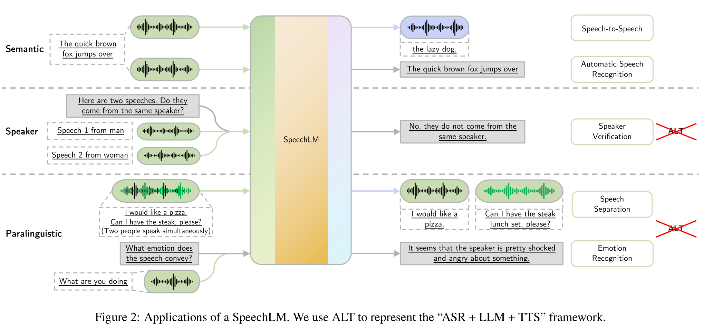

# Recent Advances in Speech Language Models: A Survey

基本信息

- 标题: "Recent Advances in Speech Language Models: A Survey"
- 作者:
  - 01 Wenqian Cui - 香港中文大学 CUHK
  - 02 Dianzhi Yu - 香港中文大学 CUHK
  - 03 Xiaoqi Jiao - 腾讯 LightSpeed Studios
  - 04 Ziqiao Meng - 香港中文大学 CUHK
  - 05 Guangyan Zhang - 腾讯 LightSpeed Studios
  - 06 Qichao Wang - 腾讯 AI Lab
  - 07 Yiwen Guo - 独立研究者
  - 08 Irwin King - 香港中文大学 CUHK
- 链接:
  - [ArXiv](https://arxiv.org/abs/2410.03751)
  - [Publication]
  - [Github]
  - [Demo]
- 文件:
  - [ArXiv](2410.03751v1__Survey__Recent_Advances_in_Speech_Language_Models__A_Survey.pdf)
  - [Publication] #TODO

## Abstract: 摘要

展开原文

Large Language Models (LLMs) have recently garnered significant attention, primarily for their capabilities in text-based interactions.
However, natural human interaction often relies on speech, necessitating a shift towards voice-based models.
A straightforward approach to achieve this involves a pipeline of "Automatic Speech Recognition (ASR) + LLM + Text-to-Speech (TTS)", where input speech is transcribed to text, processed by an LLM, and then converted back to speech.
Despite being straightforward, this method suffers from inherent limitations, such as information loss during modality conversion and error accumulation across the three stages.
To address these issues, Speech Language Models (SpeechLMs)---end-to-end models that generate speech without converting from text---have emerged as a promising alternative.
This survey paper provides the first comprehensive overview of recent methodologies for constructing SpeechLMs, detailing the key components of their architecture and the various training recipes integral to their development.
Additionally, we systematically survey the various capabilities of SpeechLMs, categorize the evaluation metrics for SpeechLMs, and discuss the challenges and future research directions in this rapidly evolving field.

 

大语言模型 (Large Language Models, LLMs) 最近获得了越来越多的关注, 主要用于文本交互的能力.
然而, 自然的人类交互往往依赖于语音, 因此需要转移到基于声音的模型.
实现这一目标的一个直接的方法是使用 "自动语音识别 (Automatic Speech Recognition, ASR) + 大语言模型 LLM + 文本转语音 (Text-to-Speech, TTS)" 构成的流程, 其中输入的语音被转录为文本, 然后被 LLM 处理, 并转换回语音.
尽管这种方法很直接, 但它也存在固有的限制, 如在模态转换过程中的信息丢失和三个阶段的错误累积.
为了解决这些问题, 出现了**语音语言模型 (Speech Language Models, SpeechLMs)**, 即无需从文本转换而直接生成语音的模型, 成为一个有前途的替代方案.
本综述首次全面概述了构造语音语言模型的近期方法, 详细介绍了其架构的关键组件和用于开发的各种训练方法.
此外, 我们系统地调查了语音语言模型的各种能力, 分类了评估指标, 并讨论了该领域的挑战和未来研究方向.

## 1.Introduction: 引言

展开原文

Large Language Models (LLMs) have demonstrated remarkable capabilities in generating text and performing a wide array of natural language processing tasks ([GPT-4 (2023)](../../Models/TextLM/2023.03.15_GPT-4.md); [LLaMA3 (2024)](../../Models/TextLM/2024.07.31_LLaMA3.md); [OPT (2022)](../../Models/TextLM/2022.05.02_OPT.md)), serving as powerful foundation models for AI-driven language understanding and generation.
Their success has also spurred numerous applications in various other domains, yet the reliance solely on text-based modalities presents a significant limitation.
This leads to the development of speech-based generative models, which allow to interact with humans more naturally and intuitively.
The inclusion of speech not only facilitates real-time voice interactions but also enriches communication by combining both text and speech information ([dGSLM (2022)](../../Models/SpokenDialogue/2022.03.30_dGSLM.md); [SpiRit-LM (2024)](../../Models/SpeechLM/2024.02.08_SpiRit-LM.md)).

Given the extensive mutual information between text and speech, it is natural to modify existing LLMs to enable speech interaction capabilities.
A straightforward approach is to adopt an "Automatic Speech Recognition (ASR) + LLM + Text-to-Speech (TTS)" framework (Fig.01 (a)) ([AudioGPT (2023)](../../Models/SpokenDialogue/2023.04.25_AudioGPT.md)).
In this setup, the user's spoken input is first processed by the ASR module, which converts it into text.
The LLM then generates a text response based on this transcription.
Finally, the TTS module transforms the text response back into speech, which is played back to the user.
However, this naive solution mainly suffers from the following two problems.
(1) **Information loss.** Speech signals not only contain semantic information (i.e., the meaning of the speech) but also paralinguistic information (e.g., pitch, timbre, tonality, etc.).
Putting a text-only LLM in the middle will cause the complete loss of paralinguistic information in the input speech ([SpeechGPT (2023)](../../Models/SpokenDialogue/2023.05.18_SpeechGPT.md)).
(2) **Cumulative error.** A staged approach like this can easily lead to cumulative errors throughout the pipeline, particularly in the ASR-LLM stage ([AudioChatLLaMA (2023)](../../Models/SpeechLM/2023.11.12_AudioChatLLaMA.md)).
Specifically, transcription errors that occur when converting speech to text in the ASR module can negatively impact the language generation performance of the LLM.

The limitations of the naive ASR + LLM + TTS framework have led to the development of Speech Language Models (SpeechLMs, Fig.01 (b)).
Unlike the naive framework, SpeechLMs directly encode speech waveforms into discrete tokens, capturing essential features and information from audio ([Section.3.1](Sec.03.Components.md#31speech-tokenizer-语音分词器)).
Although individual speech tokens may not carry word-level semantic meaning, they capture the semantic information of speech utterances and retain valuable paralinguistic information, which prevents the information loss.
SpeechLMs then model these tokens autoregressively, without solely relying on text input, which allows them to use the additional paralinguistic information to generate more expressive and nuanced speech ([Section.3.2](Sec.03.Components.md#32language-model-语言模型)).
Finally, the generated tokens are synthesized back to speech ([Section.3.3](Sec.03.Components.md#33token-to-speech-synthesizer-vocoder-音素转语音合成器)).
By working directly with the encoded speech tokens, SpeechLMs effectively mitigate the cumulative errors, as their training is integrated with the speech encoding, whereas the training of LLMs (language modeling) is completely independent of the ASR (speech recognition) module in the naive framework.

 

大语言模型 (Large Language Models, LLMs) 在生成文本和执行各种自然语言处理任务方面展现出了惊人的能力  ([GPT-4 (2023)](../../Models/TextLM/2023.03.15_GPT-4.md); [LLaMA3 (2024)](../../Models/TextLM/2024.07.31_LLaMA3.md); [OPT (2022)](../../Models/TextLM/2022.05.02_OPT.md)), 正在作为 AI 驱动语言理解和生成的强大基础模型.
其成功也促进了其他领域的许多应用, 然而, 仅依靠文本输入的限制会导致语音交互的局限性.
这也导致了基于语音的生成模型的发展, 以允许人类更自然和直观地与之交互.
语音的引入不仅可以促进实时语音交互, 而且还可以增强交流, 因为它可以结合文本和语音信息 ([dGSLM (2022)](../../Models/SpokenDialogue/2022.03.30_dGSLM.md); [SpiRit-LM (2024)](../../Models/SpeechLM/2024.02.08_SpiRit-LM.md)).

给定文本和语音之间的广泛互信息, 可以自然地修改现有的 LLMs 以实现语音交互能力.
一种直接的方法是采用 "自动语音识别 (ASR) + LLM + 文本转语音 (TTS)" 框架 (Fig.01 (a)) ([AudioGPT (2023)](../../Models/SpokenDialogue/2023.04.25_AudioGPT.md)).
在这种设置中, 用户的说话输入首先被 ASR 模块处理, 它将其转换为文本.
然后, LLM 根据此转录文本生成文本响应.
最后, TTS 模块将文本响应转换回语音, 并播放给用户.
然而, 这种简单的解决方案主要存在以下两个问题.
(1) **信息损失.** 语音信号不仅包含语义信息 (即语音的含义), 还包含其他副语言信息 (如音高, 音色, 音调等).
将文本 LLM 放在中间将导致输入语音丢失全部的副语言信息 ([SpeechGPT (2023)](../../Models/SpokenDialogue/2023.05.18_SpeechGPT.md)).
(2) **累积错误.** 这种分阶段的方法容易导致流水线中的累积错误, 特别是在 ASR-LLM 阶段 ([AudioChatLLaMA (2023)](../../Models/SpeechLM/2023.11.12_AudioChatLLaMA.md)).
具体来说, ASR 模块将语音转换为文本时发生的错误会对 LLM 的语言生成性能产生负面影响.

这种简单的 "ASR + LLM + TTS" 框架的局限性激发了**语音语言模型 (Speech Language Models, SpeechLMs)** 的发展 (Fig.01 (b)).
与简单框架不同, 语音语言模型直接将语音波形编码为离散的 Token, 捕捉音频中的本质特征和信息. ([Section.3.1](Sec.03.Components.md#31speech-tokenizer-语音分词器)).
尽管单个语音 Token 可能没有词级的语义意义, 但它们捕捉了语音话语的语义信息并保留了有价值的副语言信息, 从而防止信息损失 ([Section.3.2](Sec.03.Components.md#32language-model-语言模型)).
语音语言模型随后自回归地建模这些 Token, 不单纯依赖文本输入, 这使得它们能够利用额外的副语言信息, 生成更具有表现力和细节细腻的语音.
最后, 生成的 Token 被合成为语音 ([Section.3.3](Sec.03.Components.md#33token-to-speech-synthesizer-vocoder-音素转语音合成器)).
通过直接处理编码的语音 Token, 语音语言模型有效地减轻了累计错误, 因为它们的训练与语音编码相结合, 而简单框架中 LLM (语言建模) 训练和 ASR (语音识别) 模块完全独立.

展开原文

Beyond basic conversational abilities, SpeechLMs hold the potential to undertake more complex tasks, such as encoding speaker-specific information and emotional nuances (Fig.02).
This capability allows SpeechLMs to distinguish between different speakers during a conversation and to comprehend and generate speech imbued with specific emotional tones.
Such advancements are crucial for applications in areas like personalized assistants, emotion-aware systems, and more nuanced human-computer interaction scenarios.
Furthermore, SpeechLMs can be designed to enable real-time voice interaction, where the model can be interrupted by humans or choose to speak while the user is still speaking, which resembles the pattern of human conversations more closely.

In this survey, we present the first comprehensive overview of recent endeavors in constructing SpeechLMs.
We explore the various components that constitute their architecture ([Sec.03](Sec.03.Components.md)) and the training recipes ([Sec.04](Sec.04.Recipes.md)) involved in their development.
we aim to elucidate the current state of the field by analyzing these models from the above perspectives.
Additionally, we survey the downstream applications of SpeechLMs ([Sec.05](Sec.05.Applications.md)), classify metrics to evaluate SpeechLMs ([Sec.06](Sec.06.Evaluations.md)), discuss the challenges encountered in this rapidly evolving area, and outline promising future research directions that could drive further advancements in SpeechLM technology ([Sec.07](#7challenges-and-future-directions-挑战与未来方向)).
Our contributions are summarized as follows:

- We present the first survey in the field of SpeechLMs.
- We propose a novel taxonomy (Fig.03) of classifying SpeechLMs from the underlying components and the training recipes.
- We propose a novel classification system for the \mbox{evaluation} methods for SpeechLMs.
- We identify several challenges in building SpeechLMs.

 

除了基本的对话能力, 语音语言模型还具备执行更复杂任务的潜力, 例如编码特定说话人的信息和情感细微差别 (Fig.02).
这种能力使得语音语言模型能够在对话中区分不同的说话人, 并理解和生成带有特定情感色彩的语音.
这些进步对于个性化助手, 情感感知系统和更复杂的人机交互场景等应用领域至关重要.
此外, 语音语言模型可以设计为支持实时语音交互, 其中模型可以被人类打断或选择在用户仍在说话时发声, 这与人类对话的模式更加相似.

在本综述中, 我们首次全面概述了构造语音语言模型的近期努力.
我们探索了构成其架构的各个组件 ([Sec.03](Sec.03.Components.md)) 和开发时涉及的训练方法 ([Sec.04](Sec.04.Recipes.md)).
我们旨在通过分析这些模型的不同视角来阐明当前领域的状况.
此外, 我们调研了语音语言模型的下游应用 ([Sec.05](Sec.05.Applications.md)), 用于评估语言模型的分类指标 ([Sec.06](Sec.06.Evaluations.md)), 讨论了在这一快速发展领域中遇到的挑战, 并概述了有望推动语音语言模型技术进展的有益研究方向 ([Sec.07](#7challenges-and-future-directions-挑战与未来方向)).

我们的贡献总结如下:
- 我们发表了语音语言模型领域的第一份综述.
- 我们提出了一个新的分类体系 (Fig.03) 以区分语音语言模型的底层组件和训练方法.
- 我们提出了一个新的分类系统用于评估语音语言模型的方法.
- 我们确定了构建语音语言模型的几个挑战.

## 2.Problem Formulation: 问题形式化

展开原文

In this section, we provide a formal definition of Speech Language Models.
A Speech Language Model (SpeechLM) is an autoregressive foundation model that processes and generates speech data, utilizing contextual understanding for coherent sequence generation.
It supports both speech and text modalities, such as speech-in-text-out, text-in-speech-out, or speech-in-speech-out, enabling a wide range of tasks with context-aware capabilities.
We note that the concept of SpeechLM is in contrast to traditional text-based language models, such as LLM, where the only modality being processed within the model is text.
Therefore, to avoid confusion, we call those text-based language models TextLMs throughout this survey.

We offer a unified framework in which SpeechLMs can process and generate speech data, text data, or even interleaved speech and text data.
Specifically, an audio waveform $\textbf{a} = (a_1, a_2, \ldots, a_Q)$ consists of a sequence of audio samples $a_i \in \mathbb{R}$ of length $Q$, where $1 \leq q \leq Q$.
Similarly, a text span $\textbf{t} = (t_1, t_2, \ldots, t_K)$ consists of a sequence of text tokens $t_j$ (word, subword, character, etc.) of length $K$.
Let $\textbf{M} = (M_1, M_2, \ldots, M_N)$ denote a multimodal sequence of length $N$, where each element $M_i \in \{a_i, t_j\}$.
We define $\textbf{M}^{\text{in}} = (M_1^{\text{in}}, M_2^{\text{in}}, \ldots, M_{N_\text{in}}^{\text{in}})$ as the input multimodal sequence and $\textbf{M}^{\text{out}} = (M_1^{\text{out}}, M_2^{\text{out}}, \ldots, M_{N_\text{out}}^{\text{out}})$ as the output multimodal sequence, where $N_\text{in} \geq 0$ and $N_\text{out} \geq 0$.
Then, A SpeechLM parameterized by $\theta$ can then be represented as:

$$
    \textbf{M}^{\text{out}} = SpeechLM(\textbf{M}^{\text{in}}; \theta).
$$

 

在本节中, 我们提供了语音语言模型的正式定义.
语音语言模型 (Speech Language Model, SpeechLM) 是一种自回归基石模型, 它处理和生成语音数据, 利用上下文理解来产生连贯的序列.
它支持语音和文本模态, 如语音输入-文本输出, 文本输入-语音输出, 或语音输入-语音输出, 使得语音语言模型具备丰富的上下文感知能力来完成各种任务.
值得注意的是, 语音语言模型与传统的基于文本的语言模型如大语言模型之间存在重要区别, 后者仅处理文本模态.
因此, 为了避免混淆, 我们在本综述中将这些基于文本的语言模型称为 TextLMs.

我们提供了一个统一的框架, 语音语言模型可以处理和生成语音数据, 文本数据, 甚至是交错的语音和文本数据.
具体来说, 音频波形 $\textbf{a} = (a_1, a_2, \ldots, a_Q)$ 由一系列的音频样本 $a_i \in \mathbb{R}$ 组成, 其长度为 $Q$, 其中 $1 \leq q \leq Q$.
类似地, 文本片段 $\textbf{t} = (t_1, t_2, \ldots, t_K)$ 由一系列的文本标记 $t_j$ (词, 子词, 字符等) 组成, 其长度为 $K$.
记 $\textbf{M} = (M_1, M_2, \ldots, M_N)$ 为一个多模态序列, 其长度为 $N$, 其中每个元素 $M_i \in \{a_i, t_j\}$.
我们定义 $\textbf{M}^{\text{in}} = (M_1^{\text{in}}, M_2^{\text{in}}, \ldots, M_{N_\text{in}}^{\text{in}})$ 为输入多模态序列, 而 $\textbf{M}^{\text{out}} = (M_1^{\text{out}}, M_2^{\text{out}}, \ldots, M_{N_\text{out}}^{\text{out}})$ 为输出多模态序列, 其中 $N_\text{in} \geq 0$ 且 $N_\text{out} \geq 0$.
那么, 一个由参数 $\theta$ 所参数化的语音语言模型可以表示为:

$$
    \textbf{M}^{\text{out}} = SpeechLM(\textbf{M}^{\text{in}}; \theta).
$$

## [3.Components in SpeechLM: 语音语言模型的组件](Sec.03.Components.md)

## [4.Training Recipes: 训练方法](Sec.04.Recipes.md)

## [5.Downstream Applications: 下游应用](Sec.05.Applications.md)

## [6.Evaluation: 评估](Sec.06.Evaluations.md)

## 7.Challenges and Future Directions: 挑战与未来方向

展开原文

While SpeechLMs have demonstrated impressive abilities, the research in this area is still in its infancy.
In this section, we survey challenges, unsolved questions, and possible directions for future research in the study of SpeechLMs.

 

尽管语音语言模型已经展示出了惊人的能力, 但该领域的研究仍处于起步阶段.
在本节中, 我们总结了语音语言模型研究中的挑战, 未解决的问题, 以及未来可能的研究方向.

### 7.1.Understanding Different Component Choices: 理解不同的组件选择

展开原文

Current research on SpeechLMs encompasses key components such as speech tokenizers, language models, and vocoders, each offering a diverse range of options.
While some studies have compared various component choices—primarily focusing on speech tokenizers—the comparisons tend to be limited in scope and depth ([GSLM (2021)](../../Models/SpeechLM/2021.02.01_GSLM.md); [AudioPaLM (2023)](../../Models/SpeechLM/2023.06.22_AudioPaLM.md)).
Consequently, there remains a significant gap in understanding the advantages and disadvantages of different component selections.
Therefore, studies aimed at comprehensively comparing these choices are essential.
Such an investigation would yield valuable insights and serve as a guide for selecting more efficient components when developing SpeechLMs.

 

当前关于语音语言模型的研究涵盖了语音分词器, 语言模型和声码器等关键组件, 这些组件都提供了多种选择.
尽管一些研究已经比较了各种组件的选择, 主要集中在语音分词器上, 但这些比较往往在范围和深度上有限 ([GSLM (2021)](../../Models/SpeechLM/2021.02.01_GSLM.md); [AudioPaLM (2023)](../../Models/SpeechLM/2023.06.22_AudioPaLM.md)).
所以对于不同组件选择的优缺点仍存在显著的理解差距.
因此, 旨在全面比较这些选择的研究至关重要.
这样的研究将提供宝贵的见解, 并在开发语音语言模型时作为选择更高效组件的指南.

### 7.2.End-to-End Training: 端到端训练

展开原文

Although SpeechLMs can generate speech directly without relying on text signals, they still need to train the three components separately.
This separate optimization may hinder the model's overall potential.
Consequently, it would be worthwhile to investigate whether training can be conducted in an end-to-end manner, allowing gradients to be back-propagated from the vocoder's output to the tokenizer's input.
By exploring this fully end-to-end approach, we could potentially enable SpeechLMs to produce more coherent, contextually relevant, and high-fidelity speech outputs.

 

尽管语音语言模型可以直接生成语音而不依赖于文本信号, 但它们仍然需要分别训练三个组件.
这种单独优化可能限制了模型的整体潜力.
因此, 研究是否可以进行端到端的训练是值得的, 允许梯度从声码器的输出反向传播到分词器的输入.
通过探索这种完全端到端的方法, 我们可以使语音语言模型能够生成更连贯, 具有上下文相关性, 且更高质量的语音输出.

### 7.3.Real-Time Speech Generation: 实时语音生成

展开原文

Enabling real-time speech generation is crucial in SpeechLM as it fosters a more interactive way of engaging with humans.
However, the most adopted approaches described in [section 3](Sec.03.Components.md) still result in noticeable delays between input and output speech generation.
This delay occurs because a typical vocoder must wait for the entire sequence of output tokens to be generated by the language model before functioning, making it the most time-consuming process in the inference pipeline.
One potential solution to improve latency is to develop a streamable vocoder, allowing it to begin synthesizing output speech while the language model generates output speech tokens.
Another option could involve the SpeechLM autonomously generating audio samples in waveform.
Overall, this area of real-time speech generation remains under-explored and requires further investigation.

 

实现实时语音生成对于语音语言模型至关重要, 因为它促进了与人类更互动的交流方式.
然而, 第三节中描述的最常用方法仍然在输入和输出语音之间产生明显的延迟.
这种延迟发生的原因是典型的声码器必须等待语言模型生成整个输出 Token 序列后才能工作, 这使得它成为推理流程中最耗时的过程.
降低延迟的一个潜在解决方案是开发可流式传输的声码器, 使其能够在语言模型生合成输出语音 Token 的同时开始合成输出语音.
另一个选择可以是语音语言模型自主生成波形音频样本.
总的来说, 实时语音生成这一领域仍未得到充分探索, 还需要进一步的研究.

### 7.4.Safety Risks in SpeechLMs: 语音语言模型的安全风险

展开原文

Safety is a highly significant subject in the field of Machine Learning, particularly when it comes to large-scale generative AI models.
While there has been extensive research on safety concerns in TextLMs, the safety issues in SpeechLMs have not been thoroughly investigated.
The safety challenges in SpeechLMs present both similarities and unique aspects compared to TextLMs, as highlighted in OpenAI's recent report on the safety issues of [GPT-4o (2024)](../../Models/SpokenDialogue/2024.09.06_GPT-4o.md)'s voice model.
Therefore, it is crucial for future research to explore safety vulnerabilities in SpeechLMs and develop safer SpeechLMs.

Primary concerns for the safety issues in SpeechLMs include but are not limited to toxicity and privacy.

Toxicity refers to the harmful nature of the content generated by SpeechLMs.
For instance, these models might produce semantically dangerous content, such as instructions for making explosives.
Additionally, they could generate acoustically inappropriate content, like erotic speech ([GPT-4o (2024)](../../Models/SpokenDialogue/2024.09.06_GPT-4o.md)), which presents a unique challenge.

Privacy involves the risk of revealing personal information from the speech input after it has been processed by a SpeechLM.
For example, the model might infer the speaker's identity based on the semantic content or acoustic features of the input.
Even more concerning is the potential for the model to make biased inferences about the speaker, such as their ethnicity or religious beliefs, based on insufficient (e.g., acoustic) information ([GPT-4o (2024)](../../Models/SpokenDialogue/2024.09.06_GPT-4o.md)).

 

安全性是机器学习领域中一个非常重要的话题, 尤其是大规模生成式 AI 模型方面.
尽管在文本语言模型的安全性问题已经有大量研究, 但语音语言模型的安全性问题尚未得到充分探讨.
正如 OpenAI 最近关于 [GPT-4o (2024)](../../Models/SpokenDialogue/2024.09.06_GPT-4o.md) 声音模型安全性问题的报告所揭示的, 语音语言模型的安全性挑战与文本语言模型的安全性挑战有相似之处, 但也有独特之处.
因此, 未来研究应着力探索语音语言模型的安全性漏洞, 并开发更安全的语音语言模型.

语音语言模型的主要安全性问题包括但不限于毒性和隐私.

- 毒性指的是语音语言模型生成的内容的有害性质.
  例如, 这些模型可能生成语义上危险的内容, 如制造爆炸物的质量.
  此外, 它们可能生成声学上不适当的内容, 如色情语音, 这带来了独特的挑战.
- 隐私涉及语音输入经过语音语言模型处理后可能泄露个人信息的风险.
  例如, 模型可能根据输入的语义内容或声学特征推断说话人的身份.
  更令人担忧的是, 模型可能基于不足的信息 (如声学信息) 对说话人做出偏见推断, 如种族或宗教信仰.

### 7.5.Performance on Rare Languages: 稀有语言上的性能

展开原文

SpeechLMs directly model speech data, which allows them to more effectively handle "low-resource" languages compared to TextLMs.
"Low-resource" languages are those that lack extensive textual data, making it challenging for TextLMs to model them efficiently.
In contrast, SpeechLM provides a better solution by modeling the speech data of these "low-resource" languages, which often have more available audio data than text ([GSLM (2021)](../../Models/SpeechLM/2021.02.01_GSLM.md)).
Therefore, future research could focus on training SpeechLMs in "low-resource" languages or dialects to expand their capabilities.

 

语音语言模型直接建模语音数据, 这使得它们在处理“低资源”语言方面比起文本语言模型更有效.
"低资源"语言是指缺乏大量文本数据的语言, 这使得文本语言模型难以对其进行有效建模.
相比之下, 语音语言模型通过建模这些"低资源"语言的语音数据提供了一个更好的解决方案, 这些语言通常拥有比文本更多可用的音频数据.
因此, 未来的研究可以专注于在"低资源"语言或方言上训练语音语言模型, 以扩展其能力.

## 8.Conclusions: 结论

展开原文

This survey provides a comprehensive overview of recent advancements in Speech Language Models (SpeechLMs).
We begin by addressing the limitations of the naive framework that combines Automatic Speech Recognition (ASR), Large Language Models (LLMs), and Text-to-Speech (TTS) systems for voice interactions.
Next, we highlight the key advantages offered by SpeechLMs.
Following this, we explore the architectures of SpeechLMs, detailing the components involved and their training recipes.
We also discuss their capabilities in various downstream applications as well as their various evaluation methods.
Finally, we identify the major challenges in developing SpeechLMs and outline potential directions for future research.
We hope this survey will illuminate the field and assist the research community in creating more powerful Speech Language Models.

 

本综述提供了关于语音语言模型 (Speech Language Models, SpeechLMs) 近期进展的全面概览.
我们首先讨论了将自动语音识别 (Automatic Speech Recognition, ASR), 大语言模型 (Large Language Models, LLMs), 以及文本转语音 (Text-to-Speech, TTS) 系统结合起来用于语音交互的简单框架的局限性.
然后, 我们着重介绍了语音语言模型 (Speech Language Models, SpeechLMs) 提供的关键优势.
接下来, 我们探索了语音语言模型 (Speech Language Models, SpeechLMs) 的架构, 详细介绍了所涉及的组件及其训练方法.
我们还讨论了它们在不同下游应用中的能力, 以及它们的各种评估方法.
最后, 我们确定了开发语音语言模型 (Speech Language Models, SpeechLMs) 的主要挑战, 并概述了未来研究的潜在方向.
希望本综述能够照亮该领域, 并为研究社区提供更强大的语音语言模型.
