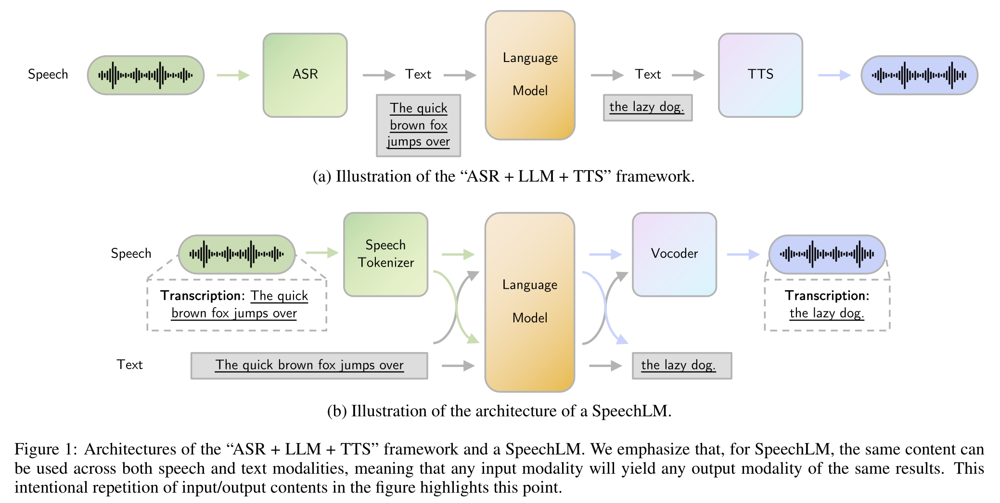
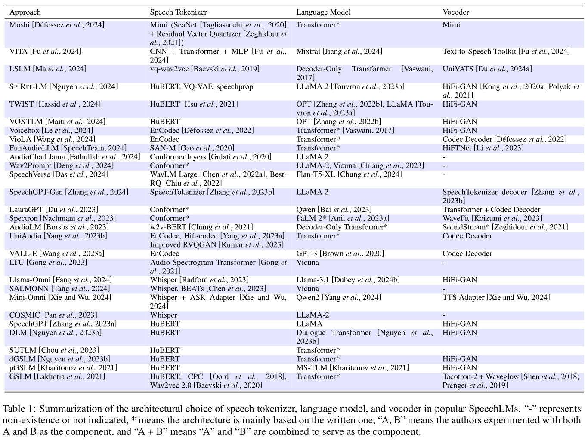

# 3.Components in SpeechLM: 语音语言模型的组件

展开原文

There are three main components within a SpeechLM, namely speech tokenizer, language model, and token-to-speech synthesizer (vocoder), as illustrated in Fig.01.
The fundamental reason for such a three-staged design pattern is to use the language modeling architecture (e.g., decoder-only transformer) to model speech autoregressively in the format of audio waveforms.
Since both the input and output of a language model are discrete tokens, additional modules need to be attached to the language model to handle the I/O format.
Specifically, the speech tokenizer first transforms continuous audio waveforms into discrete tokens to serve as input to the language model, then the language model performs the next-token prediction based on the input speech tokens.
Finally, the vocoder transforms the discrete tokens outputted by the language model back into audio waveforms.
We note that our focus here is on how the three components are grouped together to form a SpeechLM rather than a comprehensive overview of each component.
Therefore, for speech tokenizer and vocoder, we mainly summarize the methods used in existing SpeechLMs.

Table.01 summarizes the popular choices of the three components in various SpeechLM papers.

 

语音语言模型内有三个主要组件: 语音分词器 (Speech Tokenizer), 语言模型 (Language Model),  Token 转语音合成器 (Vocoder), 如图 01 所示.
形成这样的三阶段设计模式的根本原因是为了使用语言建模架构 (如, 仅有解码器的 Transformer) 来以音频波形的形式自回归地建模语音.
由于语言模型的输入和输出都是离散的 Token, 因此需要附加一些模块来处理输入输出的格式.
具体来说, 语音分词器首先将连续的音频波形编码为离散的 Token, 作为语言模型的输入, 然后语言模型基于输入的语音 Token 进行下一个 Token 的预测.
最后, 声码器将语言模型输出的离散 Token 转换回音频波形.
我们注意到这里的重点是如何将这三个组件组合在一起形成一个语音语言模型, 而不是对每个组件进行全面的概述.
因此, 对于语音分词器和声码器, 我们主要总结了现有的语音语言模型所使用的方法.

表格 01 总结了不同语音语言模型中三个组件的选择.

## 3.1.Speech Tokenizer: 语音分词器

展开原文

Speech tokenizer is the first component in SpeechLMs, which encodes continuous audio signals (waveforms) into latent representations and then converts the latent representations into discrete tokens (or sometimes called speech units).
This conversion allows the audio input to be effectively processed by a language model for tasks such as speech recognition or synthesis.
Speech tokenizer aims to capture essential features of the audio while reducing its dimensionality, facilitating the subsequent modeling and analysis of speech patterns.
In this section, we categorize speech tokenizers based on their focus on modeling different aspects of the raw audio.

 

语音分词器是语音语言模型的第一个组件, 它将连续的音频信号 (波形) 编码为隐表示, 然后将隐表示转换为离散的 Token (或有时被称为语音单元 Speech Unit).
这一转换使得音频输入可以有效地被语言模型用于语音识别或合成等任务.
语音分词器的目标是捕捉原始音频的基本特征, 同时降低其维度, 方便后续的语音模式的建模和分析.
在本节中, 我们将语音分词器根据其对不同原始音频的建模关注点进行分类.

### 3.1.1.Semantic Understanding Objective: 语义理解目标

展开原文

Speech tokenizers designed with a semantic understanding objective aim to convert speech waveforms into tokens that accurately capture the content and meaning of the speech.
These tokenizers focus on extracting semantic features from the waveforms, which enhances tasks like ASR.

A semantic understanding speech tokenizer typically comprises a speech encoder and a quantizer, where the speech encoder encodes the essential information from the waveform and the quantizer discretizes continuous representations into discrete tokens.
Let $f_E(\cdot)$ denote the speech encoder parameterized by $\theta_{f_E}$, we have $\textbf{v} = f_E(\textbf{a}; \theta_{f_E})$, where $\textbf{v} = (v_1, v_2, \ldots, v_P)$ represents the encoded representations.
Since $\textbf{v}$ is still continuous, a quantizer $d(\cdot)$ is utilized to discretize the representation.
Depending on different design choices, the discrete speech tokens \(\textbf{s} = (s_1, s_2, \ldots, s_P)\) can either be derived from $\textbf{a}$ or $\textbf{v}$.
Therefore, we have $\textbf{s} = d(\textbf{v}; \theta_d)$ or $\textbf{s} = d(\textbf{a}; \theta_d)$.
After that, $\textbf{s}$ can be used to train the speech tokenizer as a target label (such as masking $\textbf{a}_\text{mask} \subset \textbf{a}$ and reconstructing its corresponding label $\textbf{s}_\text{mask} \subset \textbf{s}$ [HuBERT (2021)](../../Models/SpeechRepresentation/2021.06.14_HuBERT.md)) or to train the following language model.

The key design choices lie in how to effectively encode and quantize the speech into discrete tokens.
[Wav2Vec 2.0 (2020)](../../Models/SpeechRepresentation/2020.06.20_Wav2Vec2.0.md) uses a convolutional encoder followed by a [product quantization module](../../Modules/VQ/PQ.md) to discretize the continuous waveform.
Then, a portion of the quantized representations is masked and modeled using a contrastive loss.
[W2V-BERT (2021)](../../Models/SpeechRepresentation/2021.08.07_W2V-BERT.md) is built upon wav2vec 2.0 and proposes to use Masked Language Modeling (MLM) loss ([BERT (2018)](../../Models/TextLM/2018.10.11_BERT.md)) in addition to contrastive loss.
Similarly, [HuBERT (2021)](../../Models/SpeechRepresentation/2021.06.14_HuBERT.md) uses the k-means algorithm to cluster the speech utterances into a certain number of hidden units, and then perform MLM to predict the target hidden units from the masked speech utterances.
To better align the representation of text and speech modalities, [Google USM (2023)](../../Models/SpeechLM/2023.03.02_Google_USM.md) utilizes text-injection loss ([Maestro (2022)](../../Models/SpeechRepresentation/2022.04.07_Maestro.md)) at the second pre-training stage to improve the performance and robustness of the downstream tasks.
[WavLM (2021)](../../Models/SpeechRepresentation/2021.10.26_WavLM.md) adds the speech denoising objective during pre-training.
While the majority of speech tokenizer studies focus on semantic-related tasks such as ASR and TTS, WavLM shows that speech denoising can boost the performance of non-semantic tasks such as speaker verification and speech separation.
A full list of downstream tasks is listed in [section 5](Sec.05.Applications.md).

 

按语义理解目标设计的语音分词器旨在将语音波形转换为准确捕捉语音内容和意义的 Token.
这些分词器专注于从波形中提取语义特征, 这有助于提升如 ASR 等任务.

语义理解语音分词器通常由一个语音编码器和一个量化器组成, 其中语音编码器编码波形中的基本信息, 量化器将连续表示离散化为离散的 Token.
记参数化为 $\theta_{f_E}$ 的语音编码器 $f_E(\cdot)$, 则有 $\textbf{v} = f_E(\textbf{a}; \theta_{f_E})$, 其中 $\textbf{v} = (v_1, v_2, \ldots, v_P)$ 表示编码表示.
由于 $\textbf{v}$ 仍然是连续的, 因此需要使用量化器 $d(\cdot)$ 来离散化表示.

根据不同的设计选择, 离散语音 Token \(\textbf{s} = (s_1, s_2, \ldots, s_P)\) 可以是从音频波形 $\textbf{a}$ 或编码表示 $\textbf{v}$ 导出的.
因此, 我们有 $\textbf{s} = d(\textbf{a}; \theta_d)$ 或 $\textbf{s} = d(\textbf{v}; \theta_d)$.
之后, $\textbf{s}$ 可以被用作目标标签 (例如, 掩膜 $\textbf{a}_\text{mask} \subset \textbf{a}$ 并重构其对应的标签 $\textbf{s}_\text{mask} \subset \textbf{s}$ [HuBERT (2021)](../../Models/SpeechRepresentation/2021.06.14_HuBERT.md)) 或用于训练后续的语言模型.

关键的设计选择在于如何有效地将语音编码和量化为离散的 Token.
- [Wav2Vec 2.0 (2020)](../../Models/SpeechRepresentation/2020.06.20_Wav2Vec2.0.md) 使用卷积编码器后接[乘积量化模块 (Product Quantization)](../../Modules/VQ/PQ.md)来离散化连续的音频波形. 然后量化表示的一部分被掩膜, 并使用对比损失 (Contrastive Loss) 来建模.
- [W2V-BERT (2021)](../../Models/SpeechRepresentation/2021.08.07_W2V-BERT.md) 建立在 wav2vec 2.0 之上, 并提出使用掩码语言模型 (Masked Language Modeling, MLM) 损失 ([BERT (2018)](../../Models/TextLM/2018.10.11_BERT.md)) 作为对比损失的补充项.
- [HuBERT (2021)](../../Models/SpeechRepresentation/2021.06.14_HuBERT.md) 使用 K 均值算法将语音句子聚类为一定数量的隐藏单元, 然后使用 MLM 从掩码的语音句子预测目标隐藏单元.
- [Google USM (2023)](../../Models/SpeechLM/2023.03.02_Google_USM.md) 为了更好地对齐文本和语音模态之间的表示, 在第二阶段的预训练中使用文本注入损失 (Text-Injection Loss) ([Maestro (2022)](../../Models/SpeechRepresentation/2022.04.07_Maestro.md)) 来提升下游任务的性能和鲁棒性.
- [WavLM (2021)](../../Models/SpeechRepresentation/2021.10.26_WavLM.md) 在预训练过程中加入语音降噪目标. 尽管语音分词器研究主要关注语义相关任务如 ASR 和 TTS, WavLM 展示了语音降噪可以增强非语义任务如说话人验证和语音分离的性能.

下游任务的完整列表可以在 [Sec.05](Sec.05.Applications.md) 中找到.

### 3.1.2.Acoustic Generation Objective: 声学生成目标

展开原文

Speech tokenizers with an acoustic generation objective focus on capturing the acoustic features necessary for generating high-quality speech waveforms.
These tokenizers prioritize the preservation of essential acoustic characteristics over semantic content, making them suitable for speech synthesis tasks.

To generate high-quality speech waveforms, acoustic generation speech tokenizers employ a speech synthesis or speech reconstruction objective.
To achieve this, the architecture typically includes an encoder, a quantizer, and a decoder.
Same as before, the encoder $f_E(\cdot)$ and quantizer $d(\cdot)$ transform the original waveform into discrete tokens.
After that, the decoder $f_D(\cdot)$ reconstructs these tokens back into speech waveforms.
This process is represented by $\hat{\textbf{a}} = f_D(\textbf{s}; \theta_{f_D})$, where $\hat{\textbf{a}}$ is the generated or reconstructed waveform.

Neural audio codecs are very suitable for and are primarily employed as acoustic generation speech tokenizers.
These codecs utilize the advanced modeling capabilities of deep neural networks to compress audio signals into a compact representation, typically in the form of quantized tokens.
For example, both [SoundStream (2021)](../../Models/SpeechCodec/2021.07.07_SoundStream.md) and [EnCodec (2022)](../../Models/SpeechCodec/2022.10.24_EnCodec.md) use convolution blocks as the encoder and use Residual Vector Quantization (RVQ) ([SoundStream (2021)](../../Models/SpeechCodec/2021.07.07_SoundStream.md)) as the quantizer.
This mechanism allows for codecs to efficiently transmit or store audio with minimal loss in quality.
Since the output of codecs is in discrete format, they can also be leveraged by SpeechLM to autoregressively generate speech.

 

按声学生成目标设计的语音分词器着重于捕获生成高质量语音波形所需的声学特征.
这些分词器优先保留必要的声学特征而不是语义内容, 使得它们适合语音合成任务.

为了生成高质量语音波形, 声学生成语音分词器采用了语音合成或语音重构目标.
为此, 架构通常包括一个编码器, 量化器和解码器.
和语义理解语音分词器一样, 编码器 $f_E(\cdot)$ 和量化器 $d(\cdot)$ 将原始波形转换为离散的 Token.
之后, 解码器 $f_D(\cdot)$ 将这些 Token 重构回语音波形.
这一过程可以表示为 $\hat{\textbf{a}} = f_D(\textbf{s}; \theta_{f_D})$, 其中 $\hat{\textbf{a}}$ 是生成或重构的波形.

神经音频编解码器非常适合且主要作为声学生成语音分词器.
这些编解码器利用深度神经网络的先进建模能力来压缩音频信号为紧凑表示, 通常以量化 Token 的形式出现.
例如 [SoundStream (2021)](../../Models/SpeechCodec/2021.07.07_SoundStream.md) 和 [EnCodec (2022)](../../Models/SpeechCodec/2022.10.24_EnCodec.md) 使用卷积块作为编码器, 使用**残差向量量化 (Residual Vector Quantization, RVQ)** 作为量化器.

这一机制使得编解码器能够以最小的质量损失高效地传输和存储音频.
因为这些编解码器的输出是离散形式, 它们可以被语音语言模型用于自回归生成语音.

### 3.1.3.Mixed Objective: 混合目标

展开原文

Speech tokenizers with a mixed objective aim to balance both semantic understanding and acoustic generation.
Currently, the development of these tokenizers is in its early stages.
Most existing mixed speech tokenizers primarily adopt the architecture of acoustic generation speech tokenizers and focus on distilling information from semantic tokenizers into the acoustic tokenizer.
[SpeechTokenizer (2023)](../../Models/SpeechCodec/2023.08.31_SpeechTokenizer.md) utilizes the RVQ-GAN ([EnCodec (2022)](../../Models/SpeechCodec/2022.10.24_EnCodec.md); [SoundStream (2021)](../../Models/SpeechCodec/2021.07.07_SoundStream.md)) architecture, distilling semantic information from [HuBERT (2021)](../../Models/SpeechRepresentation/2021.06.14_HuBERT.md) to the first layer of RVQ.
Building on SpeechTokenizer, Mimi ([Moshi (2024)](../../Models/SpokenDialogue/2024.09.17_Moshi.md)) employs a single vector quantizer (VQ) to extract information from [WavLM (2021)](../../Models/SpeechRepresentation/2021.10.26_WavLM.md) and incorporates another RVQ module to learn the acoustic information.

 

混合目标的语音分词器旨在平衡语义理解和声学生成.
目前, 这些分词器的发展处于初期阶段.
大多数现有的混合语音分词器主要采用声学生成语音分词器的架构, 着重于将语义分词器中的信息蒸馏到声学分词器中.
- [SpeechTokenizer (2023)](../../Models/SpeechCodec/2023.08.31_SpeechTokenizer.md) 使用 RVQ-GAN ([EnCodec (2022)](../../Models/SpeechCodec/2022.10.24_EnCodec.md); [SoundStream (2021)](../../Models/SpeechCodec/2021.07.07_SoundStream.md)) 架构, 将 [HuBERT (2021)](../../Models/SpeechRepresentation/2021.06.14_HuBERT.md) 的语义信息蒸馏到 RVQ 的第一层.
- [Mimi (2024)](../../Models/SpokenDialogue/2024.09.17_Moshi.md) 基于 SpeechTokenizer 使用单个向量量化器 (VQ) 从 [WavLM (2021)](../../Models/SpeechRepresentation/2021.10.26_WavLM.md) 中提取信息, 并集成另一个 RVQ 模块来学习声学信息.

## 3.2.Language Model: 语言模型

展开原文

Due to the success of TextLMs ([GPT-4 (2023)](../../Models/TextLM/2023.03.15_GPT-4.md); [Gemini (2023)](../../Models/TextLM/2023.12.19_Gemini.md); [LLaMA 3 (2024)](../../Models/TextLM/2024.07.31_LLaMA3.md)), most SpeechLMs follow their architectures.
They primarily employ [Transformers (2017)](../../Models/_Transformer/2017.06.12_Transformer.md) or decoder-only architectures (such as [OPT (2022)](../../Models/TextLM/2022.05.02_OPT.md), [LLaMA (2023)](../../Models/TextLM/2023.02.27_LLaMA.md)) to generate speech in an autoregressive manner.
To formally define it, given $|V_t|$ as the vocabulary size and $h$ as the hidden dimension, a typical text-based decoder-only transformer language model consists of an embedding matrix $E_t \in \mathbb{R}^{|V_t| \times h}$, a sequence of \( L \) transformer decoder blocks \(\textbf{De} = \{ De_1, De_2, \ldots, De_L \} \), and an output embedding matrix $E'_t \in \mathbb{R}^{h \times |V_t|}$.
Therefore, the language model (LM) can be represented as

$$
    \textbf{t}^{\text{out}} \sim \text{LM}(\textbf{t}^{\text{in}}, (E_t, \textbf{De}, E'_t)).
$$

To adapt the language model to generate speech, the original text tokenizer is changed to the speech tokenizers illustrated in [Section.3.1](#31speech-tokenizer-语音分词器).
$E_t \in \mathbb{R}^{|V_t| \times h}$ is thus changed to a speech embedding matrix $E_s \in \mathbb{R}^{|V_s| \times h}$, where $|V_s|$ represents the vocabulary size of the speech tokenizer.
The output embedding matrix is also changed from $E'_t \in \mathbb{R}^{h \times |V_t|}$ to $E'_s \in \mathbb{R}^{h \times |V_s|}$.
As a result, the language model in an SpeechLM is represented as

$$
\textbf{s}^{\text{out}} \sim \text{LM}(\textbf{s}^{\text{in}}, (E_s, \textbf{De}, E'_s)).
$$

Because the language model architecture of SpeechLMs is borrowed from TextLMs, it is natural that the resulting model can jointly model both text and speech modalities ([SpiRit-LM (2024)](../../Models/SpeechLM/2024.02.08_SpiRit-LM.md); [SpeechGPT (2023)](../../Models/SpokenDialogue/2023.05.18_SpeechGPT.md)).
To achieve this, a naive and most adopted approach is to expand the vocabulary of the original TextLM to incorporate both text and speech tokens.
Specifically, the speech embedding matrix is usually appended to the end of the text embedding matrix, resulting in a larger embedding matrix $E_m \in \mathbb{R}^{(|V_t|+|V_s|) \times h}$.
Let $\textbf{m}$ be a token sequence containing both speech and text tokens, the resulting language model becomes

$$
\textbf{m}^{\text{out}} \sim \text{LM}(\textbf{m}^{\text{in}}, (E_j, \textbf{De}, E'_j)).
$$

By doing so, the model can generate both text and speech in a single sequence, enabling much more diverse applications (see [Section.05 Application](Sec.05.Applications.md)).

 

由于文本语言模型 ([GPT-4 (2023)](../../Models/TextLM/2023.03.15_GPT-4.md); [Gemini (2023)](../../Models/TextLM/2023.12.19_Gemini.md); [LLaMA 3 (2024)](../../Models/TextLM/2024.07.31_LLaMA3.md)) 的成功, 许多语音语言模型遵循它们的架构.

它们主要应用 [Transformer (2017)](../../Models/_Transformer/2017.06.12_Transformer.md) 或仅解码器的架构 (如 [OPT (2022)](../../Models/TextLM/2022.05.02_OPT.md), [LLaMA (2023)](../../Models/TextLM/2023.02.27_LLaMA.md)) 以自回归的方式生成语音.
为了正式地定义它, 给定 $|V_t|$ 为词表大小, $h$ 为隐藏维度, 典型的基于文本的仅解码器 Transformer 语言模型由一个嵌入矩阵 $E_t \in \mathbb{R}^{|V_t| \times h}$, \( L \) 个 Transformer 解码器块组成的序列 \(\textbf{De} = \{ De_1, De_2, \ldots, De_L \} \) 和输出嵌入矩阵 $E'_t \in \mathbb{R}^{h \times |V_t|}$.

因此, 语言模型 (LM) 可以表示为

$$
    \textbf{t}^{\text{out}} \sim \text{LM}(\textbf{t}^{\text{in}}, (E_t, \textbf{De}, E'_t)).
$$

为了将语言模型应用于生成语音, 原始文本分词器被改造为如 [3.1.Speech Tokenizer](#31speech-tokenizer-语音分词器) 所示的语音分词器.
$E_t \in \mathbb{R}^{|V_t| \times h}$ 因此被改造为语音嵌入矩阵 $E_s \in \mathbb{R}^{|V_s| \times h}$, 其中 $|V_s|$ 表示语音分词器的词表大小.
输出嵌入矩阵也被改造为 $E'_s \in \mathbb{R}^{h \times |V_s|}$, 因此语音语言模型中的语言模型可以表示为

$$
\textbf{s}^{\text{out}} \sim \text{LM}(\textbf{s}^{\text{in}}, (E_s, \textbf{De}, E'_s)).
$$

由于语音语言模型的语言模型架构是借鉴自文本语言模型的, 因此改造后的模型可以同时对文本和语音模态进行建模 ([SpiRit-LM (2024)](../../Models/SpeechLM/2024.02.08_SpiRit-LM.md); [SpeechGPT (2023)](../../Models/SpokenDialogue/2023.05.18_SpeechGPT.md)).
为了实现这一目标, 最简单的和最流行的方法是将原始文本语言模型的词表扩展为包含文本和语音 Token 的词表.
具体来说, 语音嵌入矩阵通常被追加到文本嵌入矩阵的末尾, 得到一个更大的嵌入矩阵 $E_m \in \mathbb{R}^{(|V_t|+|V_s|) \times h}$.
令 $\textbf{m}$ 为包含语音和文本 Token 的 Token 序列, 则语言模型变为

$$
\textbf{m}^{\text{out}} \sim \text{LM}(\textbf{m}^{\text{in}}, (E_j, \textbf{De}, E'_j)).
$$

这样做可以使模型能够在单个序列中生成文本和语音, 这为许多不同应用提供了更多的可能性 (参见 [Section.05](Sec.05.Applications.md)).

## 3.3.Token-to-Speech Synthesizer (Vocoder): Token 转语音合成器 (声码器)

展开原文

After the tokens have been autoregressively generated by the language model component, a token-to-speech module, often known as vocoder, is utilized to synthesize all the speech tokens back into speech waveforms.
This process involves converting the linguistic and paralinguistic information represented by the generated speech tokens into audio waveforms that can be heard.
This can be seen as a reverse process to the speech tokenizer and therefore can be represented as

$$
\textbf{a} = V(\textbf{s};\theta_V),
$$

where $V$ is the vocoder model parameterized by $\theta_V$.

The pipeline of the SpeechLM vocoder can vary depending on the underlying vocoder model.
There are two main pipelines: **Direct synthesis** and **input-enhanced synthesis**.

**Direct synthesis** is the pipeline where the vocoder directly converts speech tokens generated by the language model into audio waveforms.
For example, [Polyak et al. (2021)](../../Models/SpeechCodec/2021.04.01_Speech_Resynthesis_from_Discrete_Disentangled_Self-Supervised_Representations.md) adapts the [HiFi-GAN (2020)](../../Models/Vocoder/2020.10.12_HiFi-GAN.md) architecture and takes discrete tokens as inputs.

In contrast, **input-enhanced synthesis** employs an additional module to transform the tokens into a continuous latent representation before they are fed into the vocoder ([Seed-TTS (2024)](../../Models/SpeechLM/2024.06.04_Seed-TTS.md); [TorToise-TTS (2023)](../../Models/Diffusion/2023.05.12_TorToise-TTS.md)).
The main reason for using this pipeline is that vocoders typically require intermediate audio representations, such as mel-spectrograms ([MelGAN (2019)](../../Models/Vocoder/2019.10.08_MelGAN.md); [HiFi-GAN (2020)](../../Models/Vocoder/2020.10.12_HiFi-GAN.md); [BigVGAN (2022)](../../Models/Vocoder/2022.06.09_BigVGAN.md)), as input.
When comparing the two pipelines, direct synthesis is generally simpler and faster than Input-Enhanced Synthesis.
However, the choice of pipeline depends on the type of tokens used as input.
Tokens from acoustic generation tokenizers contain sufficient acoustic information, making them suitable for direct synthesis.
Conversely, tokens from semantic understanding tokenizers provide rich semantic information but lack fine acoustic details, particularly in higher frequencies.
Therefore, these tokens are better enhanced into an acoustic-rich representation, such as mel-spectrograms, before synthesizing the final speech.

Vocoders can be categorized by their architectural choice.
In the following sections, we summarize vocoders that are mostly adopted in the development of SpeechLMs.

 

在语言模型组件自回归生成 Token 之后, 一个 Token 转语音模块 (声码器) 被用来将所有的语音 Token 合成回语音波形.
这一过程涉及到将由生成的语音 Token 所表示的语言和副语言信息转换为可以听到的音频波形.
这一过程可以视为语音分词器的逆过程, 因此可以表示为

$$
    \textbf{a} = V(\textbf{s};\theta_V),
$$

其中 $V$ 是 $\theta_V$ 参数化的声码器模型.

语音语言模型声码器的流程可以根据底层声码器模型的不同而变化.
主要有两种流程: **直接合成** 和 **输入增强合成**.

- **直接合成** 是指声码器直接将由语言模型生成的语音 Token 转换为音频波形的流程.
如 [Polyak et al. (2021)](../../Models/SpeechCodec/2021.04.01_Speech_Resynthesis_from_Discrete_Disentangled_Self-Supervised_Representations.md) 采用 [HiFi-GAN (2020)](../../Models/Vocoder/2020.10.12_HiFi-GAN.md) 架构并采用离散 Token 作为输入.
- **输入增强合成** 是指采用额外模块将 Token 转换为连续潜在表示, 再将其输入声码器 ([Seed-TTS (2024)](../../Models/SpeechLM/2024.06.04_Seed-TTS.md); [TorToise-TTS (2023)](../../Models/Diffusion/2023.05.12_TorToise-TTS.md)) 的流程.
  使用这一流程的主要原因是声码器通常需要中间音频表示作为输入, 如梅尔频谱 ([MelGAN (2019)](../../Models/Vocoder/2019.10.08_MelGAN.md); [HiFi-GAN (2020)](../../Models/Vocoder/2020.10.12_HiFi-GAN.md); [BigVGAN (2022)](../../Models/Vocoder/2022.06.09_BigVGAN.md)).

在比较这两种流程时, 直接合成通常比输入增强合成更简单和更快.
然而, 流程的选择依赖于输入的 Token 类型.
来自声学生成分词器的 Token 包含足够多的声学信息, 使得它们适合使用直接合成;
相反, 来自语义理解分词器的 Token 提供丰富的语义信息, 但缺乏精细的声学细节, 特别是在高频段.
因此这些 Token 更适合增强为具有声学丰富的表示, 如梅尔频谱, 再合成最终的语音.

### 3.3.1.GAN-based Vocoder: 基于生成对抗网络的声码器

展开原文

Generative Adversarial Network (GAN) is the most adopted architecture of the vocoders ([MelGAN (2019)](../../Models/Vocoder/2019.10.08_MelGAN.md); [HiFi-GAN (2020)](../../Models/Vocoder/2020.10.12_HiFi-GAN.md);[Polyak et al. (2021)](../../Models/SpeechCodec/2021.04.01_Speech_Resynthesis_from_Discrete_Disentangled_Self-Supervised_Representations.md); [Fre-GAN (2021)](../../Models/Vocoder/2021.06.04_Fre-GAN.md); [BigVGAN (2022)](../../Models/Vocoder/2022.06.09_BigVGAN.md)).
It is well known for its fast and high-fidelity generation in speech synthesis tasks.
The architecture of GAN includes a generator and a discriminator.
Specifically, the generator creates realistic audio waveforms from random noise or input features, while the discriminator evaluates the authenticity of the generated audio against real audio samples.

To utilize GAN to synthesize high-fidelity speech, various training objectives are designed, focusing on different aspects.
First, **GAN loss** is utilized as the fundamental objective for the operation of the generator and the discriminator.
Specifically, the typical choice GAN loss for the generator ($G$) and discriminator ($D$) is to use the least squares loss function.
The GAN loss for the generator ($\mathcal{L}_{\text{GAN}}(G; D)$) and the discriminator ($\mathcal{L}_{\text{GAN}}(D; G)$) are

$$
    \mathcal{L}_{\text{GAN}}(G; D) = \mathbb{E}_{ms} \left[ \left( D(G(ms)) - 1 \right)^2 \right]
$$

and

$$
    \mathcal{L}_{\text{GAN}}(D; G) = \mathbb{E}_{(x, ms)} \left[ \left( D(x) - 1 \right)^2 + \left( D(G(ms)) \right)^2 \right],
$$

respectively.

In these loss functions, $x$ represents the ground truth audio and $ms$ represents its mel-spectrogram.
Second, most GAN-based vocoders synthesize speech waveform from mel-spectrograms, so **mel-spectrogram loss** is proposed to align the mel-spectrogram synthesized by the generator and the mel-spectrogram transformed from the ground-truth waveform, in order to improve the fidelity of the generated speech.
Mel-spectrogram loss ($\mathcal{L}_{\text{Mel}}(G)$) works by minimizing the L1 distance between the two versions of mel-spectrograms mentioned above.
Its formula is shown below:

$$
    \mathcal{L}_{\text{Mel}}(G) = \mathbb{E}_{(x, ms)} \left[ \left\| \phi(x) - \phi(G(ms)) \right\|_1 \right],
$$
where $\phi(\cdot)$ is the function to transform a waveform into the corresponding mel-spectrogram.

Third, to further enhance the generation fidelity, **feature matching loss** ($\mathcal{L}_{FM}(G;D)$) is proposed to align the discriminator-encoded features of the ground truth sample and the generated sample with L1 distance, which has the following formula:

$$
    \mathcal{L}_{FM}(G;D) = \mathbb{E}_{(x,ms)} \left[ \sum_{i=1}^{T} \frac{1}{N_i} \left\lVert D^i(x) - D^i(G(ms)) \right\rVert_1 \right],
$$

where $D^i(\cdot)$ and $N_i$ denote the features and the number of features in the $i$-th layer of the discriminator, respectively.

For architectural choices, GAN-based vocoders focus on injecting inductive biases to generate audio waveforms.
[MelGAN (2019)](../../Models/Vocoder/2019.10.08_MelGAN.md) adds residual blocks with dilations in the generator to model the long-range correlation among the audio time steps and proposes a multi-scale architecture for the discriminator to model the different frequency ranges of the audio.
Based on the idea of the multi-scale discriminator, [HiFi-GAN (2020)](../../Models/Vocoder/2020.10.12_HiFi-GAN.md) proposes a multi-period discriminator to model the diverse periodic patterns within the audio waveforms.
To preserve high-frequency content, [Fre-GAN (2021)](../../Models/Vocoder/2021.06.04_Fre-GAN.md) employs the Discrete Wavelet Transform (DWT) to downsample and learn spectral distributions across multiple frequency bands.
Unlike traditional approaches like Average Pooling (AP), DWT efficiently decomposes the signal into low-frequency and high-frequency sub-bands.
[BigVGAN (2022)](../../Models/Vocoder/2022.06.09_BigVGAN.md) introduces a periodic activation function called snake function along with an anti-aliased representation to reduce the high-frequency artifacts in the synthesized audio.

 

生成对抗网络 (Generative Adversarial Network, GAN) 是声码器最常采用的架构 ([MelGAN (2019)](../../Models/Vocoder/2019.10.08_MelGAN.md); [HiFi-GAN (2020)](../../Models/Vocoder/2020.10.12_HiFi-GAN.md);[Polyak et al. (2021)](../../Models/SpeechCodec/2021.04.01_Speech_Resynthesis_from_Discrete_Disentangled_Self-Supervised_Representations.md); [Fre-GAN (2021)](../../Models/Vocoder/2021.06.04_Fre-GAN.md); [BigVGAN (2022)](../../Models/Vocoder/2022.06.09_BigVGAN.md)).
它在语音合成任务中以快速和高保真生成而闻名.
GAN 架构包括生成器和判别器.
具体来说, 生成器从随机噪声或输入特征创建真实的音频波形, 而判别器评估生成的音频和真实样本的真实性.

为了利用 GAN 来合成高保真语音, 设计了不同的训练目标, 着重于不同的方面.

- 首先, **GAN 损失** 被用作生成器和判别器的基本目标.
具体来说, 生成器 $G$ 和判别器 $D$ 的经典的 GAN 损失是使用最小二乘损失函数.
生成器 $G$ 和判别器 $D$ 的 GAN 损失分别为
$$
    \mathcal{L}_{\text{GAN}}(G; D) = \mathbb{E}_{ms} \left[ \left( D(G(ms)) - 1 \right)^2 \right]
$$
$$
    \mathcal{L}_{\text{GAN}}(D; G) = \mathbb{E}_{(x, ms)} \left[ \left( D(x) - 1 \right)^2 + \left( D(G(ms)) \right)^2 \right],
$$
在这些损失函数中, $x$ 表示真实的音频, $ms$ 表示其梅尔频谱图 (Mel-spectrogram).

- 其次, 大多数基于 GAN 的声码器从梅尔频谱合成语音波形, 所以**梅尔频谱损失**被提出用于对齐生成器合成的梅尔频谱和由真实音频转换的梅尔频谱, 以提高生成语音的真实度.
梅尔频谱损失 ($\mathcal{L}_{\text{Mel}}(G)$) 通过最小化两个梅尔频谱之间的 L1 距离来实现, 其公式如下:
$$
    \mathcal{L}_{\text{Mel}}(G) = \mathbb{E}_{(x, ms)} \left[ \left\| \phi(x) - \phi(G(ms)) \right\|_1 \right],
$$
其中 $\phi(\cdot)$ 是将音频转换为相应梅尔频谱的函数.

- 第三, 为了进一步增强生成的真实度, **特征匹配损失** ($\mathcal{L}_{FM}(G;D)$) 被提出, 使用 L1 距离来对齐判别器编码的真实样本和生成样本的特征, 其公式如下:
$$
    \mathcal{L}_{FM}(G;D) = \mathbb{E}_{(x,ms)} \left[ \sum_{i=1}^{T} \frac{1}{N_i} \left\lVert D^i(x) - D^i(G(ms)) \right\rVert_1 \right],
$$
其中 $D^i(\cdot)$ 和 $N_i$ 表示第 $i$ 层判别器的特征和特征数.

在架构选择方面, 基于 GAN 的声码器专注于注入归纳偏置以生成音频波形.
- [MelGAN (2019)](../../Models/Vocoder/2019.10.08_MelGAN.md) 在生成器中加入了带有膨胀卷积的残差块, 以模拟音频时间步间的长期相关性, 并提出了多尺度架构的判别器, 以模拟不同频率范围的音频.
- [HiFi-GAN (2020)](../../Models/Vocoder/2020.10.12_HiFi-GAN.md) 基于多尺度判别器提出了多周期判别器, 以模拟音频波形中的多种周期模式.
- [Fre-GAN (2021)](../../Models/Vocoder/2021.06.04_Fre-GAN.md) 为了保持高频内容, 采用离散小波变换 (Discrete Wavelet Transform, DWT) 来下采样和学习多频带的频谱分布.
  和传统的方法如平均池化不同, 离散小波变换将信号分解为低频和高频子带.
- [BigVGAN (2022)](../../Models/Vocoder/2022.06.09_BigVGAN.md) 引入了名为蛇形函数的周期激活函数和抗锯齿表示, 以减少生成音频中的高频伪影.

### 3.3.2.GAN-based Neural Audio Codec: 基于生成对抗网络的神经音频编解码器

展开原文

Given that many neural audio codecs employ a GAN architecture, they can be effectively discussed within the context of GAN-based vocoders.
Similar to its role as a tokenizer, although the primary objective of neural audio codecs is for audio compression, the encoded compact token sequences capture the essential information buried in the audio waveforms and therefore can be leveraged as a vocoder in SpeechLMs.
[EnCodec (2022)](../../Models/SpeechCodec/2022.10.24_EnCodec.md) uses a GAN architecture and proposes a novel generator including an encoder, a quantizer, and a decoder.
The compressed audio representations are outputted by the quantizer by using Residual Vector Quantization (RVQ).
[Polyak et al. (2021)](../../Models/SpeechCodec/2021.04.01_Speech_Resynthesis_from_Discrete_Disentangled_Self-Supervised_Representations.md) utilizes [HiFi-GAN (2020)](../../Models/Vocoder/2020.10.12_HiFi-GAN.md) as the vocoder backbone and proposes to disentangle the input features of a vocoder into distinct properties, which include semantic tokens, pitch tokens, and speaker embeddings.
Such a design choice enables the codec to better perform on pitch and speaker-related tasks such as voice conversion and $F_0$ manipulation.

 

许多神经音频编解码器采用 GAN 架构, 它们可以在基于 GAN 的声码器的背景下进行讨论.
类似于其作为分词器的角色, 虽然神经音频编解码器的主要目的是音频压缩, 编码后的紧凑 Token 序列捕获了音频波形中被埋藏的基本信息, 因此可以作为语音语言模型中的声码器.
- [EnCodec (2022)](../../Models/SpeechCodec/2022.10.24_EnCodec.md) 使用 GAN 架构, 提出了一种新的生成器, 包括编码器, 量化器, 和解码器.
  压缩的音频表示通过使用残差向量量化由量化器输出.
- [Polyak et al. (2021)](../../Models/SpeechCodec/2021.04.01_Speech_Resynthesis_from_Discrete_Disentangled_Self-Supervised_Representations.md) 利用 [HiFi-GAN (2020)](../../Models/Vocoder/2020.10.12_HiFi-GAN.md) 作为声码器的骨干, 提出了将声码器的输入特征解耦为不同性质, 其中包括语义 Token, 音高 Token, 和说话人嵌入.
  这种设计选择使得编解码器在音高和说话人相关的任务 (如声音转换和 $F_0$ 操控方面) 表现得更好.

### 3.3.3.Other Types of Vocoder: 其他类型的声码器

展开原文

The variety of vocoders is not restricted to the ones mentioned earlier, as those are the ones commonly employed in SpeechLMs.
This section briefly outlines other potential vocoder types that are seldom explored as a component in SpeechLMs.

 

声码器的种类不仅限于前面提到的那些, 因为它们是语音语言模型中常用的声码器.
本节简要概括了其他可能的声码器类型, 这些声码器在语音语言模型中很少作为组件被探索.

#### Pure Signal Processing Vocoder: 纯信号处理声码器

展开原文

Pure signal processing vocoders are traditional methods that rely on deterministic algorithms rather than deep learning models to synthesize speech ([Griffin-Lim (1984)](../../Models/Vocoder/1984.04.00_Griffin-Lim.md); [WORLD (2016)](../../Models/Vocoder/2015.11.11_WORLD.md)).
However, this kind of vocoders introduces noticeable artifacts in the synthesized audio and is thus rarely used.

 

纯信号处理声码器是依赖于确定性算法而不是深度学习模型的用于合成语音的传统方法 ([Griffin-Lim (1984)](../../Models/Vocoder/1984.04.00_Griffin-Lim.md); [WORLD (2016)](../../Models/Vocoder/2015.11.11_WORLD.md)).
然而, 这类声码器会在合成的音频中引入显著的伪影, 因此很少被使用.

#### Autoregressive Vocoder: 自回归声码器

展开原文

Autoregressive vocoders generate audio waveforms one sample at a time, with each sample conditioned on the previously generated samples ([WaveNet (2016)](../../Models/Vocoder/2016.09.12_WaveNet.md)).
This approach allows for high-quality audio synthesis due to its sequential nature and the ability to capture intricate temporal dependencies within the audio signal.
However, the sequential generation process can be computationally expensive and time-consuming, making autoregressive models less efficient compared to parallelized methods like GAN-based vocoders.

 

自回归声码器一次生成一个音频波形样本, 每个样本都以之前生成的样本为条件 ([WaveNet (2016)](../../Models/Vocoder/2016.09.12_WaveNet.md)).
这种方法允许高质量的音频合成, 因为它是顺序生成的, 并且能够捕获音频信号中的复杂时序依赖关系.
然而, 顺序生成过程可能是计算密集型的, 耗时耗力, 因此与 GAN-based 声码器相比, 自回归模型的效率较低.

#### Flow-based Vocoder: 流模型声码器

展开原文

Flow-based vocoder aims to establish a series of invertible transformations that map a simple distribution, such as a Gaussian, to the complex distribution of audio samples.
This mechanism allows for efficient sampling and density evaluation, enabling the model to synthesize audio in parallel rather than sequentially, which significantly enhances both speed and quality ([WaveGlow (2018)](../../Models/Vocoder/2018.10.31_WaveGlow.md)).
Compared to GAN-based vocoders, Flow-based vocoders typically need more parameters and memory to train the model, which hinders them from being effectively utilized ([MelGAN (2019)](../../Models/Vocoder/2019.10.08_MelGAN.md)).

 

基于流模型的声码器旨在建立一系列可逆变换, 将简单分布 (如高斯分布) 映射到音频样本的复杂分布.
这种机制允许高效的采样和密度评估, 使模型能够并行合成音频, 而不是顺序合成, 这有助于提高速度和质量 ([WaveGlow (2018)](../../Models/Vocoder/2018.10.31_WaveGlow.md)).
和基于 GAN 的声码器相比, 流模型声码器通常需要更多的参数和内存来训练模型, 这使得它们难以有效地被利用 ([MelGAN (2019)](../../Models/Vocoder/2019.10.08_MelGAN.md)).

#### VAE-based Vocoders: VAE 声码器

展开原文

Variational Autoencoders (VAEs) are powerful generative models that learn to encode input data into a compressed latent space while allowing for the reconstruction of the original data ([VQ-VAE (2017)](../../Modules/VQ/2017.11.02_VQ-VAE.md); [VAE-WNV-VC (2018)](../../Models/Voice_Conversion/2018.11.27_VAE-WNV-VC.md)).
However, VAE is seldom explored as the underlying architecture of vocoders.

 

变分自编码器 (VAEs) 是一种强大的生成模型, 它能够学习将输入数据编码为压缩的潜在空间, 并允许对原始数据进行重构 ([VQ-VAE (2017)](../../Modules/VQ/2017.11.02_VQ-VAE.md); [VAE-WNV-VC (2018)](../../Models/Voice_Conversion/2018.11.27_VAE-WNV-VC.md)).
然而, VAE 很少作为声码器的底层架构进行探索.

#### Diffusion-based Vocoder: 扩散模型声码器

展开原文

Diffusion models have emerged in recent years as a powerful class of generative models that can be used for high-fidelity speech synthesis.
They work by gradually adding noise to the input data (e.g., audio waveforms) to create a sequence of increasingly noisy representations, then learning to reverse this process to generate new samples ([DiffWave (2020)](../../Models/Vocoder/2020.09.21_DiffWave.md); [WaveGrad (2020)](../../Models/Vocoder/2020.09.02_WaveGrad.md); [PriorGrad (2021)](../../Models/Vocoder/2021.06.11_PriorGrad.md
For instance, [DiffWave (2020)](../../Models/Vocoder/2020.09.21_DiffWave.md) uses Denoising Diffusion Probabilistic Models (DDPM) to synthesize audio.
Additionally, [CosyVoice (2024)](../../Models/SpeechLM/2024.07.07_CosyVoice.md) introduces a Conditional Flow-Matching (CFM) model that serves as a vocoder in TTS systems.

 

扩散模型是近年来出现的一种强大的生成模型, 它可以用于高保真语音合成.
它们通过逐渐添加噪声到输入数据 (如音频波形) 来创建一系列噪声增加表示, 然后学习将这个过程反向进行, 来生成新的样本 ([DiffWave (2020)](../../Models/Vocoder/2020.09.21_DiffWave.md); [WaveGrad (2020)](../../Models/Vocoder/2020.09.02_WaveGrad.md); [PriorGrad (2021)](../../Models/Vocoder/2021.06.11_PriorGrad.md
例如: [DiffWave (2020)](../../Models/Vocoder/2020.09.21_DiffWave.md) 使用 Denoising Diffusion Probabilistic Models (DDPM) 来合成音频.
此外, [CosyVoice (2024)](../../Models/SpeechLM/2024.07.07_CosyVoice.md) 引入了一个条件流匹配 (CFM) 模型, 作为 TTS 系统中的声码器.
