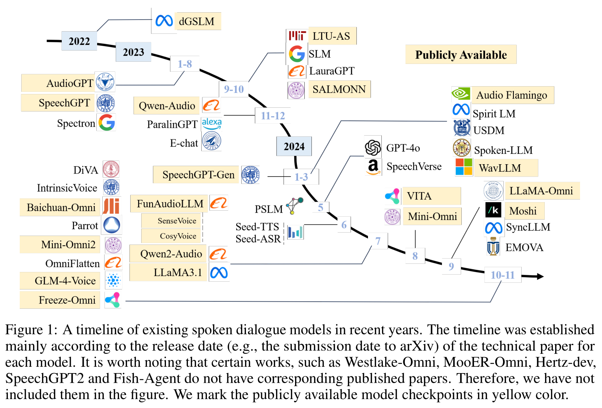
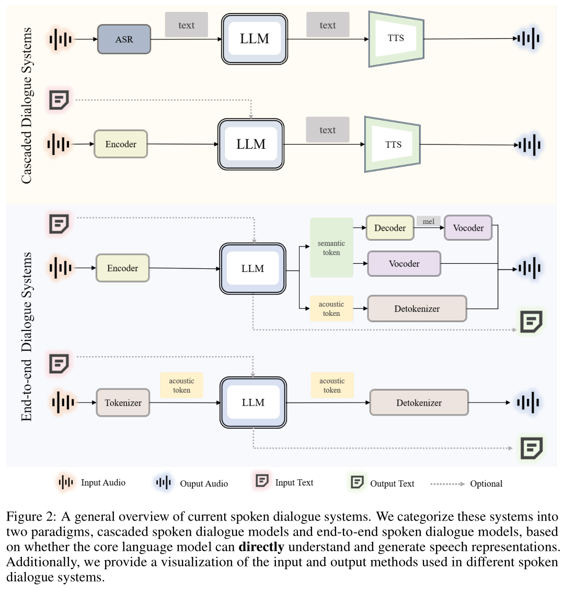
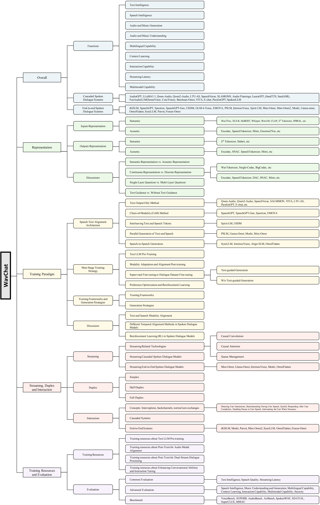

# WavChat

基本信息

- 标题: "WavChat: A Survey of Spoken Dialogue Models"
- 作者:
  - 01 Shengpeng Ji (浙江大学, shengpengji@zju.edu.cn)
  - 02 Yifu Chen (浙江大学)
  - 03 Minghui Fang (浙江大学)
  - 04 Jialong Zuo (浙江大学)
  - 05 Jingyu Lu (浙江大学)
  - 06 Hanting Wang (浙江大学)
  - 07 Ziyue Jiang (浙江大学)
  - 08 Long Zhou (微软)
  - 09 Shujie Liu (微软)
  - 10 Xize Cheng (浙江大学)
  - 11 Xiaoda Yang (浙江大学)
  - 12 Zehan Wang (浙江大学)
  - 13 Qian Yang (浙江大学)
  - 14 Jian Li (腾讯优图实验室)
  - 15 Yidi Jiang (阿里巴巴)
  - 16 Jingzhen He (阿里巴巴)
  - 17 Yunfei Chu (阿里巴巴)
  - 18 Jin Xu (阿里巴巴)
  - 19 Zhou Zhao (浙江大学, zhaozhou@zju.edu.cn)
- 链接:
  - [ArXiv](https://arxiv.org/abs/2411.13577)
  - [Publication]
  - [Github](https://github.com/jishengpeng/WavChat)
  - [Demo]
  - [WeChat](https://mp.weixin.qq.com/s/9DisPbvZBr8NGY2SPytT9Q)
- 文件:
  - [ArXiv](2411.13577v1__Survey__WavChat__A_Survey_of_Spoken_Dialogue_Models.pdf)
  - [Publication] #TODO

## Abstract: 摘要

展开原文

Recent advancements in spoken dialogue models, exemplified by systems like GPT-4o, have captured significant attention in the speech domain.
In the broader context of multimodal models, the speech modality offers a direct interface for human-computer interaction, enabling direct communication between AI and users.
Compared to traditional three-tier cascaded spoken dialogue models that comprise speech recognition (ASR), large language models (LLMs), and text-to-speech (TTS), modern spoken dialogue models exhibit greater intelligence.
These advanced spoken dialogue models not only comprehend audio, music, and other speech-related features, but also capture stylistic and timbral characteristics in speech.
Moreover, they generate high-quality, multi-turn speech responses with low latency, enabling real-time interaction through simultaneous listening and speaking capability.
Despite the progress in spoken dialogue systems, there is a lack of comprehensive surveys that systematically organize and analyze these systems and the underlying technologies.
To address this, **we have first compiled existing spoken dialogue systems in the chronological order and categorized them into the cascaded and end-to-end paradigms**.
We then provide an in-depth overview of the core technologies in spoken dialogue models, covering aspects such as **speech representation, training paradigm, streaming, duplex, and interaction capabilities**.
Each section discusses the limitations of these technologies and outlines considerations for future research.
Additionally, we present a thorough review of **relevant datasets, evaluation metrics, and benchmarks** from the perspectives of training and evaluating spoken dialogue systems.
We hope this survey will contribute to advancing both academic research and industrial applications in the field of spoken dialogue systems.
The related material is available at [Github](https://github.com/jishengpeng/WavChat).

 

口语对话模型的近期进展, 如 GPT-4o 等系统为代表, 在语音领域获得了广泛关注.
在多模态模型的更广泛背景下, 语音模态为人机交互提供了直接的接口, 使得人工智能和用户之间可以直接交流.
和传统的由自动语音识别 (ASR) + 大语言模型 (LLM) + 文本转语音 (TTS) 组成的三层级联口语对话模型相比, 现代的口语对话模型展现出更高的智能.
这些先进的口语对话模型不仅能够理解音频, 音乐, 以及其他与语音相关的特征, 还能够捕获语音的风格和音色特征.
此外, 它们能够以低延迟生成高质量, 多轮次的语音响应.

尽管口语对话系统取得了不少进步, 但缺乏全面的综述, 来系统地组织和分析这些系统和底层技术.

- 为了解决这一问题, **我们首先将现有的口语对话系统按时间顺序排列, 并将它们分类为级联范式和端到端范式**.
- 然后我们对口语对话模型的核心技术进行了深入的概述, 涵盖了**语音表示**, **训练范式**, **流式/双工/交互能力**等方面.
每一节讨论这些技术的局限性, 并概述了未来研究的考虑因素.
- 此外, 我们从训练和评估口语对话模型的角度, 全面回顾了相关的**数据集**, **评估指标**, 和**基准**.

我们希望这项工作能够促进口语对话系统的学术研究和工业应用的发展.
相关材料可在 [Github](https://github.com/jishengpeng/WavChat) 获得.

## 1·Introduction: 引言

展开原文

Spoken dialogue models ([Moshi [44]](../../Models/SpeechLM/2024.09.17_Moshi.md); [SpeechGPT [242]](../../Models/SpeechLM/2023.05.18_SpeechGPT.md); [Mini-Omni2 [223]](../../Models/SpeechLM/2024.10.15_Mini-Omni2.md)) represent one of the most direct methods of human-computer interaction, evolving from traditional voice assistants such as [Alexa [Website]](https://www.alexa.com/), [Siri [Website]](https://www.apple.com/siri/), and [Google Assistant [Website]](https://assistant.google.com/) to the latest intelligent dialogue systems, such as [GPT-4o [Website]](https://openai.com/index/chatgpt-can-now-see-hear-and-speak/).
The fundamental definition of a spoken dialogue model refers to a dialogue system capable of generating intelligent verbal responses based on the input speech.
On the one hand, the **speech modality** serves as both the input and output interface for the human-computer interaction in the spoken dialogue models.
On the other hand, the **dialogue system** ([LLaMA3 [52]](../../Models/TextLM/2024.07.31_LLaMA3.md)) requires the model to possess a certain level of textual intelligence, including the ability to comprehend the knowledge of human society and generating professional and intelligent responses.
Recently, intelligent spoken dialogue systems, exemplified by GPT-4o and [Moshi [44]](../../Models/SpeechLM/2024.09.17_Moshi.md), have garnered significant attention for their ability to extend speech intelligence capabilities beyond traditional text-based dialogue models ([AudioGPT [84]](../../Models/SpeechLM/2023.04.25_AudioGPT.md)).
These dialogue models can not only generate natural, human-like speech responses ([Moshi [44]](../../Models/SpeechLM/2024.09.17_Moshi.md); [FunAudioLLM [195]](../../Models/SpeechLM/2024.07.04_FunAudioLLM.md)) but also demonstrate an advanced understanding and generation of acoustic features beyond text, such as timbre, emotion, and style ([Spoken-LLM [127]](../../Models/SpeechLM/2024.02.20_Spoken-LLM.md); [ParalinGPT [128]](../../Models/SpeechLM/2023.12.23_ParalinGPT.md); [E-chat [227]](../../Models/SpeechLM/2023.12.31_E-chat.md)).
Additionally, they exhibit strong performance in processing other speech-related representations, including music and audio events ([Qwen2-Audio [33]](../../Models/SpeechLM/2024.07.15_Qwen2-Audio.md); [Qwen-Audio [34]](../../Models/SpeechLM/2023.11.14_Qwen-Audio.md); [LTU-AS [67]](../../Models/SpeechLM/2023.09.25_LTU-AS.md); [SALMONN [198]](../../Models/SpeechLM/2023.10.20_SALMONN.md)).
Their realistic conversational interactivity ([VITA [61]](../../Models/SpeechLM/2024.08.09_VITA.md); [Mini-Omni2 [223]](../../Models/SpeechLM/2024.10.15_Mini-Omni2.md)) and low-latency dialogue experiences ([Moshi [44]](../../Models/SpeechLM/2024.09.17_Moshi.md)) further distinguish them among the traditional spoken dialogue models.

The history of spoken dialogue models can be traced back to early systems like [dGSLM [157]](../../Models/SpeechLM/2022.03.30_dGSLM.md) and [AudioGPT [84]](../../Models/SpeechLM/2023.04.25_AudioGPT.md), leading up to more recent advancements such as GPT-4o and [Moshi [44]](../../Models/SpeechLM/2024.09.17_Moshi.md).
During this period, many notable spoken dialogue models have emerged.
As shown in Fig.01, we have organized these models in chronological order.
Broadly, they can be categorized into two types: cascaded spoken dialogue models ([Qwen2-Audio [33]](../../Models/SpeechLM/2024.07.15_Qwen2-Audio.md); [Qwen-Audio [34]](../../Models/SpeechLM/2023.11.14_Qwen-Audio.md)) and end-to-end ([FSQ [149]](../../Modules/VQ/FSQ.md); [Mini-Omni [222]](../../Models/SpeechLM/2024.08.27_Mini-Omni.md); [OmniFlatten [246]](../../Models/SpeechLM/2024.10.23_OmniFlatten.md); [IntrinsicVoice [248]](../../Models/SpeechLM/2024.10.09_IntrinsicVoice.md)) spoken dialogue models.
Given that most current spoken dialogue models rely on alignment with the text modality, the distinction between cascaded and end-to-end models is crucial.
As illustrated in Fig.02, we classify all spoken dialogue models based on whether **the core language model can directly understand and generate speech representations**, dividing them into cascaded and end-to-end categories.
Traditional cascaded spoken dialogue systems such as [AudioGPT [84]](../../Models/SpeechLM/2023.04.25_AudioGPT.md) are structured around text as the central intermediary, typically comprising three cascaded modules.
First, the input audio is transcribed into text by an automatic speech recognition (ASR) module ([Whisper [169]](../../Models/SpeechLM/2022.12.06_Whisper.md)).
The transcribed text is then fed into a large language model (LLM) such as ChatGPT to generate a textual response.
Finally, this textual response is converted back into audio through a text-to-speech (TTS) module ([VITS2 [109]](../../Models/E2E/2023.07.31_VITS2.md); [FastSpeech2 [176]](../../Models/Acoustic/2020.06.08_FastSpeech2.md)).
While this cascaded architecture leverages the strong in-context capabilities of large language models, it introduces several challenges, including high latency, limited interactivity, and the inability to process non-textual information.
To address these issues, recent research has taken two primary directions.
Some approaches ([Qwen-Audio [34]](../../Models/SpeechLM/2023.11.14_Qwen-Audio.md); [SALMONN [198]](../../Models/SpeechLM/2023.10.20_SALMONN.md)) focus on optimizing the understanding and generation components within the cascaded system to mitigate the aforementioned limitations.
Some other approach ([Mini-Omni [222]](../../Models/SpeechLM/2024.08.27_Mini-Omni.md); [Mini-Omni2 [223]](../../Models/SpeechLM/2024.10.15_Mini-Omni2.md); [SpeechGPT-Gen [244]](../../Models/SpeechLM/2024.01.24_SpeechGPT-Gen.md); [IntrinsicVoice [248]](../../Models/SpeechLM/2024.10.09_IntrinsicVoice.md)) seek to directly solve these problems by adopting end-to-end architectures for spoken dialogue systems.
Although end-to-end spoken dialogue models exhibit various differences in terms of representations and model architectures, they share a common feature: they do not rely on text as the central intermediary.
Instead, these models aim to directly comprehend and generate speech representations.
We define such systems as end-to-end spoken dialogue models.

When constructing spoken dialogue systems, we identify four core technologies closely related to spoken dialogue models, based on the different levels of intelligence involved.
The first is the design of speech representations (i.e., tokenizers and detokenizers).
The second concerns the paradigm for training, inference, and generation, specifically how to align the speech modality with the text modality while preserving or enhancing the intelligence of existing text-based dialogue models.
This part also involves selecting different model architectures, generation strategies, and multi-stage training approaches.
The third challenge involves the design of interactive, duplex, streaming for spoken dialogue systems.
Lastly, the fourth challenge relates to data-specifically, how to construct training datasets for spoken dialogue systems and evaluate their performance.

Given these considerations, in the following sections of this paper, we address these four key technologies in the order outlined above.
- In Section 2, we provide an overview of spoken dialogue systems, including typical spoken dialogue scenarios (i.e., how to define a spoken dialogue model) and recent developments in the cascaded and end-to-end spoken dialogue models.
- Section 3 focuses on the speech representations used in spoken dialogue systems.
- In Section 4, we systematically discuss the training paradigms, with particular emphasis on how to align the speech modality with the text modality, as well as multi-stage training strategies, model architectures, and generation strategies.
- Section 5 highlights the unique characteristics of spoken dialogue systems, particularly their duplex, streaming nature, which distinguishes them from text-based dialogue systems.
- In Section 6, we examine the construction of training datasets and the evaluation methodologies specific to spoken dialogue models.
At the end of each section, we include a summary and discussion to reflect on the key insights.
- Finally, in Section 7, we conclude the survey by summarizing the major findings and discussing open issues for future research.

Given the complexity of the technical points, we provide an overview of the structure of this survey in Fig.03.

 

口语对话模型 ([Moshi [44]](../../Models/SpeechLM/2024.09.17_Moshi.md); [SpeechGPT [242]](../../Models/SpeechLM/2023.05.18_SpeechGPT.md); [Mini-Omni2 [223]](../../Models/SpeechLM/2024.10.15_Mini-Omni2.md)) 代表了人机交互中最直接的方法之一, 从传统的声音助手([Alexa [Website]](https://www.alexa.com/); [Siri [Website]](https://www.apple.com/siri/); [Google Assistant [Website]](https://assistant.google.com/)) 进化到最新的智能对话系统 (如 [GPT-4o [Website]](https://openai.com/index/chatgpt-can-now-see-hear-and-speak/)).

口语对话模型的基本定义是指一个能够根据输入语音生成智能口语回应的对话系统.
一方面, **语音模态**在口语对话模型中既是人机交互的输入接口, 也是输出接口.
另一方面, **对话系统** ([LLaMA3 [52]](../../Models/TextLM/2024.07.31_LLaMA3.md)) 要求模型具备一定程度的文本智能, 包括理解人类社会知识并生成专业和智能的回应.

近期, 以 GPT-4o 和 [Moshi [44]](../../Models/SpeechLM/2024.09.17_Moshi.md) 为代表的智能口语对话系统, 因其超越了传统基于文本的对话模型 ([AudioGPT [84]](../../Models/SpeechLM/2023.04.25_AudioGPT.md)) 的语音智能能力而受到广泛关注.

这些对话模型不仅能够生成自然, 类似人类的语音回应 ([Moshi [44]](../../Models/SpeechLM/2024.09.17_Moshi.md); [FunAudioLLM [195]](../../Models/SpeechLM/2024.07.04_FunAudioLLM.md)) 还展示了超越文本的高级声学特征 (如音色, 情感和风格) 的理解和生成能力 ([Spoken-LLM [127]](../../Models/SpeechLM/2024.02.20_Spoken-LLM.md); [ParalinGPT [128]](../../Models/SpeechLM/2023.12.23_ParalinGPT.md); [E-chat [227]](../../Models/SpeechLM/2023.12.31_E-chat.md)).
此外, 它们在处理其他语音相关表示方面表现出色, 包括音乐和音频事件 ([Qwen2-Audio [33]](../../Models/SpeechLM/2024.07.15_Qwen2-Audio.md); [Qwen-Audio [34]](../../Models/SpeechLM/2023.11.14_Qwen-Audio.md); [LTU-AS [67]](../../Models/SpeechLM/2023.09.25_LTU-AS.md); [SALMONN [198]](../../Models/SpeechLM/2023.10.20_SALMONN.md)).
它们在现实对话互动 ([VITA [61]](../../Models/SpeechLM/2024.08.09_VITA.md); [Mini-Omni2 [223]](../../Models/SpeechLM/2024.10.15_Mini-Omni2.md)) 和低延迟对话体验 ([Moshi [44]](../../Models/SpeechLM/2024.09.17_Moshi.md)) 方面的表现进一步使它们在传统对话模型的竞争中脱颖而出.

口语对话模型的历史可以回溯到早期系统, 如 [dGSLM [157]](../../Models/SpeechLM/2022.03.30_dGSLM.md), [AudioGPT [84]](../../Models/SpeechLM/2023.04.25_AudioGPT.md), 直至最近的进展, 如 GPT-4o 和 [Moshi [44]](../../Models/SpeechLM/2024.09.17_Moshi.md).
在此过程中, 许多值得注意的口语对话模型相继出现.
如图 01 所示, 我们按时间顺序组织了这些模型.

大致上, 它们可以分为两种类型:
- 级联口语对话模型: ([Qwen2-Audio [33]](../../Models/SpeechLM/2024.07.15_Qwen2-Audio.md); [Qwen-Audio [34]](../../Models/SpeechLM/2023.11.14_Qwen-Audio.md))
- 端到端口语对话模型: ([FSQ [149]](../../Modules/VQ/FSQ.md); [Mini-Omni [222]](../../Models/SpeechLM/2024.08.27_Mini-Omni.md); [OmniFlatten [246]](../../Models/SpeechLM/2024.10.23_OmniFlatten.md); [IntrinsicVoice [248]](../../Models/SpeechLM/2024.10.09_IntrinsicVoice.md))

鉴于现有大多数口语对话模型依赖和文本模态的对齐, 级联模型和端到端模型之间的区别十分关键.

如图 02 所示, 我们根据**核心语言模型是否能够直接理解和生成语音表示**将所有口语对话模型划分为级联模型和端到端模型.

传统的级联口语对话系统, 如 [AudioGPT [84]](../../Models/SpeechLM/2023.04.25_AudioGPT.md), 采用以文本为中心媒介的结构, 通常由三个级联模块组成:
- 输入音频通过自动语音识别 ASR 模块转写为文本.
- 转写后的文本输入到大语言模型如 ChatGPT 中生成文本回应.
- 最后, 文本回应通过文本转语音模块 ([VITS2 [109]](../../Models/E2E/2023.07.31_VITS2.md); [FastSpeech2 [176]](../../Models/Acoustic/2020.06.08_FastSpeech2.md)) 转换回音频.

尽管这种级联架构利用了大语言模型强大的上下文能力, 但它也引入了一些挑战: 高延迟, 受限互动性, 无法处理非文本信息等.

为了处理这些问题, 近期研究采取了两个主要方向:
- 一些方法 ([Qwen-Audio [34]](../../Models/SpeechLM/2023.11.14_Qwen-Audio.md); [SALMONN [198]](../../Models/SpeechLM/2023.10.20_SALMONN.md)) 专注于优化级联系统中的理解和生成组件以缓解上述局限.
- 另一些方法 ([Mini-Omni [222]](../../Models/SpeechLM/2024.08.27_Mini-Omni.md); [Mini-Omni2 [223]](../../Models/SpeechLM/2024.10.15_Mini-Omni2.md); [SpeechGPT-Gen [244]](../../Models/SpeechLM/2024.01.24_SpeechGPT-Gen.md); [IntrinsicVoice [248]](../../Models/SpeechLM/2024.10.09_IntrinsicVoice.md)) 试图采用端到端架构来直接解决这些问题.
  尽管端到端口语对话模型在表示和模型架构方面存在各种差异, 但它们有一个共同特征: 它们不依赖于文本作为中介.
  相反, 这些模型试图直接理解和生成语音表示.
  我们将此类系统定义为端到端口语对话模型.

在构建口语对话系统时, 我们根据涉及的不同级别的智能, 确定了和口语对话模型相关的四种核心技术.
- 第一: 语音表示的设计 (即 Tokenizer 和 Detokenizer)
- 第二: 训练, 推理, 生成范式, 特别是如何在保留或增强现有文本对话模型的智能的同时对齐语音模态和文本模态. 这一部分设计到选择不同的模型架构, 生成策略, 多阶段训练策略.
- 第三: 交互, 双工, 流式的设计.
- 第四: 数据特定相关的挑战, 如何构造口语对话系统的训练数据集和评估其性能.

鉴于这些考虑, 在本文的后续章节中, 我们将按照顺序详细阐述这四种核心技术:
- 第二节: 提供口语对话模型的概述, 包括电影的口语对话场景 (即如何定义一个口语对话模型) 以及级联和端到端口语对话模型的近期进展.
- 第三节: 口语对话系统使用的语音表示.
- 第四节: 系统地讨论训练范式, 特别强调了如何将语音模态与文本模态对齐, 以及多阶段训练策略, 模型架构, 和生成策略.
- 第五节: 强调了口语对话系统的独特特性, 特别是双工, 流式特性, 这些特性使得它们与文本对话系统有所不同.
- 第六节: 考察了口语对话模型的训练数据集构建和特定的评估方法.

在每一节末尾, 我们进行总结和讨论, 以反思关键见解.
最后, 我们在第七节, 总结了本文的主要发现和未来研究的开放问题.

鉴于技术点的复杂性, 我们在图 03 中提供了本文的结构概览.

## [2·Overall: 整体视角](Sec.02.md)

## [3·Representations of Spoken Dialogue Models: 口语对话模型的表示](Sec.03.md)

## [4·Training Paradigm of Spoken Dialogue Model: 口语对话模型的训练范式](Sec.04.md)

## [5·Streaming, Duplex, and Interaction: 流式, 双工, 和交互](Sec.05.md)

## [6·Training Resources and Evaluation: 训练资源和评估](Sec.06.md)

## 7·Conclusions: 结论

展开原文

In this work, we systematically review the research related to spoken dialogue models, categorizing it according to two paradigms: cascaded spoken dialogue models and end-to-end spoken dialogue models.
Additionally, we provide a detailed overview of the core technologies behind spoken dialogue models, including speech representation, training paradigms, streaming duplex systems, and interaction mechanisms.
In the speech representation module, we classify and explain the representations from both the input and output perspectives, focusing on different types of semantic and acoustic representations.
In the training paradigm module, we thoroughly discuss five modalities of alignment for spoken dialogue models, multi-stage training strategies, model architectures, and generation paradigms.
Following this, we provide an in-depth analysis of streaming input and output for spoken dialogue models, as well as the related duplex interaction technologies.
Finally, we compile key training resources, evaluation metrics, and benchmarks relevant to spoken dialogue models.
We specifically address the evaluation of different levels of intelligence in spoken dialogue models across various scenarios.
It is important to note that, given that spoken dialogue models are a relatively new and emerging technology, many aspects such as semantic and acoustic representations, still lack well-established paradigms.
Therefore, at the end of each section, we include a dedicated discussion module to explore these open issues.
We hope that this survey will contribute to the further development of the field of spoken dialogue systems.

 

在这项工作中, 我们系统性地回顾了与口语对话模型相关的研究, 根据两种范式进行分类: 级联口语对话模型和端到端口语对话模型.

此外, 我们提供了口语对话模型背后的核心技术的详细概述, 包括语音表示, 训练范式, 流式双工系统和交互机制.
- 在语音表示模块中, 我们从输入和输出的角度分类和解释语音表示, 着重于语义和声学表示的不同类型.
- 在训练范式模块中, 我们深入讨论了口语对话模型对齐的五种方式, 多阶段训练策略, 模型架构和生成范式.
- 随后, 我们深入分析了口语对话模型流式输入和输出, 以及相关的双工交互技术.
- 最后, 我们整理了与口语对话模型相关的关键训练资源, 评估指标和基准.我们特别关注了在不同场景下对口语对话模型不同层次智能的评估.

需要注意的是, 由于口语对话模型是一项相对较新且新兴的技术, 许多方面如语义和声学表示, 仍然缺乏成熟的范式.
因此, 在每个部分的末尾, 我们专门加入了一个专门的讨论部分, 探讨这些开放性问题, 我们希望这项调查能够为口语对话系统领域的进一步发展做出贡献.