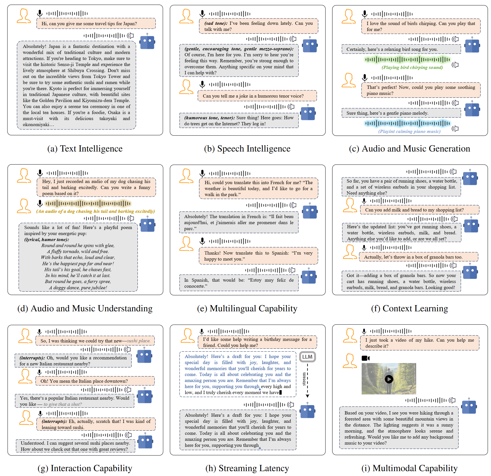

# 2·Overall: 整体视角

展开原文

In this section, we will provide an overall overview of spoken dialogue models.
we begin by defining what constitutes an intelligent spoken dialogue model by examining various dialogue scenarios.
We then provide a comprehensive overview of spoken dialogue models, distinguishing between cascaded spoken dialogue models and end-to-end spoken dialogue models.

 

在本节中, 我们将对口语对话模型进行整体概述.
首先, 我们通过考察各种对话场景来定义什么构成了一个智能口语对话模型.
然后, 我们提供了口语对话模型的全面概述, 区分级联口语对话模型和端到端口语对话模型.

## 2.1·Functions of Spoken Dialogue Systems: 口语对话系统的功能

展开原文

Based on the demos and inference interfaces of representative models such as GPT-4o, [Moshi [44]](../../Models/SpeechLM/2024.09.17_Moshi.md), [Qwen2-Audio [33]](../../Models/SpeechLM/2024.07.15_Qwen2-Audio.md), and [VITA [61]](../../Models/SpeechLM/2024.08.09_VITA.md), we categorize the usage scenarios of modern intelligent spoken dialogue models into the following nine representative categories:
1) Text Intelligence,
2) Speech Intelligence,
3) Audio and Music Generation,
4) Audio and Music Understanding,
5) Multilingual Capability,
6) Context Learning,
7) Interaction Capability,
8) Streaming Latency, and
9) Multimodal Capability.

For the nine distinct use cases in spoken dialogue models, we provide corresponding examples for each scenario in Fig.04.
It is clear from these usage scenarios that a spoken dialogue model is not simply an extension of a text-based dialogue model to the speech modality (i.e., where the speech modality serves merely as an interface for converting speech into text).
Rather, an intelligent spoken dialogue system must be capable of comprehending and generating acoustic information embedded in speech (such as timbre, style, and emotion) and of understanding and producing a wider range of audio representations, including information related to audio events and music.
Additionally, unlike non-streaming text-based systems, spoken dialogue models need to support real-time, interactive streaming capabilities.
These usage scenarios not only highlight the intelligence inherent in spoken dialogue systems but also present significant challenges for building end-to-end spoken dialogue models.
Below, we provide a detailed examination of each of the nine usage scenarios.

 

基于 GPT-4o, [Moshi [44]](../../Models/SpeechLM/2024.09.17_Moshi.md), [Qwen2-Audio [33]](../../Models/SpeechLM/2024.07.15_Qwen2-Audio.md), [VITA [61]](../../Models/SpeechLM/2024.08.09_VITA.md) 等代表性模型的演示和推理接口, 我们将现代智能口语对话模型的使用场景分为以下九个代表性类别:
1) 文本智能;
2) 语音智能;
3) 音频和音乐生成;
4) 音频和音乐理解;
5) 多语言能力;
6) 上下文学习;
7) 交互能力;
8) 流式延迟;
9) 多模态能力.

对于口语对话模型中的九个不同用例, 我们在图 04 中为每个场景提供了相应的示例.
从这些使用场景可以清楚地看出, 口语对话模型不仅仅是基于文本对话模型向语音模态的扩展 (即, 语音模态仅作为将语音转换为文本的接口).
相反, 智能口语对话模型必须能够理解和生成语音中嵌入的声学信息 (如音色, 风格, 以及情感), 并且能够理解和生成更广泛的音频表示, 包括与音频时间和音乐相关的信息.
此外, 与非流式的基于文本的系统不同, 口语对话模型需要支持实时, 交互式的流式传输能力.
这些使用场景不仅突出了口语对话系统中固有的智能, 还展示了构建端到端口语对话模型带来的重大挑战.
下面, 我们将对这九种使用场景进行详细考察.

### 2.1.1·Text Intelligence: 文本智能

展开原文

As illustrated in Fig.04 (a), a spoken dialogue system must retain the fundamental capabilities of the original text-based dialogue models, such as ChatGPT.
We define this usage scenario as textual intelligence.
In this context, the spoken dialogue model can intelligently respond to user requests, generating appropriate responses such as travel itineraries, work plans, and scheduling.
However, due to the limitations of voice-based interaction, the textual intelligence of current spoken dialogue systems is more focused on the daily scenarios.
In certain contexts, such as complex mathematical theorem reasoning, the performance requirements for spoken dialogue models differ from those of text-based dialogue models ([LLaMA [200]](../../Models/TextLM/2023.02.27_LLaMA.md)).
These advanced aspects of textual intelligence warrant further exploration in unified multimodal dialogue models.

 

如图 04 (a) 所示, 口语对话系统必须保留原始基于文本的对话模型 (如 ChatGPT) 的基本能力.
我们将这一使用场景定义为文本智能.
在这种情况下, 口语对话模型可以智能地响应用户请求, 生成合适的响应, 如旅行行程, 工作计划和日程安排.

然而, 由于基于声音交互的局限性, 当前的口语对话系统的文本智能更侧重于日常场景.
在某些情况下, 如复杂的数学定理推理, 口语对话模型的性能要求与基于文本的对话模型有所不同 ([LLaMA [200]](../../Models/TextLM/2023.02.27_LLaMA.md)).
这些文本智能的高级方面在统一的多模态对话模型中值得进一步探索.

### 2.1.2·Speech Intelligence: 语音智能

展开原文

A distinguishing feature of spoken dialogue models, compared to text-based dialogue models ([LLaMA [200]](../../Models/TextLM/2023.02.27_LLaMA.md)), is their ability to understand and generate acoustic information beyond mere textual content.
In the speech modality, not only is the textual content present, but also additional acoustic information, such as timbre (speaker identity) and style (emotion, prosody, etc.).
As illustrated in Fig.04 (b), an intelligent spoken dialogue system should be capable of understanding the timbre and style of conversational speech and, ideally, generating responses with specified timbre and style in a zero-shot manner.

This capability about speech intelligence involves several use cases.
First, on the comprehension side, the spoken dialogue system should generate responses based on the speaker's vocal style.
For example, in the [E-chat [227]](../../Models/SpeechLM/2023.12.31_E-chat.md), a classic example might be: if a user asks, "My phone won't turn on, what should I do?" in a cheerful tone, the system might respond, "It looks like you're excited about getting a new phone. What type of phone are you interested in?" Conversely, if the user asks the same question in a sad tone, the system might reply, "It's unfortunate your phone isn't working.
If you're familiar with the repair policy, let's proceed with the next steps." This situation indicates that the spoken dialogue system may generate responses with different content based on varying acoustic information.
Furthermore, the system should comprehend various acoustic cues, such as accents or emotional states, and adjust its responses of different acoustic information accordingly.
For instance, if the speaker is an American, the system might reply with a native English accent, whereas if the speaker is a Shanghainese user, the system could respond using the corresponding dialect.
Similarly, if the user speaks with a sad tone, the dialogue system should be able to generate a more encouraging and empathetic response.

On the generation side, speech intelligence is more prominently reflected in its controllability, such as voice cloning and style control.
For example, the system could be instructed to mimic a specific voice or respond in a designated style (e.g., mimicking a grandmother's soft and gentle voice for a comforting interaction).
Additionally, the system could use a voice prompt provided during the conversation to fully clone the timbre from the prompt and generate speech in that same voice.
In summary, the ability to comprehend and generate acoustic information is one of the key characteristics of an intelligent spoken dialogue model.

 

和基于文本的对话模型 ([LLaMA [200]](../../Models/TextLM/2023.02.27_LLaMA.md)) 相比, 口语对话模型的显著特征之一是它们能够理解和生成超越文本内容的声学信息的能力.
在语音模态中, 不仅存在文本内容, 还有额外的声学信息 (例如音色/说话人身份和风格/情感/韵律等).
如图 04 (b) 所示, 智能口语对话模型应该能够理解对话语音的音色和风格, 并且理想情况下, 以零样本方式生成具有指定音色和风格的响应.

语音智能的能力涉及到多种用例.

在**理解方面**, 口语对话系统应该基于说话人声学风格生成响应.
例如, 在 [E-chat [227]](../../Models/SpeechLM/2023.12.31_E-chat.md) 中, 一个典型的例子可能是:
如果用户以欢快的语气询问:"我的手机无法开机, 我该怎么办?",
系统可能会回答: "看起来你对新手机很兴奋, 你对哪种手机感兴趣?".
如果用户以悲伤的语气询问同样的问题, 系统可能会回答: "很遗憾你的手机无法正常工作. 如果你熟悉维修政策, 继续下一步吧."
这种情况表明, 口语对话系统可能会根据不同的声学信息生成不同内容的响应.

此外, 系统应该理解各种声学线索, 如口音或情绪状态, 并根据相应的不同声学信息调整其响应.
例如, 如果说话人是一位美国人, 系统可能会用本地的英语口音进行回复, 而如果说话人是上海人, 系统可以用相应的方言回复.
类似地, 如果用户以悲伤的语气说话, 对话系统应能够生成更具有鼓励性和同理心的响应.

在**生成方面**, 语音智能更突出地体现在其可控性上, 例如声音克隆和风格控制.
例如, 系统可以被指示模仿特定声音或以指定风格回应 (模仿祖母的轻声细语以进行安慰性的互动)
此外, 系统可以在对话时使用提供的声音提示来完全克隆提示中的音色并生成相同声音的语音.

总而言之, 理解和生成声学信息的能力是智能口语对话模型的关键特征之一.

### 2.1.3·Audio and Music Generation: 音频和音乐生成

展开原文

In the spoken dialogue models, beyond basic spoken dialogue capabilities, an intelligent spoken dialogue system may be required to generate music and audio.
For example, a user might instruct the system to generate a one-minute piano piece or a ten-second recording of a dog barking.
Additionally, users might provide lyrics and a musical melody, asking the spoken dialogue model to create a pop song.
The system should thus inherit the generative capabilities of large-scale music ([MusicLM [2]](../../Models/SpeechLM/2023.01.26_MusicLM.md); [MusicGen [40]](../../Models/SpeechLM/2023.06.08_MusicGen.md); [MeLoDy [116]](../../Models/SpeechLM/2023.05.25_MeLoDy.md); [Ma et al. (Survey) [141]](../2024.08.26_Foundation_Models_for_Music__A_Survey_89P/Main.md)) and audio ([Make-An-Audio [83]](../../Models/Diffusion/2023.01.30_Make-An-Audio.md); [AudioLDM [134]](../../Models/Diffusion/2023.01.29_AudioLDM.md); [AudioLDM2 [136]](../../Models/Diffusion/2023.08.10_AudioLDM2.md)) models on the output side.

 

在口语对话模型中, 除了基本的口语对话能力之外, 智能口语对话系统可能还被要求生成音乐和音频.
例如, 用户可能会指示系统生成一段一分钟的钢琴段落或十秒钟的狗叫录音.
此外, 用户可能提供歌词和音乐旋律, 要求口语对话模型创作一首流行歌曲.
因此, 系统应在输出侧继承大规模的音乐 ([MusicLM [2]](../../Models/SpeechLM/2023.01.26_MusicLM.md); [MusicGen [40]](../../Models/SpeechLM/2023.06.08_MusicGen.md); [MeLoDy [116]](../../Models/SpeechLM/2023.05.25_MeLoDy.md); [Ma et al. (Survey) [141]](../2024.08.26_Foundation_Models_for_Music__A_Survey_89P/Main.md)) 和音频 ([Make-An-Audio [83]](../../Models/Diffusion/2023.01.30_Make-An-Audio.md); [AudioLDM [134]](../../Models/Diffusion/2023.01.29_AudioLDM.md); [AudioLDM2 [136]](../../Models/Diffusion/2023.08.10_AudioLDM2.md)) 模型的生成能力.

### 2.1.4·Audio and Music Understanding: 音频和音乐理解

展开原文

Complementing its music and audio generation capabilities, a spoken dialogue model should also be able to understand music and audio on the input side ([Qwen2-Audio [33]](../../Models/SpeechLM/2024.07.15_Qwen2-Audio.md); [SALMONN [198]](../../Models/SpeechLM/2023.10.20_SALMONN.md)).
For instance, when given an audio clip, the intelligent system should identify both its content and acoustic characteristics, such as recognizing whether the sound is a bird chirping or a cat meowing, or whether the music is calm or energetic.
Moreover, the system could extend its understanding by creating literary works—like poetry or songs—based on the given music or audio.

 

除了音乐和音频生成能力之外, 口语对话模型应该还能够理解输入侧的音乐和音频 ([Qwen2-Audio [33]](../../Models/SpeechLM/2024.07.15_Qwen2-Audio.md); [SALMONN [198]](../../Models/SpeechLM/2023.10.20_SALMONN.md)).
例如, 当给定一段音频时, 智能系统应该识别其内容和声学特征, 例如识别声音是鸟鸣还是猫叫, 音乐是平静还是充满活力.

此外, 系统还可以通过基于给定的音乐或音频来创作文学作品 (诗歌/歌曲) 来扩展其理解能力.

### 2.1.5·Multilingual Capability: 多语言能力

展开原文

Similar to text-based dialogue models, spoken dialogue systems are expected to possess multilingual capabilities.
Specifically, these models should be able to perform multilingual content translation, such as translating a spoken segment in Japanese into French speech clips, effectively inheriting the capabilities of simultaneous interpretation.
In addition to multilingual content translation, the system should also handle multilingual acoustic information.
This means that the intelligent spoken dialogue model should be able to generate responses in various languages and accents, replying in the corresponding accent of the target language based on the different input speech.

 

和基于文本的对话模型类似, 口语对话系统也应该具备处理多语言的能力.
具体来说, 这些模型应该能够进行多语言的内容翻译, 例如将日语口语片段翻译成法语语音片段, 有效地继承同声传译的能力.

除了多语言内容翻译, 系统还应该能够处理多语言声学信息.
这意味着智能口语对话模型应该能够以各种语言和口音生成响应, 根据不同的输入语音以目标语言的响应口音回应.

### 2.1.6·Context Learning: 上下文学习

展开原文

In the spoken dialogue models, the ability to handle long-form and multi-turn conversations is a key benchmark for evaluating performance ([Moshi [44]](../../Models/SpeechLM/2024.09.17_Moshi.md)).
This requires that spoken dialogue models not only support long-duration audio inputs but also generate extended audio outputs.
Moreover, they must be capable of engaging in multi-turn conversations based on historical context.
An important aspect of multi-turn dialogue is the ability to revise previous responses based on new user instructions.
As shown in Fig.04 (f), an intelligent spoken dialogue model should be able to continuously modify its previous replies according to the user’s evolving requests.

 

在口语对话模型中, 处理长篇和多轮对话的能力是评估性能的关键基准 ([Moshi [44]](../../Models/SpeechLM/2024.09.17_Moshi.md)).
这要求口语对话模型不仅要支持长时段音频输入还需要生成扩展的音频输出.
此外, 它们必须能够基于历史上下文进行多轮对话.
多轮对话的重要方面之一是基于新的用户指令对之前的响应进行修正的能力.
如图 04 (f) 所示, 智能口语对话模型应该能够持续地根据用户不断变化的请求修改其之前的回复.

### 2.1.7·Interaction Capability: 交互能力

展开原文

A distinguishing feature of spoken dialogue systems compared to the text-based dialogue models is their duplex and interactive nature ([Moshi [44]](../../Models/SpeechLM/2024.09.17_Moshi.md)).
In text-based dialogue, interactions typically follow a half-duplex structure, where the response can only be provided after the question has been completed, and the user is unable to interrupt the reply in real-time.
However, in the spoken dialogue systems, full-duplex interaction is common.
This means that a conversation does not need to be fully completed before a response can be generated.
Both the system and the user can interrupt and interact in real time.
For example, if the user is unsatisfied with the system's response, they can immediately interrupt, causing the system to halt its current generation and respond to the new input.
Additionally, to emulate more natural conversational settings, the system can also interrupt the user when appropriate, such as when clarifying the user’s intent.
Beyond the ability to interrupt, interactive dialogue often includes the use of conversational fillers, such as "okay," "haha," or "oh," which signal acknowledgment or agreement.
Including these within spoken dialogue models enhances the realism and natural flow of conversations.
The underlying requirement for interaction capabilities is that the system should be able to listen and speak simultaneously, responding dynamically to the flow of the interaction.

 

与基于文本的对话模型相比, 口语对话系统的一个显著特点是它们的双工和交互性 ([Moshi [44]](../../Models/SpeechLM/2024.09.17_Moshi.md)).
在基于文本的对话中, 交互通常遵循半双工结构, 即响应只能在问句完成后提供, 用户无法实时干扰回复.
然而, 在口语对话系统中, 全双工交互是常见的.
这意味着在生成响应之前不需要完全完成对话.
系统和用户都可以实时打断和互动.
例如, 如果用户不满意系统的响应, 他们可以立即打断, 使得系统暂停当前生成并响应新的输入.

此外, 为了模仿更自然的对话场景, 系统还可以在适当的时候打断用户例如在澄清用户意图时.

除了打断能力外, 交互对话通常还包括对话填充词 (如 "okay," "haha," 或 "oh,"), 它们表示确认或同意.
在口语对话模型中包括这些内容可以增强对话的真实性和自然流动性.

交互能力的基本要求是同时听和说, 动态地响应交互流程.

### 2.1.8·Streaming Latency: 流式延迟

展开原文

Streaming comprehension and generation are also fundamental functionalities of spoken dialogue models ([Mini-Omni2 [223]](../../Models/SpeechLM/2024.10.15_Mini-Omni2.md); [IntrinsicVoice [248]](../../Models/SpeechLM/2024.10.09_IntrinsicVoice.md); [LLaMA-Omni [57]](../../Models/SpeechLM/2024.09.10_LLaMA-Omni.md)).
In the real-world scenarios, a model cannot wait until an entire minute-long audio segment has been processed before generating a response.
Instead, the model must operate on a chunk-based mechanism, dynamically processing and generating audio in real time, one chunk at a time.
Additionally, the streaming requirement means that the entire system must operate in a causal manner—understanding and generating audio based solely on past information, without relying on future information.
Streaming function is often closely tied to the need for low latency.
In practical conversational experiences, the latency of the first token generated by the spoken dialogue model (i.e., the wait time for the user) and the average latency of the generation process are critical factors that influence the overall responsiveness and usability of the spoken dialogue system.

 

流式理解和生成也是口语对话模型的基本功能 ([Mini-Omni2 [223]](../../Models/SpeechLM/2024.10.15_Mini-Omni2.md); [IntrinsicVoice [248]](../../Models/SpeechLM/2024.10.09_IntrinsicVoice.md); [LLaMA-Omni [57]](../../Models/SpeechLM/2024.09.10_LLaMA-Omni.md)).
在真实场景中, 模型不能等到整个分钟长的音频片段处理完成后才生成响应.
相反, 模型必须以分块的机制运行, 实时地动态处理和生成音频, 一次处理一个分块.
此外, 流式要求意味着整个系统必须以因果方式运行, 仅基于过去信息理解和生成音频, 而不依赖未来信息.
流式功能通常和低延迟需求紧密相关.
在实际对话体验中, 口语对话模型生成第一个 Token 的延迟 (即用户等待时间) 和生成过程的平均延迟是影响口语对话系统整体响应及可用性的关键因素.

### 2.1.9·Multimodal Capability: 多模态能力

Multimodal dialogue capability ([EMOVA [25]](../../Models/SpeechLM/2024.09.26_EMOVA.md); [VITA [61]](../../Models/SpeechLM/2024.08.09_VITA.md)) represents an advanced feature of spoken dialogue models.
In existing systems, this typically refers to the ability to process inputs from multiple modalities, such as video, images, and text, while generating intelligent speech responses.
A spoken dialogue model equipped with this capability achieves the ability to “hear, see, and speak” simultaneously.
Multimodal inputs significantly enhance the potential of these systems; for instance, users can employ various gestures to improve the quality of the model’s generated responses, and the system can develop a deeper understanding of the physical world.
Beyond multimodal inputs, the future of dialogue systems lies in large multimodal models that unify the comprehension and generation capabilities across all modalities, with spoken dialogue serving as the foundational modality.

## 2.2·Cascaded Spoken Dialogue Systems: 级联口语对话系统

The earliest prototype of cascaded spoken dialogue systems can be traced back to [AudioGPT [84]](../../Models/SpeechLM/2023.04.25_AudioGPT.md).
To achieve speech-to-speech dialogue functionality, the system first employed an Automatic Speech Recognition (ASR) model to convert speech into text, followed by ChatGPT for text-based dialogue, and finally, a Text-to-Speech (TTS) model to convert the generated text back into speech.
In this primitive version, speech was used solely as an input-output interface, retaining only the most basic textual intelligence.
For example, in the Huggingface’s open-source Speech-To-Speech framework ([Github](https://github.com/huggingface/speech-to-speech)), an additional Voice Activity Detection (VAD) module ([Github](https://github.com/snakers/silero-vad)) was further layered onto the traditional cascaded modules to distinguish between speech and silent segments, as well as between different speakers.

After the basic textual intelligence had been established in the cascaded spoken dialogue models, researchers began incorporating paralinguistic features, such as emotion and style, to enhance the speech intelligence in the cascaded spoken dialogue models.
For instance, [ParalinGPT [128]](../../Models/SpeechLM/2023.12.23_ParalinGPT.md) and [E-chat [227]](../../Models/SpeechLM/2023.12.31_E-chat.md) integrate conversational context, speech embeddings, and paralinguistic attributes into an autoregressive model via a sliding window, allowing the model to generate more accurate text responses by combining historical text and emotional representations.
Similarly, [Spoken-LLM [127]](../../Models/SpeechLM/2024.02.20_Spoken-LLM.md) introduces an [Emotion2Vec [143]](../../Models/Speech_Representaion/2023.12.23_Emotion2Vec.md) module to provide style vectors to the Llama2-Chat model.
Through [LoRA [79]](../../Modules/LoRA/2021.06.17_LoRA.md) fine-tuning, Llama2-Chat is trained not only to generate content-based text responses but also to produce text responses with specific stylistic attributes (e.g., `<cheerful, fast, normal>`), which can guide downstream TTS systems in generating expressive speech.

In addition to understanding acoustic information within cascaded spoken dialogue models, there have been efforts to directly input speech representations while retaining text as the output modality ([SpeechVerse [41]](../../Models/SpeechLM/2024.05.14_SpeechVerse.md); [Qwen-Audio [34]](../../Models/SpeechLM/2023.11.14_Qwen-Audio.md); [Audio Flamingo [111]](../../Models/SpeechLM/2024.02.02_Audio_Flamingo.md)).
This forces cascaded spoken dialogue systems to process input speech directly.
A common approach involves integrating frozen speech encoders (such as [Whisper [169]](../../Models/SpeechLM/2022.12.06_Whisper.md)) with trainable encoder adapters, allowing the speech input to be interpreted as a specialized form of text by the large language model.
By extending the vocabulary of the text-based dialogue model, the large language model can process speech as if it were a unique form of text, enabling the generation of appropriate text responses in the cascaded spoken dialogue models.

Notably, these cascaded spoken dialogue models have further advanced beyond the comprehension of human speech alone and can now understand a variety of audio modalities, including music and audio ([LTU-AS [67]](../../Models/SpeechLM/2023.09.25_LTU-AS.md); [SALMONN [198]](../../Models/SpeechLM/2023.10.20_SALMONN.md)).
For example, [SALMONN [198]](../../Models/SpeechLM/2023.10.20_SALMONN.md) models both speech and audio information by freezing the [Whisper [169]](../../Models/SpeechLM/2022.12.06_Whisper.md) and [BEATs [28]](../../Models/SpeechRepresentation/2022.12.18_BEATs.md) encoder and bridging them to a large language model via a Window-Level Q-Former ([BLIP-2 [121]](../../Models/_Basis/2023.01.30_BLIP-2.md)).
As a result, these cascaded spoken dialogue systems are capable of further performing a wide range of tasks on the comprehension side.
For instance, models like Qwen-audio ([Qwen2-Audio [33]](../../Models/SpeechLM/2024.07.15_Qwen2-Audio.md); [Qwen-Audio [34]](../../Models/SpeechLM/2023.11.14_Qwen-Audio.md)) can handle multiple tasks such as Automatic Speech Recognition (ASR), Speech-to-Text Translation (S2TT), Automatic Audio Captioning (AAC), Acoustic Scene Classification (ASC), Speech Emotion Recognition (SER), Audio Question Answering (AQA), Vocal Sound Classification (VSC), and Music Note Analysis (MNA).
Consequently, these cascaded models are often regarded as part of multitask speech-text large language models.

It is worth noting that the aforementioned cascaded spoken dialogue models generate text only and then directly feed it into a pre-trained TTS module.
However, more recent cascaded spoken dialogue models, such as Llama3.1, have begun integrating trainable TTS modules as part of the decoder within the large language model (LLM).
While these models have made progress in incorporating low-latency streaming functionalities, they are still fundamentally based on generating text content first, which is then converted into speech.
They do not directly generate speech-related representations within the LLM itself.
Therefore, we classify these models as cascaded spoken dialogue systems.

In addition, some recent efforts have focused on enhancing models like [Qwen2-Audio [33]](../../Models/SpeechLM/2024.07.15_Qwen2-Audio.md) by incorporating multimodal comprehension capabilities, thereby enabling a degree of multimodal dialogue functionality.
For instance, models such as [VITA [61]](../../Models/SpeechLM/2024.08.09_VITA.md) and [Ocean-Omni [122]](../../Models/SpeechLM/2024.10.11_Ocean-Omni.md) integrate various encoders or tokenizers for images, audio, and video into the LLM, allowing the model to understand multimodal inputs and generate corresponding text responses.

The above developments concern the comprehension side of cascaded spoken dialogue systems.
On the generation side, two main types of speech synthesis work are relevant to cascaded spoken dialogue systems.
Firstly, there has been a recent surge of advanced speech synthesis systems that can produce highly expressive and natural audio based on textual input, such as [VALL-E [209]](../../Models/SpeechLM/2023.01.05_VALL-E.md); [VALL-E X [250]](../../Models/SpeechLM/2023.03.07_VALL-E_X.md); [Mega-TTS [97]](../../Models/SpeechLM/2023.06.06_Mega-TTS.md); [Mega-TTS2 [96]](../../Models/SpeechLM/2023.07.14_Mega-TTS2.md); [CosyVoice [49]](../../Models/SpeechLM/2024.07.07_CosyVoice.md); [ChatTTS [Github]](https://github.com/2noise/ChatTTS); [FishSpeech [Github]](https://github.com/fishaudio/fish-speech); [ParlerTTS [140]](../../Models/SpeechLM/2024.02.02_Parler-TTS.md); [MaskGCT [216]](../../Models/SpeechLM/2024.09.01_MaskGCT.md) and [F5-TTS [30]](../../Models/Diffusion/2024.10.09_F5-TTS.md).
In addition, there has been significant progress in the field of text-style controllable TTS, with systems like [TextrolSpeech [92]](../../Datasets/2023.08.28_TextrolSpeech.md), [PromptTTS [71]](../../Models/Prompt/2022.11.22_PromptTTS.md), [PromptTTS2 [118]](../../Models/Prompt/2023.09.05_PromptTTS2.md), [InstructTTS [231]](../../Models/Prompt/2023.01.31_InstructTTS.md), and [ControlSpeech [93]](../../Models/SpeechLM/2024.06.03_ControlSpeech.md).
These TTS systems can generate highly natural audio based both on the content and style of the text output produced by the cascaded spoken dialogue models.

## 2.3·End-to-End Spoken Dialogue Systems: 端到端口语对话模型

Ideally, end-to-end spoken dialogue models should enable only speech input and output during both training and inference, thereby achieving multiple intelligent dialogue functions.
However, considering that speech modal is a low-density (contains a lot of acoustic information) modality compared to text modal, and that the volume of available text data far exceeds that of available speech data, many end-to-end spoken dialogue models choose to align the speech modality with the text modality to leverage pre-trained language models (LLMs).
Consequently, as showed in the Fig.02, as long as the large language models can directly understand and generate speech representations, we classify such systems as end-to-end spoken dialogue models.
In contrast, if the large language models can only generate text, we categorize the system as cascaded spoken dialogue systems.

The earliest end-to-end spoken dialogue system can be traced back to [dGSLM [157]](../../Models/SpeechLM/2022.03.30_dGSLM.md), which was trained on thousands of hours of dual-track data ([Fisher Corpus [37]](../../Datasets/Fisher_Corpus.md)) using self-attention and cross-attention mechanisms to simulate duplex interactions.
Although dGSLM lacks integration with LLMs and even basic textual intelligence, it is notable as the first fully end-to-end spoken dialogue system that does not rely on text while maintaining excellent conversational interactivity.

Following the release of [dGSLM [157]](../../Models/SpeechLM/2022.03.30_dGSLM.md), the progress in the domain of end-to-end spoken dialogue systems stagnated for a few months.
However, with the advent of ChatGPT, this field experienced rapid development.
A representative approach is [SpeechGPT [242]](../../Models/SpeechLM/2023.05.18_SpeechGPT.md), which employs autoregressive language modeling by using a sequence of speech tokens, text tokens, text tokens, and speech tokens.
This method enables the direct generation of speech tokens using textual intelligence, inspiring subsequent end-to-end spoken dialogue systems such as [Spectron [156]](../../Models/SpeechLM/2023.05.24_Spectron.md), [SpeechGPT-Gen [244]](../../Models/SpeechLM/2024.01.24_SpeechGPT-Gen.md), [GLM-4-Voice [Github]](https://github.com/THUDM/GLM-4-Voice), and [EMOVA [25]](../../Models/SpeechLM/2024.09.26_EMOVA.md).
These systems continue to use an autoregressive framework, generating the text tokens followed by the speech tokens.
Although this approach allows LLMs to generate speech tokens directly, it introduces latency issues since speech token generation cannot begin until the generation of text tokens is complete.
This leads to problems in multi-turn dialogue and overall system delay.

Beyond the design of [SpeechGPT [242]](../../Models/SpeechLM/2023.05.18_SpeechGPT.md), another intuitive approach is to directly use the hidden states before the LLM’s softmax layer to predict both text tokens and speech tokens through different projection layers.
This allows the network to share weights up to the projection layer, thereby aligning the speech and text modalities.
The [PSLM [154]](../../Models/SpeechLM/2024.06.18_PSLM.md) model is a typical example of this design.
Another method, proposed by Meta, is the interleaving approach, as seen in [Spirit-LM [158]](../../Models/SpeechLM/2024.02.08_SpiRit-LM.md), where speech and text sequences are concatenated into a single token stream and trained using a word-level interleaving method with a small, automatically curated speech-text parallel corpus.
However, this approach requires precise alignment between speech and text.

Recently, several new end-to-end spoken dialogue systems have emerged.
For instance, [Moshi [44]](../../Models/SpeechLM/2024.09.17_Moshi.md), which is based on a global-local transformer, can simultaneously generate text and speech acoustic tokens from a multi-layer quantizer.
Starting from a text-based language model backbone, Moshi generates speech tokens from the residual quantizer of a neural audio codec while modeling both the user’s speech and the system’s responses in parallel streams.
This design eliminates the need for explicit speaker turns and allows for the modeling of arbitrary conversational dynamics.
Moreover, Moshi extends previous hierarchical semantic-to-acoustic token generation by first predicting time-aligned text tokens as a prefix to audio tokens.
Similarly, [Mini-Omni [222]](../../Models/SpeechLM/2024.08.27_Mini-Omni.md) uses a [MusicGen [40]](../../Models/SpeechLM/2023.06.08_MusicGen.md)-based method to simultaneously generate text and speech codec tokens.
It introduces two strategies: autoregressive generation without strict temporal alignment by padding text tokens and batch-parallel inference strategies to boost performance.
[Mini-Omni2 [223]](../../Models/SpeechLM/2024.10.15_Mini-Omni2.md) further enhances this by incorporating multimodal understanding and duplex functionality.
At the same time, [LLaMA-Omni [57]](../../Models/SpeechLM/2024.09.10_LLaMA-Omni.md), [Freeze-Omni [212]](../../Models/SpeechLM/2024.11.01_Freeze-Omni.md) and [IntrinsicVoice [248]](../../Models/SpeechLM/2024.10.09_IntrinsicVoice.md) design an LLM for real-time voice interaction.
Their commonality lies in the fact that, at the generation stage, the hidden states of the LLM are further fed into the corresponding decoder model.
[LLaMA-Omni [57]](../../Models/SpeechLM/2024.09.10_LLaMA-Omni.md) integrates a pretrained speech encoder, a speech adapter, an LLM, and a streaming speech decoder.
It eliminates the need for speech transcription, and can simultaneously generate text and speech responses directly from speech instructions with low latency.
[Freeze-Omni [212]](../../Models/SpeechLM/2024.11.01_Freeze-Omni.md) designed 3-stage training strategies both for the modeling of speech input and output, enabling it to obtain speech-to-speech
dialogue ability noly by using text-speech paired data.
The core idea of Freeze-Omni lies in transferring the functionalities of spoken dialogue models to the encoder (ASR) and decoder (TTS), rather than assigning these tasks to the large language model.
[IntrinsicVoice [248]](../../Models/SpeechLM/2024.10.09_IntrinsicVoice.md) facilitates the transfer of textual capabilities from pre-trained LLMs to the speech modality by reducing the modality gap between text and speech.
By using a GroupFormer to generate HuBERT tokens from the LLM’s hidden states, IntrinsicVoice effectively reduces speech sequences to lengths comparable to text sequences, generating high-quality audio while significantly speeding up inference and mitigating long-text modeling issues.
Additionally, some end-to-end spoken dialogue models align speech and text through multi-stage training, eliminating the need to generate text during inference.
For example, [OmniFlatten [246]](../../Models/SpeechLM/2024.10.23_OmniFlatten.md); employs modality alignment, half-duplex dialogue learning, and full-duplex dialogue learning, along with a flattening-style standardization of text and speech tokens, to achieve duplex, text-free speech dialogue during inference.
Similar approaches include [SyncLLM [203]](../../Models/SpeechLM/2024.09.23_SyncLLM.md).

## 2.4·Summary: 总结

In this section, we have provided a general overview of current end-to-end spoken dialogue systems.
However, these systems differ significantly in their speech representations, training paradigm, model architectures and generation strategy.
In [Section.03](Sec.03.md) and [Section.04](Sec.04.md), we will present a detailed classification followed by our discussions at the end of each section.
