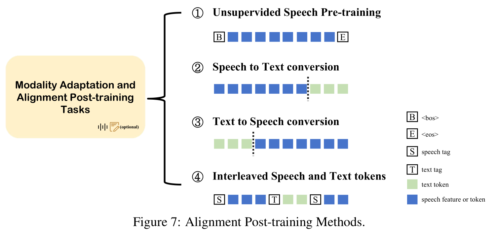

# 4·Training Paradigm of Spoken Dialogue Model: 口语对话模型的训练范式

展开原文

Existing text-based large language models have demonstrated strong contextual understanding and reasoning abilities in the field of natural language processing, such as [GPT-4 [1]](../../Models/TextLM/2023.03.15_GPT-4.md), [LLaMA 3.1 [52]](../../Models/TextLM/2024.07.31_LLaMA3.md), and [Qwen-2 [228]](../../Models/TextLM/Qwen2.md).
Due to their training on large-scale corpora, these models achieve exceptional accuracy when handling complex contexts.
To further expand the capabilities of large language models, some research ([EMOVA [25]](../../Models/SpokenDialogue/2024.09.26_EMOVA.md); [Qwen2-Audio [33]](../../Models/SpokenDialogue/2024.07.15_Qwen2-Audio.md); [VITA [61]](../../Models/SpokenDialogue/2024.08.09_VITA.md); [Mini-Omni2 [223]](../../Models/SpokenDialogue/2024.10.15_Mini-Omni2.md)) has explored enabling them to understand other modalities, thereby building multimodal interaction abilities.
The spoken dialogue model, also known as the speech-text dialogue model, allows users to interact with LLMs naturally and straightforwardly through speech.
However, the transition from text intelligence to speech intelligence involves two inherent hurdles: one core issue is the insufficient amount of speech data compared to the massive datasets used for pre-training text-based large language models.
For instance, [LLaMA 3.1 [52]](../../Models/TextLM/2024.07.31_LLaMA3.md) uses 800 billion training tokens, and [Qwen-2 [228]](../../Models/TextLM/Qwen2.md) is trained on over 7 trillion tokens, whereas pure speech pre-training data often amounts to hundreds of thousands or millions of hours.
For example, [Moshi [44]](../../Models/SpokenDialogue/2024.09.17_Moshi.md)'s pre-training speech data comprises 7 million hours, and the amount of labeled speech data is even smaller, making it difficult to support LLMs in achieving powerful speech intelligence comparable to text.
Another challenge is that speech information density is not as compact as text.
Text commonly uses [byte-pair encoding (BPE)[186]](../../Models/_Basis/2015.08.31_BPE.md) (~~[A New Algorithm for Data Compression [62]]~~) to compress it into a tight token space, whereas the speech modality includes not only semantic information but also acoustical information, which is less dense.
This undoubtedly increases the difficulty for LLMs to learn.
Understanding and generating the inherent knowledge of the speech modality more effectively is a significant challenge.

Consequently, existing spoken dialogue models aim to build upon text-based LLMs by incorporating the speech modality into these large language models.
[SpeechGPT [242]](../../Models/SpokenDialogue/2023.05.18_SpeechGPT.md); [EMOVA [25]](../../Models/SpokenDialogue/2024.09.26_EMOVA.md); [Mini-Omni [222]](../../Models/SpokenDialogue/2024.08.27_Mini-Omni.md); [Moshi [44]](../../Models/SpokenDialogue/2024.09.17_Moshi.md) support speech-in and speech-out capabilities for LLMs, forming the foundation of basic speech dialogue capabilities.
Some of the latest advanced approaches ([Moshi [44]](../../Models/SpokenDialogue/2024.09.17_Moshi.md); [OmniFlatten [246]](../../Models/SpokenDialogue/2024.10.23_OmniFlatten.md);[SyncLLM [203]](../../Models/SpokenDialogue/2024.09.23_SyncLLM.md)) attempt to transition from traditional turn-based spoken dialogue systems to full-duplex systems, aiming to simulate the natural spontaneity of human conversation.
While these advancements are promising, achieving low latency and natural interaction in full-duplex systems remains a significant challenge.
Moreover, enhancing LLMs to effectively handle the speech modality—mastering both speech comprehension and generation—while maintaining robust natural language text processing capabilities, is hindered by the limited size of labeled speech datasets.
These datasets are far smaller compared to the vast amounts of pure text data available, which risks diminishing the models' original text processing capabilities.
Thus, building a truly end-to-end conversational model that meets real-world requirements necessitates careful consideration of model architecture, training paradigms, and training data.
Overall, we believe that several key aspects are crucial in the training paradigm of spoken dialogue models: aligning speech-text modalities to ensure consistent understanding, designing multi-stage training strategies for gradual adaptation, and optimizing training structures and inference paradigms for efficient performance.

 

现有的基于文本的大语言模型已经在自然语言处理领域展现出了强大的上下文理解和推理能力, 如 [GPT-4 [1]](../../Models/TextLM/2023.03.15_GPT-4.md), [LLaMA 3.1 [52]](../../Models/TextLM/2024.07.31_LLaMA3.md) 和 [Qwen-2 [228]](../../Models/TextLM/Qwen2.md).
由于它们在大规模语料库上进行训练, 这些模型在处理复杂上下文时取得了卓越的准确性.
为了进一步扩展大语言模型的能力, 一些研究 ([EMOVA [25]](../../Models/SpokenDialogue/2024.09.26_EMOVA.md); [Qwen2-Audio [33]](../../Models/SpokenDialogue/2024.07.15_Qwen2-Audio.md); [VITA [61]](../../Models/SpokenDialogue/2024.08.09_VITA.md); [Mini-Omni2 [223]](../../Models/SpokenDialogue/2024.10.15_Mini-Omni2.md)) 探索了让大语言模型理解其他模态的可能性, 从而构建多模态交互能力.

口语对话模型, 也称为语音-文本对话模型, 允许用户通过语音以自然且直接的方式与 LLMs 进行交互.
然而, 从文本智能到语音只能的转变, 涉及到两个内在的障碍:
一个核心的问题是相比于预训练的基于文本的大语言模型所使用的海量数据集相比, 缺乏足够的语音数据.
- [LLaMA 3.1 [52]](../../Models/TextLM/2024.07.31_LLaMA3.md) 使用 8000 亿个训练 Token, [Qwen-2 [228]](../../Models/TextLM/Qwen2.md) 在超过 7 万亿个 Token 上训练, 而纯语音预训练数据往往只占数十万或数百万小时.
- [Moshi [44]](../../Models/SpokenDialogue/2024.09.17_Moshi.md) 的预训练语音数据包含 7 百万小时, 而标注语音数据却很少, 使得它很难支持 LLMs 在语音智能方面取得与基于文本的模型相当的能力.

另一个挑战是语音信息密度不如文本紧凑.
文本通常使用[字节对编码 (BPE) [186]](../../Models/_Basis/2015.08.31_BPE.md) (~~[A New Algorithm for Data Compression [62]]~~) 将其压缩到紧密的 Token 空间中, 而语音模态不仅包含语义信息, 还包含声学信息, 其密度较低.
这无疑增加了 LLMs 学习的难度.

更有效地理解和生成语音模态的内在知识是一个重大挑战.

因此, 现有的口语对话模型旨在通过将语音模态引入大语言模型中, 从而在这些基于文本的大语言模型基础上进行构建.
- [SpeechGPT [242]](../../Models/SpokenDialogue/2023.05.18_SpeechGPT.md); [EMOVA [25]](../../Models/SpokenDialogue/2024.09.26_EMOVA.md); [Mini-Omni [222]](../../Models/SpokenDialogue/2024.08.27_Mini-Omni.md); [Moshi [44]](../../Models/SpokenDialogue/2024.09.17_Moshi.md) 支持 LLMs 的语音输入和输出功能, 形成了基本的语音对话能力的基础.
- 一些最新的先进方法 ([Moshi [44]](../../Models/SpokenDialogue/2024.09.17_Moshi.md); [OmniFlatten [246]](../../Models/SpokenDialogue/2024.10.23_OmniFlatten.md);[SyncLLM [203]](../../Models/SpokenDialogue/2024.09.23_SyncLLM.md)) 试图从传统的基于轮次的口语对话系统转变为全双工系统, 旨在模拟人类对话的自然随意性.

尽管这些进展前景广阔, 但在全双工系统中实现低延迟和自然交互的能力仍然是一个重要挑战.
此外, 增强 LLMs 以有效地处理语音模态, 即掌握语音理解和生成, 同时保持稳健的自然语言文本处理能力, 受到标注语音数据集规模有限的阻碍.
与大量可用的纯文本数据相比, 这些数据集的规模要小得多, 这可能会削弱模型原有的文本处理能力.

因此, 构建一个真正满足现实需求的端到端对话模型, 需要在模型架构, 训练范式, 训练数据方面进行仔细的考虑.

总的来说, 我们认为口语对话模型的训练范式中有几个关键方面至关重要:
- 使语音-文本模态一致, 以确保一致理解;
- 设计多阶段训练策略, 逐步适应;
- 优化训练结构和推理范式, 以实现高效性能.

## 4.1·Architecture Paradigm about Modal Alignment of Speech and Text: 语音和文本模态对齐的架构范式

展开原文

To enable large language models (LLMs) to handle both speech input and output, a significant amount of prior work ([AudioPaLM [179]](../../Models/SpeechLM/2023.06.22_AudioPaLM.md); [LLaMA3 [52]](../../Models/TextLM/2024.07.31_LLaMA3.md); [LLaMA-Omni [57]](../../Models/SpokenDialogue/2024.09.10_LLaMA-Omni.md); [Mini-Omni [222]](../../Models/SpokenDialogue/2024.08.27_Mini-Omni.md); [Moshi [44]](../../Models/SpokenDialogue/2024.09.17_Moshi.md)) has focused on adapting text-based foundation models into robust spoken dialogue models.
Based on different architectural paradigms, these approaches can be broadly categorized into five types, as shown in Figure.05.

 

为了使得大语言模型能够处理语音输入和输出, 大量先前工作 ([AudioPaLM [179]](../../Models/SpeechLM/2023.06.22_AudioPaLM.md); [LLaMA3 [52]](../../Models/TextLM/2024.07.31_LLaMA3.md); [LLaMA-Omni [57]](../../Models/SpokenDialogue/2024.09.10_LLaMA-Omni.md); [Mini-Omni [222]](../../Models/SpokenDialogue/2024.08.27_Mini-Omni.md); [Moshi [44]](../../Models/SpokenDialogue/2024.09.17_Moshi.md)) 都集中在将基于文本的基础模型转化为健壮的口语对话模型.
基于不同的架构范式, 这些方法可以大致分为五类, 如图 05 所示.

### Text-Output Only Method: 仅输出文本的方法

展开原文

These systems ([Qwen2-Audio [33]](../../Models/SpokenDialogue/2024.07.15_Qwen2-Audio.md); [Qwen-Audio [34]](../../Models/SpokenDialogue/2023.11.14_Qwen-Audio.md); [LTU-AS [67]](../../Models/SpokenDialogue/2023.09.25_LTU-AS.md); [E-chat [227]](../../Models/SpokenDialogue/2023.12.31_E-chat.md); [SALMONN [198]](../../Models/SpokenDialogue/2023.10.20_SALMONN.md); [WavLLM [80]](../../Models/SpeechLM/2024.03.31_WavLLM.md); [SpeechVerse [41]](../../Models/SpokenDialogue/2024.05.14_SpeechVerse.md); [VITA [61]](../../Models/SpokenDialogue/2024.08.09_VITA.md)) maintain the text-based LLM’s foundational structure unchanged, **using an audio encoder and adaptor to map speech input into the LLM's pre-trained text latent space directly**.
This method of direct embedding alignment, combined with a multi-task training strategy, equips the LLM with the ability to 'listen,' thus enabling it to understand and process speech modality inputs effectively and perform exceptionally well in various audio understanding tasks.
Nevertheless, the output remains text-based, which necessitates the use of an external text-to-speech (TTS) system ([XTTS [21]](../../Models/SpeechLM/2024.06.07_XTTS.md); [CosyVoice [49]](../../Models/SpeechLM/2024.07.07_CosyVoice.md)) to generate speech output.
[LTU-AS [67]](../../Models/SpokenDialogue/2023.09.25_LTU-AS.md) uses [Whisper [169]](../../Models/SpeechLM/2022.12.06_Whisper.md) and the Time and Layer-Wise Transformer (TLTR) as its audio encoder, allowing it to recognize both speech and audio events.
[Qwen-Audio [34]](../../Models/SpokenDialogue/2023.11.14_Qwen-Audio.md) scales up audio-language pre-training to cover over 30 tasks and various audio types, facilitating universal audio understanding abilities.
It employs a unified encoder for all audio inputs, bridging the gap between audio and textual modalities, and uses the large language model [Qwen-7B [11]](../../Models/TextLM/2023.09.28_Qwen.md) as its foundational component.
[Qwen2-Audio [33]](../../Models/SpokenDialogue/2024.07.15_Qwen2-Audio.md) simplifies the pre-training process by utilizing natural language prompts for different data and tasks, with [DPO [170]](../../Modules/RLHF/DPO.md) optimizing the model’s performance in terms of factuality and adherence to desired behavior.
[SALMONN [198]](../../Models/SpokenDialogue/2023.10.20_SALMONN.md) employs dual auditory encoders: a speech encoder from the Whisper model and a non-speech [BEATs [28]](../../Models/SpeechRepresentation/2022.12.18_BEATs.md) audio encoder.
The auditory features from these two encoders are complementary, making them suitable for general audio inputs that contain both speech and non-speech information.
These inputs are then connected to a well-trained LLM using Q-former style attention to generate responses.
[VITA [61]](../../Models/SpokenDialogue/2024.08.09_VITA.md) implements a duplex solution through two independent modules: one generates text responses to user queries, while the other continuously monitors environmental input to selectively provide updated interaction content, although it still requires an external TTS system.
All the aforementioned methods frequently overlook paralinguistic information, including emotion, prosody, and non-verbal elements, rendering them insufficient for scenarios that involve emotional speech dialogue.
[ParalinGPT [128]](../../Models/SpokenDialogue/2023.12.23_ParalinGPT.md) utilizes an ASR model to obtain text and a speech encoder to extract emotion embeddings, thereby more accurately simulating both the linguistic content and paralinguistic attributes of spoken responses.
[E-chat [227]](../../Models/SpokenDialogue/2023.12.31_E-chat.md) employs a [HuBERT [78]](../../Models/SpeechRepresentation/2021.06.14_HuBERT.md) speech encoder to extract speech and emotion features, using a connection module to map these features to the textual space within the LLM decoder.
Although these approaches have explored emotional responses within spoken dialogue systems, they require additional systems to synthesize speech from text and suffer from high latency, making real-time dialogue challenging to achieve.

 

这些系统 ([Qwen2-Audio [33]](../../Models/SpokenDialogue/2024.07.15_Qwen2-Audio.md); [Qwen-Audio [34]](../../Models/SpokenDialogue/2023.11.14_Qwen-Audio.md); [LTU-AS [67]](../../Models/SpokenDialogue/2023.09.25_LTU-AS.md); [E-chat [227]](../../Models/SpokenDialogue/2023.12.31_E-chat.md); [SALMONN [198]](../../Models/SpokenDialogue/2023.10.20_SALMONN.md); [WavLLM [80]](../../Models/SpeechLM/2024.03.31_WavLLM.md); [SpeechVerse [41]](../../Models/SpokenDialogue/2024.05.14_SpeechVerse.md); [VITA [61]](../../Models/SpokenDialogue/2024.08.09_VITA.md)) 保持了基于文本的大语言模型的基础架构不变, **使用音频编码器和适配器将语音输入直接映射到大语言模型预训练的文本潜在空间**.
这种直接嵌入对齐的方法, 和多任务训练策略相结合, 使得大语言模型具备了听的能力, 从而能够有效地理解和处理语音模态输入, 并在各种音频理解任务中表现出色.
然而, 输出仍然是基于文本的, 这需要使用外部的文本转语音系统 ([XTTS [21]](../../Models/SpeechLM/2024.06.07_XTTS.md); [CosyVoice [49]](../../Models/SpeechLM/2024.07.07_CosyVoice.md)) 来生成语音输出.
- [LTU-AS [67]](../../Models/SpokenDialogue/2023.09.25_LTU-AS.md) 使用 [Whisper [169]](../../Models/SpeechLM/2022.12.06_Whisper.md) 与时间和层级 Transformer (TLTR) 作为音频编码器, 使其能够识别语音和音频事件.
- [Qwen-Audio [34]](../../Models/SpokenDialogue/2023.11.14_Qwen-Audio.md) 将音频-语言预训练扩展到覆盖超过三十个任务和各种音频类型, 促进了通用音频理解能力. 它对所有的音频输入采用了统一的编码器, 弥合了音频和文本模态之间的差距, 并使用大语言模型 [Qwen-7B [11]](../../Models/TextLM/2023.09.28_Qwen.md) 为基础组件.
- [Qwen2-Audio [33]](../../Models/SpokenDialogue/2024.07.15_Qwen2-Audio.md) 通过为不同数据和任务使用自然语言提示来简化预训练过程, 并使用 [DPO [170]](../../Modules/RLHF/DPO.md) 优化模型在真实性和遵循期望行为方面的表现.
- [SALMONN [198]](../../Models/SpokenDialogue/2023.10.20_SALMONN.md) 采用了双听觉编码器: 来自 Whisper 模型的语音编码器和非语音的 [BEATs [28]](../../Models/SpeechRepresentation/2022.12.18_BEATs.md) 音频编码器. 这两个编码器的听觉特征互补, 使其适合用于包含语音和非语音信息的通用音频输入. 这些输入随后通过 Q-Former 风格注意力机制连接到一个经过良好训练的 LLM 以生成响应.
- [VITA [61]](../../Models/SpokenDialogue/2024.08.09_VITA.md) 通过两个独立的模块实现全双工方案: 一个模块生成对用户查询的文本响应, 另一个持续监控环境输入以有选择地提供更新的交互内容, 尽管它仍然需要额外的 TTS 系统.

上述提及的方法经常忽略副语言信息, 包括情感, 韵律, 和非语言元素, 这使得它们在涉及情感语音对话的场景中表现不足.

- [ParalinGPT [128]](../../Models/SpokenDialogue/2023.12.23_ParalinGPT.md) 使用 ASR 模型获取文本, 并使用语音编码器提取情感嵌入, 从而更准确地模拟语音响应的语言内容和副语言属性.
- [E-Chat [227]](../../Models/SpokenDialogue/2023.12.31_E-chat.md) 采用 [HuBERT [78]](../../Models/SpeechRepresentation/2021.06.14_HuBERT.md) 语音编码器提取语音和情感特征, 使用连接模块将这些特征映射到 LLM 解码器中的文本空间.

尽管这些方法已经探索了口语对话系统的情感响应, 它们要求额外的系统来从文本合成语音并面临高延迟问题, 使得实时对话难以实现.

### Chain-of-Modality (CoM) Method: 模态链方法

展开原文

This method tokenizes speech into discrete tokens and extends the LLM’s vocabulary to handle both speech input and output.
To address alignment issues between speech and text modalities, Recent works ([SpeechGPT [242]](../../Models/SpokenDialogue/2023.05.18_SpeechGPT.md); [SpeechGPT-Gen [244]](../../Models/SpokenDialogue/2024.01.24_SpeechGPT-Gen.md); [Spectron [156]](../../Models/SpokenDialogue/2023.05.24_Spectron.md); [EMOVA [25]](../../Models/SpokenDialogue/2024.09.26_EMOVA.md)) utilize a prompting approach called Chain-of-Modality (CoM), which first generates response text autoregressively before producing the corresponding speech.
This technique allows the text LLM's output to guide speech generation, thereby enhancing the quality of the response content.
However, it is not suitable for live interactions, as the model must complete the entire text response before beginning speech generation, leading to increased response latency.
[SpeechGPT [242]](../../Models/SpokenDialogue/2023.05.18_SpeechGPT.md) and [SpeechGPT-Gen [244]](../../Models/SpokenDialogue/2024.01.24_SpeechGPT-Gen.md) employ the [SpeechTokenizer [249]](../../Models/SpeechCodec/2023.08.31_SpeechTokenizer.md) model as a speech token extractor, breaking down speech generation into the prediction of semantic tokens followed by acoustic tokens.
[Spectron [156]](../../Models/SpokenDialogue/2023.05.24_Spectron.md) performs speech continuation by predicting spectrograms frame-by-frame, optimizing the LLM with a combination of cross-entropy loss for text and reconstruction loss for speech frames.
[EMOVA [25]](../../Models/SpokenDialogue/2024.09.26_EMOVA.md), on the other hand, utilizes the FSPIRAL ([SPIRAL [85]](../../Models/SpeechRepresentation/2022.01.25_SPIRAL.md)) architecture for its speech encoder to capture phonetic and tonal information, which is then discretized using [finite scalar quantization (FSQ) [149]](../../Modules/VQ/FSQ.md).
Its speech response procedure is divided into three primary steps:
1) transcribing user instructions into text,
2) generating textual responses based on these instructions, and
3) producing style labels and response speech units from the textual responses.

This process enables EMOVA to facilitate emotional speech dialogue.

 

这种方法将语音分词为离散 Token 并扩展大语言模型的词表以处理语音输入和输出.
为了处理语音和文本模态之间的对齐问题, 近期工作 ([SpeechGPT [242]](../../Models/SpokenDialogue/2023.05.18_SpeechGPT.md); [SpeechGPT-Gen [244]](../../Models/SpokenDialogue/2024.01.24_SpeechGPT-Gen.md); [Spectron [156]](../../Models/SpokenDialogue/2023.05.24_Spectron.md); [EMOVA [25]](../../Models/SpokenDialogue/2024.09.26_EMOVA.md)) 利用了名为模态链 (Chain-of-Modality, CoM) 的提示方法, 首先自回归地生成响应文本然后生成相应的语音.
这种技术允许文本大语言模型的输出来引导语音生成, 从而增强响应内容的质量.
然而, 这不适合现场交互, 因为模型必须完成整个文本响应才能开始语音生成, 这导致响应延迟增加.
- [SpeechGPT [242]](../../Models/SpokenDialogue/2023.05.18_SpeechGPT.md) 和 [SpeechGPT-Gen [244]](../../Models/SpokenDialogue/2024.01.24_SpeechGPT-Gen.md) 采用 [SpeechTokenizer [249]](../../Models/SpeechCodec/2023.08.31_SpeechTokenizer.md) 模型作为语音 Token 提取器, 将语音生成分解为语义 Token 预测和音频 Token 预测.
- [EMOVA [25]](../../Models/SpokenDialogue/2024.09.26_EMOVA.md) 使用 FSPIRAL ([SPIRAL [85]](../../Models/SpeechRepresentation/2022.01.25_SPIRAL.md)) 架构作为其语音编码器, 捕捉语音的音素和音调信息, 然后使用 [finite scalar quantization (FSQ) [149]](../../Modules/VQ/FSQ.md) 对其离散化.
  其语音响应过程分为三个主要步骤: (1) 将用户指令转化为文本, (2) 根据这些指令生成文本响应, (3) 从文本响应生成样式标签和响应语音单元.
  这种过程使得 EMOVA 能够促进情感语音对话.

### Interleaving Text and Speech Tokens: 交错文本和语音 Token

展开原文

Some earlier models ([AudioPaLM [179]](../../Models/SpeechLM/2023.06.22_AudioPaLM.md), [VoxtLM [145]](../../Models/SpeechLM/2023.09.14_VoxtLM.md)) employed supervised training methods, using specific input and output sequences, and trained on mixed speech-text tasks, including text-to-speech (TTS), automatic speech recognition (ASR), and speech-to-speech translation.
[Spirit-LM [158]](../../Models/SpeechLM/2024.02.08_SpiRit-LM.md) leverages the temporal alignment between speech and its transcription, continuing training on a pre-trained text-based LLM using alternating text and speech tokens.
This significantly improves the model’s performance in both speech understanding and generation.
However, it employs discrete [HuBERT [78]](../../Models/SpeechRepresentation/2021.06.14_HuBERT.md) units as speech representations, which results in some loss of paralinguistic information.
[USDM [106]](../../Models/SpeechLM/2024.02.08_USDM.md) continues pretraining [Mistral-7B [22]](../../Models/TextLM/2023.10.10_Mistral-7B.md) with interleaved speech-text data to capture multimodal semantics.
For dialogue finetuning, it constructs templates using both speech and transcripts of user input as instruction data.

 

一些早期的模型 ([AudioPaLM [179]](../../Models/SpeechLM/2023.06.22_AudioPaLM.md), [VoxtLM [145]](../../Models/SpeechLM/2023.09.14_VoxtLM.md)) 采用了监督训练方法, 使用具体的输入和输出序列, 并在混合语音-文本任务上进行训练, 包括文本到语音 (TTS), 自动语音识别 (ASR), 以及语音到语音的翻译.
- [Spirit-LM [158]](../../Models/SpeechLM/2024.02.08_SpiRit-LM.md) 利用语音和其转写之间的时序对齐, 使用交替文本和语音 Token 继续训练预训练的基于文本的大语言模型 (LLM).
  这种方法显著提升了模型在语音理解和生成中的性能.
  但是, 它采用离散的 [HuBERT [78]](../../Models/SpeechRepresentation/2021.06.14_HuBERT.md) 单元作为语音表示, 这导致部分丢失了副语音信息.
- [USDM [106]](../../Models/SpeechLM/2024.02.08_USDM.md) 继续使用语音-文本数据对 [Mistral-7B [22]](../../Models/TextLM/2023.10.10_Mistral-7B.md) 进行预训练, 以捕捉多模态语义.
  为了对话微调, 它使用用户输入的语音和转写作为指令数据构造模板.

### Parallel Generation of Text and Speech: 并行生成文本和语音

展开原文

[PSLM [154]](../../Models/SpokenDialogue/2024.06.18_PSLM.md) proposes generating speech and text tokens in parallel to reduce latency; however, this approach may compromise response quality.
Additionally, this method still relies on speech recognition for input ([Whisper [169]](../../Models/SpeechLM/2022.12.06_Whisper.md)), which introduces further delay.
[LLaMA-Omni [57]](../../Models/SpokenDialogue/2024.09.10_LLaMA-Omni.md) introduces a novel streaming speech decoder that can simultaneously generate text responses and discrete speech unit sequences, significantly reducing latency and meeting real-time interaction needs.
[Moshi [44]](../../Models/SpokenDialogue/2024.09.17_Moshi.md) and [Mini-Omni [222]](../../Models/SpokenDialogue/2024.08.27_Mini-Omni.md) adopt similar approaches, introducing dual streams that generate both speech tokens and corresponding text tokens simultaneously on the assistant side, facilitating the transfer of the pre-trained LLM’s textual capabilities to the speech modality, enabling the model to directly engage in reasoning through speech.
The key difference lies in how speech-text alignment is handled: [Moshi [44]](../../Models/SpokenDialogue/2024.09.17_Moshi.md) uses explicit alignment information to supervise the model’s learning, while [Mini-Omni [222]](../../Models/SpokenDialogue/2024.08.27_Mini-Omni.md) allows the LLM to learn implicit alignment information.
On the input side, Mini-Omni feeds continuous speech embeddings from the Whisper encoder ([Whisper [169]](../../Models/SpeechLM/2022.12.06_Whisper.md)) into the LLM, enhancing the model's ability to understand spoken instructions without requiring text input.
However, inconsistencies between speech input and output introduce additional computational overhead, increasing latency in multi-turn dialogue scenarios.
In contrast, Moshi allows users to input speech without relying on text, and generates both text and speech tokens in parallel on the assistant side.
Moshi further extends its architecture to model several speech streams in parallel, allowing for conceptually and practically simple handling of full-duplex dialogues with arbitrary dynamics.

 

- [PSLM [154]](../../Models/SpokenDialogue/2024.06.18_PSLM.md) 提出并行地生成语音和文本 Token 来减少延迟, 然而这种方法可能会损害响应的质量.
  此外, 这种方法仍然依赖于输入的语音识别 ([Whisper [169]](../../Models/SpeechLM/2022.12.06_Whisper.md)), 这引入了进一步的延迟.
- [LLaMA-Omni [57]](../../Models/SpokenDialogue/2024.09.10_LLaMA-Omni.md) 引入了新颖的流式语音编码器, 以同时生成文本响应的离散语音单元序列, 显著减少延迟并适应实时交互的需求.
- [Moshi [44]](../../Models/SpokenDialogue/2024.09.17_Moshi.md) 和 [Mini-Omni [222]](../../Models/SpokenDialogue/2024.08.27_Mini-Omni.md) 采用相似方法, 引入双流架构在助手端同时生成语音 Token 和相应的文本 Token, 从而促进了预训练大语言模型的文本能力向语音模态的迁移, 使得模型能够直接通过语音进行推理.

关键区别在于如何处理语音-文本对齐:
- [Moshi [44]](../../Models/SpokenDialogue/2024.09.17_Moshi.md) 使用显式的对齐信息来监督模型的学习;
- [Mini-Omni [222]](../../Models/SpokenDialogue/2024.08.27_Mini-Omni.md) 允许 LLM 学习隐式的对齐信息.

在输入侧, Mini-Omni 将 [Whisper [169]](../../Models/SpeechLM/2022.12.06_Whisper.md) 编码器生成的连续语音嵌入输入到 LLM 中, 增强了模型理解语音指令的能力, 而无需文本输入.
然而, 语音输入和输出之间的不一致性引入了额外的计算开销, 增加了多轮对话场景中的延迟.
相比之下, Moshi 允许用户直接输入语音而不依赖于文本, 并在助手端并行生成文本和语音 Token.
Moshi 进一步扩展了架构以并行建模多个语音流, 从而能够从概念上和实践上简单地处理具有任意动态的全双工对话.

### Speech-to-Speech Generation: 语音转语音生成

展开原文

This approach aims to remove the dependency on intermediate text, thereby reducing latency and making the system closer to real-time interaction.
[SyncLLM [203]](../../Models/SpokenDialogue/2024.09.23_SyncLLM.md) achieves real-time full-duplex interaction through time chunking methods, integrating time information into LLMs to enable synchronous operation with the real-world clock.
[IntrinsicVoice [248]](../../Models/SpokenDialogue/2024.10.09_IntrinsicVoice.md) utilizes a specific model to generate multiple speech tokens in a single step, effectively reducing speech token sequences to lengths comparable to text sequences while producing high-quality audio.
[Align-SLM [129]](../../Models/SpeechLM/2024.11.04_Align-SLM.md) utilizes a pre-trained self-supervised [HuBERT [78]](../../Models/SpeechRepresentation/2021.06.14_HuBERT.md) model with K-means clustering ([TWIST [74]](../../Models/SpeechLM/2023.05.22_TWIST.md)) to convert continuous speech representations into discrete units.
It employs [LoRA [79]](../../Modules/LoRA/2021.06.17_LoRA.md) adapter fine-tuning on a pre-trained [TWIST [74]](../../Models/SpeechLM/2023.05.22_TWIST.md) to produce multiple speech continuations from a given prompt and uses semantic metrics to generate preference data for [Direct Preference Optimization (DPO) [170]](../../Modules/RLHF/DPO.md).
Experimental results indicate that integrating the preference optimization method significantly improves the semantic comprehension of the Spoken LLM.

 

这种方法旨在移除对中间文本的依赖, 从而减少延迟并使系统更接近实时互动.
- [SyncLLM [203]](../../Models/SpokenDialogue/2024.09.23_SyncLLM.md) 通过时间分块方法实现实时全双工交互, 将时间信息集成到 LLMs 中, 以便与真实世界时钟同步运行.
- [IntrinsicVoice [248]](../../Models/SpokenDialogue/2024.10.09_IntrinsicVoice.md) 使用特定模型在单步生成多个语音 Token, 有效地将语音 Token 序列长度与文本序列长度相当, 同时产生高质量的音频.
- [Align-SLM [129]](../../Models/SpeechLM/2024.11.04_Align-SLM.md) 使用预训练的自监督 [HuBERT [78]](../../Models/SpeechRepresentation/2021.06.14_HuBERT.md) 模型和 K-means 聚类 ([TWIST [74]](../../Models/SpeechLM/2023.05.22_TWIST.md)) 将连续语音表示转换为离散单元. 它采用在预训练的 [TWIST [74]](../../Models/SpeechLM/2023.05.22_TWIST.md) 上微调的 [LoRA [79]](../../Modules/LoRA/2021.06.17_LoRA.md) 适配器来从给定的提示生成多个语音延续, 并使用语义度量来生成偏好数据用于[直接偏好优化 (DPO) [170]](../../Modules/RLHF/DPO.md). 实验结果表明, 将偏好优化方法集成到 Spoken LLM 中可以显著提高语义理解能力.

## 4.2·Multi-Stage Training Strategy: 多阶段训练策略

展开原文

This section primarily discusses the training process of the Spoken Dialogue Model, building upon previous work on spoken dialogue systems.
Generally, this process consists of four stages: text LLM pre-training, modality adaptation and alignment post-training, followed by supervised fine-tuning, and optionally, preference optimization.
The primary goal in training most spoken dialogue systems is to preserve the model's original capabilities while integrating the speech modality for voice interaction into the LLM.
The diagram of multi-stage training can be referred to in Figure.06.

 

本节主要基于之前在口语对话系统方面的工作来讨论口语对话模型的训练过程.
通常, 该过程包括四个阶段:
- 文本 LLM 预训练
- 模态适配和对齐后训练
- 监督微调
- 以及可选的偏好优化

训练大多数口语对话系统的主要目标是保留模型的原始能力, 同时将语音模态集成到 LLM 中, 以实现语音交互.

多阶段训练的流程图可参考图 06。

### 4.2.1·Text LLM Pre-Training: 文本大语言模型预训练

展开原文

The goal is to develop a text-intelligent LLM model capable of handling complex contexts and possessing knowledge reasoning abilities, thus preparing it for integration with speech-intelligent LLMs.
Most spoken dialogue systems utilize pre-trained large language models as foundational models rather than pre-training with separate text data themselves.
A series of approaches ([SpeechGPT [242]](../../Models/SpokenDialogue/2023.05.18_SpeechGPT.md); [SpeechGPT-Gen [244]](../../Models/SpokenDialogue/2024.01.24_SpeechGPT-Gen.md); [Spirit-LM [158]](../../Models/SpeechLM/2024.02.08_SpiRit-LM.md); [EMOVA [25]](../../Models/SpokenDialogue/2024.09.26_EMOVA.md); [LLaMA-Omni [57]](../../Models/SpokenDialogue/2024.09.10_LLaMA-Omni.md); [SyncLLM [203]](../../Models/SpokenDialogue/2024.09.23_SyncLLM.md)) use the LLaMA model and its variants as their foundational language model.
On the other hand, ([LauraGPT [50]](../../Models/SpeechLM/2023.10.07_LauraGPT.md); [Mini-Omni [222]](../../Models/SpokenDialogue/2024.08.27_Mini-Omni.md); [Mini-Omni2 [223]](../../Models/SpokenDialogue/2024.10.15_Mini-Omni2.md); [OmniFlatten [246]](../../Models/SpokenDialogue/2024.10.23_OmniFlatten.md)) employ the Qwen ([Qwen [11]](../../Models/TextLM/2023.09.28_Qwen.md); [Qwen-2 [228]](../../Models/TextLM/Qwen2.md)) family of large language models as their backbone.
Meanwhile, [Moshi [44]](../../Models/SpokenDialogue/2024.09.17_Moshi.md) employs an RQ-Transformer for hierarchical autoregressive modeling of speech, utilizing a unique structure that involves pre-training a text-only language model with datasets from the internet (e.g., [Wikipedia](https://dumps.wikimedia.org/) and [StackExchange](https://archive.org/details/stackexchange/)).
The collected data was filtered using a comprehensive preprocessing pipeline to ensure quality and relevance, which included deduplication to remove redundant entries, language identification to retain text in the desired language, and quality filtering to exclude low-quality or irrelevant content based on criteria such as coherence and completeness.
[VITA [61]](../../Models/SpokenDialogue/2024.08.09_VITA.md) utilizes [Mixtral 8x7B1 [95]](../../Models/TextLM/Mixtral.md), a representative LLM with a sparse mixture of experts (SMoE) architecture, and performs pure-text instruction tuning for its extended Chinese vocabulary.

 

这一阶段的目标是开发一个能够处理复杂上下文并具备知识推理能力的文本智能 LLM 模型, 从而为与语音智能 LLM 的集成做好准备.

大多数口语对话系统利用预训练的大语言模型作为基础模型, 而不是自行使用单独的文本数据进行预训练.
- 一系列方法 ([SpeechGPT [242]](../../Models/SpokenDialogue/2023.05.18_SpeechGPT.md); [SpeechGPT-Gen [244]](../../Models/SpokenDialogue/2024.01.24_SpeechGPT-Gen.md); [Spirit-LM [158]](../../Models/SpeechLM/2024.02.08_SpiRit-LM.md); [EMOVA [25]](../../Models/SpokenDialogue/2024.09.26_EMOVA.md); [LLaMA-Omni [57]](../../Models/SpokenDialogue/2024.09.10_LLaMA-Omni.md); [SyncLLM [203]](../../Models/SpokenDialogue/2024.09.23_SyncLLM.md)) 使用 LLaMA 模型及其变体作为其基础语言模型.
- 另一方面 ([LauraGPT [50]](../../Models/SpeechLM/2023.10.07_LauraGPT.md); [Mini-Omni [222]](../../Models/SpokenDialogue/2024.08.27_Mini-Omni.md); [Mini-Omni2 [223]](../../Models/SpokenDialogue/2024.10.15_Mini-Omni2.md); [OmniFlatten [246]](../../Models/SpokenDialogue/2024.10.23_OmniFlatten.md)) 采用 Qwen ([Qwen [11]](../../Models/TextLM/2023.09.28_Qwen.md); [Qwen-2 [228]](../../Models/TextLM/Qwen2.md)) 系列大语言模型作为其骨干.
- 同时, [Moshi [44]](../../Models/SpokenDialogue/2024.09.17_Moshi.md) 采用 RQ-Transformer 进行语音的分层自回归建模, 利用一种独特的结构, 通过互联网数据集 (例如[维基百科](https://dumps.wikimedia.org/) 和 [StackExchange](https://archive.org/details/stackexchange/)) 预训练纯文本语言模型. 收集的数据通过全面的预处理流水线进行过滤, 以确保质量和相关性, 包括去重以删除冗余条目, 语言识别以保留所需语言的文本, 以及质量过滤以排除根据连贯性和完整性等标准判断为低质量或不相关的内容.
- [VITA [61]](../../Models/SpokenDialogue/2024.08.09_VITA.md) 利用 [Mixtral 8x7B1 [95]](../../Models/TextLM/Mixtral.md), 这是一种具有稀疏混合专家 (Sparse Mixture of Experts, SMoE) 架构的代表性 LLM, 并对其扩展的中文词汇进行纯文本指令调优.

### 4.2.2·Modality Adaptation and Alignment Post-training: 模态适配和对齐后训练

展开原文

This phase explores strategies to adapt text-based large language models (LLMs) for speech modality input, focusing on aligning text and audio modalities effectively.
The primary goal is to enhance the models' ability to understand and generate speech by bridging the gap between these two modalities.
Common approaches include multimodal training techniques, leveraging unlabeled speech corpora, and employing multi-task learning frameworks.
These methods typically involve fine-tuning existing LLMs with speech-related tasks and integrating speech-specific modules, such as speech adaptors and decoders, to facilitate seamless interaction between text and speech modalities.
Different training tasks for modality adaptation and alignment are shown in Figure.07.
[Spirit-LM [158]](../../Models/SpeechLM/2024.02.08_SpiRit-LM.md) continuously pretrain on text LLM checkpoints using interleaved text and speech tokens to improve the model's performance in speech understanding and generation.
[LLaMA-Omni [57]](../../Models/SpokenDialogue/2024.09.10_LLaMA-Omni.md) adopts a two-stage training strategy: the first stage jointly trains a speech adaptor and LLM with speech input and text responses, while the second stage uses the same dataset to train a streaming speech decoder independently.
Consequently, this LLM primarily possesses the capability for speech input understanding, with speech generation handled by a separate decoder module.
[SpeechGPT [242]](../../Models/SpokenDialogue/2023.05.18_SpeechGPT.md), [Moshi [44]](../../Models/SpokenDialogue/2024.09.17_Moshi.md), and [VITA [61]](../../Models/SpokenDialogue/2024.08.09_VITA.md) utilize unlabeled speech corpora to train models in a next-token prediction task.
In the first phase, VITA focuses on training the audio encoder and connector, while in the second phase, it optimizes both the connector and the LLM model through multimodal training.
Although capable of processing speech input, it outputs only text.
[Spectron [156]](../../Models/SpokenDialogue/2023.05.24_Spectron.md) addresses the alignment issue between text and speech representations by jointly supervising multiple objectives.
[IntrinsicVoice [248]](../../Models/SpokenDialogue/2024.10.09_IntrinsicVoice.md) employs a two-stage training approach, constructing multiple cross-modal tasks from a single dataset to enable the model to better learn the semantic consistency between speech and text.
[Mini-Omni [222]](../../Models/SpokenDialogue/2024.08.27_Mini-Omni.md), [EMOVA [25]](../../Models/SpokenDialogue/2024.09.26_EMOVA.md), and [OmniFlatten [246]](../../Models/SpokenDialogue/2024.10.23_OmniFlatten.md) adopt similar methodologies, commencing with supervised multi-task fine-tuning of the text LLM backbone to achieve speech-text modality alignment and develop a multimodal LLM ([Jin et al. (Survey) [99]](../2024.05.17_Efficient_Multimodal_Large_Language_Models__A_Survey/Main.md); [Li et al. (2024) [120]](../2024.08.16_A_Survey_on_Benchmarks_of_Multimodal_Large_Language_Models/Main.md)) using Automatic Speech Recognition (ASR) and Text-to-Speech (TTS) tasks.
Notably, Mini-Omni divides the training of various modules into three phases: the first phase utilizes data from speech recognition and synthesis to enhance the model’s abilities in these aspects, training only the ASR and TTS adapters.
The second phase focuses exclusively on enhancing the model’s text capabilities when given speech inputs, updating only the LLM parameters while freezing other modules.
Through these two training phases, the original language LLM’s capabilities are maximally preserved, while adapting to speech modality input and output, thereby addressing the primary modality alignment tasks.

 

这一阶段探索将基于文本的大语言模型适配到语音模态输入的策略, 着重于有效地对齐文本和音频模态.
主要目标是通过弥合文本和语音模态之间的差距来增强模型理解和生成的能力.
常用方法包括多模态训练技术, 利用无标签语音数据集并采用多任务学习框架.
这些方法通常涉及到使用与语音相关的任务微调现有的大语言模型并整合语音特定模块, 例如语音适配器和解码器, 以促进文本和语音模态之间的无缝交互.
模态适配和对齐的不同训练任务如图 07 所示.

- [SpiRit-LM [158]](../../Models/SpeechLM/2024.02.08_SpiRit-LM.md) 使用交错的文本和语音 Token 在文本 LLM 检查点进行持续预训练, 来提升模型在语音理解和生成的性能.
- [LLaMA-Omni [57]](../../Models/SpokenDialogue/2024.09.10_LLaMA-Omni.md) 采用两阶段训练策略: 第一阶段使用语音输入和文本响应联合训练语音适配器和 LLM, 第二阶段使用相同的数据集来单独训练流式语音解码器.
  因此这一 LLM 主要具备语音输入的理解能力, 而语音生成由单独的解码器模块处理.
- [SpeechGPT [242]](../../Models/SpokenDialogue/2023.05.18_SpeechGPT.md), [Moshi [44]](../../Models/SpokenDialogue/2024.09.17_Moshi.md), [VITA [61]](../../Models/SpokenDialogue/2024.08.09_VITA.md) 利用无标注的语音语料库通过下一个 Token 预测任务来训练模型: 第一阶段, VITA 专注于训练音频编码器和连接器, 而第二阶段通过多模态训练优化连接器和 LLM 模型. 尽管能够处理语音输入, 但只能输出文本.
- [Spectron [156]](../../Models/SpokenDialogue/2023.05.24_Spectron.md) 通过联合监督多个目标来处理文本和语音表示之间的对齐问题.
- [IntrinsicVoice [248]](../../Models/SpokenDialogue/2024.10.09_IntrinsicVoice.md) 采用两阶段训练方法, 从单一数据集构建多个跨模态任务来使得模型更好地学习语音和文本之间的语义一致性.
- [Mini-Omni [222]](../../Models/SpokenDialogue/2024.08.27_Mini-Omni.md), [EMOVA [25]](../../Models/SpokenDialogue/2024.09.26_EMOVA.md), [OmniFlatten [246]](../../Models/SpokenDialogue/2024.10.23_OmniFlatten.md) 采用类似的方法, 首先对文本 LLM 骨干进行多任务微调, 以实现语音-文本模态对齐, 并使用自动语音识别和文本转语音任务开发多模态 LLM ([Jin et al. (Survey) [99]](../2024.05.17_Efficient_Multimodal_Large_Language_Models__A_Survey/Main.md); [Li et al. (2024) [120]](../2024.08.16_A_Survey_on_Benchmarks_of_Multimodal_Large_Language_Models/Main.md)). 值得注意的是, Mini-Omni 将不同模块的训练划分为三个阶段: 第一阶段利用语音识别和合成的数据来增强模型在这些方面的能力, 仅训练 ASR 和 TTS 模块; 第二阶段仅专注于在给定语音输入时增强模型的文本能力, 冻结其他模块仅更新 LLM 参数. 通过这两个训练阶段, 原始语言 LLM 的能力被最大程度的保留, 同时适配到语音模态的输入和输出, 从而解决主要的模态对齐任务.

### 4.2.3·Supervised Fine-tuning or Dialogue Dataset Fine-tuning: 监督微调或对话数据集微调

展开原文

During this stage, most models use instruction-following datasets or dialogue data for supervised fine-tuning of the LLM, enhancing natural conversational abilities.
([SpeechGPT [242]](../../Models/SpokenDialogue/2023.05.18_SpeechGPT.md); [SpeechGPT-Gen [244]](../../Models/SpokenDialogue/2024.01.24_SpeechGPT-Gen.md)) propose a two-stage instruction-tuning process that includes cross-modal instruction fine-tuning and chain-of-modality instruction fine-tuning.
Ultimately, the model follows the A-T-T-A method to achieve end-to-end speech input and output.
[EMOVA [25]](../../Models/SpokenDialogue/2024.09.26_EMOVA.md) employs a similar chain-of-modality concept to construct instruction-tuning datasets, empowering it to respond accurately to speech instructions.
[Moshi [44]](../../Models/SpokenDialogue/2024.09.17_Moshi.md), [Mini-Omni [222]](../../Models/SpokenDialogue/2024.08.27_Mini-Omni.md), [OmniFlatten [246]](../../Models/SpokenDialogue/2024.10.23_OmniFlatten.md), and [SyncLLM [203]](../../Models/SpokenDialogue/2024.09.23_SyncLLM.md) utilize spoken dialogue datasets for fine-tuning, endowing the models with conversational interaction capabilities.
Remarkably, Moshi constructs a more natural and realistic dialogue dataset that incorporates elements such as noise and overlap, enabling the model to learn authentic multi-stream interactions.
OmniFlatten fine-tunes the speech-text LLM using interleaved and serialized dialogues across three stages to progressively train the model in acquiring half-duplex and full-duplex communication capabilities.
Similarly, SyncLLM employs a three-stage training procedure that predominantly uses synthetic spoken dialogue data along with a relatively small amount of real-world spoken dialogue data to develop a full-duplex voice agent.

 

在这一阶段, 大多数模型使用指令跟随数据集或口语数据即进行 LLM 的监督式微调, 增强自然对话能力.
- [SpeechGPT [242]](../../Models/SpokenDialogue/2023.05.18_SpeechGPT.md); [SpeechGPT-Gen [244]](../../Models/SpokenDialogue/2024.01.24_SpeechGPT-Gen.md) 提出了一种两阶段的指令微调过程, 包括跨模态指令微调和链式模态指令微调.
  最后模型遵循 A-T-T-A 方法实现端到端语音输入和输出.
- [EMOVA [25]](../../Models/SpokenDialogue/2024.09.26_EMOVA.md) 采用类似的链式模态概念构造指令微调数据集, 赋予模型准确响应语音指令.
- [Moshi [44]](../../Models/SpokenDialogue/2024.09.17_Moshi.md), [Mini-Omni [222]](../../Models/SpokenDialogue/2024.08.27_Mini-Omni.md), [OmniFlatten [246]](../../Models/SpokenDialogue/2024.10.23_OmniFlatten.md), [SyncLLM [203]](../../Models/SpokenDialogue/2024.09.23_SyncLLM.md) 利用口语对话数据集进行微调, 赋予模型对话互动能力.
  - 值得注意的是, Moshi 构造了一个更自然和真实的对话数据集, 其中包含诸如噪声和重叠等元素, 使得模型能够学习真实的多流交互.
  - OmniFlatten 利用三阶段训练过程, 首先使用交替和序列化的对话数据进行语音-文本 LLM 的微调, 逐步训练模型以实现半双工和全双工通信能力.
  - 类似地, SyncLLM 使用三阶段训练过程, 首先使用合成口语对话数据和相对较少的真实口语对话数据进行微调, 开发全双工语音智能体.

### 4.2.4·Preference Optimization and Reinforcement Learning: 偏好优化和强化学习

展开原文

The research on leveraging preference optimization to align a spoken dialogue model with human preferences is virtually absent.
Recently, [Seed-TTS [5]](../../Models/SpeechLM/2024.06.04_Seed-TTS.md); [SpeechAlign [243]](../../Models/SpeechLM/2024.04.08_SpeechAlign.md); [UNO [23]](../../Modules/RLHF/2024.06.02_UNO.md) adopted preference optimization for Text-to-Speech (TTS) models to align speech synthesis quality with human preferences but not for spoken dialogue models.
[Align-SLM [129]](../../Models/SpeechLM/2024.11.04_Align-SLM.md) pioneers the integration of [Direct Preference Optimization (DPO) [170]](../../Modules/RLHF/DPO.md) in textless Spoken Language Models (SLMs) to enhance semantic understanding.
It transforms continuous speech into discrete units using a pre-trained Hubert model and K-means clustering.
LoRA fine-tuning on a Spoken LLM generates multiple speech continuations from prompts.
Semantic metrics create preference data offline, making DPO training efficient and stable, eliminating the need for an external reward model.
Coupled with [curriculum learning [15]](../../Models/_Basis/Curriculum_Learning.md), Align-SLM progressively refines preference data selection, optimizing semantic feedback, and improving SLM performance.

 

利用偏好优化来对齐口语对话模型和人类偏好的研究几乎空缺.
- [Seed-TTS [5]](../../Models/SpeechLM/2024.06.04_Seed-TTS.md); [SpeechAlign [243]](../../Models/SpeechLM/2024.04.08_SpeechAlign.md); [UNO [23]](../../Modules/RLHF/2024.06.02_UNO.md) 采用偏好优化来对齐文本转语音模型的语音合成质量和人类偏好, 但不适用于口语对话模型.
- [Align-SLM [129]](../../Models/SpeechLM/2024.11.04_Align-SLM.md) 开创性地将 [Direct Preference Optimization (DPO) [170]](../../Modules/RLHF/DPO.md) 集成到无文本口语语言模型 (SLM) 中, 增强语义理解.
  它使用预训练的 Hubert 模型和 K-means 聚类将连续语音转换为离散单元.
  在口语 LLM 上微调 LoRA 来从提示生成多个语音连续.
  语义度量生成偏好数据离线, 使得 DPO 训练高效稳定, 避免了外部奖励模型.
  与[课程学习 [15]](../../Models/_Basis/Curriculum_Learning.md) 结合, Align-SLM 逐步优化偏好数据选择, 优化语义反馈, 并提升 SLM 性能.

## 4.3·Training Frameworks and Generation Strategies: 训练框架和生成策略

展开原文

Recent advanced methods in spoken dialogue models employ a variety of innovative techniques to achieve more natural speech output and lower latency.
In this part, we explore various approaches that exemplify these advancements:

 

在口语对话模型中的近期先进方法采用了各种创新的技术来实现更自然的语音输出和更低的延迟.
在这一部分, 我们探索了这些先进的各种方法:

### LLaMA-Omni

展开原文

[LLaMA-Omni [57]](../../Models/SpokenDialogue/2024.09.10_LLaMA-Omni.md) adds a streaming speech decoder that operates after the LLM.
This decoder runs in a non-autoregressive manner, taking the output hidden states from the LLM as input and generating the discrete unit sequence corresponding to the speech response.
To model the variable-length mapping between input and output, LLaMA-Omni employs an upsample factor, denoted as $\lambda$, along with [Connectionist Temporal Classification (CTC) loss [69]](../../Models/ASR/CTC.md).
This ensures that the model can generate speech responses simultaneously with text responses.
Additionally, a predefined chunk size is set to further enable vocoder streaming synthesis of speech waveforms, facilitating real-time interaction and reducing latency.

 

[LLaMA-Omni [57]](../../Models/SpokenDialogue/2024.09.10_LLaMA-Omni.md) 在 LLM 后添加了一个流式语音解码器.
该解码器以非自回归方式运行, 接受 LLM 的输出隐藏状态作为输入, 生成对应语音响应的离散单元序列.
为了建模输入和输出之间的可变长度映射, LLaMA-Omni 采用上采样因子, 记为 $\lambda$, 并采用 [Connectionist Temporal Classification (CTC) loss [69]](../../Models/ASR/CTC.md).
这确保模型能够同时生成文本响应和语音响应.
此外, 设置了预定义的块大小以进一步启用声码器流式合成语音波形, 促进实时互动并降低延迟.

### Mini-Omni

展开原文

[Mini-Omni [222]](../../Models/SpokenDialogue/2024.08.27_Mini-Omni.md) selects [SNAC [193]](../../Models/SpeechCodec/2024.10.18_SNAC.md), a music-grade encoder, to discretize one second of audio into hundreds of tokens, which significantly increases the burden on the LLM for modeling speech tokens.
Delay Pattern language model decoding strategies are often applied in modeling multiple parallel streams of acoustic tokens in speech tasks like [MusicGen [40]](../../Models/SpeechLM/2023.06.08_MusicGen.md), [VoiceCraft [163]](../../Models/SpeechLM/2024.03.25_VoiceCraft.md), and [Parler-TTS [140]](../../Models/SpeechLM/2024.02.02_Parler-TTS.md).
Compared with traditional sequential step decoding, this strategy can effectively reduce the time steps required for LLM decoding and generating speech tokens.
Inspired by this, Mini-Omni innovatively applies text-instructed delayed parallel generation to address the issue of long SNAC codebook sequences, simultaneously producing audio and text tokens.
This effectively leverages and preserves the original capabilities of the language model.
Moreover, Mini-Omni proposes a Batch Parallel Decoding method.
Specifically, it generates two samples in parallel for a single input: the first predicts text tokens, and the second predicts both text and speech tokens simultaneously.
The text output from the first sample is embedded into the corresponding positions of the second sample, while the second sample's text output is discarded.
This further enhances the model’s reasoning capabilities during dialogue, maximizing the transfer of its text-based abilities.

 

[Mini-Omni [222]](../../Models/SpokenDialogue/2024.08.27_Mini-Omni.md) 选择 [SNAC [193]](../../Models/SpeechCodec/2024.10.18_SNAC.md), 一个音乐级编码器, 将一秒钟的音频划分为数百个 Token, 这显著增加了 LLM 建模语音 Token 的负担.
延迟模式语言模型解码策略通常用于建模语音任务中的多个并行流的音频 Token, 如 [MusicGen [40]](../../Models/SpeechLM/2023.06.08_MusicGen.md), [VoiceCraft [163]](../../Models/SpeechLM/2024.03.25_VoiceCraft.md), 和 [Parler-TTS [140]](../../Models/SpeechLM/2024.02.02_Parler-TTS.md).
与传统的顺序步进解码相比, 这种策略可以有效地减少 LLM 解码和生成语音 Token 需要的时间步数.
受此启发, Mini-Omni 创新地采用文本指导的延迟并行生成, 解决了 SNAC 码本序列过长的问题, 同时生成音频和文本 Token.
这有效地利用并保留了语言模型的原始能力.
此外, Mini-Omni 提出了批次并行解码方法.
具体来说, 它为单个输入并行生成两个样本: 第一个预测文本 Token, 第二个同时预测文本和语音 Token.
第一个样本的文本输出嵌入到第二个样本的相应位置, 而第二个样本的文本输出被丢弃.
这进一步增强了模型在对话中的推理能力, 最大限度地迁移其基于文本的能力.

### IntrinsicVoice

展开原文

[IntrinsicVoice [248]](../../Models/SpokenDialogue/2024.10.09_IntrinsicVoice.md) introduces a speech encoder and a streaming vocoder for the tokenization and detokenization of speech, and a GroupFormer for modeling speech and text sequences.
This architecture integrates a large language model (LLM) with a GroupModel.
Specifically, it uses a pre-trained [HuBERT [78]](../../Models/SpeechRepresentation/2021.06.14_HuBERT.md) encoder and its corresponding K-Means quantizer ([TWIST [74]](../../Models/SpeechLM/2023.05.22_TWIST.md)) to process speech inputs into discrete units.
These units are organized into a grouped token sequence through a group partition operation.
The grouped tokens are then passed through an embedding layer and adaptor module to map these embeddings into the LLM's embedding space.
The context embeddings output by the LLM are processed through a linear layer and concatenated with a specified number of learnable queries.
This input is fed into a smaller non-autoregressive transformer encoder model, dubbed the "GroupModel," to predict a group of speech tokens in one step.
The introduction of GroupFormer effectively improves the model's ability to handle sequences within a group, mitigates the modality gap between speech and text, accelerates inference speed, and alleviates issues associated with long-sequence modeling.

 

[IntrinsicVoice [248]](../../Models/SpokenDialogue/2024.10.09_IntrinsicVoice.md) 提出了语音编码器和流式解码器, 用于对语音进行分词和反分词, 以及用于建模语音和文本序列的 GroupFormer.
该架构将大语言模型 (LLM) 与 GroupModel 集成在一起.
具体来说, 它使用预训练的 [HuBERT [78]](../../Models/SpeechRepresentation/2021.06.14_HuBERT.md) 编码器和其对应的 K-Means 量化器 ([TWIST [74]](../../Models/SpeechLM/2023.05.22_TWIST.md)) 对语音输入进行离散化.
这些离散单元组织成了一个分组 Token 序列, 这通过分组划分操作完成.
然后, 分组 Token 被输入到嵌入层和适配器模块中, 用于将这些嵌入映射到 LLM 的嵌入空间.
LLM 的上下文嵌入输出通过线性层处理, 并与可学习的查询连接在一起.
然后输入到较小的非自回归 Transformer 编码器模型, 称为 "GroupModel", 以一步预测一组语音 Token.
GroupFormer 的引入有效地提高了模型处理组内序列的能力, 减轻了语音和文本模态之间的模态差距, 加速了推理速度, 并减轻了长序列建模相关的问题.

### Moshi

展开原文

[Moshi [44]](../../Models/SpokenDialogue/2024.09.17_Moshi.md) introduces a mini codec model with 8 codebooks at a frame rate of 12.5 Hz for speech representation, where one second corresponds to 100 speech tokens.
It adopts an RQ-Transformer consisting of a Temporal Transformer and a smaller Depth Transformer as the backbone network for the LLM, hierarchically modeling multi-codebook audio tokens.
Similar architectures have appeared in prior research, such as [UniAudio [232]](../../Models/SpeechLM/2023.10.01_UniAudio.md) and [MegaByte [237]](../../Models/SpeechLM/2023.05.12_MegaByte.md).
The Depth Transformer models sub-sequence tokens conditioned on temporal context predicted by the Temporal Transformer.
Given the smaller size of the Depth Transformer, sub-sequence generation can almost be viewed as parallel generation.
This allows the model to scale to longer sequences by extending the temporal modeling capacity of the Temporal Transformer or to achieve greater depth by enhancing the hierarchical modeling capabilities of the Depth Transformer, rather than modeling the flattened sequence with a single model.

 

[Moshi [44]](../../Models/SpokenDialogue/2024.09.17_Moshi.md) 提出了一个具有 8 个码本帧率为 12.5 Hz 的小型码本模型用于语音表示, 一秒语音对应于 100 个语音 Token.
它采用了由时序 Transformer 和更小的深度 Transformer 组成的 RQ-Transformer 作为 LLM 的骨干网络, 层次化建模多码本音频 Token.
与以前的研究相似, 如 [UniAudio [232]](../../Models/SpeechLM/2023.10.01_UniAudio.md) 和 [MegaByte [237]](../../Models/SpeechLM/2023.05.12_MegaByte.md), 出现了类似的架构.
深度 Transformer 以时序 Transformer 预测的时序上下文为条件建模子序列 Token.
给定更小的深度 Transformer, 子序列生成几乎可以被视为并行生成.
这使得模型通过增加时序 Transformer 的时序建模能力扩展到更长的序列, 也能通过增强深度 Transformer 的层次化建模能力来实现更深的深度, 而不是用单个模型来建模扁平化的序列.

### SyncLLM

展开原文

[SyncLLM [203]](../../Models/SpokenDialogue/2024.09.23_SyncLLM.md) employs an auto-regressive transformer decoder for full-duplex dialogue, integrating time synchronization to align speech units with the real-world clock.
It predicts interleaved speech tokens for both dialogue partners, maintaining timing with speaker tags.
The model is trained on deduplicated HuBERT token sequences to enhance semantic fidelity while managing latency by anticipating user responses.
Interpolation reconstructs token sequences to fit expected structures, facilitating seamless speech synthesis.

 

[SyncLLM [203]](../../Models/SpokenDialogue/2024.09.23_SyncLLM.md) 采用自回归 Transformer 解码器进行全双工对话, 集成了时间同步功能, 以将语音单元与现实世界时钟对齐.
它为对话双方预测交错的语音 Token, 并通过说话者标签保持时间同步.
该模型在去重后的 HuBERT Token 序列上进行训练以增强语义保真度, 同时通过预测用户响应来管理延迟.
插值重建 Token 序列以适应预期的结构, 从而实现无缝的语音合成.

### Text-Guided Generation: 文本引导生成

展开原文

Some end-to-end methods like ([SpeechGPT [242]](../../Models/SpokenDialogue/2023.05.18_SpeechGPT.md); [SpeechGPT-Gen [244]](../../Models/SpokenDialogue/2024.01.24_SpeechGPT-Gen.md); [Spectron [156]](../../Models/SpokenDialogue/2023.05.24_Spectron.md); [EMOVA [25]](../../Models/SpokenDialogue/2024.09.26_EMOVA.md)) use chain-of-thought reasoning, which allows guiding speech generation with the output of an underlying text LLM.
However, this is fundamentally incompatible with live interactions, as the model needs to produce an entire answer as text before it starts speaking.
Later methods ([LLaMA-Omni [57]](../../Models/SpokenDialogue/2024.09.10_LLaMA-Omni.md); [Mini-Omni [222]](../../Models/SpokenDialogue/2024.08.27_Mini-Omni.md); [Moshi [44]](../../Models/SpokenDialogue/2024.09.17_Moshi.md)) can accept user speech input and simultaneously output speech and text, ensuring high-quality responses while significantly reducing latency.
[LLaMA-Omni [57]](../../Models/SpokenDialogue/2024.09.10_LLaMA-Omni.md) utilizes a streaming decoder to generate text and speech tokens in parallel.
[Mini-Omni [222]](../../Models/SpokenDialogue/2024.08.27_Mini-Omni.md) is restructured to transfer language reasoning abilities to streaming audio output through a text-audio parallel decoding approach.
[Moshi [44]](../../Models/SpokenDialogue/2024.09.17_Moshi.md) details a novel feature, the Inner Monologue, which consists of joint modeling of the textual and speech modalities on the system side to improve the quality of interactions.

 

- 一些端到端方法, 如 ([SpeechGPT [242]](../../Models/SpokenDialogue/2023.05.18_SpeechGPT.md); [SpeechGPT-Gen [244]](../../Models/SpokenDialogue/2024.01.24_SpeechGPT-Gen.md); [Spectron [156]](../../Models/SpokenDialogue/2023.05.24_Spectron.md); [EMOVA [25]](../../Models/SpokenDialogue/2024.09.26_EMOVA.md)) 采用思维链推理, 允许使用底层的文本 LLM 的输出引导语音生成.
然而, 这种方式和实时互动在根本上是不兼容的, 因为模型需要生成整个答案的文本, 然后才能开始说话.
- 后续方法 ([LLaMA-Omni [57]](../../Models/SpokenDialogue/2024.09.10_LLaMA-Omni.md); [Mini-Omni [222]](../../Models/SpokenDialogue/2024.08.27_Mini-Omni.md); [Moshi [44]](../../Models/SpokenDialogue/2024.09.17_Moshi.md)) 可以接受用户语音输入, 并同时输出语音和文本, 确保高质量的响应, 并显著降低延迟.
- [LLaMA-Omni [57]](../../Models/SpokenDialogue/2024.09.10_LLaMA-Omni.md) 采用流式解码器并行生成文本和语音 Token.
- [Mini-Omni [222]](../../Models/SpokenDialogue/2024.08.27_Mini-Omni.md) 通过文本-语音并行解码方法, 将语言推理能力迁移到流式音频输出.
- [Moshi [44]](../../Models/SpokenDialogue/2024.09.17_Moshi.md) 详细介绍了一种新特征, 即 Inner Monologue, 它由系统侧的联合建模文本和语音模态, 改善交互质量.

### W/O Text-Guided Generation: 无文本引导生成

展开原文

Other methods achieve speech-to-speech generation without relying on text stream generation.
[IntrinsicVoice [248]](../../Models/SpokenDialogue/2024.10.09_IntrinsicVoice.md) introduces a novel GroupModel that predicts a group of speech tokens in one step based on global context embeddings.
[SyncLLM [203]](../../Models/SpokenDialogue/2024.09.23_SyncLLM.md) predicts interleaved chunks of token sequences at each time step, allowing the model to handle all conversational cues such as backchannels, overlaps, interruptions, etc.

 

其他方法实现了无需依赖文本流生成的语音到语音生成.
- [IntrinsicVoice [248]](../../Models/SpokenDialogue/2024.10.09_IntrinsicVoice.md) 提出了一种全新的 GroupModel, 它以全局上下文嵌入为条件一步预测一组语音 Token.
- [SyncLLM [203]](../../Models/SpokenDialogue/2024.09.23_SyncLLM.md) 在每个时间步预测交错的 Token 序列块, 允许模型处理所有会话提示, 如背景通道, 重叠, 中断等.

## 4.4·Discussions about Training Paradigm in Spoken Dialogue Models: 讨论

### 4.4.1·Text and Speech Modality Alignment: 文本和语音模态对齐

展开原文

In spoken dialogue systems, the alignment between speech and text modalities is a crucial stage.
To preserve the textual intelligence of large language models (LLMs) as much as possible, nearly all current methodologies ([SpeechGPT [242]](../../Models/SpokenDialogue/2023.05.18_SpeechGPT.md); [PSLM [154]](../../Models/SpokenDialogue/2024.06.18_PSLM.md); [LLaMA-Omni [57]](../../Models/SpokenDialogue/2024.09.10_LLaMA-Omni.md); [Mini-Omni [222]](../../Models/SpokenDialogue/2024.08.27_Mini-Omni.md); [Mini-Omni2 [223]](../../Models/SpokenDialogue/2024.10.15_Mini-Omni2.md); [Moshi [44]](../../Models/SpokenDialogue/2024.09.17_Moshi.md); [OmniFlatten [246]](../../Models/SpokenDialogue/2024.10.23_OmniFlatten.md)) incorporate a post-training phase utilizing speech-text paired data when developing spoken dialogue models.
This may involve either expanding the vocabulary to treat speech tokens as an extension of the original vocabulary or using speech adaptors to map speech embeddings to the original text latent space of the LLM, and designing multi-task training objectives to achieve alignment between text and speech modalities.
For example, data from speech recognition and speech synthesis can be used to train the model's speech recognition and synthesis capabilities.
Although this is an effective strategy, its implementation can still lead to a certain degree of catastrophic forgetting in LLMs due to the large volume of pre-trained text corpora and the imbalance with paired speech-text data, which can harm the model's text-based capabilities.
Therefore, precise parameter design and customized optimization strategies are needed to mitigate this issue as much as possible, as demonstrated by approaches like [Moshi [44]](../../Models/SpokenDialogue/2024.09.17_Moshi.md).

This raises a consideration: during the training phase of spoken dialogue models, is it feasible to directly utilize speech data for adaptation to text-based LLMs, thereby eliminating the necessity for speech-text paired data?
This is because unlabeled speech data is abundant and easily accessible, making it convenient and beneficial for training the speech intelligence of LLMs.
This approach would require us to obtain a pre-aligned speech representation with the text modality.
Perhaps we can consider further exploration and experimentation in the speech tokenizer component, such as directly mapping the semantic discrete units of speech onto the text token space to achieve enforced alignment.

 

在口语对话系统中, 语音和文本模态之间的对齐是至关重要的阶段.

为了尽可能保留大语言模型的文本智能, 几乎所有现有方法 ([SpeechGPT [242]](../../Models/SpokenDialogue/2023.05.18_SpeechGPT.md); [PSLM [154]](../../Models/SpokenDialogue/2024.06.18_PSLM.md); [LLaMA-Omni [57]](../../Models/SpokenDialogue/2024.09.10_LLaMA-Omni.md); [Mini-Omni [222]](../../Models/SpokenDialogue/2024.08.27_Mini-Omni.md); [Mini-Omni2 [223]](../../Models/SpokenDialogue/2024.10.15_Mini-Omni2.md); [Moshi [44]](../../Models/SpokenDialogue/2024.09.17_Moshi.md); [OmniFlatten [246]](../../Models/SpokenDialogue/2024.10.23_OmniFlatten.md)) 在开发口语对话模型时, 都整合了利用语音-文本配对数据的后训练阶段.

这可能涉及扩展词表以将语音 Token 视为原始词表的扩展, 或者使用语音适配器将语音嵌入映射到大语言模型的原始文本潜在空间, 并设计多任务训练目标以实现文本和语音模态之间的对齐.
例如, 来自语音识别和语音合成的数据可以用于训练模型的语音识别和合成能力.
尽管这是一种有效的策略, 但其实现仍然可能导致大语言模型某种程度的灾难性遗忘, 因为大量的预训练文本语料库和语音-文本配对数据之间的不平衡, 这会损害模型的基于文本的能力.
因此, 尽可能缓解这一问题的精确的参数设计和定制优化策略是必要的, 如 [Moshi [44]](../../Models/SpokenDialogue/2024.09.17_Moshi.md) 所示.

这引起了一种考虑: 在口语对话模型的训练阶段, 是否可以直接使用语音数据对基于文本的大语言模型进行适配, 从而消除语音-文本对数据的需要?
这是因为无标签语音数据是丰富的, 易于获得, 因此可以方便地训练大语言模型的语音智能.
这种方法要求我们获得与文本模态预先对齐的语音表示.
也许我们可以考虑进一步探索和实验语音分词器组件, 例如直接将语音的语义离散单元映射到文本 Token 空间, 以实现强制对齐.

### 4.4.2·Different Temporal Alignment Methods in Spoken Dialogue Models: 不同时序对齐方法

展开原文

In speech and text modalities, there is often a significant mismatch in sequence lengths.
Even when some speech tokenizers ([WavTokenizer [90]](../../Models/SpeechCodec/2024.08.29_WavTokenizer.md); [Single-Codec [119]](../../Models/SpeechCodec/2024.06.11_Single-Codec.md)) employ extreme sequence compression methods, a length gap remains between the two.
Temporal alignment information between speech and text has been explored in tasks like Automatic Speech Recognition (ASR) and Text-to-Speech (TTS) as demonstrated by models such as [Whisper [169]](../../Models/SpeechLM/2022.12.06_Whisper.md), [FastSpeech2 [176]](../../Models/Acoustic/2020.06.08_FastSpeech2.md), and [VITS [107]](../../Models/E2E/2021.06.11_VITS.md).
Recently, some spoken dialogue systems have utilized temporal alignment information to enhance model performance, yielding promising results.
For instance, [Spirit-LM [158]](../../Models/SpeechLM/2024.02.08_SpiRit-LM.md) uses interleaving text and speech tokens for continual pre-training on the LLaMA base model, significantly boosting the model’s performance in speech understanding and generation.
Experimental visualizations demonstrate that the similarity between text and speech features is notably higher in models trained with interleaved token sequences compared to those trained without this approach.
This indicates that providing the model with explicit fine-grained temporal alignment information can effectively enhance modality alignment and improve the performance of LLMs.

[Mini-Omni [222]](../../Models/SpokenDialogue/2024.08.27_Mini-Omni.md) achieves parallel generation of text and speech by padding text tokens to match the length of speech tokens, allowing the LLM to implicitly learn the alignment information between speech and text tokens.
This can be viewed as a form of sentence-level temporal alignment information, a method also utilized in recent speech synthesis work ([F5-TTS [30]](../../Models/Diffusion/2024.10.09_F5-TTS.md)).
[Moshi [44]](../../Models/SpokenDialogue/2024.09.17_Moshi.md), on the other hand, uses word-level speech-text temporal alignment information and special marker tokens to achieve similar parallel generation capabilities.
The difference lies in that Mini-Omni fully allows the LLM to implicitly learn the alignment, whereas Moshi provides word-level alignment priors first, and then lets the model learn finer-grained alignments.

Exploring the impact of introducing different levels of temporal alignment priors on the training effectiveness of spoken dialogue models, such as sentence-level, word-level, or phoneme-level, is an intriguing area of research.
Understanding how these various alignment strategies affect model performance can guide the development of more efficient and accurate systems.
For instance, sentence-level alignment might offer a broader contextual understanding, while word-level or phoneme-level alignments could provide more detailed synchronization between speech and text, potentially leading to improvements in nuanced tasks like speech synthesis and understanding.

 

在语音和文本模态中, 序列长度通常存在显著的不匹配.
即使某些语音分词器 ([WavTokenizer [90]](../../Models/SpeechCodec/2024.08.29_WavTokenizer.md); [Single-Codec [119]](../../Models/SpeechCodec/2024.06.11_Single-Codec.md)) 采用极端的序列压缩方法, 两者之间的长度差距也仍然存在.

在自动语音识别 (ASR) 和文本转语音 (TTS) 等任务中, 语音和文本之间的时序对齐信息已被探索, 例如 [Whisper [169]](../../Models/SpeechLM/2022.12.06_Whisper.md), [FastSpeech2 [176]](../../Models/Acoustic/2020.06.08_FastSpeech2.md), 和 [VITS [107]](../../Models/E2E/2021.06.11_VITS.md).

近期, 一些口语对话系统利用时序对齐信息来增强模型性能, 取得了有前景的结果.
- [SpiRit-LM [158]](../../Models/SpeechLM/2024.02.08_SpiRit-LM.md) 使用交错的文本和语音 Token 对 LLaMA-Base 模型进行持续预训练, 显著提升了模型在语音理解和生成中的性能.
  实验可视化表明, 在训练时使用交错 Token 序列的模型相比不使用该方法的模型, 语音特征与文本特征之间的相似性明显更高.
  这表明, 提供给模型显式的细粒度时序对齐信息可以有效地增强模态对齐和提升语言模型的性能.
- [Mini-Omni [222]](../../Models/SpokenDialogue/2024.08.27_Mini-Omni.md) 通过填充文本 Token 以匹配语音 Token 的长度, 实现了文本和语音 Token 之间的隐式学习对齐信息.
  这可以视为一种句子级时序对齐信息, 也是最近的语音合成工作 ([F5-TTS [30]](../../Models/Diffusion/2024.10.09_F5-TTS.md)) 中使用的一种方法.
- [Moshi [44]](../../Models/SpokenDialogue/2024.09.17_Moshi.md) 则使用词级语音-文本时序对齐信息和特殊标记 Token, 实现了类似的并行生成能力.
  两者的不同之处在于, Mini-Omni 完全允许大语言模型隐式学习对齐信息, 而 Moshi 首先提供词级语音-文本对齐信息, 然后让模型学习更细粒度的对齐信息.

探索不同时序对齐先验对口语对话模型的训练效果的影响, 如句子级, 词级, 或音素级, 是一项有趣的研究领域.
理解这些不同的对齐策略对模型性能的影响, 可以指导开发更高效和准确的系统.
例如, 句子级别对齐可能提供更广泛的上下文理解, 而词级别对齐则可以更好地捕捉到语音和文本之间更详细的同步关系, 潜在地提升语音合成和理解等精细任务的性能.

### 4.4.3·Reinforcement Learning (RL) in Spoken Dialogue Models: 强化学习

展开原文

Reinforcement Learning (RL) has proven to be an effective learning paradigm in text and image processing ([PPO [185]](../../Models/_Basis/PPO.md); [Policy Gradient [196]](../../Models/_Basis/PG.md); [Diffusion-DPO [204]](../../Models/CV/2023.11.21_Diffusion-DPO.md)).
Recent research has shown that [Direct Preference Optimization (DPO) [170]](../../Modules/RLHF/DPO.md) can be extended to music and speech generation ([MusicRL [36]](../../Models/SpeechLM/2024.02.06_MusicRL.md); [SpeechAlign [243]](../../Models/SpeechLM/2024.04.08_SpeechAlign.md)).
[MusicRL [36]](../../Models/SpeechLM/2024.02.06_MusicRL.md) uses Reinforcement Learning from Human Feedback (RLHF) to improve music generation by fine-tuning a pretrained model for better text adherence and audio quality.
By collecting extensive human feedback, MusicRL creates a more refined and subjective music generation system.
[Seed-TTS [5]](../../Models/SpeechLM/2024.06.04_Seed-TTS.md) explores RL methods, comparing external reward models like REINFORCE with simpler methods like DPO.
The study highlights using REINFORCE to enhance speaker similarity and emotion controllability in the Seed-TTS system.
[Qwen2-Audio [33]](../../Models/SpokenDialogue/2024.07.15_Qwen2-Audio.md) uses DPO to align with human preferences by optimizing responses based on human-annotated data.
This enhances its ability to follow audio instructions accurately and intelligently respond to complex audio inputs, improving its performance in audio-centric tasks.
However, in the dialogue system field, reinforcement learning techniques based on human feedback ([Huang et al (Survey) [82]](../2023.11.09_A_Survey_on_Hallucination_in_Large_Language_Models__Principles_Taxonomy_Challenges_and_Open_Questions/Main.md)) are rarely applied.
Considering the diversity of inputs and outputs in large language models, exploring the incorporation of reinforcement learning strategies such as [Proximal Policy Optimization (PPO) [185]](../../Models/_Basis/PPO.md) can be beneficial.
Additionally, considering the performance metrics for evaluating spoken dialogue systems, designing targeted reinforcement learning strategies and feedback functions to enhance different objectives is also a direction worth exploring.

 

强化学习 (Reinforcement Learning, RL) 在文本和图像处理领域已经证明是一种有效的学习范式 ([PPO [185]](../../Models/_Basis/PPO.md); [Policy Gradient [196]](../../Models/_Basis/PG.md); [Diffusion-DPO [204]](../../Models/CV/2023.11.21_Diffusion-DPO.md)).
近期研究表明, [Direct Preference Optimization (DPO) [170]](../../Modules/RLHF/DPO.md) 可以被扩展到音乐和语音生成 ([MusicRL [36]](../../Models/SpeechLM/2024.02.06_MusicRL.md); [SpeechAlign [243]](../../Models/SpeechLM/2024.04.08_SpeechAlign.md)).
- [MusicRL [36]](../../Models/SpeechLM/2024.02.06_MusicRL.md) 使用来自人类反馈的强化学习 (RLHF) 来改善音乐生成, 通过微调预训练模型来提高文本一致性和音频质量.
  通过收集广泛的人类反馈, MusicRL 创造出一个更细致和主观的音乐生成系统.
- [Seed-TTS [5]](../../Models/SpeechLM/2024.06.04_Seed-TTS.md) 探索了 RL 方法, 比较了外部奖励模型 (REINFORCE) 和简单方法 (DPO) 的效果.
  研究发现, 使用 REINFORCE 增强说话者相似性和情感控制能力可以提升 Seed-TTS 系统的性能.
- [Qwen2-Audio [33]](../../Models/SpokenDialogue/2024.07.15_Qwen2-Audio.md) 使用 DPO 来与人类偏好相匹配, 通过优化响应基于人类标注的数据, 增强其在以音频为中心的任务中的性能.

然而, 在对话系统领域, 基于人类反馈的强化学习技术 ([Huang et al (Survey) [82]](../2023.11.09_A_Survey_on_Hallucination_in_Large_Language_Models__Principles_Taxonomy_Challenges_and_Open_Questions/Main.md)) 很少被应用.
考虑到大型语言模型的输入和输出的多样性, 探索将强化学习策略 (如 [Proximal Policy Optimization (PPO) [185]](../../Models/_Basis/PPO.md)) 纳入其中可以提供益处.
此外, 考虑到对话系统的性能评估指标, 设计目标导向的强化学习策略和反馈函数来增强不同目标也是值得探索的方向.
