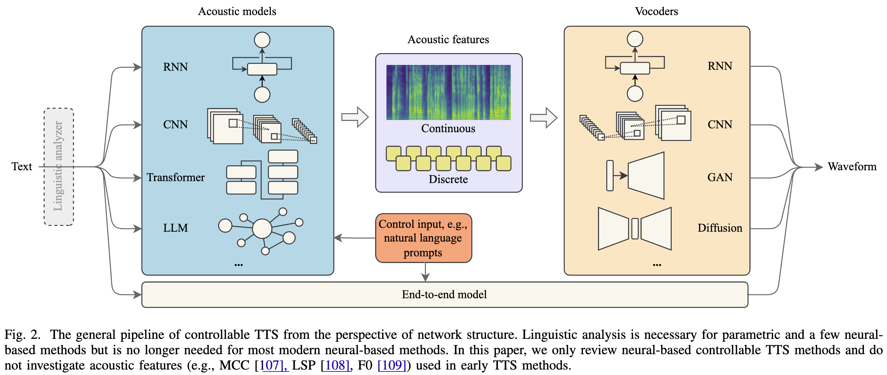

# 2·TTS Pipeline: 文本转语音流程

展开原文

In this section, we elaborate on the general pipeline that supports controllable TTS technologies, including acoustic models, speech vocoders, and feature representations.
Fig.02 depicts the general pipeline of controllable TTS, containing various model architectures and feature representations, but the control strategies will be discussed in [Section 4](Sec.04.md).
Readers can jump to [Section 3](Sec.03.md) if familiar with TTS pipelines.

 

在本节中, 我们详细介绍支持可控 TTS 技术的一般流程, 包括声学模型, 语音声码器和特征表示.

图 02 展示了可控 TTS 的一般流程, 包含各种模型架构和特征表示, 但控制策略将在 [第 4 节](Sec.04.md) 中讨论.

如果读者熟悉 TTS 流程, 可以直接跳转到 [第 3 节](Sec.03.md).

## A·Overview: 总览

展开原文

A TTS pipeline generally contains three key components, i.e., linguistic analyzer, acoustic model, speech vocoder, and with a conditional input, e.g., prompts, for controllable speech synthesis.
Besides, some end-to-end methods use a single model to encode the input and decode the speech waveforms without generating intermediate features like mel-spectrograms ([Spectrogram [110] [URL]](https://en.wikipedia.org/wiki/Spectrogram)).
- **Linguistic analyzer** aims to extract linguistic features, e.g., phoneme duration and position, syllable stress, and utterance level, from the input text, which is a necessary step in HMM-based methods ([Yoshimura et al.(1999) [64]](../../Models/_Early/Simultaneous_Modeling_of_Spectrum_Pitch_&_Duration_in_HMM-Based_Speech_Synthesis.md); [Tokuda et al. (2000) [65]](../../Models/_Early/Speech_Parameter_Generation_Algorithms_for_HMM-Based_Speech_Synthesis.md)) and a few neural-based methods ([Statistical Parametric Speech Synthesis Using DNNs [111]](../../Models/_Early/2013.05.26_Statistical_Parametric_Speech_Synthesis_Using_DNNs.md); [DBLSTM-RNN [112]](../../Models/_Early/DBLSTM-RNN.md)), but is time-consuming and error-prone.
- **Acoustic model** is a parametric or neural model that predicts the acoustic features from the input texts.
Modern neural-based acoustic models like [Tacotron [74]](../../Models/Acoustic/2017.03.29_Tacotron.md) and later works ([FastSpeech [15]](../../Models/Acoustic/2019.05.22_FastSpeech.md); [FastSpeech2 [76]](../../Models/Acoustic/2020.06.08_FastSpeech2.md); [Diff-TTS [113]](../../Models/Acoustic/2021.04.03_Diff-TTS.md)) directly take character ([CWE[114]](../../Models/SpeechRepresentation/CWE.md)) or word embeddings ([Survey by Almeida et al. (2019) [115]](../2019.01.25__Survey__Word_Embeddings.md)) as the input, which is much more efficient than previous methods.
- **Speech vocoder** is the last component that converts the intermediate acoustic features into a waveform that can be played back.
This step bridges the gap between the acoustic features and the actual sounds produced, helping to generate high-quality, natural-sounding speech ([WaveNet [73]](../../Models/Vocoder/2016.09.12_WaveNet.md); [HiFi-GAN [116]](../../Models/Vocoder/2020.10.12_HiFi-GAN.md)).
[Survey by Tan et al. (2021) [42]](../2021.06.29_A_Survey_on_Neural_Speech_Synthesis_63P/Main.md) have presented a comprehensive and detailed review of acoustic models and vocoders.
Therefore, the following subsections will briefly introduce some representative acoustic models and speech vocoders, followed by a discussion of acoustic feature representations.

 

文本转语音流程通常包含三个关键组件, 即语言分析器, 声学模型, 语音声码器, 以及条件化输入 (如用于可控语音合成的提示).
除此之外, 一些端到端的模型使用单个模型来编码输入并解码出语音波形, 而无需生成中间特征 (如梅尔频谱图 [Spectrogram [110] [URL]](https://en.wikipedia.org/wiki/Spectrogram)).
- **语言分析器 (Linguistic Analyzer)** 的目的是从输入文本中提取语言学特征 (如音素时长和位置, 音节重音, 句子级别等), 这是基于 HMM 的方法 ([Yoshimura et al.(1999) [64]](../../Models/_Early/Simultaneous_Modeling_of_Spectrum_Pitch_&_Duration_in_HMM-Based_Speech_Synthesis.md); [Tokuda et al. (2000) [65]](../../Models/_Early/Speech_Parameter_Generation_Algorithms_for_HMM-Based_Speech_Synthesis.md)) 和一些神经网络方法 ([Statistical Parametric Speech Synthesis Using DNNs [111]](../../Models/_Early/2013.05.26_Statistical_Parametric_Speech_Synthesis_Using_DNNs.md); [DBLSTM-RNN [112]](../../Models/_Early/DBLSTM-RNN.md)) 的必要步骤, 但耗时且容易出错.
- **声学模型 (Acoustic Model)** 是参数化或神经模型, 从输入文本预测声学特征.
现代基于神经网络的声学模型如 [Tacotron [74]](../../Models/Acoustic/2017.03.29_Tacotron.md) 及后续工作 ([FastSpeech [15]](../../Models/Acoustic/2019.05.22_FastSpeech.md); [FastSpeech2 [76]](../../Models/Acoustic/2020.06.08_FastSpeech2.md); [Diff-TTS [113]](../../Models/Acoustic/2021.04.03_Diff-TTS.md)) 直接采用字符 ([CWE[114]](../../Models/SpeechRepresentation/CWE.md)) 或词嵌入 ([Survey by Almeida et al. (2019) [115]](../2019.01.25__Survey__Word_Embeddings.md)) 作为输入, 这比以前的方法要更高效.
- **语音声码器 (Speech Vocoder)** 是将中间声学特征转换为可以播放的波形的最后一个组件.
这一步弥合声学特征和实际发出的声音之间的差距, 以生成高质量, 听感自然的语音 ([WaveNet [73]](../../Models/Vocoder/2016.09.12_WaveNet.md); [HiFi-GAN [116]](../../Models/Vocoder/2020.10.12_HiFi-GAN.md)).

[Survey by Tan et al. (2021) [42]](../2021.06.29_A_Survey_on_Neural_Speech_Synthesis_63P/Main.md) 展示了关于声学模型和声码器的全面且详细的综述.
因此, 下面的章节将简要介绍一些代表性的声学模型和语音声码器, 并对声学特征表示进行讨论.

## B·Acoustic Models: 声学模型

展开原文

Acoustic modeling is a crucial step in TTS because it ensures the generated acoustic features capture the subtleties of human speech.
By accurately modeling acoustic features, modern TTS systems can help generate high-quality and expressive audio that sounds close to human speech.

 

声学建模是 TTS 中的关键一步, 因为它确保生成的声学特征能够捕获人类语音的微妙之处.
通过精确建模声学特征, 现代 TTS 系统能够生成高质量且富有表现力的音频, 听起来和人类语音接近.

### Parametric Models: 参数模型

展开原文

Early acoustic models rely on parametric approaches, where predefined rules and mathematical functions are utilized to model speech generation.
These models often utilize HMMs to capture acoustic features from linguistic input and generate acoustic features by parameterizing the vocal tract and its physiological properties such as pitch and prosody ([Tokuda et al. (2000) [65] [117]](../../Models/_Early/Speech_Parameter_Generation_Algorithms_for_HMM-Based_Speech_Synthesis.md); [Yamagishi et al. (2005) [71]](../../Models/_Early/Acoustic_Modeling_of_Speaking_Styles_and_Emotional_Expressions_in_HMM-Based_Speech_Synthesis.md); [Lorenzo et al. (2015) [72]](../../Models/_Early/Emotion_Transplantation_through_Adaptation_in_HMM-Based_Speech_Synthesis.md); [Zen et al. (2007) [118]](../../Models/_Early/The_HMM-based_Speech_Synthesis_System_(HTS)_Version_2.0.md); [Nose et al. (2012) [119]](../../Models/_Early/An_Intuitive_Style_Control_Technique_in_HMM-Based_Expressive_Speech_Synthesis_Using_Subjective_Style_Intensity_and_Multiple-Regression_Global_Variance_Model.md); [Nishigaki et al. (2015) [120]](../../Models/_Early/Prosody-Controllable_HMM-Based_Speech_Synthesis_Using_Speech_Input.md)).
These methods have relatively low computational costs and can produce a range of voices by adjusting model parameters.
However, the speech quality of these methods is robotic and lacks natural intonation, and the expressiveness is also limited ([Lorenzo et al. (2015) [72]](../../Models/_Early/Emotion_Transplantation_through_Adaptation_in_HMM-Based_Speech_Synthesis.md); [Nishigaki et al. (2015) [120]](../../Models/_Early/Prosody-Controllable_HMM-Based_Speech_Synthesis_Using_Speech_Input.md)).

 

早期声学模型依赖参数化方法, 使用预定义规则和数学函数来建模语音生成.
这些模型通常使用隐马尔可夫模型来从语言输入中捕获声学特征, 并通过参数化声带及其生理特性 (如音高和语调) 来生成声学特征.
- [Tokuda et al. (2000) [65] [117]](../../Models/_Early/Speech_Parameter_Generation_Algorithms_for_HMM-Based_Speech_Synthesis.md);
- [Yamagishi et al. (2005) [71]](../../Models/_Early/Acoustic_Modeling_of_Speaking_Styles_and_Emotional_Expressions_in_HMM-Based_Speech_Synthesis.md);
- [Lorenzo et al. (2015) [72]](../../Models/_Early/Emotion_Transplantation_through_Adaptation_in_HMM-Based_Speech_Synthesis.md);
- [Zen et al. (2007) [118]](../../Models/_Early/The_HMM-based_Speech_Synthesis_System_(HTS)_Version_2.0.md);
- [Nose et al. (2012) [119]](../../Models/_Early/An_Intuitive_Style_Control_Technique_in_HMM-Based_Expressive_Speech_Synthesis_Using_Subjective_Style_Intensity_and_Multiple-Regression_Global_Variance_Model.md);
- [Nishigaki et al. (2015) [120]](../../Models/_Early/Prosody-Controllable_HMM-Based_Speech_Synthesis_Using_Speech_Input.md).

这些方法拥有相当低的计算成本, 别难过且可以通过调整模型参数来产生广泛的声音.
然而, 这些方法的语音质量是机械的, 缺乏自然的语调, 表达力也有限.

- [Lorenzo et al. (2015) [72]](../../Models/_Early/Emotion_Transplantation_through_Adaptation_in_HMM-Based_Speech_Synthesis.md);
- [Nishigaki et al. (2015) [120]](../../Models/_Early/Prosody-Controllable_HMM-Based_Speech_Synthesis_Using_Speech_Input.md).

### RNN-Based Models: 基于 RNN 的模型

展开原文

Recurrent Neural Networks (RNNs) proved particularly effective in early neural-based TTS due to their ability to model sequential data and long-range dependencies, which helps in capturing the sequential nature of speech, such as the duration and natural flow of phonemes.
Typically, these models have an encoder-decoder architecture, where an encoder encodes input linguistic features, such as phonemes or text, into a fixed-dimensional representation, and the decoder sequentially decodes this representation into acoustic features (e.g., mel-spectrogram frames) that capture the frequency and amplitude of sound over time.
[Tacotron2 [75]](../../Models/Acoustic/2017.12.16_Tacotron2.md) is one of the pioneering TTS models that uses RNNs with an attention mechanism, which helps align the text sequence with the generated acoustic features.
It takes raw characters as input and produces mel-spectrogram frames, which are subsequently converted to waveforms.
Another example is [MelNet [121]](../../Models/Acoustic/2019.06.04_MelNet.md), which leverages autoregressive modeling to generate high-quality mel-spectrograms, demonstrating versatility in generating both speech and music, achieving high fidelity and coherence across temporal scales.

 

循环神经网络在早期基于神经网络的 TTS 中特别有效, 这是因为它们建模序列数据和长期依赖的能力, 有助于捕获语音的序列性质, 例如时长和音素的自然流动.
通常这些模型具有编码器-解码器架构, 编码器将输入语言特征 (如音素或文本) 编码为固定维度的表示, 解码器顺序地将这一表示解码为声学特征 (如梅尔频谱帧), 这些特征捕获声音在时间上的频率和幅度.

- [Tacotron2 [75]](../../Models/Acoustic/2017.12.16_Tacotron2.md) 是一项开创性的 TTS 模型, 它使用带有注意力机制的 RNNs, 这有助于对齐文本序列和生成的声学特征.
它将原始字符作为输入并生成梅尔频谱帧, 随后将其转换为波形.
- [MelNet [121]](../../Models/Acoustic/2019.06.04_MelNet.md) 利用自回归建模来生成高质量梅尔频谱, 展示了生成语音和音乐的多样性, 达到高保真度和时间尺度上的连贯性.

### CNN-Based Models: 基于 CNN 的模型

展开原文

Unlike RNNs, which process sequential data frame by frame, CNNs process the entire sequence at once by applying filters across the input texts.
This parallel approach enables faster training and inference, making CNN-based TTS particularly appealing for real-time and low-latency applications.
Furthermore, by stacking multiple convolutional layers with varying kernel sizes or dilation rates, CNNs can capture both short-range and long-range dependencies, which are essential for natural-sounding speech synthesis.
[Deep Voice [16] [122]](../../Models/TTS0_System/2017.02.25_DeepVoice.md) is one of the first prominent CNN-based TTS models by Baidu, designed to generate mel-spectrograms directly from phoneme or character input.
[ParaNet [123]](../../Models/Acoustic/2019.05.21_ParaNet.md) also utilizes a RNN model to achieve sequence-to-sequence mel-spectrogram generation.
It uses a non-autoregressive architecture, which enables significantly faster inference by predicting multiple time steps simultaneously.

 

和 RNN 逐帧处理序列数据不同, CNN 通过对输入文本应用滤波器来一次性处理整个序列.
这种并行方法的训练和推理速度更快, 使得基于 CNN 的 TTS 特别适合实时和低延迟应用.
此外, 通过堆叠多个具有不同卷积核大小或膨胀率的卷积层, CNN 可以捕获短期和长期依赖, 对于自然听感语音合成至关重要.
- [Deep Voice [16] [122]](../../Models/TTS0_System/2017.02.25_DeepVoice.md) 是百度提出的首个卓越的基于 CNN 的 TTS 模型, 它直接从音素或字符输入生成梅尔频谱图.
- [ParaNet [123]](../../Models/Acoustic/2019.05.21_ParaNet.md) 也使用 CNN 模型来实现序列到序列的梅尔频谱图生成.
它使用非自回归架构, 这使得多步预测可以显著加快推理速度.

### Transformer-Based Models: 基于 Transformer 的模型

展开原文

[Transformer model [124]](../../Models/_Transformer/2017.06.12_Transformer.md) uses self-attention layers to capture relationships within the input sequence, making them well-suited for tasks requiring an understanding of global contexts, such as prosody and rhythm in TTS.
Transformer-based TTS models often employ an encoder-decoder architecture, where the encoder processes linguistic information (e.g., phonemes or text) and captures contextual relationships, and the decoder generates acoustic features (like mel-spectrograms) from these encoded representations, later converted to waveforms by a vocoder.
[TransformerTTS [125]](../../Models/Acoustic/2018.09.19_TransformerTTS.md) is one of the first TTS models that apply transformers to synthesize speech from text.
It utilizes a standard encoder-decoder transformer architecture and relies on multi-head self-attention mechanisms to model long-term dependencies, which helps maintain consistency and natural flow in speech over long utterances.
[FastSpeech [15]](../../Models/Acoustic/2019.05.22_FastSpeech.md) is a non-autoregressive model designed to overcome the limitations of autoregressive transformers in TTS, achieving faster synthesis than previous methods.
It introduces a length regulator to align text with output frames, enabling the control of phoneme duration.
[FastSpeech2 [76]](../../Models/Acoustic/2020.06.08_FastSpeech2.md) extends FastSpeech by adding pitch, duration, and energy predictors, resulting in more expressive and natural-sounding speech.

 

[Transformer [124]](../../Models/_Transformer/2017.06.12_Transformer.md) 模型使用自注意力层来捕获输入序列内的联系, 适合需要理解全局上下文的任务, 例如 TTS 中的韵律和节奏.
基于 Transformer 的 TTS 模型通常采用编码器-解码器架构, 编码器处理语言信息 (如音素或文本) 并捕获上下文关系, 解码器生成声学特征 (如梅尔频谱图), 随后由声码器转换为波形.
- [TransformerTTS [125]](../../Models/Acoustic/2018.09.19_TransformerTTS.md) 是首先使用 Transformer 从文本合成语音的 TTS 模型之一, 它采用标准的编码器-解码器 Transformer 架构, 并依赖多头自注意力机制来建模长期依赖, 这有助于保持语音的一致性和自然流动.
- [FastSpeech [15]](../../Models/Acoustic/2019.05.22_FastSpeech.md) 是一种非自回归模型, 旨在克服自回归 Transformer 在 TTS 中的限制, 实现更快的语音合成.
它引入长度调节器来对齐文本和输出帧, 使得音素时长的控制成为可能.
- [FastSpeech2 [76]](../../Models/Acoustic/2020.06.08_FastSpeech2.md) 扩展了 FastSpeech, 增加了音高, 时长, 能量预测器, 产生更富有表现力和听感自然的语音.

### LLM-Based Models: 基于大语言模型的模型

展开原文

LLMs ([BERT [126]](../../Models/TextLM/2018.10.11_BERT.md); [GPT-3 [97]](../../Models/TextLM/2020.05.28_GPT-3.md); [LLaMA [11]](../../Models/TextLM/2023.02.27_LLaMA.md); [Mistral [26]](../../Models/TextLM/2023.10.10_Mistral-7B.md)), known for their large-scale pre-training on text data, have shown remarkable capabilities in natural language understanding and generation.
LLM-based TTS models generally use a text description to guide the mel-spectrogram generation, where the acoustic model processes the input text to generate acoustic tokens that capture linguistic and contextual information, such as tone, sentiment, and prosody.
For example, [PromptTTS [101]](../../Models/Acoustic/2022.11.22_PromptTTS.md) uses a textual prompt encoded by [BERT [126]](../../Models/TextLM/2018.10.11_BERT.md) to guide the acoustic model on the timbre, tone, emotion, and prosody desired in the speech output.
PromptTTS first generates mel-spectrograms with token embeddings and then converts them to audio using a vocoder.
[InstructTTS [105]](../../Models/Acoustic/2023.01.31_InstructTTS.md) generates expressive and controllable speech using natural language style prompts.
It leverages discrete latent representations of speech and integrates natural language descriptions to guide the synthesis process, which bridges the gap between TTS systems and natural language interfaces, enabling fine-grained style control through intuitive prompts.

 

大语言模型 ([BERT [126]](../../Models/TextLM/2018.10.11_BERT.md); [GPT-3 [97]](../../Models/TextLM/2020.05.28_GPT-3.md); [LLaMA [11]](../../Models/TextLM/2023.02.27_LLaMA.md); [Mistral [26]](../../Models/TextLM/2023.10.10_Mistral-7B.md)) 以它们在文本数据上的大规模预训练而著称, 在自然语言理解和生成方面展现出了惊人的能力.
基于大语言模型的 TTS 模型通常使用文本描述来引导梅尔频谱生成, 其中声学模型处理输入文本来生成声学 Token 以捕获语言和上下文信息, 例如声调, 感情, 以及韵律.
- [PromptTTS [101]](../../Models/Acoustic/2022.11.22_PromptTTS.md) 使用 [BERT [126]](../../Models/TextLM/2018.10.11_BERT.md) 编码的文本提示来引导声学模型生成具有特定音色, 声调, 情感, 以及韵律的语音输出.
PromptTTS 首先使用 Token 嵌入生成梅尔频谱, 随后使用声码器将其转换为音频.
- [InstructTTS [105]](../../Models/Acoustic/2023.01.31_InstructTTS.md) 使用自然语言风格提示来生成具有丰富表现力和可控性的语音.
它利用语音的离散潜在表示, 并集成自然语言描述以引导合成过程, 这将 TTS 系统与自然语言接口之间的差距缩小, 使得通过直观的提示实现细粒度的风格控制成为可能.

### Other Acoustic Models: 其他声学模型

展开原文

In TTS, GANs ([Multi-SpectroGAN [127]](../../Models/Acoustic/2020.12.14_Multi-SpectroGAN.md); [Ma et al. (2018) [128]](../../Models/Acoustic/TTS-GAN.md); [Guo et al. (2019) [129]](../../Models/Acoustic/2019.04.09_A_New_GAN-Based_End-to-End_TTS_Training_Algorithm.md)), VAEs ([Zhang et al. [18]](../../Models/Acoustic/2018.12.11_Learning_Latent_Representations_for_Style_Control_and_Transfer_in_End-to-End_Speech_Synthesis.md); [GMVAE-Tacotron [130]](../../Models/Acoustic/2018.10.16_GMVAE-Tacotron.md)), and diffusion models ([Diff-TTS [113]](../../Models/Acoustic/2021.04.03_Diff-TTS.md); [Grad-TTS [131]](../../Models/Acoustic/2021.05.13_Grad-TTS.md)) can also be used as acoustic models.
Flow-based methods ([Flow-TTS [132]](../../Models/Acoustic/2020.04.09_Flow-TTS.md); [Glow-TTS [133]](../../Models/Acoustic/2020.05.22_Glow-TTS.md)) are also popular in waveform generation.
Refer to the survey paper from [Survey by Tan et al. (2021) [42]](../2021.06.29_A_Survey_on_Neural_Speech_Synthesis_63P/Main.md) for more details.

The choice of an acoustic model depends on the specific requirements and is a trade-off between synthesis quality, computational efficiency, and flexibility.
For real-time applications, CNN-based or lightweight transformer-based models are preferable, while for high-fidelity, expressive speech synthesis, transformer-based and LLM-based models are better suited.

 

在 TTS 中, 还有一些其他声学模型:
- 基于 GAN:
  - [Multi-SpectroGAN [127]](../../Models/Acoustic/2020.12.14_Multi-SpectroGAN.md);
  - [Ma et al. (2018) [128]](../../Models/Acoustic/TTS-GAN.md);
  - [Guo et al. (2019) [129]](../../Models/Acoustic/2019.04.09_A_New_GAN-Based_End-to-End_TTS_Training_Algorithm.md);
- 基于 VAE:
  - [Zhang et al. [18]](../../Models/Acoustic/2018.12.11_Learning_Latent_Representations_for_Style_Control_and_Transfer_in_End-to-End_Speech_Synthesis.md);
  - [GMVAE-Tacotron [130]](../../Models/Acoustic/2018.10.16_GMVAE-Tacotron.md);
- 基于扩散:
  - [Diff-TTS [113]](../../Models/Acoustic/2021.04.03_Diff-TTS.md);
  - [Grad-TTS [131]](../../Models/Acoustic/2021.05.13_Grad-TTS.md);
- 基于流:
  - [Flow-TTS [132]](../../Models/Acoustic/2020.04.09_Flow-TTS.md);
  - [Glow-TTS [133]](../../Models/Acoustic/2020.05.22_Glow-TTS.md);

可以从 [Survey by Tan et al. (2021) [42]](../2021.06.29_A_Survey_on_Neural_Speech_Synthesis_63P/Main.md) 获得更多细节.

声学模型的选择取决于具体需求, 是合成质量, 计算效率和灵活性之间的权衡.
- 对于实时应用, 基于 CNN 或轻量 Transformer 的模型更适合;
- 对于高保真, 表达性语音合成, 基于 Transformer 和 LLM 的模型更适合.

## C·Speech Vocoders: 语音声码器

展开原文

Vocoders are essential for converting acoustic features such as mel-spectrograms into intelligible audio waveforms and are vital in determining the naturalness and quality of synthesized speech.
We broadly categorize existing vocoders according to their model architectures, i.e., RNN-, CNN-, GAN-, and diffusion-based vocoders.

 

声码器是将声学特征 (如梅尔频谱图) 转换为可理解的音频波形的必要组件, 它们在确定合成语音的自然度和质量方面扮演着重要角色.
我们将现有的声码器根据其模型架构大致分为以下几类: 基于 RNN, CNN, GAN, 和扩散模型的声码器.

### RNN-Based Vocoders: 基于 RNN 的声码器

展开原文

Unlike traditional vocoders ([STRAIGHT [134]](../../Models/Vocoder/2006_STRAIGHT.md); [WORLD [135]](../../Models/Vocoder/2015.11.11_WORLD.md)) that depend on manually designed signal processing pipelines, RNN-based vocoders ([SampleRNN [136]](../../Models/Vocoder/2016.12.22_SampleRNN.md); [WaveRNN [137]](../../Models/Vocoder/2018.02.23_WaveRNN.md); [LPCNet [138]](../../Models/Vocoder/2018.10.28_LPCNet.md); [Multi-Band WaveRNN [139]](../../Models/Vocoder/2019.09.04_Multi-Band_WaveRNN.md)) leverage the temporal modeling capabilities of RNNs to directly learn the complex patterns in speech signals, enabling the synthesis of natural-sounding waveforms with improved prosody and temporal coherence.
For instance, [WaveRNN [137]](../../Models/Vocoder/2018.02.23_WaveRNN.md) generates speech waveforms sample-by-sample using a single-layer recurrent neural network, typically with Gated Recurrent Units (GRU).
It improves upon earlier neural vocoders like [WaveNet [73]](../../Models/Vocoder/2016.09.12_WaveNet.md) by significantly reducing the computational requirements without sacrificing audio quality.
[MB-WaveRNN [139]](../../Models/Vocoder/2019.09.04_Multi-Band_WaveRNN.md) extends WaveRNN by incorporating a multi-band decomposition strategy, where the speech waveform is divided into multiple sub-bands, with each sub-band synthesized at a lower sampling rate.
These sub-bands are then combined to reconstruct the full-band waveform, thereby accelerating the synthesis process while preserving audio quality.

 

和传统声码器 ([STRAIGHT [134]](../../Models/Vocoder/2006_STRAIGHT.md); [WORLD [135]](../../Models/Vocoder/2015.11.11_WORLD.md)) 依赖于手动设计的信号处理流程不同, 基于 RNN 的声码器 ([SampleRNN [136]](../../Models/Vocoder/2016.12.22_SampleRNN.md); [WaveRNN [137]](../../Models/Vocoder/2018.02.23_WaveRNN.md); [LPCNet [138]](../../Models/Vocoder/2018.10.28_LPCNet.md); [Multi-Band WaveRNN [139]](../../Models/Vocoder/2019.09.04_Multi-Band_WaveRNN.md)) 利用 RNN 的时序建模能力来直接学习语音信号中的复杂模式, 能够合成具有改善韵律和时序连贯性的自然听感波形.
- [WaveRNN [137]](../../Models/Vocoder/2018.02.23_WaveRNN.md) 使用单层循环神经网络, 通常带有门控循环单元 (GRU) 来逐个样本地生成语音波形.
它在更早的神经声码器如 [WaveNet [73]](../../Models/Vocoder/2016.09.12_WaveNet.md) 之上, 显著降低了计算需求, 但不牺牲了音频质量.
- [MB-WaveRNN [139]](../../Models/Vocoder/2019.09.04_Multi-Band_WaveRNN.md) 扩展了 WaveRNN, 采用多带分解策略, 将语音波形分解为多个子带, 其中每个子带以较低的采样率合成.
这些子带随后被合并以重构完整带宽波形, 加快合成过程, 同时保持音频质量.

### CNN-Based Vocoders: 基于 CNN 的声码器

展开原文

By leveraging the parallel nature of convolutional operations, CNN-based vocoders ([WaveNet [73]](../../Models/Vocoder/2016.09.12_WaveNet.md); [Parallel WaveNet [140]](../../Models/Vocoder/2017.11.28_Parallel_WaveNet.md); [FFTNet [141]](../../Models/Vocoder/2018.04.15_FFTNet.md)) can generate high-quality speech more efficiently, making them ideal for real-time applications.
A key strength of CNN-based vocoders is their ability to balance synthesis quality and efficiency.
However, they often require extensive training data and careful hyperparameter tuning to achieve optimal performance.
[WaveNet [73]](../../Models/Vocoder/2016.09.12_WaveNet.md) is a probabilistic autoregressive model that generates waveforms sample by sample conditioned on all preceding samples and auxiliary inputs, such as linguistic features and mel-spectrograms.
It employs stacks of dilated causal convolutions, enabling long-range dependence modeling in speech signals without relying on recurrent connections.
[Parallel WaveNet [140]](../../Models/Vocoder/2017.11.28_Parallel_WaveNet.md) addresses WaveNet's inference speed limitations while maintaining comparable synthesis quality.
It introduces a non-autoregressive mechanism based on a teacher-student framework, where the original WaveNet (teacher) distills knowledge into a student model.
The student generates samples in parallel, enabling real-time synthesis without waveform quality degradation.

 

通过利用卷积操作的并行性, 基于 CNN 的声码器 ([WaveNet [73]](../../Models/Vocoder/2016.09.12_WaveNet.md); [Parallel WaveNet [140]](../../Models/Vocoder/2017.11.28_Parallel_WaveNet.md); [FFTNet [141]](../../Models/Vocoder/2018.04.15_FFTNet.md)) 能够更高效地生成高质量语音, 适用于实时应用.
基于 CNN 的声码器的关键长处是它们能够平衡合成质量和效率.
然而, 它们往往需要大量训练数据和仔细的超参数调整才能达到最佳性能.
- [WaveNet [73]](../../Models/Vocoder/2016.09.12_WaveNet.md) 是一种概率自回归模型, 基于所有先前样本和辅助输入作为条件逐个样本点生成波形, 如语言特征和梅尔频谱图.
它采用了膨胀因果卷积堆叠, 能够不依赖于循环连接进行语音信号的长范围依赖性的建模.
- [Parallel WaveNet [140]](../../Models/Vocoder/2017.11.28_Parallel_WaveNet.md) 解决了 WaveNet 的推理速度限制且保持了相当的合成质量.
它基于教师-学生框架引入了非自回归机制, 其中原始 WaveNet 作为教师模型蒸馏知识到学生模型中.
学生模型并行地生成样本点, 实现实时合成而无波形质量退化.

### GAN-Based Vocoders: 基于 GAN 的声码器

展开原文

GANs have been widely adopted in vocoders for high-quality speech generation ([WaveGAN [142]](../../Models/Vocoder/2018.02.12_WaveGAN.md); [GAN-TTS [143]](../../Models/Vocoder/2019.09.25_GAN-TTS.md); [HiFi-GAN [116]](../../Models/Vocoder/2020.10.12_HiFi-GAN.md); [Parallel WaveGAN [144]](../../Models/Vocoder/2019.10.25_Parallel_WaveGAN.md); [MelGAN [145]](../../Models/Vocoder/2019.10.08_MelGAN.md)), leveraging adversarial losses to improve realism.
GAN-based vocoders typically consist of a generator that produces waveforms conditioned on acoustic features, such as mel-spectrograms, and a discriminator that distinguishes between real and synthesized waveforms.
Models like [Parallel WaveGAN [144]](../../Models/Vocoder/2019.10.25_Parallel_WaveGAN.md) and [HiFi-GAN [116]](../../Models/Vocoder/2020.10.12_HiFi-GAN.md) have demonstrated the effectiveness of GANs in vocoding by introducing tailored loss functions, such as multi-scale and multi-resolution spectrogram losses, to ensure naturalness in both time and frequency domains.
These models can efficiently handle the complex, non-linear relationships inherent in speech signals, resulting in high-quality synthesis.
A key advantage of GAN-based vocoders is their parallel inference capability, enabling real-time synthesis with lower computational costs compared to autoregressive models.
However, training GANs can be challenging due to instability and mode collapse.
Despite these challenges, GAN-based vocoders continue to advance the state-of-the-art in neural vocoding, offering a compelling combination of speed and audio quality.

 

GAN 被广泛应用于声码器进行高质量语音生成 ([WaveGAN [142]](../../Models/Vocoder/2018.02.12_WaveGAN.md); [GAN-TTS [143]](../../Models/Vocoder/2019.09.25_GAN-TTS.md); [HiFi-GAN [116]](../../Models/Vocoder/2020.10.12_HiFi-GAN.md); [Parallel WaveGAN [144]](../../Models/Vocoder/2019.10.25_Parallel_WaveGAN.md); [MelGAN [145]](../../Models/Vocoder/2019.10.08_MelGAN.md))，利用对抗损失提高真实感.
基于 GAN 的声码器通常由一个以声学特征 (如梅尔频谱图) 为条件来生成波形的生成器, 和一个区分真实波形和合成波形的判别器组成.
模型如 [Parallel WaveGAN [144]](../../Models/Vocoder/2019.10.25_Parallel_WaveGAN.md) 和 [HiFi-GAN [116]](../../Models/Vocoder/2020.10.12_HiFi-GAN.md) 已经证明了 GAN 在声码中的有效性, 通过引入特别设计的损失函数 (如多尺度和多分辨率频谱图损失) 来确保时域和频域的自然性.
这些模型能够有效地处理语音信号内在的复杂非线性关联, 以实现高质量合成.
基于 GAN 的声码器的关键优势是它们的并行推理能力, 能够比自回归模型更低的计算成本来实现实时合成.
然而, 训练 GAN 仍然面临着不稳定和模式崩溃的挑战.
尽管如此, 基于 GAN 的声码器仍然在神经声码领域取得了领先地位, 提供了速度和音频质量之间的强有力组合.

### Diffusion-Based Vocoders: 基于扩散的声码器

展开原文

Inspired by [diffusion probabilistic models [146]](../../Models/Diffusion/2020.06.19_DDPM.md) that have shown success in visual generation tasks, diffusion-based vocoders ([FastDiff [147]](../../Models/Vocoder/2022.04.21_FastDiff.md); [DiffWave [148]](../../Models/Vocoder/2020.09.21_DiffWave.md); [WaveGrad [149]](../../Models/Vocoder/2020.09.02_WaveGrad.md); [PriorGrad [150]](../../Models/Vocoder/2021.06.11_PriorGrad.md)) present a novel approach to natural-sounding speech synthesis.
The core mechanism of diffusion-based vocoders involves two stages: a forward process and a reverse process.
In the forward process, clean speech waveforms are progressively corrupted by adding noise in a controlled manner, creating a sequence of intermediate noisy representations.
During training, the model learns to reverse this process, progressively denoising the corrupted signal to reconstruct the original waveform.
Diffusion-based vocoders, such as [WaveGrad [149]](../../Models/Vocoder/2020.09.02_WaveGrad.md) and [DiffWave [148]](../../Models/Vocoder/2020.09.21_DiffWave.md), have demonstrated remarkable performance in generating high-fidelity waveforms while maintaining temporal coherence and natural prosody.
They offer advantages over previous vocoders, including robustness to over-smoothing ([Revisiting Over-Smoothness in Text to Speech [151]](../../Models/_Full/2022.02.26_Revisiting_Over-Smoothness_in_Text_to_Speech.md)) and the ability to model complex data distributions.
However, their iterative sampling process can be computationally intensive, posing challenges for real-time applications.

 

受到[扩散概率模型 [146]](../../Models/Diffusion/2020.06.19_DDPM.md) 在视觉生成任务中的成功的启发, 基于扩散的声码器 ([FastDiff [147]](../../Models/Vocoder/2022.04.21_FastDiff.md); [DiffWave [148]](../../Models/Vocoder/2020.09.21_DiffWave.md); [WaveGrad [149]](../../Models/Vocoder/2020.09.02_WaveGrad.md); [PriorGrad [150]](../../Models/Vocoder/2021.06.11_PriorGrad.md)) 展示了一种全新的自然语音合成方法.
基于扩散的声码器的核心机制由两阶段组成: 前向过程和逆向过程.
在前向过程中, 干净的语音波形被有控制地添加噪声进行逐步损坏, 形成一系列地中间噪声表示.
在训练时, 模型学习逆向这一过程, 逐步去噪破坏信号来重构原始波形.

基于扩散的声码器, 例如 [WaveGrad [149]](../../Models/Vocoder/2020.09.02_WaveGrad.md) 和 [DiffWave [148]](../../Models/Vocoder/2020.09.21_DiffWave.md), 在生成高保真波形的同时保持时域一致性和自然语调, 展示了卓越的性能.
与之前的声码器相比, 它们提供了一些优势, 包括对过度平滑 ([Revisiting Over-Smoothness in Text to Speech [151]](../../Models/_Full/2022.02.26_Revisiting_Over-Smoothness_in_Text_to_Speech.md)) 的鲁棒性和建模复杂数据分布的能力.
然而, 它们迭代式的采样过程可能计算代价高昂, 对于实时应用来说是个挑战.

### Other Vocoders: 其他声码器

展开原文

There are also many other types of vocoders such as flow-based ([P-Flow [152]](../../Models/Flow/P-Flow.md); [VoiceFlow [153]](../../Models/Diffusion/2023.09.10_VoiceFlow.md); [PeriodWave [154]](../../Models/Vocoder/2024.08.14_PeriodWave.md); [WaveFlow [155]](../../Models/Vocoder/2019.12.03_WaveFlow.md); [FloWaveNet [156]](../../Models/Vocoder/2018.11.06_FloWaveNet.md)) and VAE-based vocoders ([ParaNet [157]](../../Models/Acoustic/2019.05.21_ParaNet.md); [MSMC-TTS [158]](../../Models/_tmp/2023.05.02_MSMC-TTS.md); [VITS [159]](../../Models/E2E/2021.06.11_VITS.md)).
These methods provide unique strengths for speech synthesis such as efficiency and greater flexibility in modeling complex speech variations.
Readers can refer to the survey paper from [Tan et al. (2021) [42]](../2021.06.29_A_Survey_on_Neural_Speech_Synthesis_63P/Main.md) for more details.

The choice of vocoder depends on various factors.
While high-quality models like GAN-based and diffusion-based vocoders excel in naturalness, they may not be suitable for real-time scenarios.
On the other hand, models like [Parallel WaveNet [140]](../../Models/Vocoder/2017.11.28_Parallel_WaveNet.md) balance quality and efficiency for practical use cases.
The best choice will ultimately depend on the specific use case, available resources, and the importance of factors such as model size, training data, and inference speed.

 

还有许多其他类型的声码器, 如
- 基于流:
  - [P-Flow [152]](../../Models/Flow/P-Flow.md);
  - [VoiceFlow [153]](../../Models/Diffusion/2023.09.10_VoiceFlow.md); ?
  - [PeriodWave [154]](../../Models/Vocoder/2024.08.14_PeriodWave.md);
  - [WaveFlow [155]](../../Models/Vocoder/2019.12.03_WaveFlow.md);
  - [FloWaveNet [156]](../../Models/Vocoder/2018.11.06_FloWaveNet.md)
- 基于 VAE:
  - [ParaNet [157]](../../Models/Acoustic/2019.05.21_ParaNet.md);
  - [MSMC-TTS [158]](../../Models/_tmp/2023.05.02_MSMC-TTS.md);
  - [VITS [159]](../../Models/E2E/2021.06.11_VITS.md) ?

这些方法为语音合成提供了独特的优势, 如效率和更强的建模复杂语音变化的灵活性.

读者可以参考 [Tan et al. (2021) [42]](../2021.06.29_A_Survey_on_Neural_Speech_Synthesis_63P/Main.md) 的综述论文获取更多细节.

声码器的选择依赖于各种因素.
虽然基于 GAN 和基于扩散的声码器在自然度方面都取得了卓越的成果, 但它们可能不适用于实时场景.
另一方面, 像 [Parallel WaveNet [140]](../../Models/Vocoder/2017.11.28_Parallel_WaveNet.md) 这样的模型在实际用例中平衡质量和效率.
最好的选择将取决于具体的用例, 可用资源, 以及模型大小, 训练数据, 和推理速度等因素的重要性.

## D·Fully End-to-end TTS models: 完全端到端 TTS 模型

Fully end-to-end TTS methods ([FastSpeech2s [76]](../../Models/Acoustic/2020.06.08_FastSpeech2.md); [VITS [159]](../../Models/E2E/2021.06.11_VITS.md); [Char2Wav [160]](../../Models/E2E/2017.02.18_Char2Wav.md); [ClariNet [161]](../../Models/E2E/2018.07.19_ClariNet.md); [EATS [162]](../../Models/E2E/2020.06.05_EATS.md)) directly generate speech waveforms from textual input, simplifying the ``acoustic model → vocoder'' pipeline and achieving efficient speech generation.
[Char2Wav [160]](../../Models/E2E/2017.02.18_Char2Wav.md) is an early neural text-to-speech (TTS) system that directly synthesizes speech waveforms from character-level text input.
It integrates two components and jointly trains them: a recurrent sequence-to-sequence model with attention, which predicts acoustic features (e.g., mel-spectrograms) from text, and a [SampleRNN-based neural vocoder [136]](../../Models/Vocoder/2016.12.22_SampleRNN.md) that generates waveforms from these features.
Similarly, [FastSpeech2s [76]](../../Models/Acoustic/2020.06.08_FastSpeech2.md) directly synthesizes speech waveforms from texts by extending [FastSpeech2 [76]](../../Models/Acoustic/2020.06.08_FastSpeech2.md) with a waveform decoder, achieving high-quality and low-latency synthesis. ~
[VITS [159]](../../Models/E2E/2021.06.11_VITS.md) is another fully end-to-end TTS framework.
It integrates a variational autoencoder (VAE) with normalizing flows~\cite{rezende2015variational} and adversarial training, enabling the model to learn latent representations that capture the intricate variations in speech, such as prosody and style.
VITS combines non-autoregressive synthesis with stochastic latent variable modeling, achieving real-time waveform generation without compromising naturalness.
There are more end-to-end TTS models such as [Tacotron [74]](../../Models/Acoustic/2017.03.29_Tacotron.md), [ClariNet [161]](../../Models/E2E/2018.07.19_ClariNet.md), and [EATS [162]](../../Models/E2E/2020.06.05_EATS.md), refer to another survey ([Survey by Tan et al. (2021) [42]](../2021.06.29_A_Survey_on_Neural_Speech_Synthesis_63P/Main.md)) for more details.
End-to-end controllable methods that emerged in recent years will be discussed in [Section 4](Sec.04.md).

## E·Acoustic Feature Representations: 声学特征表示

In TTS, the choice of acoustic feature representations impacts the model's flexibility, quality, expressiveness, and controllability.
This subsection investigates continuous representations and discrete tokens as shown in Fig.02, along with their pros and cons for TTS applications.

### Continuous Representations: 连续表示

Continuous representations (e.g., mel-spectrograms) of intermediate acoustic features use a continuous feature space to represent speech signals.
These representations often involve acoustic features that capture frequency, pitch, and other characteristics without discretizing the signal.
The advantages of continuous features are:
1) Continuous representations retain fine-grained detail, enabling more expressive and natural-sounding speech synthesis.
2) Since continuous features inherently capture variations in tone, pitch, and emphasis, they are well-suited for prosody control and emotional TTS.
3) Continuous representations are more robust to information loss and can avoid quantization artifacts, allowing smoother, less distorted audio.

GAN-based ([HiFi-GAN [116]](../../Models/Vocoder/2020.10.12_HiFi-GAN.md); [Parallel WaveGAN [144]](../../Models/Vocoder/2019.10.25_Parallel_WaveGAN.md); [MelGAN [145]](../../Models/Vocoder/2019.10.08_MelGAN.md)) and diffusion-based methods ([FastDiff [147]](../../Models/Vocoder/2022.04.21_FastDiff.md); [DiffWave [148]](../../Models/Vocoder/2020.09.21_DiffWave.md)) often utilize continuous feature representations, i.e., mel-spectrograms.
However, continuous representations are typically more computationally demanding and require larger models and memory, especially in high-resolution audio synthesis.

### Discrete Tokens: 离散 Tokens

In discrete token-based TTS, the intermediate acoustic features (e.g., quantized units or phoneme-like tokens) are discrete values, similar to words or phonemes in languages.
These are often produced using quantization techniques or learned embeddings, such as HuBERT~\cite{hsu2021hubert} and SoundStream~\cite{zeghidour2021soundstream}.
The advantages of discrete tokens are:
1) Discrete tokens can encode phonemes or sub-word units, making them concise and less computationally demanding to handle.
2) Discrete tokens often allow TTS systems to require fewer samples to learn and generalize, as the representations are compact and simplified.
3) Using discrete tokens simplifies cross-modal TTS applications like voice cloning or translation-based TTS, as they map well to text-like representations such as LLM tokens.

LLM-based~\cite{wang2024maskgct,zhou2024voxinstruct,ji2024controlspeech,[InstructTTS [105]](../../Models/Acoustic/2023.01.31_InstructTTS.md)} and zero-shot TTS methods~\cite{[CosyVoice [17]](../../Models/SpeechLM/2024.07.07_CosyVoice.md); [MaskGCT]wang2024maskgct,ju2024naturalspeech3} often adopt discrete tokens as their acoustic features.
However, discrete representation learning may result in information loss or lack the nuanced details that can be captured in continuous representations.

Table~\ref{tab:sec5_controllable_methods_ar} and~\ref{tab:sec5_controllable_methods_nar} summarize the types of acoustic features of representative methods.
Table \ref{tab:sec2_quantization} summarizes popular open-source speech quantization methods.