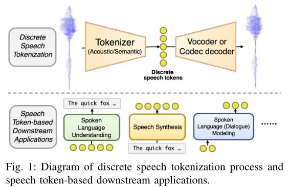

# Recent Advances in Discrete Speech Tokens: A Review

- 标题: "Recent Advances in Discrete Speech Tokens: A Review."
- 作者:
  - 01 Yiwei Guo
  - 02 Zhihan Li
  - 03 Hankun Wang
  - 04 Bohan Li
  - 05 Chongtian Shao
  - 06 Hanglei Zhang
  - 07 Chenpeng Du
  - 08 Xie Chen
  - 09 Shujie Liu
  - 10 Kai Yu
- 链接:
  - ArXiv: https://arxiv.org/abs/2502.06490v2
  - Publication:#TODO
  - Github:
  - Demo:

## Abstract

<table><tr><td width="50%">

The rapid advancement of speech generation technologies in the era of large language models (LLMs) has established discrete speech tokens as a foundational paradigm for speech representation.
These tokens, characterized by their discrete, compact, and concise nature, are not only advantageous for efficient transmission and storage, but also inherently compatible with the language modeling framework, enabling seamless integration of speech into text-dominated LLM architectures.

Current research categorizes discrete speech tokens into two principal classes: *acoustic* tokens and *semantic* tokens, each of which has evolved into a rich research domain characterized by unique design philosophies and methodological approaches.

This survey systematically synthesizes the existing taxonomy and recent innovations in discrete speech tokenization, conducts a critical examination of the strengths and limitations of each paradigm, and presents systematic experimental comparisons across token types.

Furthermore, we identify persistent challenges in the field and propose potential research directions, aiming to offer actionable insights to inspire future advancements in the development and application of discrete speech tokens.

</td><td>

在大语言模型时代, 语音生成技术的迅速发展使得离散语音 Token 成为语音表示的基础范式.
这些 Token 具有离散, 紧凑和简洁的特点, 不仅有利于高效的传输和存储, 而且与语言建模框架本质上兼容, 能够实现语音与文本主导的 LLM 架构的无缝集成.

目前的研究将离散语音 Token 分为两类：**声学 Token** 和**语义 Token**, 每一类都已经发展成了具有独特设计理念和方法论的丰富研究领域.

本综述系统地总结了现有的分类法和离散语音 Token 化的最新创新, 批判性地分析了每种范式的优缺点, 并对不同 Token 类型进行了系统的实验比较.

此外, 我们还识别了该领域持续存在的挑战, 并提出了潜在的研究方向, 旨在为未来离散语音 Token 的开发和应用提供可行的见解, 以激发未来的进展.

</td></tr></table>

## 1·Introduction

<table><tr><td width="50%">

The rapid advancement of large language models (LLMs) in natural language processing has revolutionized speech generation tasks (**Survey20241001**[^Cui2024Recent], **WavChat**[^Ji2024WavChat]), with speech being tokenized and modeled using decoder-only **Transformer**[^Vaswani2017Transformer].
Efforts starting from **GSLM**[^Lakhotia2021GSLM] and **AudioLM**[^Borsos2022AudioLM] aim to develop text-free spoken LLMs, akin to how current LLM-powered chatbots enable text-based interactions.
Other works, including **VALL-E**[^Wang2023VALL-E] and **VioLA**[^Wang2023VioLA], extend this approach to conditional speech generation tasks, such as zero-shot text-to-speech and speech translation.
However, this paradigm requires data to be tokenized, as LLMs typically process discrete data only.
Textual tokens naturally meet this requirement because they are designed as discrete units separated by clear boundaries, whereas raw speech signals are continuous and boundary-less.
Therefore, a necessary step before applying speech data to LLM is the **tokenization of speech**, whose goal is:

***To convert long speech waveforms into short discrete tokens for downstream tasks.
These tokens should be compatible with the underlying textual representations, especially for language modeling approaches targeted at speech.***

</td><td>

自然语言处理领域中大语言模型的快速发展, 已经彻底改变了语音生成任务 (**Survey20241001**[^Cui2024Recent], **WavChat**[^Ji2024WavChat]), 语音被 Token 化, 使用仅解码器架构的 **Transformer**[^Vaswani2017Transformer] 进行建模.
从 **GSLM**[^Lakhotia2021GSLM] 和 **AudioLM**[^Borsos2022AudioLM] 开始的研究, 试图开发文本无关的口语大语言模型, 类似于当前基于 LLM 的聊天机器人实现基于文本的交互.
其他工作, 包括 **VALL-E**[^Wang2023VALL-E] 和 **VioLA**[^Wang2023VioLA], 扩展了这种方法, 使之适用于条件语音生成任务, 如零样本文本转语音和语音翻译.
然而, 这种范式要求数据需要被 Token 化, 因为 LLM 通常只能处理离散数据.
文本 Token 天然满足这一要求, 因为它们被设计为具有明确边界的离散单元, 而原始语音信号是连续且无边界的.
因此, 在将语音数据应用到 LLM 之前, 首先需要进行语音 Token 化, 其目标是:

***将长的语音波形转换为短的离散 Token, 以用于下游任务.***
***这些 Token 应该与底层的文本表示兼容, 尤其是用于对语音的语言建模方法.***

</td></tr>
<tr><td colspan="2">

</td></tr>
<tr><td>

Fig.01: Diagram of discrete speech tokenization process and speech token-based downstream applications.

</td><td>

图 01: 离散语音 Token 化过程和基于语音 Token 的下游应用的示意图.

</td></tr>
<tr><td>

As a result, significant efforts have been directed towards developing efficient and powerful speech tokenization methods.
Generally, these methods are based on two distinct principles, giving rise to two types of speech tokens: *acoustic tokens* and *semantic tokens*.
Acoustic tokens are derived from neural codecs designed to encode speech at a low bitrate while preserving as much information as possible.
In contrast, semantic tokens originate from speech self-supervised learning (SSL) (**Survey20220521**[^Mohamed2022Self]), which aims to learn a more phonetic or semantic representation space, making it easier for speech recognition.
These two nearly independent lines of research magically intersect in the context of language modeling for speech.
Now, there are also efforts that try to design a speech tokenizer that accomplishes the two objectives simultaneously (**SpeechTokenizer**[^Zhang2023SpeechTokenizer], **Mimi**[^Defossez2024Moshi]).
Consequently, speech tokenization has become a core problem of speech processing under the new paradigm, with versatile downstream applications, as shown in [Fig.01](#fig:diagram).

</td><td>

因此, 大量研究工作致力于开发高效且强大的语音 Token 化方法.
总体而言, 这些方法基于两种不同原理, 从而形成两类语音 Token: 声学 Token 和语义 Token.
- 声学 Token 来源于神经编解码器, 这些编解码器旨在以低比特率编码语音, 同时尽可能保留原始信息.
- 语义 Token 来自语音自监督学习 (**Survey20220521**[^Mohamed2022Self]), 其目标是学习更具音素性或语义性的表示空间, 从而更有利于语音识别任务.

这两条原本几乎独立发展的研究路径, 在语音语言建模的背景下神奇地交汇了.
现在, 也出现了一些工作尝试设计语音 Tokenizer 同时实现两个目标, 例如 **SpeechTokenizer**[^Zhang2023SpeechTokenizer] 和 **Mimi**[^Defossez2024Moshi].
因此, 在这一新范式下, 语音 Token 化已经成为语音处理的核心问题之一, 并拥有广泛多样的下游应用场景, 如[图 01](#fig:diagram)所示.

</td></tr>
<tr><td>

Despite the rapid development and numerous recent works, a comprehensive taxonomy of methodologies in discrete speech tokens has not been clearly constructed.
Existing reviews (**Survey20220521**[^Mohamed2022Self], **Survey20230317**[^Anees2023Speech], **Survey20240220**[^Wu2024Towards], **Survey20241001**[^Cui2024Recent], **Survey20240813**[^Kim2024Neural], **WavChat**[^Ji2024WavChat]) in this field overlook the diverse categories and methodologies in both acoustic and semantic tokens.
For example, **Survey20241001**[^Cui2024Recent], **WavChat**[^Ji2024WavChat] focus primarily on methods in spoken language modeling, providing only brief descriptions of some speech tokens used in existing models.
The taxonomy of neural audio codecs has been summarized in **Survey20240220**[^Wu2024Towards], **CodecFake+**[^Chen2025CodecFake+], but the realm of semantic tokens is still overlooked.
In this review, we provide a comprehensive overview of the concepts, methods, and characteristics of various types of discrete speech tokens, with their applications in spoken language understanding, speech generation, and spoken dialogue models.
We hope that through this review, the community can have a clear understanding of the current development and key technologies of discrete speech tokens, so as to promote further research in the future.

</td><td>

尽管该领域发展迅速且近年来涌现了大量研究工作, 但针对**离散语音分词**的方法论, 尚未建立起一个全面的分类体系.

现有的综述文献 (**Survey20220521**[^Mohamed2022Self], **Survey20230317**[^Anees2023Speech], **Survey20240220**[^Wu2024Towards], **Survey20241001**[^Cui2024Recent], **Survey20240813**[^Kim2024Neural], **Survey20241115/WavChat**[^Ji2024WavChat]) 在很大程度上忽略了声学分词与语义分词之间丰富多样的类别和方法差异:
- 例如，**Survey20241001**[^Cui2024Recent] 和 **Survey20241115/WavChat**[^Ji2024WavChat] 主要聚焦于**口语语言建模**的方法，仅对现有模型中使用的部分语音分词进行了简要描述；
- **Survey20240220**[^Wu2024Towards] 和 **CodecFake+**[^Chen2025CodecFake+] 虽然总结了**神经音频编解码器**的分类体系，但仍未涵盖**语义分词**的研究范畴。

在本综述中，我们将提供一个全面的梳理，涵盖各类离散语音分词的概念、方法及其特性，并介绍其在**语音理解**、**语音生成**和**口语对话系统**中的广泛应用。

我们希望通过本次综述，帮助研究社区清晰地认识离散语音分词领域的当前发展脉络与关键技术，从而推动未来更深入的研究与创新。

</td></tr>
<tr><td>

Our contributions are summarized as follows:
-  This review is the first to focus specifically on discrete speech tokens with sufficient depth in the LLM era.
-  We construct a comprehensive taxonomy of current research on discrete speech tokens and meticulously review the motivation, representative approaches, and challenges in each sub-category.
-  We provide a unified comparison of different types of discrete speech tokens in terms of reconstruction and voice conversion performance, covering both acoustic and semantic tokens.
-  We summarize the current challenges and potential future directions for discrete speech tokens, including decoupled and variable frame rate tokens.

</td><td>

我们的贡献总结如下:
- 本综述是大语言模型时代首次专门针对离散语音 Token 进行深入探讨.
- 我们构造了离散语音 Token 现有研究的全面分类体系, 并细致地回顾了每个子类中的研究动机, 代表性方法和面临的挑战.
- 我们从语音重构性能和声音转换 VC 性能两方面, 对不同类型的离散语音 Token 进行了统一的对比分析.
- 我们总结了离散语音 Token 的当前挑战和潜在的未来研究方向, 包括解耦和可变帧率 Token.

</td></tr>
<tr><td>

The structure of this review is shown in [Fig.02](#fig:Taxonomy).
Following **AudioLM**[^Borsos2022AudioLM], **SPEAR-TTS**[^Kharitonov2023SPEAR-TTS], [^Yang2023Towards], we classify discrete speech tokens into acoustic and semantic tokens based on their principles.
We will characterize the two types of tokens both by conceptual descriptions and unified experimental comparisons.

</td><td>

综述的整体结构如[图 02](#fig:Taxonomy)所示.
遵循 **AudioLM**[^Borsos2022AudioLM], **SPEAR-TTS**[^Kharitonov2023SPEAR-TTS], [^Yang2023Towards], 我们将离散语音 Token 基于其原理划分为声学 Token 和语义 Token.
我们将通过概念性描述和统一的实验对比, 对这两类 Token 进行特征刻画.

<tr><td colspan="2">

</td></tr>
<tr><td>

Fig. 2: Structure of this review.

</td><td>

图 02: 本综述的结构.

</td></tr></table>

## 2·Pre-Requisites: Discrete Representation Learning

<table><tr><td width="50%">

Discrete speech tokens are obtained through the quantization of continuous representations, which is usually achieved by offline clustering or online vector quantization algorithms.
This section provides a concise overview of the existing quantization methods commonly used in discrete speech tokens.
Denote $\bm x\in \mathbb R^d$ as a vector in the $d$-dimensional continuous space.
A quantization process $q$ transforms $\bm x$ into a discrete *token* in a finite set, i.e.
$q(\bm x): \mathbb R^d\to\{1,2,...,V\}$ where $V$ is the *vocabulary size*.
The output tokens are sometimes referred to as *indexes* in the finite $V$-cardinal set.
The function $q$ is usually associated with a *codebook* $\mathcal C=\{\bm c_1,\bm c_2,...,\bm c_V\}$ where every *code-vector* $\bm c_i\in\mathbb R^d$ corresponds to the $i$-th token.
The code-vectors are representations of tokens in the original $d$-dimensional space.
As $V$ elements can be encoded using $\lceil \log_2 V\rceil$ raw bits\footnote{We use $\lceil z\rceil$ to denote the ceiling of a scalar $z$, i.e., the smallest integer greater than or equal to $z$.
Similarly, $\lfloor z\rfloor$ denotes the floor of $z$, i.e., the largest integer less than or equal to $z$.}, quantization often compresses the cost for data storage and transmission to a great extent.

</td><td>

</td></tr></table>

### 2.1·Offline Clustering

<table><tr><td width="50%">

Clustering is a simple approach for quantization.
Given a dataset $X=\{\bm x_1,\bm x_2,...\bm x_N\}$, a clustering algorithm aims to assign each sample $\bm x_i$ to a group such that some cost is minimized.
The most frequently used clustering method for discrete speech tokens is k-means clustering [^Ikotun2023K-Means], e.g., in  **GSLM**[^Lakhotia2021GSLM].
K-means is a clustering algorithm based on Euclidean distances.
Its training process iteratively assigns each data sample to the nearest centroid, and moves cluster centroids till convergence, with a pre-defined number of clusters.
After training, the centroids form the codebook, and new data can be quantized to the index of the nearest centroid in this Voronoi partition.
In practice, centroids are usually initialized with the k-means++ algorithm [^Arthur2007K-Means++] for better convergence.
Hierarchical agglomerative clustering has also been used in discrete speech tokens, which iteratively merges the closest clusters.
It is usually applied after k-means to reduce the number of clusters [^Cho2024SD-HuBERT:], **SyllableLM**[^Baade2024SyllableLM].
Other clustering algorithms are less explored in the context of discrete speech tokens.

</td><td>

</td></tr></table>

### 2.2·Vector Quantization

<table><tr><td width="50%">

Clustering is often an isolate process, thus cannot be optimized together with other neural network modules.
Instead, vector quantization (VQ) [^Gray1984Vector] enables a learnable network module that allows gradients to pass through when producing discrete representations.
Autoencoders with a VQ module is termed **VQ-VAE**[^Oord2017VQ-VAE].
There are multiple VQ methods:

</td><td>

聚类通常是孤立的过程, 因此不能和其他神经网络模块一同优化.
**向量量化 (Vector Quantization, VQ)**[^Gray1984Vector] 实现了可学习网络模块, 当生成离散表示时允许梯度传递.
具有 VQ 模块的自编码器被称为 **VQ-VAE**[^Oord2017VQ-VAE].

</td></tr></table>

#### 2.2.1·K-Means VQ

<table><tr><td width="50%">

Like k-means clustering, k-means VQ method finds the code-vector closest to the input, i.e.

$$
q(\bm x)=\underset{i\in \{1,2,...,V\}}{\arg\min} \|\bm x-\bm c_i\|^2.
$$

Then, code-vector $\bm c_k\triangleq\bm c_{q(\mathbf x)}$ is fed to subsequent networks.
As the $\min$ operation is not differentiable, straight-through estimators (STEs)[^Bengio2013Estimating] are usually applied to graft gradients, i.e.
$\operatorname{STE}(\bm c_k,\bm x)=\bm x+\operatorname{sg}(\bm c_k-\bm x)$ where $\operatorname{sg(\cdot)}$ stops tracking gradients.
In this way, the input value to subsequent networks is still $\bm c_k$, but gradients are grafted to $\bm x$ in back propagation.
Auxiliary loss functions are often used together with k-means VQ ( **VQ-VAE**[^Oord2017VQ-VAE]): commitment loss $\mathcal L_{\text{cmt}}=\|\operatorname{sg}(\bm c_k)-\bm x\|^2$ and codebook loss $\mathcal L_{\text{code}}=\|\operatorname{sg}(\bm x)-\bm c_k\|^2$.
The commitment loss pushes the continuous input $\bm x$ towards the closest codebook entry, while the codebook loss does the opposite and updates the code-vector $\bm c_k$.
The two loss terms are weighted by different factors to put different optimization strengths on $\bm x$ and $\bm c_k$, as pushing $\bm c_k$ towards $\bm x$ is an easier task.
It is also common to replace $\mathcal L_{\text{code}}$ with exponential moving average (EMA) to update the codebook instead ( [^Razavi2019Generating]), which does not rely on explicit loss functions.
VQ in high-dimensional spaces is known to suffer from codebook collapse, where the codebook usage is highly imbalanced ( [^{\L}a{\'n}cucki2020Robust], [^Dhariwal2020Jukebox]).
To improve the utilization of codebook, random replacement (as known as *codebook expiration*) can be applied [^Dhariwal2020Jukebox] on code-vectors that have remained inactive for a long time.
Other solutions include additional auxiliary constraints such as entropy penalty (**MaskGIT**[^Chang2022MaskGIT], [^Yu2024Language]), factorized codebook lookup in low-dimensional space ( [^Yu2022Vector-Quantized]), and adding a linear projection to update all code-vectors together ( [^Zhu2024Addressing]).

</td><td>

类似 K 均值聚类, K 均值向量量化寻找最接近输入的编码向量, 即

$$
q(\bm x)=\underset{i\in \{1,2,...,V\}}{\arg\min} \|\bm x-\bm c_i\|^2.
$$

然后, 编码向量 $\bm c_k\triangleq\bm c_{q(\mathbf x)}$ 被送入后续网络.

因为最小化操作是不可微的, 通常应用**直通估计器 (STEs)**[^Bengio2013Estimating] 来嫁接梯度, 即

$$
\operatorname{STE}(\bm c_k,\bm x)=\bm x+\operatorname{sg}(\bm c_k-\bm x),
$$

- 其中 $\operatorname{sg(\cdot)}$ 停止跟踪梯度.

通过这种方式, 后续网络的输入值仍然是 $\bm c_k$, 但反向传播时梯度被嫁接到 $\bm x$ 上.

辅助损失函数通常和 K 均值向量量化一同使用 (**VQ-VAE**[^Oord2017VQ-VAE]):
- 提交损失
  $$
  \mathcal L_{\text{cmt}}=\|\operatorname{sg}(\bm c_k)-\bm x\|^2
  $$
- 码本损失
  $$
  \mathcal L_{\text{code}}=\|\operatorname{sg}(\bm x)-\bm c_k\|^2
  $$

提交损失将连续输入 $\bm x$ 推向最近的码本元素, 而码本损失则相反并更新码本向量 $\bm c_k$.
两个损失项通过不同的因子进行加权以赋予 $\bm x$ 和 $\bm c_k$ 不同的优化强度, 推动 $\bm c_k$ 朝 $\bm x$ 方向移动更容易.
将 $\mathcal L_{\text{code}}$ 替换为**指数移动平均 (EMA)** 更新码本也十分常用, 而不依赖于显式损失函数 ( [^Razavi2019Generating]).

高维空间里的向量量化会遇到码本坍缩问题, 即码本利用率高度不平衡 ( [^{\L}a{\'n}cucki2020Robust], [^Dhariwal2020Jukebox]).
- 为了提升码本利用率, 随机替换 (也称**码本过期?**) 被应用于那些长时间未被使用过的码本向量 [^Dhariwal2020Jukebox].
- 其他解决方案包括额外的辅助约束, 例如熵惩罚 (**MaskGIT**[^Chang2022MaskGIT], [^Yu2024Language]), 低维空间的因子分解码本查找 ( [^Yu2022Vector-Quantized]), 以及添加线性投影来更新所有码本向量 ( [^Zhu2024Addressing]).

</td></tr></table>

#### 2.2.2·Gumbel VQ

<table><tr><td width="50%">

Instead of quantizing by Euclidean distance, another choice is by probability.
Gumbel VQ[^Jang2017GumbelSoftmax] uses Gumbel-Softmax as a proxy distribution for traditional Softmax to allow differentiable sampling.
Given input $\bm x$ and a codebook of size $V$, a transform $h(\cdot)$ is applied on $\bm x$ into $V$ logits: $\bm l=h(\bm x)\in \mathbb R^V$.
In inference, quantization is performed by choosing the index with the largest logit, i.e.
$q(\bm x)=\arg\max_i \left\{\bm l^{(i)}\right\}$.
In training, samples are drawn from the categorical distribution implied by $\bm l$ for the subsequent neural networks.
To achieve efficient sampling and let gradients pass through, Gumbel trick is used: 

$$
\begin{aligned}
&\bm u\in \mathbb R^V\sim \operatorname{Uniform}(0, 1),\bm v=-\log(-\log(\bm u)) 
\\ &\bm s=\operatorname{Softmax}((\bm l+\bm v)/\tau)
\end{aligned}
$$

where Eq.\eqref{eq:gumbel-noise} samples Gumbel noise $\bm v$ element-wise, and Eq.\eqref{eq:gumbel-softmax} calculates Gumbel-Softmax distribution $\bm s$ with a temperature $\tau$.
The forward pass simply use $j=\arg\max_i \{\bm s^{(i)}\}$ as the sampled index, but the true gradient of Gumbel-Softmax is used in backward pass.
In other words, the gradient on the one-hot distribution corresponding to $j$ is grafted to $\bm s$ as an approximate.
The temperature $\tau$ balances the approximation accuracy and gradient variances.
The transform $h(\cdot)$ is usually parameterized as neural networks, or negatively proportional to Euclidean distances[^Jiang2023Latent-Domain].
After quantization, code-vector $\bm c_k$ with $k=q(\bm x)$ is fed to subsequent networks.
Gumbel VQ does not require additional losses, since code-vectors can be directly learned with gradients and do not need to be pushed towards $\bm x$.

</td><td>

不使用欧式距离进行量化的另一选择是通过概率.
**Gumbel VQ**[^Jang2017GumbelSoftmax] 使用 Gumbel-Softmax 作为传统 Softmax 的代理分布以实现可微采样.
给定输入 $\bm x$ 和尺寸为 $V$ 的码本, 变换 $h(\cdot)$ 应用于 $\bm x$ 得到 $V$ 个 logits: $\bm l=h(\bm x)\in \mathbb R^V$.
在推理时, 量化是通过选择具有最大 logit 的索引实现的, 即 $q(\bm x)=\arg\max_i \left\{\bm l^{(i)}\right\}$.
在训练时, 样本是从 $\bm l$ 隐含的离散分布中采样得到的, 用于后续神经网络.
为了实现高效的采样并让梯度通过, 使用了 Gumbel 技巧:

</td></tr></table>

#### 2.2.3·Finite Scalar Quantization

<table><tr><td width="50%">

As mentioned before, VQ methods based on code-vector assignment usually suffer from codebook collapse.
Despite many efforts, this remains a crucial challenge.
Finite scalar quantization (FSQ)[^Mentzer2023FSQ] is an alternative to perform quantization in scalar domain.
FSQ quantizes each dimension of a vector $\bm x$ into $L$ levels.
For the $i$-th dimension $\bm x^{(i)}$, FSQ transforms the values to into limited range and then rounds to integers, i.e.

$$
q\left(\bm x^{(i)}\right)=\operatorname{round}\left(\lfloor L/2\rfloor\tanh\left(\bm x^{(i)}\right)\right).
$$

The quantized values are thus integers ranging from $-\lfloor L/2 \rfloor$ to $\lfloor L/2 \rfloor$\footnote{Following **FSQ**[^Mentzer2023FSQ], this is the symmetric case for $L$ being odd.
When $L$ is even, there is an offset before rounding to obtain asymmetric quantized values.}.
For a $d$-dimensional vector $\bm x$, there are $L^d$ possible quantization outcomes.
Hence, FSQ usually requires a much smaller hidden dimension than VQ.
STE is applied to pass gradients.
As quantization is simply done via rounding to integers, there is no explicit codebooks associated with the FSQ process.
FSQ is reported to have better codebook usage\footnote{Although there is no longer a codebook associated with code-vectors, codebook usage can still be measured among all possible $V=L^d$ outcomes.} especially for a large $V$ compared to VQ methods, without the need for auxiliary losses.

</td><td>

</td></tr></table>

#### 2.2.4·Other VQ Tricks

<table><tr><td width="50%">

In many cases, a single VQ module suffers from a highly-limited representation space, thus results in poor performance compared to continuous counterparts.
There are some widely-used VQ tricks that introduce multiple quantizers to refine the quantized space, as shown in [Fig.03](#fig:gvq-rvq):

</td><td>

</td></tr>
<tr><td colspan="2">

</td></tr>
<tr><td>

Fig.03: Diagram of GVQ (left) and RVQ (right).

</td><td>

</td></tr>
<tr><td>

-  *Grouped VQ (GVQ)*, also known as *product quantization*[^Jégou2011Product].
It groups the input vector $\bm x$ by dimensions and apply VQ on different parts of $\bm x$ independently.
They can have different or shared codebooks.
The VQ outputs are then concatenated along dimensions to match that of $\bm x$.
For instance, GVQ is used in neural word embeddings[^Yu2020Neural] and speech self-supervised learning models (**VQ-Wav2Vec**[^Baevski2019VQ-Wav2Vec], **Wav2Vec2.0**[^Baevski2020Wav2Vec2.0]) to achieve efficient quantization.
-  *Residual VQ (RVQ)*, also known as *multi-stage quantization*[^Juang1982Multiple].
It adopts a serial approach that iteratively quantizes the residual of the last quantizer.
Similar to GVQ, RVQ also has multiple quantizers.
For the $i$-th quantizer $q_i$ with input $\bm x_i$ and output code-vector $\bm c_{k}$, the residual is defined as $\bm x_{i+1}=\bm x_i-\bm c_{k}$.
The outputs from all $q_i$ are finally summed as the quantized result of $\bm x$.
In this way, information in the codebooks is supposed to follow a coarse-to-fine order, and more details in the original $\bm x$ can be preserved than a plain quantizer.
It is used in various speech codecs[^Zeghidour2021SoundStream], **EnCodec**[^Defossez2022EnCodec], **DAC**[^Kumar2023DAC], for instance.

GVQ and RVQ can be flexibly combined to form GRVQ[^Yang2023HiFi-Codec] that applies RVQ on each GVQ branch for better codebook utilization.
A network can also contain multiple VQ modules at different places, like cross-scale VQ (CSVQ)[^Jiang2022Cross-Scale] where every decoder layer has a quantizer inside.
Note that RVQ naturally produces an order of importance in residual layers, while all quantizers in GVQ are equally important.
Such order of importance can also be enforced in GVQ by a "nested dropout'' trick[^Rippel2014Learning].

</td><td>

</td></tr></table>

## 3·Speech Tokenization Methods: Acoustic Tokens

<table><tr><td width="50%">

</td><td>

</td></tr>
<tr><td colspan="2">

</td></tr>
<tr><td>

Tab.02: A summary of famous acoustic speech tokens (neural speech codecs).
Italic "*C,T,U*'' denote CNN, Transformer or U-Net-based generator architecture in [Fig.05](#fig:generator).
Symbols `/' and `-' denote "or'' and "to'' for different model versions, and "+'' means different configurations in different VQ streams in a single model.
$Q,F,V$ mean number of quantizers, frame rate and vocabulary size of each quantizer respectively.
For example, "$Q=2$, $V$=8192+($2^{12}$-$2^{15}$)'' in SemantiCodec means one of the two VQ streams has 8192 possible codes, and the other can vary from $2^{12}$ to $2^{15}$ in different configurations.
Bitrates are computed by $\frac1{1000}\sum_{i=1}^Q F_i\lceil \log_2 V_i\rceil$ kbps, without entropy coding.

</td><td>

</td></tr>
<tr><td>

Acoustic tokens, also known as *speech codecs*, refer to the discrete representations optimized mainly for signal compression and reconstruction.
The audio codec technology arises long ago.
Traditional codecs, including MP3[^Finlayson2008A], Opus[^Valin2012Definition] and EVS[^Dietz2015Overview], typically take advantage of signal processing algorithms to improve quality and lower the bitrate.

In the deep learning era, numerous codec models based on neural networks have emerged.
These models typically consist of an encoder that compresses speech signals and a decoder that reconstructs the speech signals, with a quantizer situated between the two.
The quantizer is also parameterized and jointly trained with the whole network in an end-to-end manner.
The codebook indices produced by the quantizer are referred to as acoustic tokens.
To improve the representation ability of discrete VQ spaces and thus obtain better codec performance, RVQ, GVQ, GRVQ and FSQ tricks are commonly applied in the quantization module.

We list the VQ method, number of quantizers $Q$, frame rate $F$, vocabulary size $V$ for each quantizer, and the resulting bitrate of existing neural acoustic speech tokens in Table.[Tab.02](#tab:acoustic-metadata).

</td><td>

</td></tr></table>

### 3.1·Model Architectures

<table><tr><td width="50%">

</td><td>

</td></tr>
<tr><td colspan="2">

</td></tr>
<tr><td>

Fig.04: Neural architectures of acoustic tokens.
- Upper: **VQ-GAN** type where the quantization module is placed between an encoder and a decoder;
- Bottom: **latent diffusion** type where quantized tokens condition the diffusion process towards a latent space learned by an autoencoder.

Note that inputs and outputs can be waveforms, frequency-domain features or even SSL features depending on purpose and design.

</td><td>

</td></tr>
<tr><td>

Although acoustic codec models differ from one to one regarding their purposes, most of them share a similar encoder-quantizer-decoder framework.
With audio clip $\bm x$ that can either be time-domain sampling points, frequency-domain features or even other machine learning features, an encoder $f_\theta(\cdot)$ transforms it to $f_\theta(\bm x)$ in a continuous latent vector space.
The encoder $f_\theta(\cdot)$ will usually perform downsampling to reduce the temporal length of the input signals, especially for waveform inputs.
A VQ module $q_\phi(\cdot)$ discretizes $f_\theta(\bm x)$ into tokens and corresponding codebook vectors $\bm c$.
A decoder $g_\psi(\cdot)$ then uses $\bm c$ to reconstruct $\hat {\bm x}$, and a certain distance metric of $d(\bm x, \hat{\bm x})$ is usually optimized.
There are two major paradigms for designing the encoder, decoder, and quantizers, which can be summarized as diagrams in [Fig.04](#fig:acoustic-paradigms).

</td><td>

</td></tr>
<tr><td colspan="2">

</td></tr>
<tr><td>

Fig.05: Major generator (VQ-VAE) architectures of VQ-GAN-based acoustic tokens.
% Upper: **CNN-based**; Middle: **Transformer-based**; Bottom: **U-Net-based**.
"Q.'' and "Trans'' are short for quantizer and Transformer, respectively.

</td><td>

</td></tr>
<tr><td>

</td><td>

</td></tr></table>

#### 3.1.1·VQ-GAN

<table><tr><td width="50%">

VQ-GAN[^Esser2021Taming] is a very commonly adopted framework of acoustic tokens that trains a VQ-VAE with GAN objectives.
Besides the original reconstruction and VQ objectives in a VQ-VAE, VQ-GAN uses discriminators $d_\xi(\bm x, \hat{\bm x})$ to distinguish real and reconstructed data that adversarially train the generator network composed of $f_\theta,q_\phi$, and $g_\psi$.
In acoustic tokens, there are usually multiple discriminators, e.g.
multi-resolution and multi-scale STFT discriminators from the neural vocoder researches (**MelGAN**[^Kumar2019MelGAN], [^Jang2021UnivNet]).
The generator architecture of VQ-GAN-based acoustic tokens has multiple choices, with the three most representative ones visualized in [Fig.05](#fig:generator): CNN-based, Transformer-based, and U-Net-based.

The CNN-based generator is the most widely used architecture so far in acoustic tokens.
**SoundStream**[^Zeghidour2021SoundStream] and  **EnCodec**[^Defossez2022EnCodec] are two famous early neural acoustic tokens that operate in an end-to-end VQ-GAN manner.
They receive time-domain waveforms as inputs and directly reconstruct waveforms.
Their encoder and decoder have a mirrored architecture to perform down and up-samplings.
In SoundStream, the encoder and decoder are purely constructed by convolutional neural networks (CNNs) while EnCodec augments them with an LSTM.
The CNN encoder down-samples the waveform to a high-dimensional embedding sequence, whose frame rate is determined by the sampling rate, CNN kernel sizes and strides at a fixed ratio.
The continuous embeddings are passed to an RVQ quantizer, and the quantized vectors are summed before being transformed to the waveform domain by the CNN decoder.
The training criteria include reconstruction loss (in the time and frequency domain), adversarial loss, feature matching loss, and quantization losses for RVQ layers.
To allow for a flexible choice of bitrates, structured dropout is adopted where the number of codebooks in the RVQ module can be randomly chosen (**SoundStream**[^Zeghidour2021SoundStream]), such that only a portion of quantizers in front are activated during training.
The acoustic tokens can consequently reside in variable bitrates depending on the chosen number of RVQ quantizers.
The inputs and outputs of the codec model can also be frequency-domain features like magnitude and phase spectra for reducing computation burden (**FunCodec**[^Du2023FunCodec]).
There, the convolution kernels are typically 2D instead of 1D in the time-domain codecs.

Later, **Transformers**[^Vaswani2017Transformer] have been adopted, e.g.
in **Single-Codec**[^Li2024Single-Codec] and **Mimi**[^Defossez2024Moshi].
They can be directly applied to frequency-domain inputs and outputs.
When operating on waveform-domain inputs or outputs, a CNN **Moshi**[^Defossez2024Moshi] or patchifying [^Wu2024TS3-Codec], [^Parker2025Scaling] operation is usually added before or after the Transformer blocks.
In Mimi, a shallow Transformer layer is added after the CNN-based encoder, and vice versa in its decoder.
Recently, some propose to use purely Transformer-based backbone and discard the CNN blocks, e.g., **TS3-Codec**[^Wu2024TS3-Codec].
As Transformers demonstrate superior modeling ability and scaling property, these works prove to outperform CNN-based codecs either with less computation [^Wu2024TS3-Codec] or larger scale [^Parker2025Scaling].
However, to ensure stream-ability, an attention mask should be employed **Moshi**[^Defossez2024Moshi].
The encoder and decoder can also be designed to be different.
For example, **Single-Codec**[^Li2024Single-Codec] uses  **Conformer**[^Gulati2020Conformer] encoder and CNN decoder, while **LSCodec**[^Guo2024LSCodec] uses the reverse configuration.

Though RVQ or GVQ is usually applied, most acoustic tokens contain only one quantization module as a whole.
However, there are also U-Net-based codecs where multiple quantizers are employed, e.g., CoFi-Codec[^Guo2024CoFi-Speech] and ESC[^Gu2024Esc].
Each sub-encoder or decoder in the U-Net can be a CNN or Transformer.
This offers a more flexible control of the resolution of each VQ stream (Section [sec:multi-resolution](#sec:multi-resolution)).

It is also noteworthy that training a separate vocoder on top of existing acoustic tokens may result in improved audio quality than the original decoded outputs, since reconstructing waveform alone may be simpler than optimizing VQ representation and reconstruction at the same time.
This is exemplarily verified in  **AudioDec**[^Wu2023AudioDec], MBD[^San2023From] and Vocos[^Siuzdak2024Vocos].
Therefore, some acoustic tokens directly simplify the VQ-GAN training objective back to the original VQ-VAE, where the discrete tokens are obtained first by a simple reconstruction loss, and a vocoder is trained as an additional stage, like  **AudioDec**[^Wu2023AudioDec] and LSCodec[^Guo2024LSCodec].
These works are denoted as "VQ-VAE+GAN'' in [Tab.02](#tab:acoustic-metadata).

</td><td>

</td></tr></table>

#### 3.1.2·Latent Diffusion

<table><tr><td width="50%">

Different from VQ-GAN which uses GAN to generate waveforms or frequency features, some codecs also use latent diffusion (**DDPM**[^Ho2020DDPM], [^Song2020Score], **LDM**[^Rombach2021LDM]) as an alternative.
These codecs use discretized tokens as a condition to generate some latent acoustic space, e.g.
from a pretrained continuous speech autoencoder.
Since diffusion models are strong generative models, acoustic tokens of this type does not need discriminators and adversarial training like VQ-GAN.
For instance, LaDiffCodec[^Yang2024Generative] uses EnCodec tokens to condition the diffusion process from Gaussian noise to the latent space in a pretrained and frozen waveform autoencoder.
This is to bridge the gap of reconstruction quality between discrete and continuous representations and improve the codec performance compared to the original acoustic tokens.
Inference efficiency is a major concern of these models unless specifically optimized in limited sampling steps.

</td><td>

</td></tr></table>

### 3.2·General-Purpose Acoustic Tokens

#### 3.2.1·Motivation

<table><tr><td width="50%">

In this section, we describe the most common type of neural acoustic tokens (speech codecs) that are designed only with the objective of speech signal reconstruction.
Those acoustic tokens are optimized towards better signal or perceptual quality under bitrates as low as possible.

</td><td>

</td></tr></table>

#### 3.2.2·Approaches

<table><tr><td width="50%">

**Advanced VQ methods and model architectures**

Based on SoundStream and EnCodec, more codecs with advanced VQ methods, network structure, or optimization strategies have been researched with depth.
As an example,  **DAC**[^Kumar2023DAC] achieves remarkable reconstruction quality by adding periodic inductive bias, better discriminators, modified loss functions, and a better VQ mechanism from ViT-VQGAN[^Yu2022Vector-Quantized] to improve codebook usage.
Specifically, it performs L2-normed code lookup in a low-dimensional space (e.g.
8 or 32) instead of a high-dimensional space like 1024.
Other architectural improvements include using frequency-domain inputs[^Ai2024APCodec], [^Ai2024A], [^Li2024Single-Codec], variance-constrained residual blocks[^Ahn2024HILCodec], multi-filter bank discriminator[^Ahn2024HILCodec], selective down-sampling back-projection[^Zheng2024SuperCodec], etc.
Several training tricks are explored, such as not applying VQ with a certain probability and pure adversarial training proposed in  **Moshi**[^Defossez2024Moshi].
Also, the training of neural speech codecs does not need to be end-to-end, i.e.
the learning of VQ representations and signal reconstruction can be separated.
[^Wu2023AudioDec], [^Du2024APCodec+] adopt a two-stage training process that introduces adversarial losses and an additional vocoder after training only with metric losses, to achieve improved quality.
Additional training criteria around the VQ module are proposed for better VQ utilization, such as delicate code-vector replacement strategy, codebook balancing loss, and similarity loss between consecutive RVQ layers proposed in ERVQ[^Zheng2024Ervq].
Other VQ methods besides GVQ or RVQ also exist in speech codecs.
NDVQ[^Niu2024Ndvq] improves the capacity of RVQ space by changing codebook {vectors} to parameterized Gaussian {distributions}.
FSQ has also been introduced to several speech codecs, like SQ-Codec[^Yang2024SimpleSpeech] where scalar rounding is applied to each of its 32-dimensional latent space.
Stable-Codec[^Parker2025Scaling] adopts FSQ in a Transformer-based architecture, exhibiting strong scalability to large model sizes up to 950M parameter count.
It also explores a flexible post-training quantization level adjustment technique and residual FSQ strategy.
Note that most acoustic tokens require multiple quantizers, but **single-codebook** codecs have also been explored.
Single-Codec[^Li2024Single-Codec] designs an encoder consisting of Conformer and bidirectional LSTM to better compress mel spectrogram inputs.
**WavTokenizer**[^Ji2024WavTokenizer] and BigCodec[^Xin2024BigCodec] further explores single-codebook codec modeling with better network designs or larger parameter count.
TS3-Codec[^Wu2024TS3-Codec] adopts a fully Transformer design that leads to a better single-codebook codec with fewer computation overhead.
LSCodec[^Guo2024LSCodec] also achieves single-codebook coding with speaker disentanglement (Section [sec:acoustic-disen](#sec:acoustic-disen)).
These single-codebook codecs with remarkably low bitrates offer great benefit to downstream speech generation models on simplicity and efficiency.
</td><td>

</td></tr>
<tr><td>

**Temporal redundancy reduction**

Instead of capturing all the information through VQ layers like the previously mentioned codecs, some researchers have attempted to reduce the redundant bitrate of time-varying VQ codes.
One reasonable method is to encode the global information in speech, e.g.
speaker timbre and channel effects, by a global encoder instead of the time-varying codes.
Disen-TF-Codec[^Jiang2023Disentangled] is the first to explore VQ-GAN codec models with an additional global encoder that aids the codec decoder.
In Disen-TF-Codec, the global features are designed to be sequential to adapt to speaker changes during transmission.
In TiCodec[^Ren2024Fewer-Token], the global tokens are time-invariant and vector-quantized instead.
They are extracted from different segments of an utterance in conjunction with time-varying tokens.
Similar global encoders are also seen in [^Guo2024SoCodec], [^Guo2024CoFi-Speech], [^Li2024Single-Codec].
FreeCodec[^Zheng2024FreeCodec] further incorporates a prosody encoder[^Ren2022ProsoSpeech] that compresses the low-frequency range of mel spectrograms into a low frame rate VQ sequence to assist in reconstruction.
Another typical example of temporal redundancy reduction is predictive coding, as seen in TF-Codec[^Jiang2023Latent-Domain].
This approach captures temporal-varying information in the latent space by autoregressive prediction, which significantly reduces redundancy and entropy in the residual part for quantization.
LMCodec[^Jenrungrot2023LMCodec] employs autoregressive prediction from coarse codes (first RVQ levels) to fine codes (last RVQ levels)[^Borsos2022AudioLM], enabling the transmission of fewer codes.

</td><td>

</td></tr>
<tr><td>

**Multi-resolution and variable-bitrate coding**

Rather than relying solely on uni-resolution tokens, where all quantizers share the same temporal frequency, it is reasonable to design multi-resolution codecs, because speech contains both fast and slow information streams.
For instance, many vowels exhibit slowly changing characteristics, while events such as explosive consonants and background noises require fine-grained modeling.
Therefore, incorporating multiple temporal resolutions in codecs is likely to reduce the necessary bitrate.
SNAC[^Siuzdak2024Snac] is a notable multi-resolution acoustic token.
It follows the  **DAC**[^Kumar2023DAC] architecture, but in each RVQ layer, residuals are downsampled before codebook look-up and upsampled afterward.
This enables SNAC to have three RVQ streams at a frame rate of 12, 23, 47Hz respectively.
Similarly, CoFi-Codec[^Guo2024CoFi-Speech] achieves multi-resolution coding by GVQ quantizers within its U-Net-based architecture.
LLM-Codec[^Yang2024UniAudio] also adopts this idea to achieve very low frame rates with semantic distillation (Section [sec:acoustic-distillation](#sec:acoustic-distillation)).
In addition to multiple temporal resolutions, it is also feasible to consider the varying information intensities across different speech frames.
This observation motivates the design of codecs to allocate different numbers of quantizers for different speech frames.
As an example, VRVQ[^Chae2024Variable] automatically selects the number of RVQ quantizers per frame by a predictor that is jointly trained with the whole network.

</td><td>

</td></tr></table>

#### 3.2.3·Challenges

<table><tr><td width="50%">

Despite the emergence of single-codebook and low-bitrate codecs[^Li2024Single-Codec], **WavTokenizer**[^Ji2024WavTokenizer], [^Xin2024BigCodec], [^Guo2024LSCodec], achieving ideal reconstruction quality with a highly limited VQ space remains a challenging problem.
Additionally, as acoustic tokens aim to encode all necessary information for signal recovery, they may become redundant and overly complex for downstream modeling.
While scaling up the model size or switching to non-causal networks has been shown to improve performance[^Li2024Single-Codec], [^Xin2024BigCodec], [^Parker2025Scaling], these approaches may also compromise streamability or efficiency.
Furthermore, simply introducing global encoders like [^Jiang2023Disentangled], [^Ren2024Fewer-Token], [^Guo2024CoFi-Speech] does not guarantee disentanglement (Section [sec:acoustic-disen](#sec:acoustic-disen)) and may still result in redundancy within the time-varying codes.

</td><td>

</td></tr></table>

### 3.3·Acoustic Tokens With Semantic Distillation

<table><tr><td width="50%">

</td><td>

</td></tr>
<tr><td colspan="2">

</td></tr>
<tr><td>

Fig.06: Different semantic distillation methods in acoustic tokens.
Gray color indicates frozen during training.

</td><td>

</td></tr>
<tr><td>

</td><td>

</td></tr></table>

#### 3.3.1·Motivation

<table><tr><td width="50%">

Acoustic tokens are a convenient choice for spoken language models, as they can be directly converted back to waveforms without the need for extra vocoders.
However, if reconstruction is the sole objective of these tokens, their representation space may become overly complex and overly focused on acoustic details, in contrast to natural language tokens that primarily carry semantic information.
A natural improvement is to incorporate speech semantic features either from speech self-supervised learning (SSL) models, supervised models, or even text transcriptions.
Since speech SSL models aim to capture high-level phonetic or semantic information without external supervision[^Mohamed2022Self], integrating SSL features does not impose additional data requirements for injecting semantic information into the training process.
Acoustic tokens with criteria beyond reconstruction are sometimes referred to as having a "mixed objective''[^Cui2024Recent].
Given that the primary purpose of these models remains acoustic reconstruction in these models, we continue to refer to them as acoustic tokens.
The process of introducing semantic information into acoustic tokens is termed **semantic distillation**, with approaches summarized in Fig.
[Fig.06](#fig:acoustic-distill).

</td><td>

</td></tr></table>

#### 3.3.2·Approaches

<table><tr><td width="50%">

**Semantic feature guidance**

The earliest effort in semantic distillation is to guide some RVQ layers in acoustic tokens towards semantic features, which are typically SSL features.
Since information in RVQ naturally follows a coarse-to-fine order, guiding early RVQ layers towards semantic-oriented features helps establish and reinforce a semantic-to-acoustic information hierarchy.
For example,  **SpeechTokenizer**[^Zhang2023SpeechTokenizer] uses a  **HuBERT**[^Hsu2021HuBERT] SSL model to guide the first RVQ layer in EnCodec.
This ensures that the first RVQ layer contains more semantic information, thereby pushing acoustic details to the subsequent RVQ layers.
This distillation is implemented either by regressing the first RVQ output to continuous HuBERT embeddings or by classifying it into discrete HuBERT tokens.
LLM-Codec alternatively uses  **Whisper**[^Radford2022Whisper] and  **T5**[^Raffel2019T5] as semantic teachers.
Mimi[^Defossez2024Moshi] uses a  **WavLM**[^Chen2021WavLM] teacher and applies distillation to a specialized VQ module rather than the first RVQ layer.
Since SSL feature guidance occurs only during the training stage, it does not incur additional inference costs.
It has been reported that TTS language models trained with such acoustic tokens exhibit better robustness than those with unguided tokens[^Zhang2023SpeechTokenizer].

</td><td>

</td></tr>
<tr><td>

**Fixed semantic codebook**

A more direct approach to achieve semantic distillation is to integrate semantic knowledge into the codebook of quantizers.
This forces the quantization space itself to be more semantic-related.
This method is proposed in LLM-Codec[^Yang2024UniAudio] where all three RVQ codebooks are initiated from the token embedding module of LLaMa-2[^Touvron2023LLaMa] and remain frozen during training.
This approach not only reduces the bitrate of the codec but also significantly enhances the semantic representation ability of LLM-Codec.

</td><td>

</td></tr>
<tr><td>

**Semantic features as inputs or outputs**

Semantic features can also be compressed together with the acoustic features.
This requires the encoder and quantizer to construct a shared acoustic and semantic space that balances the two information sources.
The first attempt in this direction is made in [^Siahkoohi2022Ultra-Low-Bitrate] where Conformer representations from a pretrained wav2vec 2.0[^Baevski2020Wav2Vec2.0] are combined with CNN encoder outputs for quantization.
SemantiCodec[^Liu2024SemantiCodec] quantizes AudioMAE[^Huang2022Masked] SSL features without relying on acoustic inputs.
The quantized SSL features then serve as a condition for acoustic reconstruction using latent diffusion, which resembles a vocoder that transforms semantic inputs into acoustic outputs.
Providing aligned phoneme sequences instead of SSL features to the quantizer has also shown benefits on reducing bitrates[^Du2023FunCodec].
Moreover, semantic features can also serve as outputs, thereby reinforcing the constraint that semantic information be compressed into the discrete latent space.
For instance, [^Guo2024SoCodec], [^Ye2024Codec] combine hidden HuBERT embeddings with acoustic features before RVQ and jointly optimizes acoustic and semantic reconstruction objectives.
X-Codec 2.0[^Ye2025Llasa] improves it by using w2v-BERT 2.0[^Barrault2023Seamless] and FSQ.

</td><td>

</td></tr></table>

#### 3.3.3·Challenges

<table><tr><td width="50%">

Guiding part of the RVQ layers towards semantic features does not guarantee that acoustic information is encoded in the remaining layers, as shown by the degraded VC performance in  **SpeechTokenizer**[^Zhang2023SpeechTokenizer].
It may impose a greater challenge for the VQ layer to encode both acoustic and semantic information if semantic features serve as inputs as well.
Additionally, fixing a semantic codebook could negatively impact acoustic reconstruction ability, as the VQ representation space becomes overly restricted.

</td><td>

</td></tr></table>

### 3.4·Acoustic Tokens With Disentanglement

#### 3.4.1·Motivation

<table><tr><td width="50%">

Another line of mixed-objective acoustic tokens is disentanglement.
A prominent research direction is the disentanglement of speaker timbre information, as this is a global trait among all the speech information aspects.
Encoding speaker information into every token timestep is redundant; thus, removing the global speaker timbre can make the information in acoustic tokens more compact and reduce the necessary bitrate.
Speaker-decoupled speech tokens can alleviate the modeling burden for downstream tasks.
For example, a TTS model using these tokens can achieve independent control over prosody and speaker identity.
The disentanglement of speaker timbre also enables an acoustic token to perform voice conversion (VC), as timbre from the target speaker can be easily combined with the speaker-agnostic content tokens from the source speech.

Note that in Section [sec:acoustic](#sec:acoustic), it is mentioned that some codecs introduce a global encoder to reduce the necessary bitrate of time-variant tokens[^Jiang2023Disentangled], [^Ren2024Fewer-Token], [^Li2024Single-Codec], [^Zheng2024FreeCodec].
They have already demonstrated some ability to decouple global speaker timbre and local contents, albeit in an **implicit** manner through the natural information bottleneck from VQ.
In this section, we elaborate on **explicit** methods, which involve specialized training techniques and criteria to achieve disentanglement.

</td><td>

</td></tr></table>

#### 3.4.2·Approaches

<table><tr><td width="50%">

**Gradient reversal layer (GRL)**

The GRL technique[^Ganin2015Unsupervised] is commonly used for disentanglement.
Suppose speaker information needs to be disentangled, and a classifier (or speaker verifier, etc.) $s_\mu(\cdot)$ receives some latent feature $\bm h$ from the acoustic token to perform speaker discriminative tasks.
GRL operates by negating the gradient sign before $s_\mu(\cdot)$, thereby forcing $\bm h$ to fool the speaker classifier while the classifier itself improves, similar to adversarial training.

SSVC[^Mart{\'\i}n-Cortinas2024Enhancing] is one of the pioneering efforts in this direction.
SSVC attempts to decouple content and speaker representations from WavLM features.
The content branch is quantized via RVQ, and the speaker branch is trained using a contrastive loss to produce speaker embeddings.
Disentanglement is enforced by a GRL between the speaker embeddings produced from the speaker branch and the content representations.
Similarly, PromptCodec minimizes an SSIM loss[^Wang2004Image] between content and speaker representations, with the help of a pretrained speaker verification model.

Such GRL technique is not limited to disentangling speaker timbre alone.
FACodec[^Ju2024NaturalSpeech3] employs supervised decoupling to factorize speech into speaker timbre, content, prosody, and acoustic detail information.
The timbre extractor in FACodec is optimized via a speaker classification loss.
For the other components -- prosody, content, and acoustic detail -- separate RVQ modules are applied prior to the supervised decoupling process.
For each component, some supervision signal with the desired information is applied, and GRL is employed to other non-related information components.
These three quantized features are then combined before applying GRL with the speaker information.
Finally, the decoder integrates all four information branches to reconstruct the speech signal.

</td><td>

</td></tr>
<tr><td>

**Perturbation**

For speaker disentanglement, a more straightforward approach is to apply speaker timbre perturbations to speech signals and leverage the strong information bottleneck created by the discrete VQ module.
When the encoder is unable to learn sufficient timbre information, and the decoder is provided with prominent timbre, the bottleneck in the middle will naturally prevent timbre from being encoded[^Qian2019AutoVC].
This idea is adopted in LSCodec[^Guo2024LSCodec] to achieve speaker decoupling and ultra-low-bitrate coding.
LSCodec leverages continuous WavLM features to represent speaker timbre.
These features are fed to a Conformer-based decoder by position-agnostic cross attention[^Du2023UniCATS], [^Li2024Sef-Vc].
A stretching-based speaker perturbation algorithm is applied to the input waveform to facilitate speaker disentanglement.
The training process of LSCodec involves multiple stages where a VQ module is injected after constructing a speaker-decoupled continuous space.
Through this approach, LSCodec achieves high-quality speech reconstruction and voice conversion using only a single codebook with very low bitrates.
</td><td>

</td></tr>
<tr><td>

**Source separation**

Apart from the disentanglement of speaker timbre, source separation has also been explored in the context of acoustic tokens.
SD-Codec[^Bie2024Learning] proposes to decouple different audio sources in the neural codec, like speech, music, and sound effects, by employing multiple parallel RVQ modules.
This approach allows for more efficient and targeted processing of each audio component.

</td><td>

</td></tr></table>

#### 3.4.3·Challenges

<table><tr><td width="50%">

The GRL technique for disentanglement inherently carries the risk of a more complex optimization trajectory.
Additionally, some disentanglement methods require supervised data[^Ju2024NaturalSpeech3], which imposes a significant constraint.
Due to the intricate nature of speech informatics, current efforts are still suboptimal compared to semantic tokens, particularly in terms of VC performance[^Guo2024LSCodec].

</td><td>

</td></tr></table>

## 4·Speech Tokenization Methods: Semantic Tokens

<table><tr><td width="50%">

Semantic tokens refer to discrete speech representations from discriminative or self-supervised learning (SSL) models.
While we use the term *semantic tokens* to maintain consistency with prior works, some researchers recently argue that SSL features are more accurately described as *phonetic* than *semantic*[^Choi2024Self] in nature.
Hence to clarify, in this review, semantic tokens should be more accurately defined as the complementary set of acoustic tokens, such that they are not primarily aimed at reconstruction purposes.
In practice, the vast majority of these tokens are designed for discriminative tasks and are believed to have a strong correlation with phonetic and semantic information[^Wells2022Phonetic], **Survey20220521**[^Mohamed2022Self], [^Sicherman2023Analysing], [^Yeh2024Estimating].

</td><td>

</td></tr></table>

### 4.1·Semantic Tokens From General-Purpose SSL

#### 4.1.1·Motivation

<table><tr><td width="50%">

Speech SSL models have consistently outperformed many traditional methods in various speech tasks[^Yang2021Superb], **Survey20220521**[^Mohamed2022Self].
Their potential has been extensively mined in discriminative tasks such as automatic speech recognition (ASR)[^Schneider2019Wav2vec], **VQ-Wav2Vec**[^Baevski2019VQ-Wav2Vec], **HuBERT**[^Hsu2021HuBERT], [^Zhang2020Pushing], automatic speaker verification (ASV)[^Chen2021WavLM], [^Jung2024ESPnet-SPK], [^Miara2024Towards], speech emotion recognition (SER)[^Morais2022Speech], **WavLM**[^Chen2021WavLM], [^Madanian2023Speech], [^Ma2024Emotion2vec] and speech translation (ST)[^Wu2020Self-Supervised], [^Nguyen2020Investigating], [^Babu2022Xls-R].
Discretized SSL tokens are initially favored for reducing computation costs and improving robustness against irrelevant information for ASR[^Chang2023Exploration].
As language models have gained increasing attention, these SSL tokens have been further explored in generative tasks such as TTS[^Du2022VQTTS], **SPEAR-TTS**[^Kharitonov2023SPEAR-TTS], [^Zhu2023Vec-Tok] and SLM[^Lakhotia2021GSLM], **AudioLM**[^Borsos2022AudioLM], [^Hassid2024Textually].
This is because they can be considered high-level abstractions of speech semantics that are largely independent of acoustic details.

</td><td>

</td></tr>
<tr><td colspan="2">

</td></tr>
<tr><td>

Fig.07: Representatives in different kinds of semantic tokens.
% Upper: semantic tokens from **general-purpose SSL models**; Middle: **perturbation-invariant SSL models**; Bottom: semantic tokens from **supervised models**.
"Q.'' denotes quantizer, which can be optional (dotted line).

</td><td>

</td></tr>
<tr><td>

</td><td>

</td></tr></table>

#### 4.1.2·Approaches

<table><tr><td width="50%">

SSL models initiate the learning process by defining a pretext task which enables the model to learn meaningful representations directly from the data itself.
Typical speech SSL models employ CNNs and Transformer encoders to extract deep contextual embeddings.
When it comes to semantic tokens, there are mainly two ways to extract those discrete tokens from an SSL model (see upper part of [Fig.07](#fig:semantic-types)):
[leftmargin=5mm]
-  External quantization, like clustering or training a VQ-VAE.
This refers to extracting continuous embeddings from a certain layer or multiple layers in a pretrained SSL model, and performing quantization manually.
For example, a common semantic token is the HuBERT+kmeans units, where k-means clustering is performed on a HuBERT Transformer layer with a portion of training data[^Lakhotia2021GSLM], **pGSLM**[^Kharitonov2021pGSLM].
It is also feasible to perform clustering on multiple layers[^Shi2024Mmm], [^Mousavi2024How], or train a VQ-VAE on the SSL hidden embeddings[^Huang2024R}ep{C}odec], **MaskGCT**[^Wang2024MaskGCT].

-  When an SSL model contains an inner quantizer that is trained together with other network modules, its outputs can also be regarded as semantic tokens.
Many SSL models involve quantizers to produce targets for their training objectives[^Baevski2019VQ-Wav2Vec], **Wav2Vec2.0**[^Baevski2020Wav2Vec2.0], [^Chiu2022Self-Supervised], [^Zhu2025MuQ].
This approach provides an efficient and effective way of extracting semantic tokens.

Note that for SSL models with an inner quantizer, it is still practical to perform external quantization on its continuous embeddings, like wav2vec 2.0[^Baevski2020Wav2Vec2.0].
However, these two methods -- internal and external quantization -- may result in different patterns of information exhibition, which we will investigate in Section [sec:analysis](#sec:analysis).
For general-purpose SSL models, there are different designs on the pretext task[^Mohamed2022Self].
[Tab.03](#tab:semantic-metadata) provides a high-level summary of well-known semantic tokens.

</td><td>

</td></tr>
<tr><td>

**Contrastive**

This type of speech SSL models aims to learn representations by distinguishing a target sample (positives) from distractors (negatives) given an anchor[^Mohamed2022Self].
They minimize the latent space similarity of negative pairs and maximize that of the positive pairs.
For semantic tokens, vq-wav2vec[^Baevski2019VQ-Wav2Vec] and wav2vec 2.0[^Baevski2020Wav2Vec2.0] are two representative contrastive SSL models.
They involve a quantizer to produce localized features that is contrastively compared to contextualized continuous features.
Vq-wav2vec[^Baevski2019VQ-Wav2Vec] uses pure CNN blocks while wav2vec 2.0[^Baevski2020Wav2Vec2.0] adopts a Transformer for stronger capacity.
Both use GVQ quantizers with two groups to expand the VQ space.
Wav2vec 2.0 has also been extended to massively multilingual versions[^Conneau2021Unsupervised], [^Babu2022Xls-R], [^Pratap2024Scaling].

</td><td>

</td></tr>
<tr><td>

**Predictive**

This type of speech SSL models incorporates an external target for prediction, either from signal processing features or another teacher network.
A popular line of work is  **HuBERT**[^Hsu2021HuBERT].
It takes raw waveforms as inputs, applies random masks on the hidden representations before Transformer contextual blocks, and then predicts k-means quantized targets from MFCC or another HuBERT teacher.
**WavLM**[^Chen2021WavLM] augments HuBERT by additional speaker and noise perturbations to achieve superior performance in more paralinguistic-related tasks.
There are no inner quantizers in both models, so external quantization like k-means clustering is necessary to obtain semantic tokens.
BEST-RQ[^Chiu2022Self-Supervised] changes the prediction target to the output of a random projection quantizer.
The next-token prediction criterion from language models (LMs) have also been adopted into speech SSL[^Turetzky2024Last], [^Han2024Nest-Rq], either with or without a pretrained text LM.
This method emphasizes the autoregressive prediction property of learned tokens that may be better suited for the LM use case.

</td><td>

</td></tr></table>

#### 4.1.3·Challenges

<table><tr><td width="50%">

Firstly, SSL models typically require large amount of data to train, as indicated in [Tab.03](#tab:semantic-metadata).
For SSL models without a built-in quantizer during pretraining, k-means clustering is a prevalent approach to obtain discrete units.
However, given that most SSL models operate in high-dimensional spaces (e.g., with 768 or 1024 dimensions), the space and time complexity of k-means clustering are substantial.
The clustering results can sometimes be unreliable due to the curse of dimensionality in Euclidean space.
Moreover, it is often reported, and will also be shown by experiments in Section [sec:analysis](#sec:analysis), that discretized SSL units lose much acoustic details after quantization[^Polyak2021Speech], [^Sicherman2023Analysing], [^Mousavi2024DASB}--{Discrete].
Different clustering settings, such as the chosen layer and vocabulary size, can lead to different outcomes within a single model.
Finally, since most SSL models utilize Transformer blocks, their causality and streaming ability are compromised.

</td><td>

</td></tr></table>

### 4.2·Semantic Tokens From Perturbation-Invariant SSL

#### 4.2.1·Motivation

<table><tr><td width="50%">

As SSL tokens feature semantic or phonetic information, a major concern is to improve the resistance against perturbations in the input signal.
This kind of invariance includes noise and speaker aspects that don't affect the contents of speech.
Noise invariance refers to the invariance against signal augmentations such as additive noise, reverberations, etc.
Speaker invariance aims to remove speaker information, similar to speaker-disentangled acoustic tokens.
In the training process, perturbations are often explicitly introduced in these perturbation-invariant SSL models.
The original and perturbed view of an utterance are both fed to the same network (or teacher and student networks), and an external loss to reduce the impact of perturbation is applied.
The middle part of [Fig.07](#fig:semantic-types) depicts a typical perturbation-invariant SSL model.

</td><td>

</td></tr></table>

#### 4.2.2·Approaches

<table><tr><td width="50%">

**Perturbations**

The perturbations can either be designed to augment the acoustics or alter the speaker timbre, depending on the objective of invariance.
These perturbations usually preserve temporal alignments, meaning that the perturbed utterance and the original one are strictly synchronized.
For noise-invariant SSL tokens, basic signal variations like time stretching, pitch shifting, additive noise, random replacing, reverberation, and  **SpecAugment**[^Park2019SpecAugment] are commonly applied[^Gat2023Augmentation], [^Lodagala2023CCC-Wav2vec], [^Messica2024Nast], [^Huang2022Spiral].
Typical speaker timbre perturbations include formant and pitch scaling as well as random equalization[^Qian2022ContentVec], [^Chang2023Self-Supervised], [^Chang2024DC-Spin].
In contrast, random time stretching is applied as speaker perturbation in [^Hwang2024Removing], which alters the tempo in each random segment.

</td><td>

</td></tr>
<tr><td>

**Contrastive-based Methods**

Contrastive loss is a common method to obtain perturbation-invariant representations.
In this context, the contrastive loss is a modified version of that used in wav2vec 2.0[^Baevski2020Wav2Vec2.0].
Given two embedding sequences derived from the original and perturbed utterances, assuming the perturbation preserves frame-wise alignment, the positive sample of an anchor is taken from the same position in the other utterance.
This is because the content remains unchanged by the perturbation, thus the same position of two representation sequences should encode the same information.
In noise-invariant models[^Huang2022Spiral], [^Lodagala2023CCC-Wav2vec], negative samples are selected from the other utterance relative to the anchor.
However, in speaker-invariant models[^Qian2022ContentVec], [^Hwang2024Removing], negative samples are selected from the same utterance as the anchor.
Specifically, in [^Hwang2024Removing], soft attention pooling is applied to create equal-length representation sequences from two utterances with different durations.
This approach forces SSL models to ignore acoustic differences and focus solely on the unperturbed content.

</td><td>

</td></tr>
<tr><td>

**Distribution-based Methods**

Another method to achieve invariance is to minimize some distance metrics between the representations extracted from the original and perturbed utterances.
In existing perturbation-invariant SSL models, this is typically accomplished using a cross-entropy loss between the underlying distributions in the VQ module of the SSL model.
NAST[^Messica2024Nast] trains a Gumbel-based VQ-VAE on HuBERT features and enforces similarity between the Gumbel distributions Eq.\eqref{eq:gumbel-softmax} derived from the original and augmented utterances.
Spin[^Chang2023Self-Supervised] and DC-Spin[^Chang2024DC-Spin] explore a speaker-invariant clustering algorithm for HuBERT features.
Similar to NAST[^Messica2024Nast], Spin employs a cross-entropy loss to ensure that the distributions over codebook entries are similar between the original and perturbed utterances.
This distribution-based approach forces the same content to be quantized to the same index regardless of acoustic conditions.

</td><td>

</td></tr>
<tr><td>

**CTC-based Methods**

Noise invariance can also be achieved like an ASR task with perturbed speech inputs.
As semantic tokens from SSL models are highly content-related, these tokens extracted from the original clean utterance can serve as some pseudo-label for a perturbed view.
In [^Gat2023Augmentation], a connectionist temporal classification (CTC)[^Graves2006Connectionist] loss is calculated between quantized tokens from the augmented signal and a pretrained HuBERT+kmeans pseudo-labels from the clean signal.
This pushes the quantized tokens to have the same phonetic structure with the pseudo-labels.

</td><td>

</td></tr></table>

#### 4.2.3·Challenges

<table><tr><td width="50%">

While noise and speaker-invariance have emerged as promising approaches in semantic tokens, they currently rely on content-preserving perturbations that are typically hand-crafted.
Most existing methods have only been evaluated on small-scale data and models.
It also remains unclear how these methods will generally benefit generative tasks such as speech generation and spoken language modeling.

</td><td>

</td></tr>
<tr><td colspan="2">

</td></tr>
<tr><td>

Tab.03: A high-level summary of famous semantic speech tokens.
Notations follow Table.[Tab.02](#tab:acoustic-metadata).
Symbol `/' denotes different versions.
"Inner Quantizer'' refers to whether the model has a quantizer, or external quantization (e.g.
clustering) must be performed.
$F$ denotes frame rate.
In case there are inner quantizers, $Q,V$ denote number of quantizers and vocabulary size for each quantizer, respectively.
"*NR*.'' means not reported.

</td><td>

</td></tr></table>

### 4.3·Semantic Tokens From Supervised  Models

<table><tr><td width="50%">

As representing semantic or phonetic information is the major purpose of semantic tokens, a more direct way to achieve this is through supervised learning.
A famous example shown at the bottom of [Fig.07](#fig:semantic-types) is the $\mathcal S^3$ Tokenizer from  **CosyVoice**[^Du2024CosyVoice].
It places a single-codebook VQ layer between two Transformer encoder modules and optimizes the network through an ASR loss similar to  **Whisper**[^Radford2022Whisper].
The same method is adopted in [^Zeng2024Scaling], [^Zeng2024GLM-4-Voice:] where the frame rate is further reduced to 12.5Hz.
CosyVoice 2[^Du2024CosyVoice] improves $\mathcal S^3$ Tokenizer by replacing plain VQ with FSQ for better codebook utilization.
Note that in this kind of supervised semantic tokens, it is the output of the VQ layer that serves as tokens.
This allows for more preservation of paralinguistic information than directly transcribing speech into text.
These supervised tokenizers are trained on massive paired speech-text data, and have demonstrated rich speech content understanding capabilities[^Du2024CosyVoice], **LLaMA-Omni**[^Fang2024LLaMA-Omni].

However, training these models is highly costly due to the heavy data demands.
Training with only the ASR task may still result in the loss of some prosody information.
Although **CosyVoice**[^Du2024CosyVoice] has demonstrated that its supervised tokenizer trained on Chinese and English can also work in Japanese and Korean, it remains unclear how well these supervised tokenizers generalize to more unseen languages.

</td><td>

</td></tr></table>

### 4.4·Length Reduction by Deduplication and Acoustic BPE

<table><tr><td width="50%">

In most cases, the frame rate of discrete speech tokens ranges from 25 to 100Hz.
This leads to a huge discrepancy in lengths between speech representations and the underlying text modality.
This discrepancy has been a critical issue in building decoder-only TTS and other LM-based speech generation tasks, since longer sequences result in harder training and more unstable inference.
Therefore, length reduction techniques have been proposed to address this issue.
These methods are inspired by language processing techniques and are thus more closely related to semantic tokens.
Note that although these length reduction methods are universal across token types, they are less frequently applied to acoustic tokens.
This is because acoustic tokens usually involve multiple VQ streams that complicate token-level operations.

A common approach to reduce token sequence lengths is deduplication[^Chang2023Exploration], [^Chang2024Exploring], i.e.
removing the repeated consecutive tokens in a sequence.
Since the encoded continuous features are often close in consecutive frames where the speech dynamics do not change rapidly, they are likely to be quantized to the same unit.
Therefore, removing these redundant tokens can yield a more phonetic representation.
When the deduplicated tokens are used for generative modeling, a unit-to-speech model (similar to TTS) should be employed to upsample the tokens and convert them back to acoustic signals[^Lakhotia2021GSLM].

Another popular approach to reducing the length of speech token sequences is acoustic byte-pair encoding (BPE)\footnote{The term "acoustic'' here is used to distinguish it from traditional BPE applied to text tokens, rather than referring to "acoustic tokens''.} or so-called subword modeling[^Hayashi2020DiscreTalk], [^Ren2022Speech], [^Chang2023Exploration], [^Shen2024Acoustic], [^Dekel2024Exploring].
Similar to text BPE[^Gage1994A], acoustic BPE iteratively merges the two most frequent consecutive tokens and adds the merged token to the vocabulary.
After training on a corpus, a deterministic BPE mapping is established between original token combinations and the new vocabulary.
This mapping enables a lossless compression algorithm, allowing tokens to be perfectly reconstructed after BPE decoding.
This operation can identify certain morphological patterns in token sequences, and offers a powerful way to remove redundant tokens.
In practice, acoustic BPEs on HuBERT semantic tokens has demonstrated significant speed and performance gains in ASR[^Chang2023Exploration], [^Chang2024Exploring], spoken language modeling[^Shen2024Acoustic], [^Dekel2024Exploring] and TTS[^Li2024On], [^Zhu2023Vec-Tok].

Although deduplication is a simple and training-free method, acoustic BPE offers several unique advantages over it.
First, acoustic BPE can identify redundant patterns that are not simply repetitions, whereas deduplication only removes exact duplicates.
Additionally, deduplication discards the duration information of every token in the resulting sequence.
This could be problematic for downstream tasks, as important rhythmic information may reside in the repetitions of tokens.
In contrast, acoustic BPE preserves duration information by encoding repetitions of varying lengths into distinct new tokens.
Furthermore, acoustic BPE is flexible in terms of target vocabulary size, which can be adjusted based on the desired length reduction ratio and downstream performance.

</td><td>

</td></tr>
<tr><td colspan="2">

</td></tr>
<tr><td>

Fig.08: BPE effect comparison of multiple tokens.
The starting point of each line represents the original vocabulary size.

</td><td>

</td></tr>
<tr><td>

We visualize the length reduction effect of BPE on different speech tokens in [Fig.08](#fig:bpe-effect).
In addition to semantic tokens from various models and different k-means clusters in HuBERT, we also experiment with acoustic tokens.
For acoustic tokens with multiple codebooks, we apply BPE only to the first quantizer, in accordance with the current speech generation paradigm[^Wang2023VALL-E].
From [Fig.08](#fig:bpe-effect), it is evident that different types of tokens exhibit very distinct patterns.
Semantic tokens generally show significant length reduction when applying BPE, especially for HuBERT models with fewer k-means clusters.
For single-codebook acoustic tokens, speaker-decoupled LSCodec tokens shows more reduction than general-purpose WavTokenizer and BigCodec.
For a single RVQ layer among multiple-codebook acoustic tokens, the reduction effect is also significant.
These findings suggest that the effect of BPE is negatively correlated with the information density in the speech tokens: the less information, the more length reduction achieved by BPE.

</td><td>

</td></tr></table>

### 4.5·Variable Frame Rate Tokens and Unit Discovery

<table><tr><td width="50%">

Information in speech is not uniformly distributed along the time axis[^Dieleman2021Variable-Rate].
In segments such as silence or long vowels, information density is low, whereas in segments with explosive consonants, speech events occur much more frequently.
This inherent non-uniformity suggests that it might be more natural to allocate more tokenized bits to regions with dense information and higher variance, and fewer bits to regions with less uncertainty.
This kind of discrete speech tokens is referred to as *variable frame rate (VFR) tokens* in this review.
Note that while multi-resolution and variable-bitrate tokens have been introduced previously, the concept of VFR is still distinct.
In multi-resolution tokens[^Siuzdak2024Snac], [^Guo2024CoFi-Speech], each quantizer operates at a fixed frame rate.
In variable-bitrate tokens[^Chae2024Variable], the frame rate remains fixed, while the variability lies in the number of quantizers per frame.
Instead, VFR tokens should directly allocate different granularities on the temporal axis.

VFR tokens are closely related to acoustic unit discovery.
As speech lacks a natural boundary of phonetic units[^Mohamed2022Self], there are much research efforts to find and locate the underlying acoustic units behind speech utterances in an unsupervised manner[^Eloff2019Unsupervised], [^Dunbar2020The], [^Niekerk2020Vector-Quantized], [^Nguyen2020The].
This is particularly of interest for low-resource languages.
The discovered units can guide the boundary segmentation of VFR tokens.
To this end, VFR tokens are interesting not only because they might reduce the necessary bitrate, but also because they can introduce a strong inductive bias that linguistic knowledge is encoded[^Dieleman2021Variable-Rate].

A recent direction of VFR tokens is to discover acoustic units from an SSL model.
Note that deduplicated tokens and acoustic BPE themselves can be regarded as VFR tokens.
**Sylber**[^Cho2024Sylber] and  **SyllableLM**[^Baade2024SyllableLM] take similar approaches that first locate acoustic boundaries from existing HuBERT models, and then train another HuBERT student with segment-level pooled targets between boundaries.
The final HuBERT embeddings undergo the same segment-level pooling and kmeans clustering procedure to produce tokens at a very low frame rate ($\approx5$Hz) that align well with syllables.

Boundary prediction can be involved to achieve frame rate variability in the training process, where a specific model predicts frame-level boundaries and is trained together with other network modules.
The training techniques of such models include reinforcement learning[^Cuervo2022Variable-Rate], soft pooling[^Hwang2024Removing], and slowness constraint[^Dieleman2021Variable-Rate].
However, these approaches are rarely adopted in the context of discrete speech tokens today, and there have barely been a VFR acoustic token till now.

</td><td>

</td></tr></table>

### 4.6·Speech Token Vocoders

<table><tr><td width="50%">

Acoustic tokens are designed naturally with a decoder that outputs waveforms or spectrograms given tokens, but semantic tokens are not.
A necessary component for building a discrete token-based speech generation system with semantic tokens is the speech resynthesis model, or speech token vocoders.
Unlike traditional spectrogram-based vocoders[^Kong2020HiFi-GAN], these vocoders receive discrete speech tokens as an input and reconstruct speech signals.

Polyak et al.[^Polyak2021Speech] first explores speech resynthesis from discrete speech units by a HifiGAN[^Kong2020HiFi-GAN] augmented with discretized pitch units and speaker embedding inputs.
The vec2wav vocoder in  **VQTTS**[^Du2022VQTTS] improves this vocoder by a  **Conformer**[^Gulati2020Conformer] frontend module before HifiGAN generator.
Later, CTX-vec2wav[^Du2023UniCATS] proposes a position-agnostic cross-attention mechanism that effectively integrates timbre information from surrounding acoustic contexts without the need for pretrained speaker embeddings.
This makes it more timbre-controllable and suitable for zero-shot TTS and VC[^Li2024Sef-Vc].
Upon it, vec2wav 2.0[^Guo2024Vec2wav] further advances the timbre controllability by SSL timbre features and adaptive activations, demonstrating a strong VC performance.

It is also feasible to apply diffusion or flow matching algorithms in token vocoders[^Betker2023TorToiSe-TTS], **Seed-TTS**[^Anastassiou2024Seed-TTS], **CosyVoice**[^Du2024CosyVoice].
There, the discrete tokens are treated as a condition for diffusion or flow matching to generate mel-spectrograms, and further converted to waveform by a pretrained mel vocoder.
Compared to training a token-to-wav vocoder in an end-to-end fashion, training a token-to-mel model is more convenient and does not need adversarial training.
To better control timbre, a mask strategy is introduced into the training process where the model only computes loss on the un-masked part of spectrograms[^Du2024CosyVoice].
During inference, spectrogram from speaker prompt conditions the generative process, which can be regarded as a form of "in-context learning''.
However, this requires tokens to be extracted from reference prompts before synthesis.
Also, inference efficiency may be compromised for better generation quality with multiple inference steps, and this method is only validated on massive amount of data currently.

</td><td>

</td></tr></table>

## 5·Analysis of Discrete Speech Tokens

### 5.1·Metrics and Existing Benchmarks

<table><tr><td width="50%">

Discrete speech tokens can be evaluated from various aspects besides bitrate and codebook utilization:

-  **Signal-level reconstruction metrics**: For reconstruction evaluations, signal-level metrics like PESQ, STOI, mel distance, GPE, etc.
are often used.

-  **Perceptual reconstruction metrics**: Apart from signal-level metrics, there can also be perceptual evaluations of reconstruction performance.
This includes intelligibility (often measured by WER, CER, or phone error rates), speaker similarity, subjective or proxy MOS tests, etc.

-  **Performance on downstream tasks**: Probing tasks can be used to measure the preservation or prominence of certain information in tokens, like ASR, ASV, emotion recognition, and spoken language modeling[^Nguyen2020The].
Note that this is different from perceptual reconstruction metrics since it operates directly on tokens.
Performance in generative tasks like TTS and VC can also be evaluated.
% Also, as discrete tokens can be applied to more generative speech processing tasks like TTS and VC, it is feasible to compare the performance of these tasks.

-  **Semantic/phonetic relevance**: If the tokens are expected to align with texts (e.g.
for semantic tokens and semantic-distilled acoustic tokens), metrics like phone discrminability[^Nguyen2020The], phone purity, and phone-normalized mutual information[^Hsu2021HuBERT] can be computed.

-  **Invariance and robustness**: If the tokens are expected to be invariant to perturbations, unit edit distance[^Gat2023Augmentation] can be considered as a measurement.

There are several existing benchmarks on discrete speech tokens.
[Codec-SUPERB [URL]](https://codecsuperb.com/)[^Wu2024Codec-Superb] evaluates both signal-level reconstruction metrics and downstream performances of acoustic tokens.
ESPnet-Codec[^Shi2024ESPnet-Codec] integrates multiple codecs into a unified training and evaluation framework VERSA[^Shi2024Versa] and extends evaluation to some generative tasks such as TTS and SVS.
DASB\footnote{\scriptsize\url{https://github.com/speechbrain/benchmarks/tree/main/benchmarks/DASB}}[^Mousavi2024DASB}--{Discrete] performs more downstream probing tasks, and includes generative tasks as well as semantic tokens.
STAB[^Vashishth2024Stab] takes a different perspective that measures the invariance, robustness, compressibility, and vocabulary utilization of speech tokens.
This emphasizes the application in spoken language models instead of reconstruction.

</td><td>

</td></tr></table>

### 5.2·Existing Analyses

<table><tr><td width="50%">

There are several theoretical or experimental analyses of the advantages of discrete speech tokens.
Nguyen et al.[^Nguyen2022Are] demonstrates by an encoder-only language model that semantic SSL tokens are favorable for spoken language modeling, due to their removal of linguistically irrelevant information.
Sicherman et al.[^Sicherman2023Analysing] supports this claim by showing that semantic units have a strong correlation with phonemes, but a weaker correlation with speakers.
Abdullah et al.[^Abdullah2023An] refines the correlation between semantic SSL tokens and linguistic content to the "sub-phonemic'' level instead of high-level phonemes due to contextual variability.
Chang et al.[^Chang2023Exploration] explores the use of WavLM tokens for end-to-end ASR together with deduplication and BPE.
Although these tokens underperform continuous SSL features, they still show competitive performance.
Similar findings are reported on contextual ASR[^Cui2024Exploring], multilingual ASR[^Cui2024Exploring], end-to-end speech translation, understanding[^Chang2024Exploring], and more LLM-based semantic-related tasks with discrete units as inputs[^Wang2024A].
Expresso[^Nguyen2023Expresso] evaluates the resynthesis quality of HuBERT and EnCodec tokens on an expressive dataset, finding that HuBERT struggles to preserve source speech expressivity while EnCodec performs better.

The downside of speech tokens is also researched.
Yeh et al.[^Yeh2024Estimating] suggests that VQ on HuBERT embeddings cannot achieve perfect disentanglement of speaker and phonetic content.
EMO-Codec[^Ren2024EMO-Codec] shows that codec reconstruction still sometimes degrades the emotion information.
O'Reilly et al.[^O'Reilly2024Code] shows that neural audio codecs often lack stability after repeated encoding and decoding, i.e.
not idempotent.
Therefore, the reconstruction quality of acoustic tokens and the performance on discriminative downstream tasks of both acoustic and semantic tokens have been well benchmarked.
However, the reconstruction performance of semantic tokens still requires a more thorough comparison.
Hence, we adopt a reconstruction approach to compare different types of tokens.
Specifically, we use a timbre-controllable speech token vocoder to resynthesize semantic tokens into waveforms and measure the preservation of content, prosody, speaker identity, and acoustic details, respectively.
The details and results of these experiments will be elaborated in the rest of this chapter.

</td><td>

</td></tr></table>

### 5.3·Reconstruction Analysis

<table><tr><td width="50%">

</td><td>

</td></tr>
<tr><td colspan="2">

</td></tr>
<tr><td>

Tab.04: Reconstruction and voice conversion comparisons of tokens in different categories.
For all semantic tokens, we train a specific CTX-vec2wav$^\alpha$ as a vocoder.
All vocoders are trained on  **LibriTTS**[^Zen2019LibriTTS], and evaluations are done on LibriTTS testset-B[^Du2023UniCATS].
"L'' means a certain layer in the SSL Transformer block, and "km'' means manual k-means clustering.
Settings in parentheses denote model versions.

</td><td>

</td></tr>
<tr><td>

To enable a fair comparison between acoustic and semantic tokens from a reconstruction perspective, we train a CTX-vec2wav$^\alpha$ vocoder[^Guo2024LSCodec] for different semantic tokens on  **LibriTTS**[^Zen2019LibriTTS].
This vocoder supplements the insufficient speaker timbre information in semantic tokens using continuous WavLM features extracted from the reference prompts.
This approach enables semantic tokens to perform voice conversion (VC) by switching reference prompts conveniently.
The training details follow **UniCATS**[^Du2023UniCATS].
We compute several metrics for reconstruction ability:

-  **WER** (word error rate, in percentage) measures the content intelligibility of reconstructed speech.
It is computed between ground truth texts and ASR-decoded transcriptions.
We use NeMo-ASR\footnote{\scriptsize\url{https://huggingface.co/nvidia/stt_en_fastconformer_transducer_large}} here.

-  **GPE** (gross pitch error, in percentage) measures the relative error percentage of pitch contours of the reconstructed speech compared to ground truth.
-  **PESQ** (perceptual evaluation of speech quality) and **STOI** (short-time objective intelligibility) measure the speech quality from a signal perspective.
-  **SECS** (speaker embedding cosine similarity) computes the cosine similarity of speaker embeddings outputted from a speaker verification model\footnote{\scriptsize\url{https://github.com/resemble-ai/Resemblyzer}}.

We use LibriTTS testset-B~ **UniCATS**[^Du2023UniCATS] as the test set for evaluations.
It contains 500 utterances from unseen speakers that sum up to about 1 hour.
We use the original utterance to provide timbre information when necessary, i.e.
for TiCodec, FACodec, LSCodec and all semantic tokens\footnote{Note that there is potential of information leakage in this situation.
An alternative strategy is to use a reference prompt from the same speaker to provide timbre information, then compute similarity between the generated utterance and the reference.
However, this is rather "same-speaker conversion'' instead of reconstruction, and the SECS values are not comparable to ordinary acoustic tokens that don't require additional speaker inputs.}.
All evaluation metrics are computed on 16kHz waveform for a fair comparison, and reconstructed waveforms with higher sampling rates are downsampled before evaluation.
We take representative works in each token category.
When there are multiple feasible configurations for a model, we choose one typical configuration that balances bitrate and performance.
Note that different variants (especially on frame rate and number of quantizers) within the same model can lead to significant differences in reported metrics.
For SSL models like wav2vec 2.0, HuBERT and WavLM, we take the official "Large'' model variant.
For wav2vec 2.0, we experiment with both its inner quantizer before the Transformer blocks and k-means clustering results on a specific Transformer layer.

The results are shown in [Tab.04](#tab:recon-vc).
It is evident that acoustic tokens designed only for reconstruction can achieve decent speech quality, but still far from the state-of-the-art spectrogram-based vocoders because of higher compression rates.
Retaining good speech intelligibility (i.e.
low WER) becomes particularly challenging when the frame rate is low.
Acoustic tokens with semantic distillation can also achieve strong reconstruction quality.
Explicitly disentangled acoustic tokens may sacrifice some reconstruction performance metrics when the bitrate is extremely low.
Semantic tokens generally struggle to achieve the same level of acoustic reconstruction as acoustic tokens, as evidenced by lower GPE, PESQ, and STOI scores.
Notably, most semantic tokens included exhibit significant information loss in prosody as reflected by their GPE scores.
However, their WER scores remain comparable to acoustic tokens, despite having much lower bitrates.
This highlights the property that semantic tokens primarily retain content-related information rather than acoustic details.

</td><td>

</td></tr></table>

### 5.4·Voice Conversion Analysis

<table><tr><td width="50%">

Despite the loss of acoustic information, a prominent advantage of semantic tokens over most acoustic tokens is their inherent timbre controllability.
Some acoustic tokens also have this ability, such as those with a global encoder like TiCodec and disentangled acoustic tokens, also possess this ability To compare this ability across different tokens, we conduct voice conversion (VC) experiments using these tokens as the content from the source speech.
We use the same source utterances in Section [sec:reconstruction](#sec:reconstruction), but assign a different target speaker for each source utterance as the prompt.
Then, we perform VC experiments on the 500 VC pairs.
In addition to WER and SECS, we also measure **P.Corr** as an objective metric for prosody preservation.
This calculates the Pearson correlation coefficient between the pitch contours of the converted and source utterances.
Note that this metric will be meaninglessly high if the VC similarity is low, i.e., when the source timbre is barely changed.
As the source utterances are the same as Section [sec:reconstruction](#sec:reconstruction), the WER numbers are directly comparable to those in the reconstruction experiments.

The results presented in [Tab.04](#tab:recon-vc) indicate that semantic tokens often achieve much higher VC similarity compared to acoustic tokens.
However, due to the substantial loss of prosody information, semantic tokens tend to have lower P.Corr scores than acoustic tokens.
Among the acoustic tokens capable of performing VC, explicit disentanglement methods, such as FACodec and LSCodec, outperform the implicit criterion employed in TiCodec.
It is also noteworthy that different tokenization settings in wav2vec 2.0 lead to drastically different outcomes.
Tokens generated from its inner quantizer preserve prosody well but also retain much speaker information, whereas clusters derived from its Transformer hidden embeddings exhibit the opposite characteristics.

Supervised semantic tokens from $\mathcal S^3$ Tokenizer also exhibit good intelligibility and VC ability.
Unlike HuBERT-style SSL models, this supervised tokenizer demonstrates better preservation of prosody both in reconstruction and VC settings.
Given that prosody and intonation are a crucial factors for ASR, it is reasonable to assume that the tokenizer's VQ module encodes some prosody information.
In contrast, while HuBERT-style SSL models do contain rich prosody information in their continuous features (e.g., as evidenced by good emotion recognition results[^Yang2021Superb]), phonetic information is likely the primary component.
Therefore, offline clustering is prone to discard these prosody characteristics.

</td><td>

</td></tr></table>

## 6·Discrete Speech Token-Based Application Paradigms

<table><tr><td width="50%">

</td><td>

</td></tr></table>

### 6.1·Spoken Language Understanding

#### 6.1.1·Motivation

<table><tr><td width="50%">

Spoken language understanding (SLU) tasks, including automatic speech recognition (ASR), speech translation, intent classification and others, aim to extract meaningful domain-specific information from speech.
Most SLU tasks follow a speech-in text-out pipeline, except S2ST which also involves speech generation.
The adoption of discrete tokens in SLU offers some benefits.
Discrete tokens may naturally exhibit some invariance against noise and speaker information, particularly semantic tokens, which can make downstream models to focus more effectively on content-related information in some tasks.
On a broader scale, discrete tokens provide a promising approach to unifying speech understanding and generation in spoken language models.
As an alternative input to an SLU model instead of continuous features, discrete speech tokens are typically deduplicated or BPE-encoded before subsequent modules.
Semantic tokens have been better explored than acoustic ones in this context.

</td><td>

</td></tr></table>

#### 6.1.2·Speech Translation

<table><tr><td width="50%">

Among the various SLU tasks, discrete speech tokens are mostly adopted in speech translation, including speech-to-text translation (S2TT) and speech-to-speech translation (S2ST).
Since semantic tokens correlate well with phonetics, they can serve as universal pseudo-labels for untranscribed languages, useful for S2TT in low-resource settings[^Zhang2023Dub].
Direct S2ST using discrete tokens has garnered more attention on the generation side (Section [sec:application-synthesis](#sec:application-synthesis)).
Early approaches primarily rely on extracting discrete tokens using VQ-VAEs, particularly for unwritten languages[^Tjandra2019Speech-to-Speech], [^Zhang2021UWSpeech].
Recent researches in this area include employing semantic tokens[^Lee2022Direct], [^Lee2022Textless], **SpeechGen**[^Wu2023SpeechGen], acoustic tokens[^Peng2024Mslm-S2st], [^Wang2024Speech-to-Speech], [^Gong2024SeamlessExpressiveLM], two-pass architectures[^Chen2023Speech-to-Speech], **UnitY**[^Inaguma2022UnitY], and non-autoregressive frameworks[^Huang2023TranSpeech].
These efforts collectively contribute to advancing the performance and applicability of discrete token-based speech translation systems.

</td><td>

</td></tr></table>

#### 6.1.3·Unified Speech Understanding

<table><tr><td width="50%">

Discrete tokens provide opportunity to construct unified and adaptable spoken language models with various SLU functionalities.
Efforts include task identifies[^Wang2023VioLA], prompt tuning[^Chang2022SpeechPrompt], **SpeechPrompt V2**[^Chang2023SpeechPromptV2], [^Chang2024SpeechPrompt], **SpeechGen**[^Wu2023SpeechGen], shared audio and text vocabulary[^Rubenstein2023AudioPaLM], and combining continuous and discrete representations[^Du2023LauraGPT].
These efforts highlight the potential of discrete tokens in enhancing the performance and versatility of universal SLU models.

</td><td>

</td></tr></table>

#### 6.1.4·Limitations

<table><tr><td width="50%">

Despite the advantages and growing popularity in S2ST tasks, discrete tokens still underperform in many SLU tasks.
Lots of SLU studies[^Puvvada2024Discrete], [^Chang2024Exploring], [^Shon2024DiscreteSLU], [^Cui2024Exploring], [^Cui2024Exploring] only verify that discrete tokens can surpass traditional frequency-domain features in certain tasks such as ASR.
Continuous SSL features continue to have superior performance[^Wang2024A].
The majority of current LLM-based SLU models rely predominantly on continuous inputs, such as Whisper features[^Gong2023Joint], [^Chu2023Qwen-Audio], [^Tang2024Salmonn], [^Hu2024WavLLM], [^Ma2024An], [^Bai2024Seed-Asr].
Moreover, the performance of discrete tokens in speaker-related tasks is generally much inferior to that of continuous features[^Puvvada2024Discrete], [^Mousavi2024DASB}--{Discrete].
A significant limitation of discrete tokens for SLU is the inevitable information loss during the quantization process.
Mitigating such loss with more VQ codebooks may hinder the accessibility of semantic information crucial for SLU as well.
Therefore, the full potential of leveraging discrete tokens for SLU remains largely untapped and warrants further exploration.

</td><td>

</td></tr></table>

### 6.2·Speech Generation

#### 6.2.1·Motivation

<table><tr><td width="50%">

Discrete tokens have catalyzed a paradigm shift in speech generation, with TTS being the most representative application.
In TTS systems, discrete tokens are usually used as intermediate features that bridge the acoustic model (text-to-token) and the vocoder or codec decoder (token-to-wav).
There are two major advantages of applying discrete tokens in TTS:

-  **Easier training objectives**.
Discrete tokens replace the original spectrogram-based regression task with a classification task[^Du2022VQTTS], which can be much easier.
This also offers a better balance between acoustic models and vocoders, since texts are closer to discrete speech tokens than frequency-domain features.

-  **Better use of decoder-only language models**.
Decoder-only language models have shown remarkable success in natural language generation.
After discretization, speech can also be autoregressively generated under the same paradigm.
This offers huge potential in leveraging the in-context learning and scaling capabilities of language models to achieve zero-shot high-fidelity TTS[^Wang2023VALL-E].

Other generative tasks, such as singing voice synthesis and speech editing, can similarly benefit from the advantages of discrete tokens observed in TTS.
For voice conversion (VC), using discrete tokens as content representations can simplify the process to a token vocoder[^Guo2024Vec2wav], when timbre information is effectively removed from the tokens.
Tasks like speech to speech translation[^Lee2022Direct], [^Zhang2021UWSpeech], speech enhancement[^Wang2024Selm], [^Liu2024Joint] and target speaker extraction[^Tang2024Tselm] can also be enhanced through language modeling on discrete tokens.

</td><td>

</td></tr></table>

#### 6.2.2·Autoregressive TTS

<table><tr><td width="50%">

Autoregressively predicting the next VQ index of discrete speech tokens is first proposed in  **VQTTS**[^Du2022VQTTS], which uses an LSTM conditioned on Transformer representations to generate vq-wav2vec[^Baevski2019VQ-Wav2Vec] semantic tokens.
A discrete token vocoder converts the tokens to waveforms with the assistance of handcrafted prosody features.
VQTTS achieves state-of-the-art TTS quality at that time, and shows promising performance in speaker-adaptive TTS[^Du2023Speaker], [^Liu2023Dse-TTS], [^Du2023Multi-Speaker] and expressive TTS[^Liu2024StoryTTS].

Subsequently, decoder-only TTS models using neural audio codecs have made tremendous success in zero-shot TTS starting from  **VALL-E**[^Wang2023VALL-E].
VALL-E contains an autoregressive (AR) model and non-autoregressive (NAR) model, both of which generate  **EnCodec**[^Defossez2022EnCodec] RVQ tokens.
The AR model performs next-token prediction on the first RVQ layer conditioned on text.
The NAR model predicts the $n+1$-th RVQ tokens given the text, all EnCodec tokens from the speaker reference, and the previous $n$ RVQ layers.
VALL-E employs a concise design in which text and speaker references serve as "prompts'' for a language model.
It achieves remarkable zero-shot TTS performance when trained on 60k hours of speech.
Later, methods have been proposed to improve generation robustness[^Song2024ELLA-V], **RALL-E**[^Xin2024RALL-E], **VALL-E R**[^Han2024VALL-ER], **VALL-T**[^Du2024VALL-T], [^Wang2024Attention-Constrained], **VALL-E 2**[^Chen2024VALL-E2], efficiency[^Song2024TacoLM], style control[^Kim2023SCVALL-E], [^Lyth2024Natural], **TextrolSpeech**[^Ji2023TextrolSpeech], and to incorporate LLMs[^Hao2023Boosting], [^Shen2024Get].

Besides using an NAR model to predict the rest RVQ layers, alternate modeling strategies have been proposed, such as hierarchical modeling[^Yang2024UniAudio] and token interleaving patterns[^Copet2024Simple], **VoiceCraft**[^Peng2024VoiceCraft].
Semantic tokens are also introduced to cooperate with acoustic codecs[^Kharitonov2023SPEAR-TTS], [^Zhu2023Vec-Tok], [^Shen2024Get], **IST-LM**[^Yang2024IST-LM], which might decrease the modeling difficulty since they bridge the gap between texts and acoustics and usually require only a single token stream.
Numerous industry-level large-scale TTS systems have been produced in this autoregressive TTS paradigm, such as  **XTTS**[^Casanova2024XTTS], BASE-TTS[^{\L}ajszczak2024Base],  **Seed-TTS**[^Anastassiou2024Seed-TTS],  **CosyVoice**[^Du2024CosyVoice], **CosyVoice**[^Du2024CosyVoice],  **Fish-Speech**[^Liao2024Fish-Speech], etc.

</td><td>

</td></tr></table>

#### 6.2.3·Non-Autoregressive TTS

<table><tr><td width="50%">

While autoregressive modeling is the current mainstream of TTS with discrete tokens, non-autoregressive models also exist.
These models either treat the code-vectors as continuous features[^Shen2023NaturalSpeech2], or directly generate discrete tokens by masked prediction[^Wang2024MaskGCT] or discrete diffusion models[^Du2023UniCATS], **NaturalSpeech3**[^Ju2024NaturalSpeech3].
These non-autoregressive methods are naturally more robust than autoregressive methods in inference, and also supports speech editing.

</td><td>

</td></tr></table>

#### 6.2.4·Unified Speech Generation

<table><tr><td width="50%">

The language modeling approach of discrete tokens allows a unified generation framework for multiple tasks.
It suffices to use a task identifier to condition the unified language model.
For example, **VALL-E X**[^Zhang2023VALL-EX], [^Wang2024SpeechX] extends VALL-E with more tasks like cross-lingual TTS, S2ST, speech editing, etc.
UniAudio[^Yang2024UniAudio] supports 11 speech and audio generation tasks within a single hierarchical Transformer model.
Prompt tuning upon a spoken language model has also been explored in **SpeechGen**[^Wu2023SpeechGen] for efficient, transferable and versatile generation.
These efforts demonstrate the potential of a large-scale foundation model for generation.

</td><td>

</td></tr></table>

#### 6.2.5·Limitations

<table><tr><td width="50%">

In contrast to discrete tokens, another emerging framework for speech generation is diffusion or flow matching-based models, including non-autoregressive models **HierSpeech++**[^Lee2023HierSpeech++], **VoiceBox**[^Le2023VoiceBox], [^Liu2024E1], **F5-TTS**[^Chen2024F5-TTS] or autoregressive models **MELLE**[^Meng2024MELLE], **ARDiT**[^Liu2024ARDiT], **KALL-E**[^Xia2024KALL-E], [^Turetzky2024Continuous], **DiTAR**[^Jia2025DiTAR].
They generate continuous features, and some even eliminate the need for forced alignments in non-autoregressive generation.
Owing to the strong capability of diffusion and flow matching algorithms, they also have remarkable generation fidelity, diversity and controllability.
They can have a higher upper bound for speech quality and intelligibility, as they inherently avoid quantization errors.
In comparison, discrete token-based speech generation models usually fall short in generation robustness.
Therefore, there is an ongoing debate between discrete and continuous representations for speech generation.

</td><td>

</td></tr></table>

### 6.3·Text-Free Spoken Language Models

#### 6.3.1·Motivation

<table><tr><td width="50%">

End-to-end spoken language and dialogue modeling is one of the most ultimate goals in speech technology.
Discrete tokens are a core component of existing spoken language models, as they enable the language modeling technique to be applied directly on speech.
The models discussed in this subsection are text-free spoken language models (TF-SLMs).
We anticipate that a well-trained TF-SLM will be capable of generating semantically coherent speech without the need for text transcription guidance.

</td><td>

</td></tr></table>

#### 6.3.2·Existing Efforts

<table><tr><td width="50%">

Ever since  **GSLM**[^Lakhotia2021GSLM] and  **AudioLM**[^Borsos2022AudioLM] proposed the vision of TF-SLMs, building such models remains a significant challenge even till today.
This difficulty primarily arises from the lower language modeling efficiency of speech token sequences compared to text, due to their lower semantic information density, longer sequence lengths, and the presence of paralinguistic information[^Wang2024Why].
Current advancements in TF-SLMs mainly focus on two strategies: (1) reducing token frame rates, and (2) aligning speech with text.

The first approach aims to shorten speech sequences and enhance semantic density by lowering frame rates **GSLM**[^Lakhotia2021GSLM], [^Hassid2024Textually], [^Shen2024Acoustic] to even $\approx$5Hz[^Baade2024SyllableLM], **Sylber**[^Cho2024Sylber].
While mitigating sequence length issues to different degrees, they still encounter scalability limitations[^Cuervo2024Scaling] and compromise reconstruction quality.
The second strategy involves aligning speech with text through methods like initializing pre-training with text LLMs[^Hassid2024Textually], reinforcement learning using ASR and text LLM feedback[^Lin2024Align-SLM], text-speech token interleaving[^Nguyen2024Spirit-Lm], adopting novel architectures applied in text language modeling[^Park2024Long-Form], etc[^Veluri2024Beyond], [^Zhang2024IntrinsicVoice].
Meanwhile, full duplex modeling has been proposed[^Ma2024Language] to allow users to interrupt and start new dialogues at will.
However, despite many efforts, these models still struggle to generate semantically reliable long speech during inference due to the lack of explicit transcription guidance.

</td><td>

</td></tr></table>

#### 6.3.3·Limitations

<table><tr><td width="50%">

Although these methods show promise, achieving semantic coherence is still a challenging goal, leaving significant progress to be made toward the goal of truly end-to-end spoken language modeling.
Improving the semantic density and expressiveness of discrete speech representations, making it easier to align text and speech during TF-SLM training, is a promising direction for future exploration.

</td><td>

</td></tr></table>

### 6.4·Text-Guided Spoken Language Models

#### 6.4.1·Motivation

<table><tr><td width="50%">

Since TF-SLM remains an open problem, the prevalent successful speech dialogue systems settle for an alternative choice that uses text as explicit guidance.
Recent researches, especially following work like OpenAI's GPT-4o\footnote{https://openai.com/index/hello-gpt-4o/}, have focused on SLMs that combine three key capabilities: strong understanding of speech semantics, high-quality speech output, and low latency[^Zhang2024SpeechGPT-Gen], [^Fu2024Vita], [^Xie2024Mini-Omni], **Moshi**[^Defossez2024Moshi], [^Xie2024Mini-Omni2], **LLaMA-Omni**[^Fang2024LLaMA-Omni], [^Yu2024SALMONN-Omni], [^Zhong2024Lyra], **SLAM-Omni**[^Chen2024SLAM-Omni], [^Chen2024Emova], [^Wang2024Freeze-Omni], [^Zeng2024GLM-4-Voice:], [^Zhang2024InternLM-XComposer2.5-OmniLive], [^Fu2025Vita-1.5], [^Luo2025OpenOmni], [^Chen2025MinMo].
We refer to them as text-guided spoken language models (TG-SLMs).
Unlike TF-SLMs, while TG-SLMs utilize a unified LLM for seamless processing of user's speech input and system's speech output, they internally decompose the end-to-end speech dialogue process into two well-established sub-procedures: SLU powered by LLMs, and real-time TTS.
The two sub-procedures are connected via text as an intermediary to stabilize the semantic coherency of the final output.
The LLM first generates a textual response to the audio input, then synthesizes the speech token sequence in a streaming fashion.
In a TG-SLM, the SLU sub-procedure usually uses continuous speech features as input since they preserve more acoustic details for understanding, while the TTS sub-procedure typically uses discrete speech tokens as output to better fit LLM autoregressive generation.

</td><td>

</td></tr></table>

#### 6.4.2·Speech Generation in TG-SLMs

<table><tr><td width="50%">

To reduce modeling complexity and better align with the autoregressive generation paradigm of LLMs, TG-SLMs favor single-layer discrete speech tokens as direct LLM outputs.
Existing works make use of either the first layer of an RVQ codec[^Zhang2024SpeechGPT-Gen], single-codebook codec[^Fu2025Vita-1.5], or single-codebook supervised semantic token[^Zeng2024GLM-4-Voice:], [^Luo2025OpenOmni].
Specific designs are introduced corresponding to the tokens, such as chain-of-modality[^Zhang2024SpeechGPT-Gen], token interleaving to lower latency[^Zeng2024GLM-4-Voice:], two-stage decoding process[^Fu2025Vita-1.5], etc.
To better rebuild the speech information with the help of pretrained LLMs, several TG-SLMs use multi-layer speech tokens as LLM output, such as **Moshi**[^Defossez2024Moshi], [^Xie2024Mini-Omni], [^Xie2024Mini-Omni2].
They often employ different techniques to generate the text tokens and multi-layer speech tokens in parallel reduce latency.

Mainstream TG-SLMs with discrete tokens as LLM outputs need an additional decoder to synthesize continuous speech signals, either using the codec decoder or a separately-trained vocoder.
There are also efforts to streamingly synthesize speech signals directly based on the LLM hidden embedding[^Yu2024SALMONN-Omni], [^Chen2025MinMo], eliminating the need for discrete tokens, additional decoders, or even explicit text tokens, hence further improving the real-time ability.

</td><td>

</td></tr></table>

#### 6.4.3·Limitations

<table><tr><td width="50%">

Overall, TG-SLMs' task decomposition is effective and flexible.
The SLU sub-procedure can handle both continuous and discrete representations, and single-layer discrete tokens simplify the training and inference of the TTS sub-procedure.
However, unlike TF-SLMs, TG-SLMs rely heavily on text as an intermediary in the TTS sub-procedure, which may overlook paralinguistic information such as emotion, prosody, and environmental context from the previous input, resulting in less coherent and natural response.
Additionally, the lack of high-quality annotated conversational data and concerns over security pose significant challenges for the future development of TG-SLMs.

</td><td>

</td></tr></table>

## 7·Challenges and Future Directions

<table><tr><td width="50%">

Current discrete speech tokens still exhibit certain limitations and challenges that need to be addressed.
In this section, we summarize the existing challenges in this field and outline the corresponding future directions.

</td><td>

</td></tr></table>

#### 7.1.1·Low-Bitrate Tokens

<table><tr><td width="50%">

For bitrates of tokens, factors $Q$ (number of quantizers) and $F$ (frame rate) play a more important role than $V$ (vocabulary size).
Using only a single codebook is very beneficial for language modeling, since speech can be truly regarded as another "natural language'' then.
However, there is usually a noticeable degradation in reconstruction performance in these tokens.
A critical problem lies in how to better utilize the highly-compact discrete VQ representation space.
For $F$, the frame rates of most tokens are still much greater than text sequences, which can significantly influence the syntactic and semantic modeling capability of language models[^Wang2024Why].
However, reducing the frame rate of tokens may also lead to decreased intelligibility in reconstructed speech.
A lower $V$ is also desirable for language modeling and length reduction by BPE.

For acoustic tokens, it remains an open problem what the lower bound of bitrate and the frame rate $F$ are, and how to reach them.
More powerful network architectures or advanced VQ strategies should be helpful, and reducing temporal redundancy by disentangling global information is also a promising solution.

</td><td>

</td></tr></table>

#### 7.1.2·Streaming Ability and Efficiency

<table><tr><td width="50%">

Real-time applications require tokens to be stream-able both in encoding and decoding.
For most CNN-based acoustic tokens, achieving this is easy due to their fixed receptive fields.
For acoustic tokens with Transformer blocks, an attention mask is necessary.
However, most SSL models employ a non-causal Transformer architecture, which makes semantic tokens derived from these models unsuitable for real-time tokenization.
It remains unclear how much performance degradation would result from transitioning to causal architectures in both SSL models and token vocoders.

Streaming ability also poses a requirement for model efficiency.
Currently, larger acoustic token models are reported to achieve better performance with lower bitrates[^Xin2024BigCodec], [^Parker2025Scaling], but at a cost of efficiency.
In addition to reducing the bitrate of the tokenized codes, the efficiency of tokenizers must also be balanced for real-time applications.

</td><td>

</td></tr></table>

#### 7.1.3·Disentanglement in Acoustic Tokens

<table><tr><td width="50%">

Whether disentanglement should be incorporated into acoustic tokens depends on the specific application.
If reconstruction is the major objective, disentanglement may not be necessary.
However, disentanglement can help reduce the bitrate in time-varying tokens, ensure anonymity during transmission, reduce downstream modeling complexity, and achieve independent control of difference voice properties.
There are currently only limited efforts on decoupled acoustic tokens, and the decoupling effect is still suboptimal or causing a negative impact on reconstruction quality.
More advanced techniques for information decoupling should be considered in the future.

</td><td>

</td></tr></table>

#### 7.1.4·Variable Frame Rate Tokens

<table><tr><td width="50%">

Current speech tokens are usually designed at a fixed temporal rate, while the underlying linguistic units in speech are highly variable-rate.
This can offer an important insight and potential of further reducing the bitrate, and more importantly, closing the gap between speech tokens and natural language units for downstream tasks.
So far, only semantic tokens have explored varying temporal rates, but with a complicated algorithm or iterative training process[^Baade2024SyllableLM], **Sylber**[^Cho2024Sylber].
More explorations need to be taken on variable frame rate acoustic tokens and the benefit of these variable frame rate tokens in practice.

</td><td>

</td></tr></table>

#### 7.1.5·Combining Acoustic and Semantic Tokens

<table><tr><td width="50%">

Given the distinct properties of acoustic and semantic tokens, a natural question arises: Can a representation space contain rich speech understanding capabilities while also reconstructing acoustic details at a decent level? It is promising to incorporating semantic information from SSL models to enhance the reconstruction and downstream modeling performance of acoustic tokens[^Zhang2023SpeechTokenizer], [^Ye2024Codec], [^Liu2024SemantiCodec].
This approach should be further optimized to achieve lower bitrates and even a single codebook.

</td><td>

</td></tr></table>

#### 7.1.6·Paralinguistics in Semantic Tokens

<table><tr><td width="50%">

While speaker information is generally considered irrelevant for semantic content, prosody serves as a crucial component of paralinguistic information.
Semantic tokens derived through simple clustering methods are likely to discard both speaker information and prosody, harming downstream models' ability to handle rich emotions, tones, singing voices, and non-verbal vocalizations that convey semantic meaning.
This problem can be partially mitigated by certain VQ approaches that encode more information from SSL features[^Huang2024R}ep{C}odec], [^Shi2024Mmm], [^Mousavi2024How], but at a cost of more codebooks and higher bitrates.
Supervised tokenization could also be considered for directly guiding tokens toward paralinguistic information.
However, current supervised tokens rely solely on ASR, which is insufficient for preserving prosody.

</td><td>

</td></tr></table>

#### 7.1.7·Noise Preservation vs Noise Robustness

<table><tr><td width="50%">

Similar to disentanglement in acoustic tokens, the inclusion or exclusion of background noise and channel effects in the tokens also depends on the specific application.
Most acoustic tokens are designed to capture noise, but their performance across various types of noise and channel effects remains unclear.
This issue extends beyond speech and relates to the broader scope of neural *audio* codecs.
On the other hand, denoising[^Zeghidour2021SoundStream] is also an interesting application of acoustic tokens that leverages the limited VQ space.
If noise is considered undesirable in tokens, such as semantic tokens, then the robustness against various types of signal perturbations needs to be investigated.

</td><td>

</td></tr></table>

#### 7.1.8·Timbre Control in Token Vocoders

<table><tr><td width="50%">

For semantic tokens and speaker-decoupled acoustic tokens, token vocoders should be responsible for controlling speaker timbre.
Currently, both GAN-based token-to-wav vocoders[^Guo2024Vec2wav] and flow matching-based token-to-mel models[^Du2024CosyVoice] have demonstrated strong timbre control capabilities.
It remains an open question whether the upper bound of the former method can be improved by training on large-scale datasets, as is done with the latter.
Also, the timbre controllability of in-the-wild reference prompts with various acoustic conditions should be further investigated.

</td><td>

</td></tr></table>

#### 7.1.9·Adaptivity

<table><tr><td width="50%">

The diverse application scenarios range from transmission to various speech processing tasks and speech LLMs.
It is challenging to develop a single speech tokenizer that meets all the requirements of these scenarios.
However, adaptivity remains a desirable property, where the tokenizer is expected to adapt to different scenarios given a task prompt or a few data examples.
If such tokens exist and the aforementioned challenges are well addressed, then we may be close to achieving a universal speech tokenizer.

</td><td>

</td></tr></table>

## 8·Conclusion

<table><tr><td width="50%">

Recently, discrete speech tokens have emerged as a rapidly evolving field and a core research direction in the speech LLM era.
These tokens encode acoustic or semantic information into a compact discrete representation space, catalyzing the fusion of LLMs and speech processing.
Existing discrete speech tokens show rich diversity in model architecture and optimization objectives.
In this review, we provide a comprehensive introduction to representative categories of discrete speech tokens, summarizing their motivations and limitations.
We conduct a unified analysis of reconstruction and voice conversion across different token types to highlight their unique characteristics.
We also review efforts to apply discrete tokens to speech processing tasks, including spoken language understanding, speech generation, and spoken language modeling.
Finally, we explore future directions for discrete speech tokenization methods.
We hope this review lays a solid foundation for future research in speech technology.
\section*{Acknowledgments} We thank Haoran Wang, Jingyu Zhou, and Shuai Wang for their contribution in a tutorial related to this review paper.

</td><td>

</td></tr></table>

## References

[^Cui2024Recent]: [**Survey20241001**: Recent Advances in Speech Language Models: A Survey](2024.10.01_Cui2024Recent.md). ArXiv:2410.03751.
[^Ji2024WavChat]: [**Survey20241115/WavChat**: A Survey of Spoken Dialogue Models](2024.11.15_Ji2024WavChat.md). ArXiv:2411.13577.
[^Vaswani2017Transformer]: [**Transformer**: Attention Is All You Need](../Models/_Basis/2017.06.12_Transformer.md). ArXiv:1706.03762/NeurIPS2017.
[^Lakhotia2021GSLM]: [**GSLM**: On Generative Spoken Language Modeling from Raw Audio](../Models/SpeechLM/PureSpeechLM/2021.02.01_GSLM.md). ArXiv:2102.01192v2/TACL2021.
[^Borsos2022AudioLM]: [**AudioLM**: A Language Modeling Approach to Audio Generation](../Models/SpeechLM/PureSpeechLM/2022.09.07_AudioLM.md). ArXiv:2209.03143v2/TASLP2023.
[^Wang2023VALL-E]: [**VALL-E**: Neural Codec Language Models are Zero-Shot Text to Speech Synthesizers](../Models/CodecLM/2023.01.05_VALL-E.md). ArXiv:2301.02111/TASLP2025.
[^Wang2023VioLA]: [**VioLA**: Unified Codec Language Models for Speech Recognition, Synthesis, and Translation](../Models/SpeechLM/ST2ST/2023.05.25_VioLA.md). ArXiv:2305.16107/ASLP2024.
[^Mohamed2022Self]: [**Survey20220521**: Self-Supervised Speech Representation Learning: A Review](2022.05.21_Mohamed2022Self.md). ArXiv:2205.10643/JSTSP2022.
[^Zhang2023SpeechTokenizer]: [**Speechtokenizer**: Unified Speech Tokenizer for Speech Large Language Models](../Models/Tokenizers/2023.08.31_SpeechTokenizer.md). ArXiv:2308.16692/ICLR2024.
[^Defossez2024Moshi]: [**Moshi**: A Speech-Text Foundation Model for Real-Time Dialogue](../Models/SpeechLM/Interaction/2024.09.17_Moshi.md). ArXiv:2410.00037v2.
[^Anees2023Speech]: [**Survey20230317**: Speech Coding Techniques and Challenges: A Comprehensive Literature Survey](2023.03.17_Anees2023Speech.md). Multimedia Tools and Applications 2024.
[^Wu2024Towards]: [**Survey20240220**: Towards Audio Language Modeling: An Overview](2024.02.20_Wu2024Towards.md). ArXiv:2402.13236.
[^Kim2024Neural]: [**Survey20240813**: Neural Speech and Audio Coding: Modern AI Technology Meets Traditional Codecs](2024.08.13_Kim2024Neural.md). ArXiv:2408.06954v2/IEEE Signal Processing Magazine.
[^Chen2025CodecFake+]: [**CodecFake+**: A Large-Scale Neural Audio Codec-Based Deepfake Speech Dataset](../Datasets/2025.01.14_CodecFake+.md). ArXiv:2501.08238v2.
[^Kharitonov2023SPEAR-TTS]: [**SPEAR-TTS**: Speak, Read and Prompt: High-Fidelity Text-to-Speech with Minimal Supervision](../Models/SpeechLM_TTS/2023.02.07_SPEAR-TTS.md). ArXiv:2302.03540v1/TACL2023.
[^Yang2023Towards]: [Towards Universal Speech Discrete Tokens: A Case Study for ASR and TTS](../Models/Codec/2023.09.14_Yang2023Towards.md). ArXiv:2309.07377v2/ICASSP2024.
[^Ikotun2023K-Means]: {K-Means Clustering Algorithms: A Comprehensive Review, Variants Analysis, and Advances in the Era of Big Data}. Information Sciences 2023.
[^Arthur2007K-Means++]: {K-Means++: The Advantages of Careful Seeding}. Proc. SODA 2007.
[^Cho2024SD-HuBERT:]: {SD-HuBERT:} {Sentence-Level Self-Distillation Induces Syllabic Organization in HuBERT}. Proc. IEEE ICASSP 2024.
[^Baade2024SyllableLM]: [**SyllableLM**: Learning Coarse Semantic Units for Speech Language Models](../Models/SpeechLM/2024.10.05_SyllableLM.md). ArXiv:2410.04029.
[^Gray1984Vector]: {Vector Quantization}. IEEE Assp Magazine 1984.
[^Oord2017VQ-VAE]: [**VQ-VAE**: Neural Discrete Representation Learning](../Modules/VQ/2017.11.02_VQ-VAE.md). ArXiv:1711.00937v2/NeurIPS2017.
[^Bengio2013Estimating]: {Estimating or Propagating Gradients Through Stochastic Neurons for Conditional Computation}. arXiv:1308.3432.
[^Razavi2019Generating]: {Generating Diverse High-Fidelity Images With VQ-VAE-2}. Proc. NeurIPS 2019.
[^{\L}a{\'n}cucki2020Robust]: {Robust Training of Vector Quantized Bottleneck Models}. Proc. IJCNN 2020.
[^Dhariwal2020Jukebox]: {Jukebox: A Generative Model for Music}. arXiv:2005.00341.
[^Chang2022MaskGIT]: [**MaskGIT**: Masked Generative Image Transformer](../Models/_Basis/2022.02.08_MaskGIT.md). ArXiv:2202.04200v1/CVPR2022.
[^Yu2024Language]: {Language Model Beats Diffusion: Tokenizer Is Key to Visual Generation}. Proc. ICLR 2024.
[^Yu2022Vector-Quantized]: {Vector-Quantized Image Modeling With Improved VQGAN}. Proc. ICLR 2022.
[^Zhu2024Addressing]: {Addressing Representation Collapse in Vector Quantized Models With One Linear Layer}. arXiv:2411.02038.
[^Jang2017GumbelSoftmax]: [**Gumbel Softmax**: Categorical Reparameterization with Gumbel-Softmax](../Modules/Reparameterization/2016.11.03_GumbelSoftmax.md). ArXiv:1611.01144v5.
[^Jiang2023Latent-Domain]: {Latent-Domain Predictive Neural Speech Coding}. IEEE/ACM Trans. ASLP. 2023.
[^Mentzer2023FSQ]: [**FSQ**: Finite Scalar Quantization: VQ-VAE Made Simple](../Modules/VQ/2023.09.27_FSQ.md). ArXiv:2309.15505v2.
[^Jégou2011Product]: {Product Quantization for Nearest Neighbor Search}. Ieee Tpami 2011.
[^Yu2020Neural]: {Neural Network Language Model Compression With Product Quantization and Soft Binarization}. IEEE/ACM Trans. ASLP. 2020.
[^Baevski2019VQ-Wav2Vec]: [**VQ-Wav2Vec**: Self-Supervised Learning of Discrete Speech Representations](../Models/Tokenizers/2019.10.12_VQ-Wav2Vec.md). ArXiv:1910.05453v3/ICLR2020Poster.
[^Baevski2020Wav2Vec2.0]: [**Wav2Vec 2.0**: A Framework for Self-Supervised Learning of Speech Representations](../Models/Tokenizers/2020.06.20_Wav2Vec2.0.md). ArXiv:2006.11477/NeurIPS2020.
[^Juang1982Multiple]: {Multiple Stage Vector Quantization for Speech Coding}. Proc. IEEE ICASSP 1982.
[^Zeghidour2021SoundStream]: [**SoundStream**: An End-to-End Neural Audio Codec](../Models/Codec/2021.07.07_SoundStream.md). ArXiv:2107.03312v1/TASLP2021.
[^Defossez2022EnCodec]: [**EnCodec**: High Fidelity Neural Audio Compression](../Models/Codec/2022.10.24_EnCodec.md). ArXiv:2210.13438/TMLR2023.
[^Kumar2023DAC]: [**DAC**: High-Fidelity Audio Compression with Improved RVQGAN](../Models/Tokenizers/2023.06.11_Descript-Audio-Codec.md). ArXiv:2306.06546v2/NeurIPS2023Spotlight.
[^Yang2023HiFi-Codec]: [**HiFi-Codec**: Group-Residual Vector Quantization for High Fidelity Audio Codec](../Models/Tokenizers/2023.05.04_HiFi-Codec.md). ArXiv:2305.02765.
[^Jiang2022Cross-Scale]: {Cross-Scale Vector Quantization for Scalable Neural Speech Coding}. Proc. ISCA Interspeech 2022.
[^Rippel2014Learning]: {Learning Ordered Representations With Nested Dropout}. Proc. ICML 2014.
[^Finlayson2008A]: {A More Loss-Tolerant RTP Payload Format for MP3 Audio}.
[^Valin2012Definition]: {Definition of the Opus Audio Codec}. RFC 2012.
[^Dietz2015Overview]: [**Survey20150419**: Overview of the EVS Codec Architecture](2015.04.19_Dietz2015Overview.md). ICASSP2015.
[^Esser2021Taming]: {Taming Transformers for High-Resolution Image Synthesis}. Proc. IEEE/CVF ICCV 2021.
[^Kumar2019MelGAN]: [**MelGAN**: Generative Adversarial Networks for Conditional Waveform Synthesis](../Models/Vocoder/2019.10.08_MelGAN.md). ArXiv:1910.06711/NeurIPS2019.
[^Jang2021UnivNet]: {UnivNet}: {A Neural Vocoder With Multi-Resolution Spectrogram Discriminators for High-Fidelity Waveform Generation}. Proc. ISCA Interspeech 2021.
[^Du2023FunCodec]: [**FunCodec**: A Fundamental, Reproducible and Integrable Open-Source Toolkit for Neural Speech Codec](../Models/Tokenizers/2023.09.14_FunCodec.md). ArXiv:2309.07405/ICASSP2024.
[^Li2024Single-Codec]: {Single-Codec: Single-Codebook Speech Codec Towards High-Performance Speech Generation}. Proc. ISCA Interspeech 2024.
[^Wu2024TS3-Codec]: {TS3-Codec}: {Transformer-Based Simple Streaming Single Codec}. arXiv:2411.18803.
[^Parker2025Scaling]: {Scaling Transformers for Low-Bitrate High-Quality Speech Coding}. Proc. ICLR 2025.
[^Gulati2020Conformer]: [**Conformer**: Convolution-augmented Transformer for Speech Recognition](../Models/-ASR/2020.05.16_Conformer.md). ArXiv:2005.08100v1/InterSpeech2020.
[^Guo2024LSCodec]: {LSCodec}: {Low-Bitrate and Speaker-Decoupled Discrete Speech Codec}. arXiv:2410.15764.
[^Guo2024CoFi-Speech]: [**CoFi-Speech**: Speaking from Coarse to Fine: Improving Neural Codec Language Model via Multi-Scale Speech Coding and Generation](../Models/CodecLM/2024.09.18_CoFi-Speech.md). ArXiv:2409.11630v1.
[^Gu2024Esc]: {ESC}: {Efficient Speech Coding With Cross-Scale Residual Vector Quantized Transformers}. Proc. EMNLP 2024.
[^Wu2023AudioDec]: [**AudioDec**: An Open-Source Streaming High-Fidelity Neural Audio Codec](../Models/Codec/2023.05.26_AudioDec.md). ArXiv:2305.16608v1/ICASSP2023.
[^San2023From]: {From Discrete Tokens to High-Fidelity Audio Using Multi-Band Diffusion}. Proc. NeurIPS 2023.
[^Siuzdak2024Vocos]: {Vocos: Closing the Gap Between Time-Domain and Fourier-Based Neural Vocoders for High-Quality Audio Synthesis}. Proc. ICLR 2024.
[^Ho2020DDPM]: [**DDPM**: Denoising Diffusion Probabilistic Models](../Models/Diffusion/_2020.06.19_DDPM.md). ArXiv:2006.11239v2.
[^Song2020Score]: [Score-Based Generative Modeling through Stochastic Differential Equations](../Models/Diffusion/_2020.11.26_Song2020Score.md). ArXiv:2011.13456v2/ICLR2021Oral.
[^Rombach2021LDM]: [**LDM**: High-Resolution Image Synthesis with Latent Diffusion Models](../Models/Diffusion/_2021.12.20_LDM.md). ArXiv:2112.10752v2/CVPR2022.
[^Yang2024Generative]: {Generative De-Quantization for Neural Speech Codec via Latent Diffusion}. Proc. IEEE ICASSP 2024.
[^Ai2024APCodec]: {APCodec: A Neural Audio Codec With Parallel Amplitude and Phase Spectrum Encoding and Decoding}. IEEE/ACM Trans. ASLP. 2024.
[^Ai2024A]: {A Low-Bitrate Neural Audio Codec Framework With Bandwidth Reduction and Recovery for High-Sampling-Rate Waveforms}. Proc. ISCA Interspeech 2024.
[^Ahn2024HILCodec]: {HILCodec: High-Fidelity and Lightweight Neural Audio Codec}. Ieee JSTSP 2024.
[^Zheng2024SuperCodec]: {SuperCodec}: {A Neural Speech Codec With Selective Back-Projection Network}. Proc. IEEE ICASSP 2024.
[^Du2024APCodec+]: {APCodec+: A Spectrum-Coding-Based High-Fidelity and High-Compression-Rate Neural Audio Codec With Staged Training Paradigm}. Proc. ISCSLP 2024.
[^Zheng2024Ervq]: {ERVQ}: {Enhanced Residual Vector Quantization With Intra-and-Inter-Codebook Optimization for Neural Audio Codecs}. arXiv:2410.12359.
[^Niu2024Ndvq]: {NDVQ}: {Robust Neural Audio Codec With Normal Distribution-Based Vector Quantization}. Proc. IEEE SLT 2024.
[^Yang2024SimpleSpeech]: {SimpleSpeech}: {Towards Simple and Efficient Text-to-Speech With Scalar Latent Transformer Diffusion Models}. Proc. ISCA Interspeech 2024.
[^Ji2024WavTokenizer]: [**WavTokenizer**: an Efficient Acoustic Discrete Codec Tokenizer for Audio Language Modeling](../Models/Tokenizers/2024.08.29_WavTokenizer.md). ArXiv:2408.16532v3/ICLR2025.
[^Xin2024BigCodec]: {BigCodec}: {Pushing the Limits of Low-Bitrate Neural Speech Codec}. arXiv:2409.05377.
[^Jiang2023Disentangled]: {Disentangled Feature Learning for Real-Time Neural Speech Coding}. Proc. IEEE ICASSP 2023.
[^Ren2024Fewer-Token]: {Fewer-Token Neural Speech Codec With Time-Invariant Codes}. Proc. IEEE ICASSP 2024.
[^Guo2024SoCodec]: {SoCodec}: {A Semantic-Ordered Multi-Stream Speech Codec for Efficient Language Model Based Text-to-Speech Synthesis}. Proc. IEEE SLT 2024.
[^Zheng2024FreeCodec]: {FreeCodec: A Disentangled Neural Speech Codec With Fewer Tokens}. arXiv:2412.01053.
[^Ren2022ProsoSpeech]: {ProsoSpeech: Enhancing Prosody With Quantized Vector Pre-Training in Text-to-Speech}. Proc. IEEE ICASSP 2022.
[^Jenrungrot2023LMCodec]: {LMCodec: A Low Bitrate Speech Codec With Causal Transformer Models}. Proc. IEEE ICASSP 2023.
[^Siuzdak2024Snac]: {SNAC}: {Multi-Scale Neural Audio Codec}. arXiv:2410.14411.
[^Yang2024UniAudio]: {UniAudio} 1.5: {Large Language Model-Driven Audio Codec Is a Few-Shot Audio Task Learner}. Proc. NeurIPS 2024.
[^Chae2024Variable]: {Variable Bitrate Residual Vector Quantization for Audio Coding}. arXiv:2410.06016.
[^Hsu2021HuBERT]: [**HuBERT**: Self-Supervised Speech Representation Learning by Masked Prediction of Hidden Units](../Models/Tokenizers/2021.06.14_HuBERT.md). ArXiv:2106.07447/TASLP2021.
[^Radford2022Whisper]: [**Whisper**: Robust Speech Recognition via Large-Scale Weak Supervision](../Models/-ASR/2022.12.06_Whisper.md). ArXiv:2212.04356/ICML2023.
[^Raffel2019T5]: [**T5**: Exploring the Limits of Transfer Learning with a Unified Text-to-Text Transformer](../Models/TextLM/2019.10.23_T5.md). ArXiv:1910.10683/JMLR2020.
[^Chen2021WavLM]: [**WavLM**: Large-Scale Self-Supervised Pre-Training for Full Stack Speech Processing](../Models/Tokenizers/2021.10.26_WavLM.md). ArXiv:2110.13900v5/JSTSP2022.
[^Touvron2023LLaMa]: {LLaMa} 2: {Open Foundation and Fine-Tuned Chat Models}. arXiv:2307.09288.
[^Siahkoohi2022Ultra-Low-Bitrate]: {Ultra-Low-Bitrate Speech Coding With Pretrained Transformers}. Proc. ISCA Interspeech 2022.
[^Liu2024SemantiCodec]: {SemantiCodec}: {An Ultra Low Bitrate Semantic Audio Codec for General Sound}. Ieee JSTSP 2024.
[^Huang2022Masked]: {Masked Autoencoders That Listen}. Proc. NeurIPS 2022.
[^Ye2024Codec]: {Codec Does Matter: Exploring the Semantic Shortcoming of Codec for Audio Language Model}. arXiv:2408.17175.
[^Ye2025Llasa]: {Llasa: Scaling Train-Time and Inference-Time Compute for Llama-Based Speech Synthesis}. arXiv:2502.04128.
[^Barrault2023Seamless]: [**Seamless**: Multilingual Expressive and Streaming Speech Translation](../Models/SpeechLM/2023.12.08_Seamless.md). ArXiv:2312.05187.
[^Ganin2015Unsupervised]: {Unsupervised Domain Adaptation by Backpropagation}. Proc. ICML 2015.
[^Mart{\'\i}n-Cortinas2024Enhancing]: {Enhancing the Stability of LLM-based Speech Generation Systems Through Self-Supervised Representations}. arXiv:2402.03407.
[^Wang2004Image]: {Image Quality Assessment: From Error Visibility to Structural Similarity}. IEEE Trans. On Image Processing 2004.
[^Ju2024NaturalSpeech3]: [**NaturalSpeech3/FACodec**: Zero-Shot Speech Synthesis with Factorized Codec and Diffusion Models](../Models/Diffusion/2024.03.05_NaturalSpeech3.md). ArXiv:2403.03100v3/ICML2024Oral.
[^Qian2019AutoVC]: {AutoVC: Zero-Shot Voice Style Transfer With Only Autoencoder Loss}. Proc. ICML 2019.
[^Du2023UniCATS]: [**UniCATS**: A Unified Context-Aware Text-to-Speech Framework with Contextual VQ-Diffusion and Vocoding](../Models/Diffusion/2023.06.13_UniCATS.md). ArXiv:2306.07547v6/AAAI2024.
[^Li2024Sef-Vc]: {SEF-VC: Speaker Embedding Free Zero-Shot Voice Conversion With Cross Attention}. Proc. IEEE ICASSP 2024.
[^Bie2024Learning]: {Learning Source Disentanglement in Neural Audio Codec}. arXiv:2409.11228.
[^Choi2024Self]: [Self-Supervised Speech Representations are More Phonetic than Semantic](../Models/Tokenizers/_2024.06.12_Choi2024Self.md). ArXiv:2406.08619v1/InterSpeech2024.
[^Wells2022Phonetic]: [Phonetic Analysis of Self-Supervised Representations of English Speech](../Models/Tokenizers/2022.09.18_Wells2022Phonetic.md). InterSpeech2022.
[^Sicherman2023Analysing]: {Analysing Discrete Self-Supervised Speech Representation for Spoken Language Modelling}. Proc. IEEE ICASSP 2023.
[^Yeh2024Estimating]: {Estimating the Completeness of Discrete Speech Units}. Proc. IEEE SLT 2024.
[^Yang2021Superb]: {SUPERB: Speech Processing Universal PERformance Benchmark}. Proc. ISCA Interspeech 2021.
[^Schneider2019Wav2vec]: {Wav2vec: Unsupervised Pre-Training for Speech Recognition}. Proc. ISCA Interspeech 2019.
[^Zhang2020Pushing]: {Pushing the Limits of Semi-Supervised Learning for Automatic Speech Recognition}. arXiv:2010.10504.
[^Jung2024ESPnet-SPK]: {ESPnet-SPK: Full Pipeline Speaker Embedding Toolkit With Reproducible Recipes, Self-Supervised Front-Ends, and Off-the-Shelf Models}. Proc. ISCA Interspeech 2024.
[^Miara2024Towards]: {Towards Supervised Performance on Speaker Verification With Self-Supervised Learning by Leveraging Large-Scale ASR Models}. Proc. ISCA Interspeech 2024.
[^Morais2022Speech]: {Speech Emotion Recognition Using Self-Supervised Features}. Proc. IEEE ICASSP 2022.
[^Madanian2023Speech]: {Speech Emotion Recognition Using Machine Learning - A Systematic Review}. Intelligent Systems With Applications 2023.
[^Ma2024Emotion2vec]: {Emotion2vec: Self-Supervised Pre-Training for Speech Emotion Representation}. Findings of ACL 2024.
[^Wu2020Self-Supervised]: {Self-Supervised Representations Improve End-to-End Speech Translation}. Proc. ISCA Interspeech 2020.
[^Nguyen2020Investigating]: {Investigating Self-Supervised Pre-Training for End-to-End Speech Translation}. Proc. ISCA Interspeech 2020.
[^Babu2022Xls-R]: {XLS-R}: {Self-Supervised Cross-Lingual Speech Representation Learning at Scale}. Proc. ISCA Interspeech 2022.
[^Chang2023Exploration]: {Exploration of Efficient End-to-End ASR Using Discretized Input From Self-Supervised Learning}. Proc. ISCA Interspeech 2023.
[^Du2022VQTTS]: [**VQTTS**: High-Fidelity Text-to-Speech Synthesis with Self-Supervised VQ Acoustic Feature](../Models/Others/2022.04.02_VQTTS.md). ArXiv:2204.00768v4/InterSpeech2022.
[^Zhu2023Vec-Tok]: {Vec-Tok Speech: Speech Vectorization and Tokenization for Neural Speech Generation}. arXiv:2310.07246.
[^Hassid2024Textually]: {Textually Pretrained Speech Language Models}. Proc. NeurIPS 2024.
[^Kharitonov2021pGSLM]: [**pGSLM**: Text-Free Prosody-Aware Generative Spoken Language Modeling](../Models/SpeechLM/PureSpeechLM/2021.09.07_pGSLM.md). ArXiv:2109.03264/ACL2022.
[^Shi2024Mmm]: {MMM}: {Multi-Layer Multi-Residual Multi-Stream Discrete Speech Representation From Self-Supervised Learning Model}. Proc. ISCA Interspeech 2024.
[^Mousavi2024How]: {How Should We Extract Discrete Audio Tokens From Self-Supervised Models?}. Proc. ISCA Interspeech 2024.
[^Huang2024R}ep{C}odec]: {R}ep{C}odec: {A Speech Representation Codec for Speech Tokenization}. Proc. ACL (Vol 1: Long Papers) 2024.
[^Wang2024MaskGCT]: [**MaskGCT**: Zero-Shot Text-to-Speech with Masked Generative Codec Transformer](../Models/SpeechLM_TTS/2024.09.01_MaskGCT.md). ArXiv:2409.00750v3.
[^Chiu2022Self-Supervised]: {Self-Supervised Learning With Random-Projection Quantizer for Speech Recognition}. Proc. ICML 2022.
[^Zhu2025MuQ]: {MuQ}: {Self-Supervised Music Representation Learning With Mel Residual Vector Quantization}. arXiv:2501.01108.
[^Conneau2021Unsupervised]: {Unsupervised Cross-Lingual Representation Learning for Speech Recognition}. Proc. ISCA Interspeech 2021.
[^Pratap2024Scaling]: {Scaling Speech Technology to 1,000+ Languages}. JMLR 2024.
[^Turetzky2024Last]: {LAST}: {Language Model Aware Speech Tokenization}. arXiv:2409.03701.
[^Han2024Nest-Rq]: {NEST-RQ}: {Next Token Prediction for Speech Self-Supervised Pre-Training}. arXiv:2409.08680.
[^Polyak2021Speech]: [Speech Resynthesis from Discrete Disentangled Self-Supervised Representations](../Models/Tokenizers/2021.04.01_Resynthesis.md). ArXiv:2104.00355/InterSpeech2021.
[^Mousavi2024DASB}--{Discrete]: {DASB}--{Discrete Audio and Speech Benchmark}. arXiv:2406.14294.
[^Park2019SpecAugment]: [**SpecAugment**: A Simple Data Augmentation Method for Automatic Speech Recognition](../Modules/DataAugmentation/2019.04.18_SpecAugment.md). ArXiv:1904.08779v3/InterSpeech2019.
[^Gat2023Augmentation]: {Augmentation Invariant Discrete Representation for Generative Spoken Language Modeling}. Proc. IWSLT@ACL 2023.
[^Lodagala2023CCC-wav2vec]: {CCC-wav2vec} 2.0: {Clustering Aided Cross Contrastive Self-Supervised Learning of Speech Representations}. Proc. IEEE SLT 2023.
[^Messica2024Nast]: {NAST}: {Noise Aware Speech Tokenization for Speech Language Models}. Proc. ISCA Interspeech 2024.
[^Huang2022Spiral]: {SPIRAL}: {Self-Supervised Perturbation-Invariant Representation Learning for Speech Pre-Training}. Proc. ICLR 2022.
[^Qian2022ContentVec]: [**ContentVec**: An Improved Self-Supervised Speech Representation by Disentangling Speakers](../Models/Tokenizers/2022.04.20_ContentVec.md). ArXiv:2204.09224.
[^Chang2023Self-Supervised]: {Self-Supervised Fine-Tuning for Improved Content Representations by Speaker-Invariant Clustering}. Proc. ISCA Interspeech 2023.
[^Chang2024DC-Spin]: {DC-Spin}: {A Speaker-Invariant Speech Tokenizer for Spoken Language Models}. arXiv:2410.24177.
[^Hwang2024Removing]: {Removing Speaker Information From Speech Representation Using Variable-Length Soft Pooling}. arXiv:2404.00856.
[^Graves2006Connectionist]: {Connectionist Temporal Classification: Labelling Unsegmented Sequence Data With Recurrent Neural Networks}. Proc. ICML 2006.
[^Du2024CosyVoice]: [**CosyVoice**: A Scalable Multilingual Zero-shot Text-to-speech Synthesizer based on Supervised Semantic Tokens](../Models/SpeechLM_TTS/2024.07.07_CosyVoice.md). ArXiv:2407.05407v2.
[^Zeng2024Scaling]: {Scaling Speech-Text Pre-Training With Synthetic Interleaved Data}. arXiv:2411.17607.
[^Zeng2024GLM-4-Voice:]: {GLM-4-Voice:} {Towards Intelligent and Human-Like End-to-End Spoken Chatbot}. arXiv:2412.02612.
[^Du2024CosyVoice]: [**CosyVoice**: A Scalable Multilingual Zero-shot Text-to-speech Synthesizer based on Supervised Semantic Tokens](../Models/SpeechLM_TTS/2024.07.07_CosyVoice.md). ArXiv:2407.05407v2.
[^Fang2024LLaMA-Omni]: [**LLaMA-Omni**: Seamless Speech Interaction with Large Language Models](../Models/SpeechLM/Interaction/2024.09.10_LLaMA-Omni.md). ArXiv:2409.06666v2/ICLR2025.
[^Chang2024Exploring]: {Exploring Speech Recognition, Translation, and Understanding With Discrete Speech Units: A Comparative Study}. Proc. IEEE ICASSP 2024.
[^Hayashi2020DiscreTalk]: {DiscreTalk: Text-to-Speech as a Machine Translation Problem}. arXiv:2005.05525.
[^Ren2022Speech]: {Speech Pre-Training With Acoustic Piece}. Proc. ISCA Interspeech 2022.
[^Shen2024Acoustic]: {Acoustic BPE for Speech Generation With Discrete Tokens}. Proc. IEEE ICASSP 2024.
[^Dekel2024Exploring]: {Exploring the Benefits of Tokenization of Discrete Acoustic Units}. Proc. ISCA Interspeech 2024.
[^Gage1994A]: {A New Algorithm for Data Compression}. The C Users Journal Archive 1994.
[^Li2024On]: {On the Effectiveness of Acoustic BPE in Decoder-Only TTS}. Proc. ISCA Interspeech 2024.
[^Dieleman2021Variable-Rate]: {Variable-Rate Discrete Representation Learning}. arXiv:2103.06089.
[^Eloff2019Unsupervised]: {Unsupervised Acoustic Unit Discovery for Speech Synthesis Using Discrete Latent-Variable Neural Networks}. Proc. ISCA Interspeech 2019.
[^Dunbar2020The]: {The Zero Resource Speech Challenge 2020: Discovering Discrete Subword and Word Units}. Proc. ISCA Interspeech 2020.
[^Niekerk2020Vector-Quantized]: {Vector-Quantized Neural Networks for Acoustic Unit Discovery in the ZeroSpeech 2020 Challenge}. Proc. ISCA Interspeech 2020.
[^Nguyen2020The]: {The Zero Resource Speech Benchmark 2021: Metrics and Baselines for Unsupervised Spoken Language Modelling}. NeuRIPS Workshop on Self-Supervised Learning for Speech and Audio Processing 2020.
[^Cho2024Sylber]: [**Sylber**: Syllabic Embedding Representation of Speech from Raw Audio](../Models/Tokenizers/2024.10.09_Sylber.md). ArXiv:2410.07168v2/ICLR2025.
[^Cuervo2022Variable-Rate]: {Variable-Rate Hierarchical CPC Leads to Acoustic Unit Discovery in Speech}. Proc. NeurIPS 2022.
[^Kong2020HiFi-GAN]: [**HiFi-GAN**: Generative Adversarial Networks for Efficient and High Fidelity Speech Synthesis](../Models/Vocoder/2020.10.12_HiFi-GAN.md). ArXiv:2010.05646/NeurIPS2020.
[^Guo2024Vec2wav]: {Vec2wav 2.0: Advancing Voice Conversion via Discrete Token Vocoders}. arXiv:2409.01995.
[^Betker2023TorToiSe-TTS]: [**TorToiSe-TTS**: Better Speech Synthesis Through Scaling](../Models/Diffusion/2023.05.12_TorToise-TTS.md). ArXiv:2305.07243v2.
[^Anastassiou2024Seed-TTS]: [**Seed-TTS**: A Family of High-Quality Versatile Speech Generation Models](../Models/SpeechLM_TTS/2024.06.04_Seed-TTS.md). ArXiv:2406.02430v1.
[^Wu2024Codec-Superb]: {Codec-Superb}: {An in-Depth Analysis of Sound Codec Models}. arXiv:2402.13071.
[^Shi2024ESPnet-Codec]: {ESPnet-Codec: Comprehensive Training and Evaluation of Neural Codecs for Audio, Music, and Speech}. arXiv:2409.15897.
[^Shi2024Versa]: {VERSA: A Versatile Evaluation Toolkit for Speech, Audio, and Music}. arXiv:2412.17667.
[^Vashishth2024Stab]: {STAB}: {Speech Tokenizer Assessment Benchmark}. arXiv:2409.02384.
[^Nguyen2022Are]: {Are Discrete Units Necessary for Spoken Language Modelling?}. Ieee JSTSP 2022.
[^Abdullah2023An]: {An Information-Theoretic Analysis of Self-Supervised Discrete Representations of Speech}. Proc. ISCA Interspeech 2023.
[^Cui2024Exploring]: {Exploring SSL Discrete Speech Features for Zipformer-Based Contextual ASR}. arXiv:2409.08797.
[^Cui2024Exploring]: {Exploring SSL Discrete Tokens for Multilingual ASR}. arXiv:2409.08805.
[^Wang2024A]: {A Comparative Study of Discrete Speech Tokens for Semantic-Related Tasks With Large Language Models}. arXiv:2411.08742.
[^Nguyen2023Expresso]: {Expresso: A Benchmark and Analysis of Discrete Expressive Speech Resynthesis}. Proc. ISCA Interspeech 2023.
[^Ren2024EMO-Codec]: {EMO-Codec}: {An in-Depth Look at Emotion Preservation Capacity of Legacy and Neural Codec Models With Subjective and Objective Evaluations}. arXiv:2407.15458.
[^O'Reilly2024Code]: {Code Drift: Towards Idempotent Neural Audio Codecs}. arXiv:2410.11025.
[^Zen2019LibriTTS]: [**LibriTTS**: A Corpus Derived from LibriSpeech for Text-to-Speech](../Datasets/2019.04.05_LibriTTS.md). ArXiv:1904.02882v1/InterSpeech2019.
[^Zhang2023Dub]: {DUB}: {Discrete Unit Back-Translation for Speech Translation}. Findings of ACL 2023.
[^Tjandra2019Speech-to-Speech]: {Speech-to-Speech Translation Between Untranscribed Unknown Languages}. Proc. IEEE ASRU 2019.
[^Zhang2021UWSpeech]: {UWSpeech}: {Speech-to-Speech Translation for Unwritten Languages}. Proc. AAAI 2021.
[^Lee2022Direct]: {Direct Speech-to-Speech Translation With Discrete Units}. Proc. ACL (Vol 1: Long Papers) 2022.
[^Lee2022Textless]: {Textless Speech-to-Speech Translation on Real Data}. Proc. NAACL 2022.
[^Wu2023SpeechGen]: [**SpeechGen**: Unlocking the Generative Power of Speech Language Models with Prompts](../Models/SpeechLM/ST2S/2023.06.03_SpeechGen.md). ArXiv:2306.02207.
[^Peng2024Mslm-S2st]: {MSLM-S2ST: A Multitask Speech Language Model for Textless Speech-to-Speech Translation With Speaker Style Preservation}. arXiv:2403.12408.
[^Wang2024Speech-to-Speech]: {Speech-to-Speech Translation With Discrete-Unit-Based Style Transfer}. Proc. ACL (Vol 4: Student Research Workshop) 2024.
[^Gong2024SeamlessExpressiveLM]: {SeamlessExpressiveLM}: {Speech Language Model for Expressive Speech-to-Speech Translation With Chain-of-Thought}. arXiv:2405.20410.
[^Chen2023Speech-to-Speech]: {Speech-to-Speech Translation for a Real-World Unwritten Language}. Findings of ACL 2023.
[^Inaguma2022UnitY]: [**UnitY**: Two-Pass Direct Speech-to-Speech Translation with Discrete Units](../Models/_Basis/2022.12.15_UnitY.md). ArXiv:2212.08055/ACL2023.
[^Huang2023TranSpeech]: {TranSpeech: Speech-to-Speech Translation With Bilateral Perturbation}. Proc. ICLR 2023.
[^Chang2022SpeechPrompt]: [**SpeechPrompt**: A Simple and Effective Method for Improving Text-to-Speech Synthesis](../Models/SpeechLM/2022.03.31_SpeechPrompt.md). ArXiv:2203.16773/InterSpeech2022.
[^Chang2023SpeechPromptV2]: [**SpeechPrompt V2**: Prompt Tuning for Speech Classification Tasks](../Models/SpeechLM/2023.03.01_SpeechPrompt_v2.md). ArXiv:2303.00733.
[^Chang2024SpeechPrompt]: {SpeechPrompt: Prompting Speech Language Models for Speech Processing Tasks}. IEEE/ACM Trans. ASLP. 2024.
[^Rubenstein2023AudioPaLM]: [**AudioPaLM**: A Large Language Model That Can Speak and Listen](../Models/SpeechLM/ST2ST/2023.06.22_AudioPaLM.md). ArXiv:2306.12925.
[^Du2023LauraGPT]: [**LauraGPT**: Listen, Attend, Understand, and Regenerate Audio with GPT](../Models/SpeechLM/ST2ST/2023.10.07_LauraGPT.md). ArXiv:2310.04673.
[^Puvvada2024Discrete]: {Discrete Audio Representation as an Alternative to Mel-Spectrograms for Speaker and Speech Recognition}. Proc. IEEE ICASSP 2024.
[^Shon2024DiscreteSLU]: {DiscreteSLU}: {A Large Language Model With Self-Supervised Discrete Speech Units for Spoken Language Understanding}. arXiv:2406.09345.
[^Gong2023Joint]: {Joint Audio and Speech Understanding}. Proc. IEEE ASRU 2023.
[^Chu2023Qwen-Audio]: {Qwen-Audio: Advancing Universal Audio Understanding via Unified Large-Scale Audio-Language Models}. arXiv:2311.07919.
[^Tang2024Salmonn]: {SALMONN}: {Towards Generic Hearing Abilities for Large Language Models}. Proc. ICLR 2024.
[^Hu2024WavLLM]: {WavLLM}: {Towards Robust and Adaptive Speech Large Language Model}. Findings of EMNLP 2024.
[^Ma2024An]: {An Embarrassingly Simple Approach for LLM With Strong ASR Capacity}. arXiv:2402.08846.
[^Bai2024Seed-Asr]: {Seed-Asr: Understanding Diverse Speech and Contexts With LLM-Based Speech Recognition}. arXiv:2407.04675.
[^Shen2017Tacotron2]: [**Tacotron2**: Natural TTS Synthesis by Conditioning WaveNet on Mel Spectrogram Predictions](../Models/Acoustic/2017.12.16_Tacotron2.md). ArXiv:1712.05884/ICASSP2018.
[^Ren2020FastSpeech2]: [**FastSpeech2**: Fast and High-Quality End-to-End Text-to-Speech](../Models/Acoustic/2020.06.08_FastSpeech2.md). ArXiv:2006.04558/ICLR2021.
[^{\L}ajszczak2024Base]: {BASE TTS: Lessons From Building a Billion-Parameter Text-to-Speech Model on 100K Hours of Data}. arXiv:2402.08093.
[^Wang2024Selm]: {SELM}: {Speech Enhancement Using Discrete Tokens and Language Models}. Proc. IEEE ICASSP 2024.
[^Liu2024Joint]: {Joint Semantic Knowledge Distillation and Masked Acoustic Modeling for Full-Band Speech Restoration With Improved Intelligibility}. arXiv:2409.09357.
[^Tang2024Tselm]: {TSELM}: {Target Speaker Extraction Using Discrete Tokens and Language Models}. arXiv:2409.07841.
[^Du2023Speaker]: {Speaker Adaptive Text-to-Speech With Timbre-Normalized Vector-Quantized Feature}. IEEE/ACM Trans. ASLP. 2023.
[^Liu2023Dse-Tts]: {DSE-TTS: Dual Speaker Embedding for Cross-Lingual Text-to-Speech}. Proc. ISCA Interspeech 2023.
[^Du2023Multi-Speaker]: {Multi-Speaker Multi-Lingual VQTTS System for LIMMITS 2023 Challenge}. Proc. IEEE ICASSP 2023.
[^Liu2024StoryTTS]: {StoryTTS}: {A Highly Expressive Text-to-Speech Dataset With Rich Textual Expressiveness Annotations}. Proc. IEEE ICASSP 2024.
[^Song2024ELLA-V]: [**ELLA-V**: Stable Neural Codec Language Modeling with Alignment-Guided Sequence Reordering](../Models/CodecLM/2024.01.14_ELLA-V.md). ArXiv:2401.07333v1.
[^Xin2024RALL-E]: [**RALL-E**: Robust Codec Language Modeling with Chain-of-Thought Prompting for Text-to-Speech Synthesis](../Models/CodecLM/2024.04.04_RALL-E.md). ArXiv:2404.03204v3.
[^Han2024VALL-ER]: [**VALL-E R**: Robust and Efficient Zero-Shot Text-to-Speech Synthesis via Monotonic Alignment](../Models/CodecLM/2024.06.12_VALL-E_R.md). ArXiv:2406.07855.
[^Du2024VALL-T]: [**VALL-T**: Decoder-Only Generative Transducer for Robust and Decoding-Controllable Text-to-Speech](../Models/CodecLM/2024.01.25_VALL-T.md). ArXiv:2401.14321v5/ICASSP2025.
[^Wang2024Attention-Constrained]: {Attention-Constrained Inference for Robust Decoder-Only Text-to-Speech}. Proc. IEEE SLT 2024.
[^Chen2024VALL-E2]: [**VALL-E 2**: Neural Codec Language Models are Human Parity Zero-Shot Text to Speech Synthesizers](../Models/CodecLM/2024.06.08_VALL-E_2.md). ArXiv:2406.05370v2.
[^Song2024TacoLM]: {TacoLM}: {GaTed Attention Equipped Codec Language Model Are Efficient Zero-Shot Text to Speech Synthesizers}. Proc. ISCA Interspeech 2024.
[^Kim2023SCVALL-E]: [**SC VALL-E**: Style-Controllable Zero-Shot Text to Speech Synthesizer](../Models/CodecLM/2023.07.20_SC_VALL-E.md). ArXiv:2307.10550v1.
[^Lyth2024Natural]: {Natural Language Guidance of High-Fidelity Text-to-Speech With Synthetic Annotations}. arXiv:2402.01912.
[^Ji2023TextrolSpeech]: [**TextrolSpeech**: A Text Style Control Speech Corpus With Codec Language Text-to-Speech Models](../Datasets/2023.08.28_TextrolSpeech.md). ArXiv:2308.14430v1/ICASSP2024.
[^Hao2023Boosting]: {Boosting Large Language Model for Speech Synthesis: An Empirical Study}. arXiv:2401.00246.
[^Shen2024Get]: {Get Large Language Models Ready to Speak: A Late-Fusion Approach for Speech Generation}. arXiv:2410.20336.
[^Yang2024UniAudio]: {UniAudio: Towards Universal Audio Generation With Large Language Models}. Proc. ICML 2024.
[^Copet2024Simple]: {Simple and Controllable Music Generation}. Proc. NeurIPS 2024.
[^Peng2024VoiceCraft]: [**VoiceCraft**: Zero-Shot Speech Editing and Text-to-Speech in the Wild](../Models/SpeechLM_TTS/2024.03.25_VoiceCraft.md). ArXiv:2403.16973v3/ACL2024.
[^Yang2024IST-LM]: [**IST-LM**: Interleaved Speech-Text Language Models for Simple Streaming Text-to-Speech Synthesis](../Models/CodecLM/2024.12.20_IST-LM.md). ArXiv:2412.16102v3.
[^Casanova2024XTTS]: [**XTTS**: A Massively Multilingual Zero-Shot Text-to-Speech Model](../Models/SpeechLM_TTS/2024.06.07_XTTS.md). ArXiv:2406.04904v1.
[^Liao2024Fish-Speech]: [**Fish-Speech**: Leveraging Large Language Models for Advanced Multilingual Text-to-Speech Synthesis](../Models/SpeechLM/2024.11.02_Fish-Speech.md). ArXiv:2411.01156v2.
[^Shen2023NaturalSpeech2]: [**NaturalSpeech2**: Latent Diffusion Models are Natural and Zero-Shot Speech and Singing Synthesizers](../Models/Diffusion/2023.04.18_NaturalSpeech2.md). ArXiv:2304.09116v3/ICLR2024Spotlight.
[^Zhang2023VALL-EX]: [**VALL-E X**: Speak Foreign Languages with Your Own Voice: Cross-Lingual Neural Codec Language Modeling](../Models/CodecLM/2023.03.07_VALL-E_X.md). ArXiv:2303.03926.
[^Wang2024SpeechX]: {SpeechX}: {Neural Codec Language Model as a Versatile Speech Transformer}. IEEE/ACM Trans. ASLP. 2024.
[^Lee2023HierSpeech++]: [**HierSpeech++**: Bridging the Gap between Semantic and Acoustic Representation of Speech by Hierarchical Variational Inference for Zero-shot Speech Synthesis](../Models/E2E/2023.11.21_HierSpeech++.md). ArXiv:2311.12454v2.
[^Le2023VoiceBox]: [**VoiceBox**: Text-Guided Multilingual Universal Speech Generation at Scale](../Models/FlowMatching/2023.06.23_Voicebox.md). ArXiv:2306.15687/NeurIPS2023Poster.
[^Liu2024E1]: {E1 TTS: Simple and Fast Non-Autoregressive TTS}. arXiv:2409.09351.
[^Chen2024F5-TTS]: [**F5-TTS**: A Fairytaler that Fakes Fluent and Faithful Speech with Flow Matching](../Models/FlowMatching/2024.10.09_F5-TTS.md). ArXiv:2410.06885v3.
[^Meng2024MELLE]: [**MELLE**: Autoregressive Speech Synthesis without Vector Quantization](../Models/SpeechLM_TTS/2024.07.11_MELLE.md). ArXiv:2407.08551v2.
[^Liu2024ARDiT]: [**ARDiT**: Autoregressive Diffusion Transformer for Text-to-Speech Synthesis](../Models/Diffusion/2024.06.08_ARDiT.md). ArXiv:2406.05551v1.
[^Xia2024KALL-E]: [**KALL-E**:Autoregressive Speech Synthesis with Next-Distribution Prediction](../Models/SpeechLM_TTS/2024.12.22_KALL-E.md). ArXiv:2412.16846v2.
[^Turetzky2024Continuous]: {Continuous Speech Synthesis Using Per-Token Latent Diffusion}. arXiv:2410.16048.
[^Jia2025DiTAR]: [**DiTAR**: Diffusion Transformer Autoregressive Modeling for Speech Generation](../Models/Diffusion/2025.02.06_DiTAR.md). ArXiv:2502.03930v3/ICML2025.
[^Wang2024Why]: {Why Do Speech Language Models Fail to Generate Semantically Coherent Outputs? A Modality Evolving Perspective}. arXiv:2412.17048.
[^Cuervo2024Scaling]: {Scaling Properties of Speech Language Models}. Proc. EMNLP 2024.
[^Lin2024Align-Slm]: {Align-Slm: Textless Spoken Language Models With Reinforcement Learning From AI Feedback}. arXiv:2411.01834.
[^Nguyen2024Spirit-Lm]: {Spirit-Lm: Interleaved Spoken and Written Language Model}. arXiv:2402.05755.
[^Park2024Long-Form]: {Long-Form Speech Generation With Spoken Language Models}. arXiv:2412.18603.
[^Veluri2024Beyond]: {Beyond Turn-Based Interfaces: Synchronous LLMs as Full-Duplex Dialogue Agents}. arXiv:2409.15594.
[^Zhang2024IntrinsicVoice]: {IntrinsicVoice: Empowering LLMs With Intrinsic Real-Time Voice Interaction Abilities}. arXiv:2410.08035.
[^Ma2024Language]: {Language Model Can Listen While Speaking}. arXiv:2408.02622.
[^Zhang2024SpeechGPT-Gen]: [**SpeechGPT-Gen**: Scaling Chain-of-Information Speech Generation](../Models/SpeechLM/Interaction/2024.01.24_SpeechGPT-Gen.md). ArXiv:2401.13527v2.
[^Fu2024Vita]: {Vita: Towards Open-Source Interactive Omni Multimodal LLM}. arXiv:2408.05211.
[^Xie2024Mini-Omni]: {Mini-Omni: Language Models Can Hear, Talk While Thinking in Streaming}. arXiv:2408.16725.
[^Xie2024Mini-Omni2]: {Mini-Omni2: Towards Open-Source GPT-4o With Vision, Speech and Duplex Capabilities}. arXiv:2410.11190.
[^Yu2024SALMONN-omni]: {SALMONN-omni: A Codec-Free LLM for Full-Duplex Speech Understanding and Generation}. arXiv:2411.18138.
[^Zhong2024Lyra]: {Lyra: An Efficient and Speech-Centric Framework for Omni-Cognition}. arXiv:2412.09501.
[^Chen2024SLAM-Omni]: [**SLAM-Omni**: Timbre-Controllable Voice Interaction System with Single-Stage Training](../Models/SpeechLM/Interaction/2024.12.20_SLAM-Omni.md). ArXiv:2412.15649v1.
[^Chen2024Emova]: {EMOVA: Empowering Language Models to See, Hear and Speak With Vivid Emotions}. arXiv:2409.18042.
[^Wang2024Freeze-Omni]: {Freeze-Omni: A Smart and Low Latency Speech-to-Speech Dialogue Model With Frozen LLM}. arXiv:2411.00774.
[^Zhang2024InternLM-XComposer2.5-OmniLive]: {InternLM-XComposer2.5-OmniLive: A Comprehensive Multimodal System for Long-Term Streaming Video and Audio Interactions}. arXiv:2412.09596.
[^Fu2025Vita-1.5]: {VITA-1.5: Towards GPT-4o Level Real-Time Vision and Speech Interaction}. arXiv:2501.01957.
[^Luo2025OpenOmni]: {OpenOmni}: {Large Language Models Pivot Zero-Shot Omnimodal Alignment Across Language With Real-Time Self-Aware Emotional Speech Synthesis}. arXiv:2501.04561.
[^Chen2025MinMo]: {MinMo}: {A Multimodal Large Language Model for Seamless Voice Interaction}. arXiv:2501.06282.