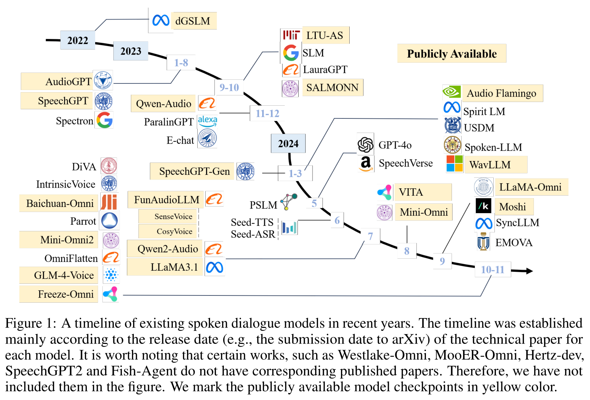
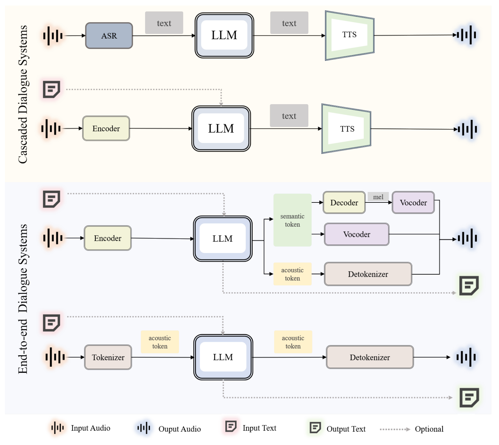
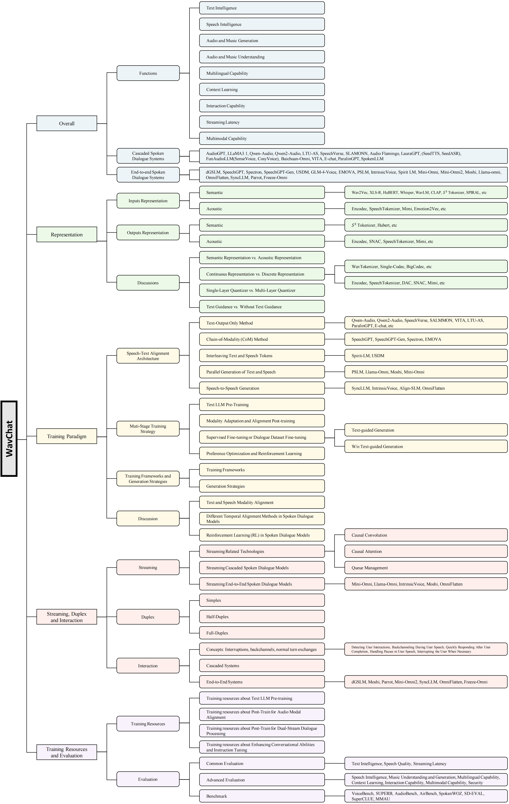
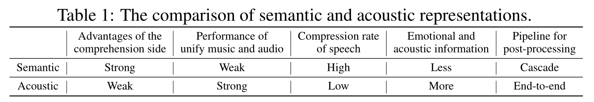
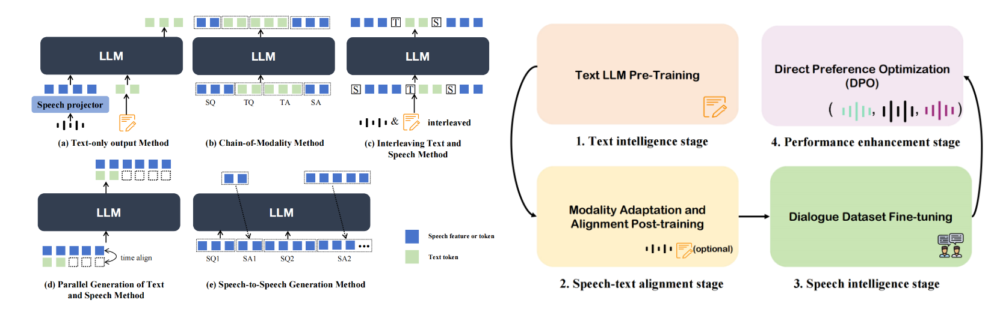
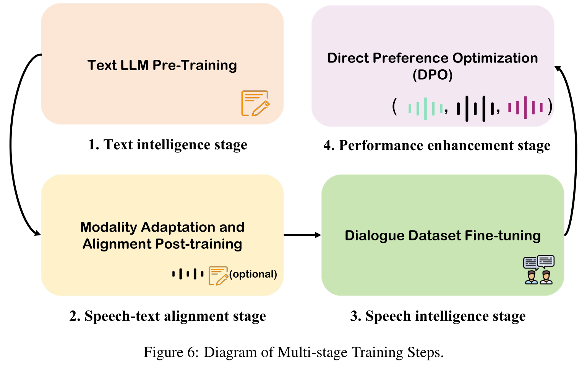
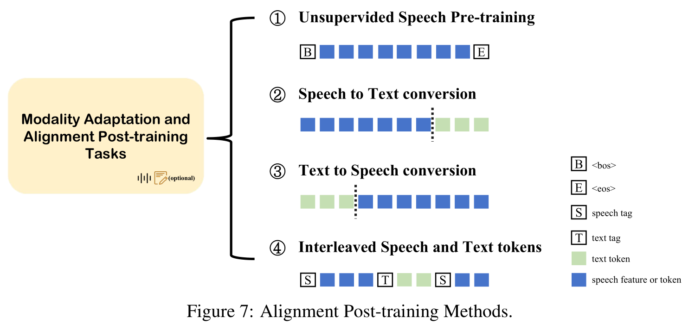
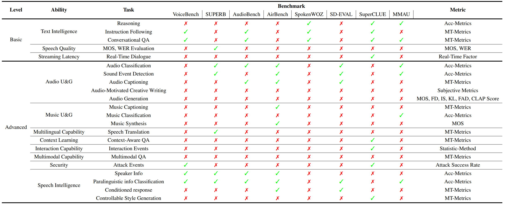

# WavChat: 口语对话模型综述

基本信息

- 标题: "WavChat: A Survey of Spoken Dialogue Models"
- 作者:
  - 01 Shengpeng Ji (浙江大学, shengpengji@zju.edu.cn)
  - 02 Yifu Chen (浙江大学)
  - 03 Minghui Fang (浙江大学)
  - 04 Jialong Zuo (浙江大学)
  - 05 Jingyu Lu (浙江大学)
  - 06 Hanting Wang (浙江大学)
  - 07 Ziyue Jiang (浙江大学)
  - 08 Long Zhou (微软)
  - 09 Shujie Liu (微软)
  - 10 Xize Cheng (浙江大学)
  - 11 Xiaoda Yang (浙江大学)
  - 12 Zehan Wang (浙江大学)
  - 13 Qian Yang (浙江大学)
  - 14 Jian Li (腾讯优图实验室)
  - 15 Yidi Jiang (阿里巴巴)
  - 16 Jingzhen He (阿里巴巴)
  - 17 Yunfei Chu (阿里巴巴)
  - 18 Jin Xu (阿里巴巴)
  - 19 Zhou Zhao (浙江大学, zhaozhou@zju.edu.cn)
- 链接:
  - [ArXiv](https://arxiv.org/abs/2411.13577)
  - [Publication]
  - [Github](https://github.com/jishengpeng/WavChat)
  - [Demo]
  - [WeChat](https://mp.weixin.qq.com/s/9DisPbvZBr8NGY2SPytT9Q)
- 文件:
  - [ArXiv]()
  - [Publication] #TODO

## 摘要

**口语对话模型 (Spoken Dialogue Models)** 的近期进展, 如 GPT-4o 等系统为代表, 在语音领域获得了广泛关注.
在多模态模型的更广泛背景下, 语音模态为人机交互提供了直接的接口, 使得人工智能和用户之间可以直接交流.
和传统的由自动语音识别 (ASR) + 大语言模型 (LLM) + 文本转语音 (TTS) 组成的三层级联口语对话模型相比, 现代的口语对话模型展现出更高的智能.
这些先进的口语对话模型不仅能够理解音频, 音乐, 以及其他与语音相关的特征, 还能够捕获语音的风格和音色特征.
此外, 它们能够以低延迟生成高质量, 多轮次的语音响应.

尽管口语对话系统取得了不少进步, 但缺乏全面的综述, 来系统地组织和分析这些系统和底层技术.

- 为了解决这一问题, **我们首先将现有的口语对话系统按时间顺序排列, 并将它们分类为级联范式和端到端范式**.
- 然后我们对口语对话模型的核心技术进行了深入的概述, 涵盖了**语音表示**, **训练范式**, **流式/双工/交互能力**等方面.
每一节讨论这些技术的局限性, 并概述了未来研究的考虑因素.
- 此外, 我们从训练和评估口语对话模型的角度, 全面回顾了相关的**数据集**, **评估指标**, 和**基准**.

我们希望这项工作能够促进口语对话系统的学术研究和工业应用的发展.
相关材料可在 [Github](https://github.com/jishengpeng/WavChat) 获得.

## 1·引言

口语对话模型 (Moshi[^Moshi], SpeechGPT[^SpeechGPT], Mini-Omni2[^Mini-Omni2]) 代表了人机交互中最直接的方法之一, 从传统的声音助手 ([Alexa [URL]](https://www.alexa.com/); [Siri [URL]](https://www.apple.com/siri/); [Google Assistant [URL]](https://assistant.google.com/)) 进化到最新的智能对话系统 (如 [GPT-4o [URL]](https://openai.com/index/chatgpt-can-now-see-hear-and-speak/)).

口语对话模型的基本定义是指一个能够根据输入语音生成智能口语回应的对话系统.
一方面, **语音模态**在口语对话模型中既是人机交互的输入接口, 也是输出接口.
另一方面, **对话系统** (LLaMA3.1[^LLaMA3]) 要求模型具备一定程度的文本智能, 包括理解人类社会知识并生成专业和智能的回应.

近期, 以 GPT-4o 和 Moshi[^Moshi] 为代表的智能口语对话系统, 因其超越了传统基于文本的对话模型 (AudioGPT[^AudioGPT]) 的语音智能能力而受到广泛关注.

这些对话模型不仅能够生成自然, 类似人类的语音回应 (Moshi[^Moshi]; FunAudioLLM[^FunAudioLLM]) 还展示了超越文本的高级声学特征 (如音色, 情感和风格) 的理解和生成能力 (Spoken-LLM[^Spoken-LLM]; ParalinGPT[^ParalinGPT]; E-chat[^E-chat]).
此外, 它们在处理其他语音相关表示方面表现出色, 包括音乐和音频事件 (Qwen2-Audio[^Qwen2-Audio]; Qwen-Audio[^Qwen-Audio]; LTU-AS[^LTU-AS]; SALMONN[^SALMONN]).
它们在现实对话互动 (VITA[^VITA]; Mini-Omni2[^Mini-Omni2]) 和低延迟对话体验 (Moshi[^Moshi]) 方面的表现进一步使它们在传统对话模型的竞争中脱颖而出.

口语对话模型的历史可以回溯到早期系统, 如 dGSLM[^dGSLM], AudioGPT[^AudioGPT], 直至最近的进展, 如 GPT-4o 和 Moshi[^Moshi].
在此过程中, 许多值得注意的口语对话模型相继出现.
如图 01 所示, 我们按时间顺序组织了这些模型.

大致上, 它们可以分为两种类型:
- 级联口语对话模型: (Qwen2-Audio[^Qwen2-Audio], Qwen-Audio[^Qwen-Audio])
- 端到端口语对话模型: (FSQ[^FSQ], Mini-Omni[^Mini-Omni], OmniFlatten[^OmniFlatten], IntrinsicVoice[^IntrinsicVoice])

鉴于现有大多数口语对话模型依赖和文本模态的对齐, 级联模型和端到端模型之间的区别十分关键.

如图 02 所示, 我们根据**核心语言模型是否能够直接理解和生成语音表示**将所有口语对话模型划分为级联模型和端到端模型.

传统的级联口语对话系统, 如 AudioGPT[^AudioGPT], 采用以文本为中心媒介的结构, 通常由三个级联模块组成:
- 输入音频通过自动语音识别 ASR 模块 (Whisper[^Whisper]) 转写为文本.
- 转写后的文本输入到大语言模型如 ChatGPT 中生成文本回应.
- 最后, 文本回应通过文本转语音模块 (VITS2[^VITS2], FastSpeech2[^FastSpeech2]) 转换回音频.

尽管这种级联架构利用了大语言模型强大的上下文能力, 但它也引入了一些挑战: 高延迟, 受限互动性, 无法处理非文本信息等.

为了处理这些问题, 近期研究采取了两个主要方向:
- 一些方法 (Qwen-Audio[^Qwen-Audio], SALMONN[^SALMONN]) 专注于优化级联系统中的理解和生成组件以缓解上述局限.
- 另一些方法 (Mini-Omni[^Mini-Omni], Mini-Omni2[^Mini-Omni2], SpeechGPT-Gen[^SpeechGPT-Gen], IntrinsicVoice[^IntrinsicVoice]) 试图采用端到端架构来直接解决这些问题.
  尽管端到端口语对话模型在表示和模型架构方面存在各种差异, 但它们有一个共同特征: 它们不依赖于文本作为中介.
  相反, 这些模型试图直接理解和生成语音表示.
  我们将此类系统定义为端到端口语对话模型.

在构建口语对话系统时, 我们根据涉及的不同级别的智能, 确定了和口语对话模型相关的四种核心技术.
- 第一: 语音表示的设计 (即 Tokenizer 和 Detokenizer)
- 第二: 训练, 推理, 生成范式, 特别是如何在保留或增强现有文本对话模型的智能的同时对齐语音模态和文本模态. 这一部分设计到选择不同的模型架构, 生成策略, 多阶段训练策略.
- 第三: 交互, 双工, 流式的设计.
- 第四: 数据特定相关的挑战, 如何构造口语对话系统的训练数据集和评估其性能.

鉴于这些考虑, 在本文的后续章节中, 我们将按照顺序详细阐述这四种核心技术:
- 第二节: 提供口语对话模型的概述, 包括电影的口语对话场景 (即如何定义一个口语对话模型) 以及级联和端到端口语对话模型的近期进展.
- 第三节: 口语对话系统使用的语音表示.
- 第四节: 系统地讨论训练范式, 特别强调了如何将语音模态与文本模态对齐, 以及多阶段训练策略, 模型架构, 和生成策略.
- 第五节: 强调了口语对话系统的独特特性, 特别是双工, 流式特性, 这些特性使得它们与文本对话系统有所不同.
- 第六节: 考察了口语对话模型的训练数据集构建和特定的评估方法.

在每一节末尾, 我们进行总结和讨论, 以反思关键见解.
最后, 我们在第七节, 总结了本文的主要发现和未来研究的开放问题.

鉴于技术点的复杂性, 我们在图 03 中提供了本文的结构概览.

## 2·整体视角

在本节中, 我们将对口语对话模型进行整体概述.
首先, 我们通过考察各种对话场景来定义什么构成了一个智能口语对话模型.
然后, 我们提供了口语对话模型的全面概述, 区分级联口语对话模型和端到端口语对话模型.

### 2.1·口语对话系统的功能

基于 GPT-4o, Moshi[^Moshi], Qwen2-Audio[^Qwen2-Audio], VITA[^VITA] 等代表性模型的演示和推理接口, 我们将现代智能口语对话模型的使用场景分为以下九个代表性类别:
1) 文本智能;
2) 语音智能;
3) 音频和音乐生成;
4) 音频和音乐理解;
5) 多语言能力;
6) 上下文学习;
7) 交互能力;
8) 流式延迟;
9) 多模态能力.

对于口语对话模型中的九个不同用例, 我们在图 04 中为每个场景提供了相应的示例.
从这些使用场景可以清楚地看出, 口语对话模型不仅仅是基于文本对话模型向语音模态的扩展 (即, 语音模态仅作为将语音转换为文本的接口).
相反, 智能口语对话模型必须能够理解和生成语音中嵌入的声学信息 (如音色, 风格, 以及情感), 并且能够理解和生成更广泛的音频表示, 包括与音频时间和音乐相关的信息.
此外, 与非流式的基于文本的系统不同, 口语对话模型需要支持实时, 交互式的流式传输能力.
这些使用场景不仅突出了口语对话系统中固有的智能, 还展示了构建端到端口语对话模型带来的重大挑战.
下面, 我们将对这九种使用场景进行详细考察.

#### 2.1.1·文本智能

如图 04 (a) 所示, 口语对话系统必须保留原始基于文本的对话模型 (如 ChatGPT) 的基本能力.
我们将这一使用场景定义为文本智能.
在这种情况下, 口语对话模型可以智能地响应用户请求, 生成合适的响应, 如旅行行程, 工作计划和日程安排.

然而, 由于基于声音交互的局限性, 当前的口语对话系统的文本智能更侧重于日常场景.
在某些情况下, 如复杂的数学定理推理, 口语对话模型的性能要求与基于文本的对话模型有所不同 (LLaMA[^LLaMA]).
这些文本智能的高级方面在统一的多模态对话模型中值得进一步探索.

#### 2.1.2·语音智能

和基于文本的对话模型 (LLaMA[^LLaMA]) 相比, 口语对话模型的显著特征之一是它们能够理解和生成超越文本内容的声学信息的能力.
在语音模态中, 不仅存在文本内容, 还有额外的声学信息 (例如音色/说话人身份和风格/情感/韵律等).
如图 04 (b) 所示, 智能口语对话模型应该能够理解对话语音的音色和风格, 并且理想情况下, 以零样本方式生成具有指定音色和风格的响应.

语音智能的能力涉及到多种用例.

在**理解方面**, 口语对话系统应该基于说话人声学风格生成响应.
例如, 在 E-chat[^E-chat] 中, 一个典型的例子可能是:
如果用户以欢快的语气询问:"我的手机无法开机, 我该怎么办?",
系统可能会回答: "看起来你对新手机很兴奋, 你对哪种手机感兴趣?".
如果用户以悲伤的语气询问同样的问题, 系统可能会回答: "很遗憾你的手机无法正常工作.
如果你熟悉维修政策, 继续下一步吧."
这种情况表明, 口语对话系统可能会根据不同的声学信息生成不同内容的响应.

此外, 系统应该理解各种声学线索, 如口音或情绪状态, 并根据相应的不同声学信息调整其响应.
例如, 如果说话人是一位美国人, 系统可能会用本地的英语口音进行回复, 而如果说话人是上海人, 系统可以用相应的方言回复.
类似地, 如果用户以悲伤的语气说话, 对话系统应能够生成更具有鼓励性和同理心的响应.

在**生成方面**, 语音智能更突出地体现在其可控性上, 例如声音克隆和风格控制.
例如, 系统可以被指示模仿特定声音或以指定风格回应 (模仿祖母的轻声细语以进行安慰性的互动)
此外, 系统可以在对话时使用提供的声音提示来完全克隆提示中的音色并生成相同声音的语音.

总而言之, 理解和生成声学信息的能力是智能口语对话模型的关键特征之一.

#### 2.1.3·音频和音乐生成

在口语对话模型中, 除了基本的口语对话能力之外, 智能口语对话系统可能还被要求生成音乐和音频.
例如, 用户可能会指示系统生成一段一分钟的钢琴段落或十秒钟的狗叫录音.
此外, 用户可能提供歌词和音乐旋律, 要求口语对话模型创作一首流行歌曲.
因此, 系统应在输出侧继承大规模的音乐 (MusicLM[^MusicLM], MusicGen[^MusicGen], MeLoDy[^MeLoDy], Survey20240826[^S20240826]) 和音频 (Make-An-Audio[^Make-An-Audio], AudioLDM[^AudioLDM], AudioLDM2[^AudioLDM2]) 模型的生成能力.

#### 2.1.4·音频和音乐理解

除了音乐和音频生成能力之外, 口语对话模型应该还能够理解输入侧的音乐和音频 (Qwen2-Audio[^Qwen2-Audio], SALMONN[^SALMONN]).
例如, 当给定一段音频时, 智能系统应该识别其内容和声学特征, 例如识别声音是鸟鸣还是猫叫, 音乐是平静还是充满活力.

此外, 系统还可以通过基于给定的音乐或音频来创作文学作品 (诗歌/歌曲) 来扩展其理解能力.

#### 2.1.5·多语言能力

和基于文本的对话模型类似, 口语对话系统也应该具备处理多语言的能力.
具体来说, 这些模型应该能够进行多语言的内容翻译, 例如将日语口语片段翻译成法语语音片段, 有效地继承同声传译的能力.

除了多语言内容翻译, 系统还应该能够处理多语言声学信息.
这意味着智能口语对话模型应该能够以各种语言和口音生成响应, 根据不同的输入语音以目标语言的响应口音回应.

#### 2.1.6·上下文学习

在口语对话模型中, 处理长篇和多轮对话的能力是评估性能的关键基准 (Moshi[^Moshi]).
这要求口语对话模型不仅要支持长时段音频输入还需要生成扩展的音频输出.
此外, 它们必须能够基于历史上下文进行多轮对话.
多轮对话的重要方面之一是基于新的用户指令对之前的响应进行修正的能力.
如图 04 (f) 所示, 智能口语对话模型应该能够持续地根据用户不断变化的请求修改其之前的回复.

#### 2.1.7·交互能力

与基于文本的对话模型相比, 口语对话系统的一个显著特点是它们的双工和交互性 (Moshi[^Moshi]).
在基于文本的对话中, 交互通常遵循半双工结构, 即响应只能在问句完成后提供, 用户无法实时干扰回复.
然而, 在口语对话系统中, 全双工交互是常见的.
这意味着在生成响应之前不需要完全完成对话.
系统和用户都可以实时打断和互动.
例如, 如果用户不满意系统的响应, 他们可以立即打断, 使得系统暂停当前生成并响应新的输入.

此外, 为了模仿更自然的对话场景, 系统还可以在适当的时候打断用户例如在澄清用户意图时.

除了打断能力外, 交互对话通常还包括对话填充词 (如 "okay," "haha," 或 "oh,"), 它们表示确认或同意.
在口语对话模型中包括这些内容可以增强对话的真实性和自然流动性.

交互能力的基本要求是同时听和说, 动态地响应交互流程.

#### 2.1.8·流式延迟

流式理解和生成也是口语对话模型的基本功能 (Mini-Omni2[^Mini-Omni2], IntrinsicVoice[^IntrinsicVoice], LLaMA-Omni[^LLaMA-Omni]).
在真实场景中, 模型不能等到整个分钟长的音频片段处理完成后才生成响应.
相反, 模型必须以分块的机制运行, 实时地动态处理和生成音频, 一次处理一个分块.
此外, 流式要求意味着整个系统必须以因果方式运行, 仅基于过去信息理解和生成音频, 而不依赖未来信息.
流式功能通常和低延迟需求紧密相关.
在实际对话体验中, 口语对话模型生成第一个 Token 的延迟 (即用户等待时间) 和生成过程的平均延迟是影响口语对话系统整体响应及可用性的关键因素.

#### 2.1.9·多模态能力

多模态对话能力 (EMOVA[^EMOVA], VITA[^VITA]) 是口语对话模型的一个高级特性.
在现有系统中, 这通常指的是处理来自多个模态 (如音频, 图像, 文本) 的输入, 同时生成智能语音响应的能力.
具备这种能力的口语对话模型可以实现 "听, 看, 说" 同时进行.
多模态输入显著提升了这些系统的潜力.

例如, 用户可以通过各种手势来提升模型生成响应的质量, 且系统可以对物理世界进行更深入的理解.

除了多模态输入, 对话系统的未来在于大型多模态模型, 这些模型统一了所有模态的理解和生成能力, 而口语对话扮演着基础模态.

### 2.2·级联口语对话系统

级联口语对话模型的最早原型可以追溯到 AudioGPT[^AudioGPT].
为了实现语音到语音对话功能, 该系统首先采用自动语音识别 (ASR) 模型来将语音转换为文本, 后跟 ChatGPT 进行基于文本的对话, 最后使用文本转语音 (TTS) 模型将生成的文本转换为语音.
在这一原始版本中, 语音仅作为输入输出接口, 仅保留了最基础的文本智能.
- 例如, HuggingFace 开源的语音到语音框架 ([Github](https://github.com/huggingface/speech-to-speech)) 中进一步在传统级联模块上叠加一个语音活动检测 (Voice Activity Detection, VAD) 模块来区分语音和静音片段, 以及不同说话人.

级联口语对话模型中建立了基本的文本智能后, 研究人员开始融入副语言特征, 例如情感和风格, 以增强级联口语对话模型中的语音智能.
- 例如, ParalinGPT[^ParalinGPT] 和 E-chat[^E-chat] 通过滑动窗口机制将对话上下文, 语音嵌入和副语言属性集成到自回归模型中, 使得模型能够结合历史文本和情感表示来生成更准确的文本响应.
- 类似地, Spoken-LLM[^Spoken-LLM] 引入了 Emotion2Vec[^Emotion2Vec] 模块来为 LLaMA2-Chat 模型提供风格向量.
通过 LoRA[^LoRA] 微调, LLaMA2-Chat 被训练成生成不仅基于内容的文本响应, 还能够生成具有具体的风格属性 (如 `<cheerful, fast, normal>`) 的文本响应, 以指导下游 TTS 系统来生成更具表现力的语音.

除了在级联口语对话模型中理解声学信息, 还有其他一些努力试图直接输入语音表示同时保留文本作为输出模态 (*SpeechVerse[^SpeechVerse], Qwen-Audio[^Qwen-Audio], Audio Flamingo[^AudioFlamingo]).
这迫使级联口语对话模型直接处理输入语音.
一个常用方法是整合冻结的语音编码器 (如 Whisper[^Whisper]) 与可训练的编码器适配器, 允许语音输入被解释为特定的文本形式, 由大型语言模型进行处理.
通过扩展基于文本的对话模型的词表, 大语言模型能够将语音作为一种独特形式的文本来处理, 从而在级联口语对话模型生成适当的文本响应.

值得注意的是, 这些级联口语对话模型不局限于单独理解人类语音, 还能够理解多种音频模态, 包括音乐和音频 (LTU-AS[^LTU-AS], SALMONN[^SALMONN]).
- SALMONN[^SALMONN] 通过冻结 Whisper[^Whisper] 和 BEATs[^BEATs] 编码器并将它们通过窗口级别 Q-Former (BLIP-2[^BLIP2]) 与大型语言模型进行桥接来建模语音和音频信息.

因此, 这些级联口语对话系统能够在理解方面执行广泛的任务.

- 如 Qwen2-Audio[^Qwen2-Audio], Qwen-Audio[^Qwen-Audio] 的模型能够处理多种任务, 例如自动语音识别, 语音到文本翻译, 自动音频字幕, 声学场景分类, 语音情感识别, 音频问答, 歌声分类和音乐音符分析.

因此, 这些级联模型通常被视为多任务语音-文本大语言模型的一部分.

值得注意的是, 上述级联口语对话模型仅生成文本, 然后直接将它们输入到预训练的 TTS 模块.
然而, 最近的级联口语对话模型, 例如 LLaMA 3.1, 开始将可训练的文本转语音模块作为大语言模型的编码器的一部分进行集成.
尽管这些模型在集成低延迟流式功能方面取得了进展, 但它们仍然首先生成文本内容然后转化为语音.
它们并不直接将语音相关的表示输入到 LLM 内部.
因此, 我们将这些模型分类为级联口语对话系统.

此外, 一些近期的模型 (如 Qwen2-Audio[^Qwen2-Audio]) 尝试通过融入多模态理解能力, 从而实现一定程度的多模态对话功能.
- 模型如 VITA[^VITA] 和 Baichuan-Omni[^Baichuan-Omni] 将图像, 音频和视频的编码器或 Tokenizer 集成到 LLM 中, 使得模型能够理解多模态输入并生成相应的文本响应.

上述发展涉及到级联口语对话模型的理解方面.

在生成方面, 级联口语对话系统有两种主要的语音合成工作.
- 近年来先进语音合成系统能够基于文本输入生成高度表现力和自然的音频.
   - VALL-E[^VALL-E];
   - VALL-E X[^VALL-E-X];
   - MegaTTS[^MegaTTS];
   - MegaTTS2[^MegaTTS2];
   - CosyVoice[^CosyVoice];
   - [ChatTTS [Github]](https://github.com/2noise/ChatTTS);
   - [FishSpeech [Github]](https://github.com/fishaudio/fish-speech);
   - ParlerTTS[^ParlerTTS];
   - MaskGCT[^MaskGCT];
   - F5-TTS[^F5-TTS].
- 文本风格可控的 TTS 系统方面也取得了显著进展.
   - TextrolSpeech[^TextrolSpeech];
   - PromptTTS[^PromptTTS];
   - PromptTTS2[^PromptTTS2];
   - InstructTTS[^InstructTTS];
   - ControlSpeech[^ControlSpeech].

这些文本转语音系统能够基于级联口语对话模型生成的文本内容和风格生成高度自然的音频.

### 2.3·端到端口语对话模型

理想情况下, 端到端口语对话模型应该训练和推理时仅使用语音输入和输出, 从而实现多种智能对话功能.
然而, 考虑到语音模态相对于文本模态是低密度模态 (包含大量声学信息), 且可用的文本数据量远远超过可用的语音数据, 许多端到端的口语对话模型选择将语音模态和文本模态对齐来利用预训练语言模型.
因此, 如[图 02](#Fig.02) 所示, 只要大语言模型能够直接理解和生成语音表示, 我们将此类系统归类为端到端口语对话模型.
相反, 如果大语言模型只能够生成文本, 我们将该系统归类为级联口语对话系统.

最早的端到端口语对话系统可以回溯到 dGSLM[^dGSLM], 该系统基于数千小时的二轨数据 (Fisher Corpus[^Fisher]) 训练, 使用自注意力和交叉注意力机制来模拟双工交互.
尽管 dGSLM 缺乏与 LLMs 的集成, 甚至缺乏基本的文本智能, 但它作为第一个完全端到端的口语对话系统, 不依赖文本的同时保持了出色的对话交互性, 具有重要意义.

随着 dGSLM[^dGSLM] 的发布, 端到端口语对话模型的发展停滞了几个月.
然而, 随着 ChatGPT 的出现, 这一领域迅速发展.
- 一个代表性的方法是 SpeechGPT[^SpeechGPT], 通过使用 {输入语音 Token, 输入文本 Token, 响应文本 Token, 响应语音 Token} 的序列进行自回归语言建模.
- 这种方式使得文本智能能够直接生成语音 Token, 启发了后续的端到端口语对话系统, 如 Spectron[^Spectron], SpeechGPT-Gen[^SpeechGPT-Gen], [GLM-4-Voice [Github]](https://github.com/THUDM/GLM-4-Voice) 和 EMOVA[^EMOVA].
这些系统仍然使用自回归框架, 先生成文本 Token 再生成语音 Token.

尽管这种方法允许 LLM 直接生成语音 Token, 但它引入了延迟问题, 因为语音 Token 生成只能在文本 Token 生成完成后开始.
这导致多轮对话和整体系统延迟问题.

除了 SpeechGPT[^SpeechGPT] 的设计之外, 另一种直观的方法是直接使用 LLM 的 softmax 层之前的隐藏状态通过不同映射层来预测文本 Token 和语音 Token.
这使得网络可以在映射层之前共享权重, 从而对齐语音和文本模态.
- 例如, PSLM[^PSLM] 是典型的这种设计.
- Meta 提出的另一种方法是交错方法, 如 SpiRit-LM[^SpiRit-LM], 其中语音和文本序列被拼接成单个 Token 流, 并使用小型手工制作的语音-文本并行语料库进行词级交错方法训练.
  然而这种方法要求语音和文本的精确对齐.

近期出现了几个新的端到端口语对话系统.
- Moshi[^Moshi] 是基于全局-局部 Transformer 的模型, 可以从多层量化器同时生成文本和语音声学 Token.
  从基于文本的语言模型骨干开始, Moshi 从神经音频编解码器的残差量化器中生成音频 Token 并对用户的语音和系统响应进行并行流建模.
  这一设计消除了显式切换说话人的需要并允许建模任意对话动态.
  此外, Moshi 通过先预测时间对齐的文本 Token 作为音频 Token 的前缀来扩展先前的层次化语义转声学 Token 生成.
- Mini-Omni[^Mini-Omni] 类似地使用基于 MusicGen[^MusicGen] 的方法来同时生成文本和语音编解码器 Token.
  它引入了两种策略: 通过填充文本 Tokens 进行无严格时间对齐的自回归生成和批量并行推理策略以提升性能.
- Mini-Omni2[^Mini-Omni2] 通过整合多模态理解和双工功能进一步增强了这一方法.

LLaMA-Omni[^LLaMA-Omni], Freeze-Omni[^Freeze-Omni], IntrinsicVoice[^IntrinsicVoice] 设计了 LLM 以进行实时声音交互.
它们的共同点在于在生成阶段, LLM 的隐藏状态被进一步输入到对应的解码器模型中.
- LLaMA-Omni[^LLaMA-Omni] 继承了预训练语音编码器, 语音适配器, 大语言模型和流式语音解码器.
它消除了语音转写的需要, 并能够直接从语音指令中以低延迟直接生成文本和语音响应.
- Freeze-Omni[^Freeze-Omni] 设计了三阶段训练策略用于语音输入和输出的建模, 使其仅通过使用文本-语音配对数据即可获得语音到语音的对话能力.
其核心思想是将口语对话模型的功能转移到编码器 (ASR) 和解码器 (TTS) 中, 而不是将其分配给大型语言模型.
- IntrinsicVoice[^IntrinsicVoice] 通过减少文本和语音之间的模态差距, 促进了预训练 LLMs 文本能力迁移到语音模态
  它通过使用 GroupFormer 从 LLM 的隐藏状态生成 HuBERT Token, 有效地将语音序列缩短到与文本序列相当的长度, 生成高质量音频的同时显著加快推理速度, 并缓解了长文本建模问题.

此外, 一些端到端口语对话模型通过多阶段训练对齐语音和文本, 从而在推理过程中无需生成文本.
- OmniFlatten[^OmniFlatten] 通过模态对齐, 半双工对话学习和全双工对话学习, 一起文本和语音 Token 的扁平标准化, 实现了推理过程中的双工无文本语音对话.
- 类似的方法包括 SyncLLM[^SyncLLM].

### 2.4·小结

在本节中, 我们提供了当前端到端口语对话系统的概述.
然而, 这些系统在语音表示, 训练范式, 模型架构, 生成策略上存在显著差异.
在[第 3 节](#Sec.03) 和[第 4 节](#Sec.04), 我们将进行详细分类, 并在每节的末尾进行讨论.

## 3·口语对话模型中的表示技术

**表示 (Representations)** 在口语对话系统中扮演者至关重要的角色, 因为它们决定了语音对话系统如何理解, 处理和生成语音信号.
此外, 它们作为语音和其他模态之间的桥梁, 因此直接影响系统的性能, 功能和应用范围.
和文本表示与视觉表示相比, 语音表示具有独特的复杂性.
- 文本表示主要依赖于定义明确的符号系统, 通过结构化元素 (如词汇和句法) 传达含义.
- 视觉表示侧重于捕捉图像中的空间关系和视觉特征.
- 语音信号包含动态声学特征 (如音色, 韵律和情感) 和丰富的语义内容, 要求相应的表示不仅捕获时序变化而且还能保留对底层含义的理解.

语音的独特性促使了两种表示模型的发展.
由这两种建模方法获得的表示通常被分类为**语义 (Semantic) Token** 和**声学 (Acoustic) Token**.

1. 语义类是基于预测的建模. 这些模型被训练以进行表示学习, 如以自回归方式预测未来帧 (VQ-APC[^VQ-APC]; DNNSeg[^DNNSeg]) 或使用周围帧来预测被掩膜的帧 (Audio ALBERT[^AudioALBERT]; HuBERT[^HuBERT]; Mockingjay[^Mockingjay]).
   这种方法倾向于优先捕捉语音中的语言信息, 特别适用于识别和理解任务.
2. 声学类专注于语音压缩和重建 (WavTokenizer[^WavTokenizer]; EncCodec[^EnCodec], DAC[^DAC], SoundStream[^SoundStream]).
   这些模型将语音特征量化为一系列离散 Token (通过编码器对原始波形进行下采样), 然后使用解码器来上采样这些离散 Token 为语音, 计算和原始信号之间的重构损失.
   通过这种方法, 我们可以获得具有惊人压缩率和高保真度声学信息的离散声学 Token, 更适合例如语音合成和情感分析等任务.

在口语对话系统中, 如图 2 所示, 不同口语对话模型对于表示选择采用不同的方法.
在接下来的部分, 我们将枚举口语对话模型中常用的语音表示, 既包括输入端, 也包括输出端.
在最后, 我们将详细讨论这些表示的优势和局限性, 以及在口语对话模型中使用的语音表示的未来趋势.

### 3.1·输入端的语音表示

#### 语义类

为了增强语言模型对理解语音表示的能力和在输入时对齐多模态数据, 使用预训练模型, 如 Wav2Vec[^Wav2Vec], HuBERT[^HuBERT], Whisper[^Whisper], WavLM[^WavLM] 来从语音中提取高级语义特征已经成为许多口语对话系统的核心策略.

##### Wav2Vec, Wav2Vec2.0, XLS-R

Wav2Vec[^Wav2Vec] 是语音表示学习领域的基础工作, 开创了从无标注语音数据中提取自监督语音表示.
这一方法推动了语音识别, 说话人识别和其他语音处理应用等任务的技术进步.
Wav2Vec 采用多层一维卷积神经网络直接在原始语音波形上进行逐步提取时序语音特征.
训练通过对比学习完成: 模型选择一个 "正确" 目标 (当前语音帧), 以及多个 "错误" 目标 (负样本).
通过学习区分正样本和负样本, 模型有效地在潜在空间中学习如何表示语音特征.

Wav2Vec2.0[^Wav2Vec2] 作为 Wav2Vec 的改进版本, 引入了 Transformer 架构和掩模建模.
Wav2Vec2.0 量化了由 CNN 提取的潜在语音表示, 然后使用 Transformer 来建模语义信息, 类似于 BERT[^BERT].
它还采用对比学习目标, 要求模型从多个候选表示中区分出正确量化表示.

- ParalinGPT[^ParalinGPT] 旨在将情感表达纳入对话互动, 选择具有编码丰富韵律信息方面的能力的 Wav2Vec2.0, 有益于语音情感识别 (Survey20221005[^S20221005]).
具体来说, ParalinGPT 使用 Wav2Vec2.0 中间层 (第 12 层) 进行逐帧特征提取, 因为这一层在情感分析线性探测任务中表现出了最佳结果.
此外, ParalinGPT 应用平均池化和线性特征映射器来提取发言嵌入.

XLS-R[^XLS-R] 是一种基于 Wav2Vec2.0 架构的多语言自监督语音表示模型.
它扩展并优化了 Wav2Vec2.0 以支持更广泛的语言范围, 特别是低资源语言.
在跨语言训练中, XLS-R 采用多语言数据增强和降噪技术, 增强了模型在处理多种语言语音时的适应性.
- USDM[^USDM] 使用 XLS-R 获得 50Hz 的连续中间表示, 然后使用 $K$=10000 的量化器 (Seamless[^Seamless]) 生成语音 Token.

##### HuBERT

HuBERT[^HuBERT] 是一种常用的无监督学习模型, 对语音的 MFCC[^MFCC] 特征进行 K-Means 聚类, 为每帧分配伪标签.
它使用卷积编码器从 16kHz 采样率的语音以 20ms 的帧率生成特征序列.
最后, 它随机掩膜连续帧的一部分特征作为 Transformer[^Transformer] 的输入.
HuBERT 基于周围的上下文生成掩膜内容, 使其能够捕获语音中的时序和语义信息并获得上下文细节的更深刻理解.

口语对话系统, 例如 E-Chat[^E-chat], SpeechGPT[^SpeechGPT], PSLM[^PSLM], IntrinsicVoice[^IntrinsicVoice] 广泛使用了 HuBERT 作为它们的语音编码器.
- E-Chat 提取 HuBERT 的 24 层权重之和作为语音嵌入, 并结合一组额外的权重参数来提取情感嵌入, 从而实现情感感知的能力.
- SpeechGPT 对 HuBERT 提取的连续特征进行 K-Means 聚类来量化, 将其转化为离散单元序列.
  这些离散单元随后整合到大语言模型的词表中, 实现文本和语音模态之间的直接对齐.
- 为了更有效地将集成语言模型和语音流, PSLM 在 HuBERT 提取特征后添加了额外的嵌入层.
- IntrinsicVoice 使用 HuBERT 作为语音 Tokenizer , 将语音 Token 进行分组以减少序列长度. 然后嵌入层将这些 Token 转换为密集的嵌入, 并通过可训练的语音适配器映射到语言模型的嵌入空间中.
- SpiRit-LM[^SpiRit-LM] 使用 HuBERT 提取语义特征, 使用500 个基本单元的 K-Means 模型作为基础单元.
  它采用数据增强技术 [^Gat2022Augmentation] 训练了一个前馈量化器, 以生成离散语音 Token.
- Align-SLM[^Align-SLM] 使用 HuBERT, 聚类数 K=500.

值得注意的是, 当连续表示被聚类到离散单元时, 它们主要捕获内容信息, 这可以用于建模和理解.
这一过程首先从 HuBERT 的第 11 层提取 25Hz 帧级连续表示, 将每帧分配到最近的聚类索引, 然后消除连续相同的索引来缩短序列.

##### Whisper

Whisper[^Whisper] 是基于经典的编码器-解码器架构的模型, 在语音识别领域获得了广泛关注.
编码器将输入语音转换为高级特征表示, 而解码器则从这些表示生成相应的文本输出.
在大规模的各种语音环境的数据上以文本为目标进行预训练, Whisper 展示了从语音提取语义信息的强大能力.
- Qwen-Audio[^Qwen-Audio], Qwen2-Audio[^Qwen2-Audio] 使用 Whisper 的编码器将语音转换为连续表示, 然后与文本表示结合并输入到大型语言模型中.
- Mini-Omni[^Mini-Omni], Mini-Omni2[^Mini-Omni2], LLama-Omni[^LLaMA-Omni] 采用类似的方法, 在 Whisper 编码器之后连接了一个语音适配器.

它们共同的目标是将语音表示映射到大语言模型的文本嵌入空间, 通过词表扩展强制对齐从而增强模型理解语音的能力.

##### WavLM

WavLM[^WavLM] 是一种为全面语音处理任务设计的预训练模型, 在推动语音技术发展中发挥了关键作用.
具体来说, WavLM 采用了掩膜语音降噪和预测框架, 其中一些输入包含模拟噪声或带有掩码部分的叠加语音.
目标是预测掩膜区域中的原始语音的伪标签.
这种方法使得模型能够通过掩膜语音预测学习到与 ASR 相关的信息, 同时也通过语音降噪建模获得其他和非 ASR 任务相关的知识.
WavLM 中语音帧的掩码和预测流程和 HuBERT 类似.
然而, WavLM 引入额外的门控相对位置偏置来增强模型对语音中时序信息的敏感性.
- SpeechVerse[^SpeechVerse] 利用预训练的 WavLM Large 作为其语音编码器的骨干, 将 WavLM 的所有中间层特征编码到语义表示中, 实现更好的泛化性能.
  为了处理语音特征和文本 Token 之间的显著的长度差异, SpeechVerse 采用了一个可学习的卷积模块来对语音特征进行下采样.

##### $S^3$ Tokenizer

CosyVoice[^CosyVoice] 提出使用一个监督的自动语音识别模块生成**监督语义语音 Tokenizer (Supervised Semantic Speech ($S^3$) Tokenizer)**.
和标准的 ASR 模型不同, $S^3$ Tokenizer 将编码器分为两个部分, 并在这两个部分之间引入向量量化层.
第一个编码器将梅尔频谱转化为上下文感知的表示, 而第二个编码器将离散语音单元转换为连续隐藏状态.
最后, 基于 Transformer 的 ASR 解码器预测文本标签的后验概率.
通过在多语言 ASR 任务上的监督学习, $S^3$ Tokenizer 能够将语音转换为语义上一致的 Token, 这有助于促进语音理解和生成.
- OmniFlatten[^OmniFlatten] 使用 $S^3$ Tokenizer 提取离散语音 Token, 并直接将其输入到文本语音预训练的 Transformer 中.

##### SPIRAL

SPIRAL[^SPIRAL] 旨在从语音数据中学习对噪声和扰动健壮的表示.
它使用了教师-学生网络, 其中对学生模型的语音输入应用了各种扰动, 例如加噪, 增益调整, 以及时频扭曲.
教师模型随后引导学生模型在这些扰动下生成一致的表示.
- EMOVA[^EMOVA] 利用 SPIRAL 的架构作为语音编码器处理语音, 并采用**有限标量量化 (Finite Scalar Quantization, FSQ)**[^FSQ] 来离散这些特征.
这一过程将语音和文本词表对齐, 从而更自然地集成到 LLM 中.

##### 其他

一些口语对话系统并没有使用预训练的表示模型, 它们通过堆叠基础模块来处理输入特征.
- VITA[^VITA] 首先使用梅尔滤波器组分解语音信号, 模拟人类对声音的非线性感知.
  然后, 使用四层卷积神经网络下采样模块和 24 层 Transformer 来处理输入特征.
  为了和后续的语言模型对齐, VITA 采用了一个简单的两层 MLP 作为适配器.
- Freeze-Omni[^Freeze-Omni] 使用分块流式语音编码器将输入语音特征转换为高维表示.
  然后, 适配器模块将这些高维表示映射到主 LLM 的嵌入空间, 确保对输入语音的快速, 低延迟响应.
  语音编码器模块由数个下采样卷积层和 Transformer 块组成, 而适配器只包含几个下采样卷积层.
  下采样层用于减少语音特征的帧率, 在预填充阶段提高 LLM 的处理速度, 并减少延迟.

#### 声学类

考虑到语义特征不足以捕获语音的情感, 音色和风格,
- 一些表示模型如 Emotion2Vec[^Emotion2Vec] 尝试通过自监督训练提取声学信息.
- 其他模型则着重于重建目标以确保高保真语音, 包括 Encodec[^EnCodec], SpeechTokenizer[^SpeechTokenizer], Mimi[^Moshi] 等.

##### EnCodec

Encodec[^EnCodec] 是一种直接, 流式, 卷积式的编码器-解码器架构.
原始语音通过一系列卷积层进行下采样, 将其映射到潜在特征表示.
残差向量量化 (SoundStream[^SoundStream]) 随后将编码器的连续潜在特征离散化.
量化目标是将来连续特征映射到离散 Token 的预定义集合 (称为 "码本") 进行后续压缩和传输.
解码器通过连续的反卷积层将离散特征恢复为接近原始语音的波形.
- LauraGPT[^LauraGPT] 采用了 EnCodec 的增强版本作为其语音编码器, 进行了特定修改:
  (1) 在幅度谱域中添加重构损失以提高中到高频信号质量;
  (2) 堆叠五个步长为 (8, 5, 4, 2, 2) 的卷积块以处理长序列长度的挑战, 实现每 Token 组的码率为 25Hz;
  (3) 在 Residual Vector Quantization (RVQ) 模块中使用 32 个量化器, 其词汇大小为 1024, 并采用结构性 Dropout.
  这种改进通过引入更多量化器来提高语音质量, 同时保留了浅层量化器中的大部分信息.
  LauraGPT 最终从第一个量化器层的输出中选择语音 Token, 在性能与序列长度效率之间取得平衡.
  剩余的量化器仅在编码器-解码器模型训练时使用.

##### SpeechTokenizer

SpeechTokenizer[^SpeechTokenizer] 统一了语义和声学 Token, 在不同的 RVQ 层上分层次地分解语音信息地不同方面.
它建立在 RVQ-GANs 框架之上, 遵循与 SoundStream[^SoundStream] 和 Encodec[^EnCodec] 相同的模式.
值得注意的是, SpeechTokenizer 替换了 EnCodec 编码器中原本跟随卷积块地两层 LSTM 为两层 BiLSTM, 以增强语义建模能力.
鉴于 HuBERT 在编码大量内容信息方面的能力 (Survey20220521[^S20220521]), SpeechTokenizer 使用 HuBERT 作为语义教师.
在训练时, 它引入了两种蒸馏方法: 连续表示蒸馏和伪标签预测.
- 连续表示蒸馏: SpeechTokenizer 采用 HuBERT 第 9 层表示或 HuBERT 所有层的平均表示作为语义教师.
  训练目标是在所有时间步上最大化 RVQ 第一层输出与语义教师表示之间的维度级余弦相似度.
- 伪标签预测: SpeechTokenizer 采用 HuBERT 单元作为目标标签.

- 在对话系统中, SpeechGPT-Gen 使用 SpeechTokenizer RVQ-1 处理原始语音, 主要增强了大型语言模型对语音语义建模能力.

##### Mimi

受到先前 SpeechTokenizer 工作的启发, Mimi[^Moshi] 使用蒸馏将非因果的, 高级语义信息迁移到由因果模型产生的 Token 中, 从而实现语义-声学 Token 的流式编码和解码.
为了提升 Mimi 编码语音为紧凑表示并重建高质量语音的能力, 在编码器和解码器中添加了 Transformer 模块.
Mimi 使用 WavLM 蒸馏 RVQ-1, 丰富其语义信息.
值得注意的是, 进行蒸馏显著增强了第一个量化器的语音区分能力, 然而, 也可能导致语音质量下降.
Mimi 假设这是由于将语义信息蒸馏到单个 RVQ 第一级: 由于高阶量化器操作的是第一级的残差, 后者需要权衡语音质量与音素区分能力.
Mimi 解决这一问题的方法是引入分割 RVQ 方法.
与使用单个 8 级 RVQ 不同, Mimi 提取语义信息到简单 VQ 中, 并应用并行 7 级 RVQ, 在最后将它们合并.
这消除了对语义量化器残差中必须保留声学信息的约束.
经过仔细设计, Mimi 作为 Moshi[^Moshi] 的语音编码器, 这种方法增强了模型的能力捕捉到语义和声学细节.

##### Emotion2Vec

Emotion2Vec[^Emotion2Vec] 是一种多功能的语音情感表示模型, 旨在从语音中提取情感特征.
在预训练阶段, Emotion2Vec 通过教师网络和学生网络进行在线蒸馏.
在执行特定的下游任务时, Emotion2Vec 被冻结, 并训练了一个轻量级的下游模型.
Emotion2Vec 引入了话语级损失, 以控制全局情感, 并采用帧级损失来构建帧间预训练任务, 使其能够学习上下文情绪.
- Spoken-LLM[^Spoken-LLM] 使用 Emotion2Vec 提取的特征作为大型语言模型的输入, 旨在使模型理解和响应情感.

### 3.2·输出端的语音表示

#### 语义类

在输出阶段, 大多数口语对话系统选择自回归地建模语义 Token, 如 $S^3$ Tokens[^CosyVoice] 和 HuBERT[^HuBERT] 单元.
值得注意的是这些语义 Token 缺乏声学条件化, 因此需要声码器 (HiFi-GAN[^HiFi-GAN]; [^Polyak2021Speech]) 或解码器, 进一步将语义离散单元作为输入, 以合成与训练期间遇到的发言人一致的语音.

##### $S^3$ Tokenizer

OmniFlatten[^OmniFlatten] 在语音输出阶段使用大语言模型 (LLM) 自回归地预测 $S^3$ Token.
当将离散 Token 转换为语音时, 它采用了 CosyVoice[^CosyVoice] 使用的最优传输条件流匹配 (OT-CFM) 模型.
OT-CFM 将语音 Token 序列转换为梅尔频谱图, 然后使用 HiFi-GAN[^HiFi-GAN] 声码器生成最终的语音.

##### HuBERT

由预训练 HuBERT[^HuBERT] 提取的语音 Token 被广泛作为口语对话系统中大语言模型的生成目标.
- SpeechGPT[^SpeechGPT] 和 SpiRit-LM[^SpiRit-LM] 使用 LLaMA[^LLaMA] 自回归地预测一系列单元, 并使用基于 HuBERT 单元的 HiFi-GAN[^HiFi-GAN] 来解码语音信号的离散表示.
- PSLM[^PSLM] 在 Transformer 层之后引入额外的语音映射层, 以处理隐藏状态, 并通过 Softmax 层获得语义 Token.
- LLaMA-Omni[^LLaMA-Omni] 中的语音解码器以非自回归的方式运行, 接受大语言模型的输出隐藏状态作为输入, 生成与语音响应对应的离散 HuBERT 单元序列. 离散单元可以用额外的基于单元的声码器 [^Polyak2021Speech] 转换为波形.
- IntrinsicVoice[^IntrinsicVoice] 引入 Group-Former 以增强大语言模型在序列建模方面的能力.当大语言模型预测 `<speech>` Token 时, 全局嵌入通过一个映射层传递和分发, 并与可学习的查询集合一起传递给组模型, 以预测单元.
  IntrinsicVoice 使用 HiFi-GAN[^HiFi-GAN], 一种非自回归神经声码器, 有效生成高质量波形, 用于语音解码以减少整体延迟.
- Align-SLM[^Align-SLM] 也使用基于 HiFi-GAN[^HiFi-GAN] 的模型将离散单元转换为波形, 使用了 textless-lib 库[^textless-lib]中的模型检查点.

##### 其他

- USDM[^USDM] 不直接根据输入语音来生成语音, 它首先将语音转录为文本, 生成响应文本, 然后在端到端流程中生成相应的语音 Token.
  通过在语音输入和输出之间插入文本相关任务, 模型在中间模态中获得了预训练 LLM 和**思维链 (Chain-of-Thought, CoT)**[^CoT] 推理的好处.
  由于流程中的每个阶段都处理前一阶段生成的所有输入和输出 Token.
  USDM 对转录出现的错误更具健壮性, 并且比使用分离模块的级联方法更能生成上下文相关的口语响应.
  USDM 使用 VoiceBox[^VoiceBox] 架构训练了一个单元到语音模型, 以从单元中重构语音.
- EMOVA[^EMOVA] 在给定图像或语音输入时生成语音单元形式的响应, 然后使用 U2S 解码器将其转换为输出波形.
  U2S 解码器遵循 VAE 架构: 它使用语音单元编码器将预测的语音单元转换为连续嵌入, 将这些嵌入与大语言模型预测的风格嵌入相结合, 以确定时长, 最后通过解码器重构语音波形.

#### 声学类

许多口语对话系统选择直接从声学表示模型 (如 EnCodec[^EnCodec], SpeechTokenizer[^SpeechTokenizer], Mimi[^Moshi] 生成 Token.
这些声学 Token 之后通过冻结的编解码器的解码器部分直接上采样回原始波形.

##### EnCodec

LauraGPT[^LauraGPT] 使用 Qwen-1.8B[^Qwen] 来预测语音 Token.
当合成语音时, 它除了对 LLM 预测的语音 Token 进行条件化外, 还对文本和语音输入进行条件化.
这种文本和语音条件化使模型能够利用提示和带噪语音中的丰富信息生成高质量语音信号, 而离散 Token (Encodec 的第一量化器输出) 则缺乏这种能力.
预测出的语音 Token 和条件化输入一起被送入编解码器的声码器.
仅编码器架构的 Transformer 模型将这些输入编码为稠密嵌入, 然后编解码器的解码器部分将其重建为语音信号.

##### SNAC

SNAC[^SNAC] 将语音编码为分层 Token, 类似于 EnCodec[^EnCodec] 和 DAC[^DAC], 通过引入在不同时间分辨率的量化, 形成语音的多尺度离散表示.
在这种方法中, 浅层 RVQ 层有更低的采样频率, 覆盖更宽的时间范围, 而更深的 RVQ 层在更高频率采样.
SNAC 相对于 RVQ-GAN 引入了适当的增强, 包括残差噪声块, 深度卷积, 局部窗口注意力.
- Mini-Omni[^Mini-Omni], Mini-Omni2[^Mini-Omni2] 系列是 MusicGen[^MusicGen] 引入的并行生成方法的延续, 利用 SNAC[^SNAC] 作为语音编码器, 由七个互补的 Token 层组成.
  在单步中, 它生成八个 Token, 包括文本, 而各层之间的延迟保持为一步.
  此外, Mini-Omni 和 Mini-Omni2 还采用批处理方法, 其中包含两个样本: 一个需要文本和语音响应, 另一个仅需要文本响应.
  通过丢弃第一个样本的文本 Token, 将第二个样本的输出嵌入到第一个样本中, 实际上将模型的文本功能转移到语音任务中, 显著增强推理能力, 最小化资源开销.

##### SpeechTokenizer

在输出侧, SpeechGPT-Gen[^SpeechGPT-Gen]使用**流匹配 (Flow Matching)**[^FlowMatching] 合成语音 Token.
流匹配有效地建模了从简单先验分布到复杂数据分布的转换, 从而在语音生成中获得良好结果.
SpeechGPT-Gen[^SpeechGPT-Gen] 应用流匹配进行感知建模, 生成与 SpeechTokenizer[^SpeechTokenizer] 语音 Token 匹配的语音 Token.
具体来说, 给定语音 $S$, 语义表示 $V_1$, 感知表示 $V_{2:8}$ 和由 SpeechTokenizer 提取的完整信息表示 $V_{1:8} = V_1 + V_{2:8}$, 感知建模是根据提示语音 $a$ 和语义表示 $V_1$ 预测完整表示 $V_{1:8}$.
SpeechGPT-Gen 通过将 SpeechGPT[^SpeechGPT] 的输出与提示语音连接起来, 并使用流匹配模型合成响应语音.

##### Mimi

Mimi[^Moshi] 有 8 个码本, 帧率为 12.5Hz, 需 100 个自回归步骤生成 1 秒语音.
这导致了高计算成本和与流式推理不兼容.
为了解决这些问题, Moshi[^Moshi] 提出了 RQ-Transformer, 由一个时序 Transformer 和一个深度 Transformer 组成.
RQ-Transformer 将长度为 $K \cdot S$ 的扁平序列分解为 $S$ 个时间步, 用于一个大的时序 Transformer, 产生一个上下文嵌入用于对 $K$ 个步骤的小深度 Transformer 进行条件化.
这使得扩展到更长的序列成为可能, 因为可以增加 $S$ 或增加 $K$ 而不用模型扁平序列.

##### TiCodec

TiCodec[^TiCodec] 是一种解耦的编解码器模型, 可以分离语音中的时间变化和不变的信息, 并分别量化它们.
- 受 VALL-E[^VALL-E] 的启发, Freeze-Omni[^Freeze-Omni] 使用基于 Token 的语音解码器, 其中包含 NAR 预填充和 AR 生成阶段, 实现语音输出能力.
语音解码器主要由 NAR 解码器, AR 解码器和编解码器模型 (TiCodec[^TiCodec]) 的冻结解码器组成 .
NAR 解码器和 AR 解码器都基于 Transformer 块.
NAR 解码器用于从 LLM 的输出中建模语义特征, 然后 AR 解码器基于 NAR 解码器的输出生成语音 Token.
最后, 编解码器模型的解码器将语音 Token 转换为语音流.

### 3.3·相关讨论

#### 语义表示对比声学表示

现有的对话系统通常根据任务需求选择不同的方法进行理解 (输入) 和生成 (输出).
- SpiRit-LM[^SpiRit-LM] 在输入和输出端都使用语义表示 (HuBERT[^HuBERT])
- Mini-Omni[^Mini-Omni] 在输入端使用语义表示 (Whisper[^Whisper]) 而在输出端使用声学表示 (SNAC[^SNAC])

每种组合都提供了独特的优势和权衡, 而在实际应用中达成统一的语音表示方法还没有达成共识.

我们回归语义表示和声学表示的区别, 如表格 01 所示

语义表示的优势:
- 受益于具体的任务目标, 如 Wav2Vec[^Wav2Vec], HuBERT[^HuBERT], WavLM[^WavLM], Whisper[^Whisper] 等模型都专注于从说话内容中提取语义信息.
这种内在优势使得**语音可以直接映射到大语言模型的嵌入空间中, 有助于和其他模态对齐, 并充分利用大语言模型的强项**.
与之相反, 由模型 (例如 EnCodec[^EnCodec], DAC[^DAC]) 提取的声学表示不利于语言模型理解, 这也是为什么 SpeechTokenizer[^SpeechTokenizer] 和 Mimi[^Moshi] 选择使用语义蒸馏.
- 此外, **语义表示提供更高的压缩率**.
通过在卷积层中配置不同的下采样参数, 模型 (例如 HuBERT 和 Whisper) 能够轻松实现 25Hz 到 50Hz 的帧率.
例如 SpiRit-LM[^SpiRit-LM] 采用 25Hz HuBERT 单元, 这意味着只需要 25 个标记来表示一秒的语音.
与之相反, 声学特征是为了压缩和重建而设计的, 信号传输的限制使得极限压缩和高质量重建难以同时实现.
尽管 Mimi[^Moshi] 已经实现了 12.5Hz 的帧率, 但它使用 8 个码本, 这意味着自回归地预测一秒的语音需要 100 步.
- 最后, **在某些情况下, 语义表示具有独特的优势**.

声学表示的优势:
- 然而, 我们必须承认纯粹的语义表示在自然性和表现力方面存在缺陷, 特别是在涉及到情感表达或复杂语音动态的任务中, 而这些任务中的声学表示能提供更多细致的信息.
  HuBERT[^HuBERT] 不能像 EnCodec[^EnCodec] 或 Emotion2Vec[^Emotion2Vec] 那样有效地提取语调和风格特征.
- 值得注意的是, 使用声学表示可以灵活地处理各种数据类型——语音, 音频, 音乐, 声音——这使得对话系统更加统一和多样化.
- 当声学表示用作语言模型的输出时, 它可以无缝地连接到编解码器的解码器部分以进行语音合成.
  与之相反, 使用语义特征的对话系统通常要求单独训练好的声码器 (SpiRit-LM[^SpiRit-LM], USDM[^USDM]) 或依赖额外的文本到转语音工具箱 (LLaMA-Omni[^LLaMA-Omni])
  这种差距对于对话系统至关重要, 因为其导致的延迟会直接影响用户体验.

鉴于语义特征和声学特征在不同任务中的独特优势, 未来研究可能会转向集成这些特征.
一个有价值的视角是, 模型如 SpeechTokenizer[^SpeechTokenizer] 和 Mimi[^Moshi] 已经试图将语义表示从 HuBERT[^HuBERT] 或 WavLM[^WavLM] 中蒸馏到 RVQ-1, 确保系统中语义和声学信息的平衡.

随着技术进步, 我们期待着更加统一和完善的模型方法.
一个有希望的方向是为语音分词器设计新的训练目标, 探索数据驱动和目标驱动方法, 避免使用额外的预训练模型.
由于对话系统仍在不断发展, 探索更加健壮的混合表示是有价值的.

#### 连续表示对比离散表示

现在口语对话系统仍无该选择连续表示还是离散表示的共识.
输入侧的考虑主要依赖于系统选择的表示模型的类型.
- 一些系统 (Mini-Omni[^Mini-Omni], Mini-Omni2[^Mini-Omni2], LLaMA-Omni[^LLaMA-Omni]) 使用模型 (HuBERT[^HuBERT] 或 Whisper[^Whisper]) 来提取连续语音表示, 要求增加一个语音适配器和额外的专注于模态对齐的训练阶段.
- 另一些系统 (SpeechGPT[^SpeechGPT], EMOVA[^EMOVA], Moshi[^Moshi]) 使用模型 (EnCodec[^EnCodec] 或 Mimi[^Moshi]) 来提取离散语音表示, 将语音 Token 直接添加到大语言模型的词表中, 从而将训练负担移到大语言模型本身.

尽管使用了不同方法, 但关键是使得大语言模型能有效地理解语音特征.
对于自回归模型, 使用离散输入可能更容易管理, 然而, 是否真的在性能方面优于连续输入仍有待探索.

使用下一个 Token 目标进行训练的语言模型倾向于离散模态.
- 在输出侧使用离散特征自然地支持简单的编解码器的解码器 (Mini-Omni[^Mini-Omni], Mini-Omni2[^Mini-Omni2], Mimi[^Moshi], Freeze-Omni[^Freeze-Omni]) 以重构高保真度语音, 增强语音质量和声学控制的同时, 实现端到端系统.
相比之下, 连续特征可能需要额外的文本转语音工具箱 ((VITA[^VITA]) 或声码器 (LLaMA-Omni[^LLaMA-Omni]), 变成级联流程使得难以保留详细的声学信息.
- 使用离散表示的另一个优势是能够快速地将其输入到下一轮对话轮次中, 如 OmniFlatten[^OmniFlatten].

在计算机视觉领域, 涌现了一系列工作 (Transfusion[^Transfusion], Show-o[^Show-o]), 试图将离散和连续表示结合, 目的是在无信息损失的情况下完全整合这些模态, 并且已经在某些领取取得了成功.
这些方法可能为下一代口语对话模型提供了有价值的见解.

#### 单层量化器对比多层量化器

如前所述, 关于压缩率, 在使用语音编解码器时量化器的数量必须经过仔细考虑.
目前, 对话系统通常使用多层量化器, 如 EnCodec[^EnCodec], SpeechTokenizer[^SpeechTokenizer], SNAC[^SNAC], Mimi[^Moshi].
这不可避免地引入了生成延迟, 因为残差向量量化要求每个量化器的输入依赖于前一个量化器的输出.

Mini-Omni[^Mini-Omni] 和 Mini-Omni2[^Mini-Omni2] 采取了与 MusicGen[^MusicGen] 类似的策略, 引入延迟步骤以实现多个量化器之间的并行生成.

Moshi[^Moshi] 提出将残差向量量化拆分, 使得八个向量量化器能够独立并行生成.
这些策略在一定程度上缓解了延迟问题, 但仍未达到语义表示的效率水平.

最近, 关于单层量化器的研究已经取得了令人鼓舞的成果.
诸如 WavTokenizer[^WavTokenizer], Single-Codec[^Single-Codec], and BigCodec[^BigCodec] 等模型主张使用单层 VQ 对语音进行离散化, 取得了在重构和生成任务中的具有竞争力的结果.
值得注意的是, WavTokenizer[^WavTokenizer] 已经实现了 40Hz 的压缩率.
将单层量化器与对话系统集成是有希望的, 因为它允许在输入侧快速提取语音特征, 并且大大减少了自回归建模的负担.

#### 文本引导对比无文本引导

实践中, 研究人员发现直接进行语音到语音生成具有挑战性 (Mini-Omni[^Mini-Omni], Mini-Omni2[^Mini-Omni2], LLaMA-Omni[^LLaMA-Omni]), 这是由于复杂的映射关系, 因此常常先生成中间文本来实现更高的生成质量.
当前的端到端对话系统通常采用以下两种策略之一:
1. 一种策略 (LLaMA-Omni[^LLaMA-Omni], IntrinsicVoice[^IntrinsicVoice]) 是首先生成和文本响应对应的隐藏状态, 然后再进行后处理以获得语音 Token.
2. 另一种策略 (Mini-Omni[^Mini-Omni], Mini-Omni2[^Mini-Omni2], Moshi[^Moshi]) 是并行生成文本和语音 Token.

这些方法利用了大语言模型的文本建模能力, 本质上是通过先生成文本来引导语义一致的语音合成.
然而, 这带来了响应速度的开销.

尽管直接应用语音到语音的生成面临模型复杂度增加和推理困难等挑战, 但我们仍然相信它是未来研究的有希望的方向.
- 一种方法是重新训练大型口语对话模型以适应具体的语音表示.
然而, 这面临与数据资源相关的挑战, 因为大规模和高质量的对话数据仍然稀缺.
此外, 这种方法不能完全消除文本提示, 要求多阶段训练, 首先从文本-语音对开始, 使得模型逐渐获得对话能力.
- 另一种方法可以从语音编解码器入手, 如 SpeechTokenizer 和 Mimi 在语义蒸馏方面的广泛工作.
  我们设想一种新颖的语音编解码器, 在编码阶段对齐文本和语音, 从而减轻大型语言模型的生成负担.
  通过在过程的早期对齐语音表示与文本表示空间, 自回归建模将不再需要文本引导, 从而产生了一个全新的对话系统范式.

## 4·口语对话模型的训练范式

现有的基于文本的大语言模型已经在自然语言处理领域展现出了强大的上下文理解和推理能力, 如 GPT-4[^GPT-4], LLaMA3.1[^LLaMA3] 和 Qwen-2[^Qwen2].
由于它们在大规模语料库上进行训练, 这些模型在处理复杂上下文时取得了卓越的准确性.
为了进一步扩展大语言模型的能力, 一些研究 (EMOVA[^EMOVA], Qwen2-Audio[^Qwen2-Audio], VITA[^VITA], Mini-Omni2[^Mini-Omni2]) 探索了让大语言模型理解其他模态的可能性, 从而构建多模态交互能力.

口语对话模型, 也称为语音-文本对话模型, 允许用户通过语音以自然且直接的方式与 LLMs 进行交互.
然而, 从文本智能到语音只能的转变, 涉及到两个内在的障碍:
一个核心的问题是相比于预训练的基于文本的大语言模型所使用的海量数据集相比, 缺乏足够的语音数据.
- LLaMA3.1[^LLaMA3] 使用 8000 亿个训练 Token, Qwen-2[^Qwen2] 在超过 7 万亿个 Token 上训练, 而纯语音预训练数据往往只占数十万或数百万小时.
- Moshi[^Moshi] 的预训练语音数据包含 7 百万小时, 而标注语音数据却很少, 使得它很难支持 LLMs 在语音智能方面取得与基于文本的模型相当的能力.

另一个挑战是语音信息密度不如文本紧凑.
文本通常使用**字节对编码 (BPE)**[^Gage1994New], [^BPE] 将其压缩到紧密的 Token 空间中, 而语音模态不仅包含语义信息, 还包含声学信息, 其密度较低.
这无疑增加了 LLMs 学习的难度.

更有效地理解和生成语音模态的内在知识是一个重大挑战.

因此, 现有的口语对话模型旨在通过将语音模态引入大语言模型中, 从而在这些基于文本的大语言模型基础上进行构建.
- SpeechGPT[^SpeechGPT], EMOVA[^EMOVA], Mini-Omni[^Mini-Omni], Moshi[^Moshi] 支持 LLMs 的语音输入和输出功能, 形成了基本的语音对话能力的基础.
- 一些最新的先进方法 (Moshi[^Moshi], OmniFlatten[^OmniFlatten], SyncLLM[^SyncLLM]) 试图从传统的基于轮次的口语对话系统转变为全双工系统, 旨在模拟人类对话的自然随意性.

尽管这些进展前景广阔, 但在全双工系统中实现低延迟和自然交互的能力仍然是一个重要挑战.
此外, 增强 LLMs 以有效地处理语音模态, 即掌握语音理解和生成, 同时保持稳健的自然语言文本处理能力, 受到标注语音数据集规模有限的阻碍.
与大量可用的纯文本数据相比, 这些数据集的规模要小得多, 这可能会削弱模型原有的文本处理能力.

因此, 构建一个真正满足现实需求的端到端对话模型, 需要在模型架构, 训练范式, 训练数据方面进行仔细的考虑.

总的来说, 我们认为口语对话模型的训练范式中有几个关键方面至关重要:
- 使语音-文本模态一致, 以确保一致理解;
- 设计多阶段训练策略, 逐步适应;
- 优化训练结构和推理范式, 以实现高效性能.

### 4.1·语音文本模态对齐的架构范式

为了使得大语言模型能够处理语音输入和输出, 大量先前工作 (AudioPaLM[^AudioPaLM]; LLaMA3.1[^LLaMA3], LLaMA-Omni[^LLaMA-Omni], Mini-Omni[^Mini-Omni], Moshi[^Moshi]) 都集中在将基于文本的基础模型转化为健壮的口语对话模型.
基于不同的架构范式, 这些方法可以大致分为五类, 如图 05 所示.

#### 仅输出文本

这些系统 (Qwen2-Audio[^Qwen2-Audio], Qwen-Audio[^Qwen-Audio], LTU-AS[^LTU-AS], E-Chat[^E-chat], SALMONN[^SALMONN], WavLLM[^WavLLM], SpeechVerse[^SpeechVerse], VITA[^VITA]) 保持了基于文本的大语言模型的基础架构不变, **使用音频编码器和适配器将语音输入直接映射到大语言模型预训练的文本潜在空间**.
这种直接嵌入对齐的方法, 和多任务训练策略相结合, 使得大语言模型具备了听的能力, 从而能够有效地理解和处理语音模态输入, 并在各种音频理解任务中表现出色.
然而, 输出仍然是基于文本的, 这需要使用外部的文本转语音系统 (XTTS[^XTTS], CosyVoice[^CosyVoice]) 来生成语音输出.
- LTU-AS[^LTU-AS] 使用 Whisper[^Whisper] 与时间和层级 Transformer (TLTR) 作为音频编码器, 使其能够识别语音和音频事件.
- Qwen-Audio[^Qwen-Audio] 将音频-语言预训练扩展到覆盖超过三十个任务和各种音频类型, 促进了通用音频理解能力. 它对所有的音频输入采用了统一的编码器, 弥合了音频和文本模态之间的差距, 并使用大语言模型 Qwen-7B[^Qwen] 为基础组件.
- Qwen2-Audio[^Qwen2-Audio] 通过为不同数据和任务使用自然语言提示来简化预训练过程, 并使用 DPO[^DPO] 优化模型在真实性和遵循期望行为方面的表现.
- SALMMON[^SALMONN] 采用了双听觉编码器: 来自 Whisper 模型的语音编码器和非语音的 BEATs[^BEATs] 音频编码器. 这两个编码器的听觉特征互补, 使其适合用于包含语音和非语音信息的通用音频输入. 这些输入随后通过 Q-Former 风格注意力机制连接到一个经过良好训练的 LLM 以生成响应.
- VITA[^VITA] 通过两个独立的模块实现全双工方案: 一个模块生成对用户查询的文本响应, 另一个持续监控环境输入以有选择地提供更新的交互内容, 尽管它仍然需要额外的 TTS 系统.

上述提及的方法经常忽略副语言信息, 包括情感, 韵律, 和非语言元素, 这使得它们在涉及情感语音对话的场景中表现不足.

- ParalinGPT[^ParalinGPT] 使用 ASR 模型获取文本, 并使用语音编码器提取情感嵌入, 从而更准确地模拟语音响应的语言内容和副语言属性.
- E-chat[^E-chat] 采用 HuBERT[^HuBERT] 语音编码器提取语音和情感特征, 使用连接模块将这些特征映射到 LLM 解码器中的文本空间.

尽管这些方法已经探索了口语对话系统的情感响应, 它们要求额外的系统来从文本合成语音并面临高延迟问题, 使得实时对话难以实现.

#### 模态链

这种方法将语音分词为离散 Token 并扩展大语言模型的词表以处理语音输入和输出.
为了处理语音和文本模态之间的对齐问题, 近期工作 (SpeechGPT[^SpeechGPT], SpeechGPT-Gen[^SpeechGPT-Gen], Spectron[^Spectron], EMOVA[^EMOVA]) 利用了名为模态链 (Chain-of-Modality, CoM) 的提示方法, 首先自回归地生成响应文本然后生成相应的语音.
这种技术允许文本大语言模型的输出来引导语音生成, 从而增强响应内容的质量.
然而, 这不适合现场交互, 因为模型必须完成整个文本响应才能开始语音生成, 这导致响应延迟增加.
- SpeechGPT[^SpeechGPT] 和 SpeechGPT-Gen[^SpeechGPT-Gen] 采用 SpeechTokenizer[^SpeechTokenizer] 模型作为语音 Token 提取器, 将语音生成分解为语义 Token 预测和音频 Token 预测.
- EMOVA[^EMOVA] 使用 FSPIRAL[^SPIRAL] 架构作为其语音编码器, 捕捉语音的音素和音调信息, 然后使用标量向量量化 (FSQ)[^FSQ] 对其离散化.
  其语音响应过程分为三个主要步骤: (1) 将用户指令转化为文本, (2) 根据这些指令生成文本响应, (3) 从文本响应生成样式标签和响应语音单元.
  这种过程使得 EMOVA 能够促进情感语音对话.

#### 交错文本和语音 Token

一些早期的模型 (AudioPaLM[^AudioPaLM], VoxtLM[^VoxtLM]) 采用了监督训练方法, 使用具体的输入和输出序列, 并在混合语音-文本任务上进行训练, 包括文本到语音 (TTS), 自动语音识别 (ASR), 以及语音到语音的翻译.
- Spirit-LM[^SpiRit-LM] 利用语音和其转写之间的时序对齐, 使用交替文本和语音 Token 继续训练预训练的基于文本的大语言模型 (LLM).
  这种方法显著提升了模型在语音理解和生成中的性能.
  但是, 它采用离散的 HuBERT[^HuBERT] 单元作为语音表示, 这导致部分丢失了副语音信息.
- USDM[^USDM] 继续使用语音-文本数据对 Mistral-7B[^Mistral7B] 进行预训练, 以捕捉多模态语义.
  为了对话微调, 它使用用户输入的语音和转写作为指令数据构造模板.

#### 并行生成文本和语音

- PSLM[^PSLM] 提出并行地生成语音和文本 Token 来减少延迟, 然而这种方法可能会损害响应的质量.
  此外, 这种方法仍然依赖于对输入进行语音识别 (Whisper[^Whisper]), 这引入了进一步的延迟.
- LLaMA-Omni[^LLaMA-Omni] 引入了新颖的流式语音编码器, 以同时生成文本响应的离散语音单元序列, 显著减少延迟并适应实时交互的需求.
- Moshi[^Moshi] 和 Mini-Omni[^Mini-Omni] 采用相似方法, 引入双流架构在助手端同时生成语音 Token 和相应的文本 Token, 从而促进了预训练大语言模型的文本能力向语音模态的迁移, 使得模型能够直接通过语音进行推理.

关键区别在于如何处理语音-文本对齐:
- Moshi[^Moshi] 使用显式的对齐信息来监督模型的学习;
- Mini-Omni[^Mini-Omni] 允许 LLM 学习隐式的对齐信息.

在输入侧, Mini-Omni 将 Whisper[^Whisper] 编码器生成的连续语音嵌入输入到 LLM 中, 增强了模型理解语音指令的能力, 而无需文本输入.
然而, 语音输入和输出之间的不一致性引入了额外的计算开销, 增加了多轮对话场景中的延迟.
相比之下, Moshi 允许用户直接输入语音而不依赖于文本, 并在助手端并行生成文本和语音 Token.
Moshi 进一步扩展了架构以并行建模多个语音流, 从而能够从概念上和实践上简单地处理具有任意动态的全双工对话.

#### 语音转语音生成

这种方法旨在移除对中间文本的依赖, 从而减少延迟并使系统更接近实时互动.
- SyncLLM[^SyncLLM] 通过时间分块方法实现实时全双工交互, 将时间信息集成到 LLMs 中, 以便与真实世界时钟同步运行.
- IntrinsicVoice[^IntrinsicVoice] 使用特定模型在单步生成多个语音 Token, 有效地将语音 Token 序列长度与文本序列长度相当, 同时产生高质量的音频.
- Align-SLM[^Align-SLM] 使用预训练的自监督 HuBERT[^HuBERT] 模型和 K-means 聚类 (TWIST[^TWIST]) 将连续语音表示转换为离散单元. 它采用在预训练的 TWIST[^TWIST] 上微调的 LoRA[^LoRA] 适配器来从给定的提示生成多个语音延续, 并使用语义度量来生成偏好数据用于**直接偏好优化 (DPO)**[^DPO]. 实验结果表明, 将偏好优化方法集成到 Spoken LLM 中可以显著提高语义理解能力.

### 4.2·多阶段训练策略

本节主要基于之前在口语对话系统方面的工作来讨论口语对话模型的训练过程.
通常, 该过程包括四个阶段:
- 文本 LLM 预训练
- 模态适配和对齐后训练
- 监督微调
- 以及可选的偏好优化

训练大多数口语对话系统的主要目标是保留模型的原始能力, 同时将语音模态集成到 LLM 中, 以实现语音交互.

多阶段训练的流程图可参考图 06。

#### 文本大预言模型预训练

这一阶段的目标是开发一个能够处理复杂上下文并具备知识推理能力的文本智能 LLM 模型, 从而为与语音智能 LLM 的集成做好准备.

大多数口语对话系统利用预训练的大语言模型作为基础模型, 而不是自行使用单独的文本数据进行预训练.
- 一系列方法 (SpeechGPT[^SpeechGPT],SpeechGPT-Gen[^SpeechGPT-Gen], SpiRit-LM[^SpiRit-LM], EMOVA[^EMOVA], LLaMA-Omni[^LLaMA-Omni], SyncLLM[^SyncLLM]) 使用 LLaMA 模型及其变体作为其基础语言模型.
- 另一方面 (LauraGPT[^LauraGPT], Mini-Omni[^Mini-Omni], Mini-Omni2[^Mini-Omni2], OmniFlatten[^OmniFlatten]) 采用 Qwen (Qwen[^Qwen], Qwen2[^Qwen2]) 系列大语言模型作为其骨干.
- 同时, Moshi[^Moshi] 采用 RQ-Transformer 进行语音的分层自回归建模, 利用一种独特的结构, 通过互联网数据集 (例如[维基百科](https://dumps.wikimedia.org/) 和 [StackExchange](https://archive.org/details/stackexchange/)) 预训练纯文本语言模型. 收集的数据通过全面的预处理流水线进行过滤, 以确保质量和相关性, 包括去重以删除冗余条目, 语言识别以保留所需语言的文本, 以及质量过滤以排除根据连贯性和完整性等标准判断为低质量或不相关的内容.
- VITA[^VITA] 利用 Mixtral 8x7B1[^Mixtral], 这是一种具有稀疏混合专家 (Sparse Mixture of Experts, SMoE) 架构的代表性 LLM, 并对其扩展的中文词汇进行纯文本指令调优.

#### 模态适配和对齐后训练

这一阶段探索将基于文本的大语言模型适配到语音模态输入的策略, 着重于有效地对齐文本和音频模态.
主要目标是通过弥合文本和语音模态之间的差距来增强模型理解和生成的能力.
常用方法包括多模态训练技术, 利用无标签语音数据集并采用多任务学习框架.
这些方法通常涉及到使用与语音相关的任务微调现有的大语言模型并整合语音特定模块, 例如语音适配器和解码器, 以促进文本和语音模态之间的无缝交互.
模态适配和对齐的不同训练任务如图 07 所示.

- Spirit-LM[^SpiRit-LM] 使用交错的文本和语音 Token 在文本 LLM 检查点进行持续预训练, 来提升模型在语音理解和生成的性能.
- LLaMA-Omni[^LLaMA-Omni] 采用两阶段训练策略: 第一阶段使用语音输入和文本响应联合训练语音适配器和 LLM, 第二阶段使用相同的数据集来单独训练流式语音解码器.
  因此这一 LLM 主要具备语音输入的理解能力, 而语音生成由单独的解码器模块处理.
- SpeechGPT[^SpeechGPT], Moshi[^Moshi], VITA[^VITA] 利用无标注的语音语料库通过下一个 Token 预测任务来训练模型: 第一阶段, VITA 专注于训练音频编码器和连接器, 而第二阶段通过多模态训练优化连接器和 LLM 模型. 尽管能够处理语音输入, 但只能输出文本.
- Spectron[^Spectron] 通过联合监督多个目标来处理文本和语音表示之间的对齐问题.
- IntrinsicVoice[^IntrinsicVoice] 采用两阶段训练方法, 从单一数据集构建多个跨模态任务来使得模型更好地学习语音和文本之间的语义一致性.
- Mini-Omni[^Mini-Omni], EMOVA[^EMOVA], OmniFlatten[^OmniFlatten] 采用类似的方法, 首先对文本 LLM 骨干进行多任务微调, 以实现语音-文本模态对齐, 并使用自动语音识别和文本转语音任务开发多模态 LLM (Survey20240517[^S20240517]; Survey20240816[^S20240816]). 值得注意的是, Mini-Omni 将不同模块的训练划分为三个阶段: 第一阶段利用语音识别和合成的数据来增强模型在这些方面的能力, 仅训练 ASR 和 TTS 模块; 第二阶段仅专注于在给定语音输入时增强模型的文本能力, 冻结其他模块仅更新 LLM 参数. 通过这两个训练阶段, 原始语言 LLM 的能力被最大程度的保留, 同时适配到语音模态的输入和输出, 从而解决主要的模态对齐任务.

#### 监督式微调/对话数据集微调

在这一阶段, 大多数模型使用指令跟随数据集或口语数据即进行 LLM 的监督式微调, 增强自然对话能力.
- SpeechGPT[^SpeechGPT], SpeechGPT-Gen[^SpeechGPT-Gen] 提出了一种两阶段的指令微调过程, 包括跨模态指令微调和链式模态指令微调.
  最后模型遵循 A-T-T-A 方法实现端到端语音输入和输出.
- EMOVA[^EMOVA] 采用类似的链式模态概念构造指令微调数据集, 赋予模型准确响应语音指令.
- Moshi[^Moshi], Mini-Omni[^Mini-Omni], OmniFlatten[^OmniFlatten], SyncLLM[^SyncLLM] 利用口语对话数据集进行微调, 赋予模型对话互动能力.
  - 值得注意的是, Moshi 构造了一个更自然和真实的对话数据集, 其中包含诸如噪声和重叠等元素, 使得模型能够学习真实的多流交互.
  - OmniFlatten 利用三阶段训练过程, 首先使用交替和序列化的对话数据进行语音-文本 LLM 的微调, 逐步训练模型以实现半双工和全双工通信能力.
  - 类似地, SyncLLM 使用三阶段训练过程, 首先使用合成口语对话数据和相对较少的真实口语对话数据进行微调, 开发全双工语音智能体.

#### 偏好优化和强化学习

利用偏好优化来对齐口语对话模型和人类偏好的研究几乎空缺.
- Seed-TTS[^Seed-TTS]; SpeechAlign[^SpeechAlign]; UNO[^UNO] 采用偏好优化来对齐文本转语音模型的语音合成质量和人类偏好, 但不适用于口语对话模型.
- Align-SLM[^Align-SLM] 开创性地将**直接偏好优化**[^DPO] 集成到无文本口语语言模型 (SLM) 中, 增强语义理解.
  它使用预训练的 Hubert 模型和 K-means 聚类将连续语音转换为离散单元.
  在口语 LLM 上微调 LoRA 来从提示生成多个语音连续.
  语义度量生成偏好数据离线, 使得 DPO 训练高效稳定, 避免了外部奖励模型.
  与**课程学习**[^CurriculumLearning] 结合, Align-SLM 逐步优化偏好数据选择, 优化语义反馈, 并提升 SLM 性能.

### 4.3·训练框架和生成策略

在口语对话模型中的近期先进方法采用了各种创新的技术来实现更自然的语音输出和更低的延迟.
在这一部分, 我们探索了这些先进的各种方法:

- LLaMA-Omni[^LLaMA-Omni] 在 LLM 后添加了一个流式语音解码器.
该解码器以非自回归方式运行, 接受 LLM 的输出隐藏状态作为输入, 生成对应语音响应的离散单元序列.
为了建模输入和输出之间的可变长度映射, LLaMA-Omni 采用上采样因子, 记为 $\lambda$, 并采用 **Connectionist Temporal Classification (CTC)**[^CTC].
这确保模型能够同时生成文本响应和语音响应.
此外, 设置了预定义的块大小以进一步启用声码器流式合成语音波形, 促进实时互动并降低延迟.

- Mini-Omni[^Mini-Omni] 选择 SNAC[^SNAC], 一个音乐级编码器, 将一秒钟的音频划分为数百个 Token, 这显著增加了 LLM 建模语音 Token 的负担.
延迟模式语言模型解码策略通常用于建模语音任务中的多个并行流的音频 Token, 如 MusicGen[^MusicGen], VoiceCraft[^VoiceCraft], 和 Parler-TTS[^ParlerTTS].
与传统的顺序步进解码相比, 这种策略可以有效地减少 LLM 解码和生成语音 Token 需要的时间步数.
受此启发, Mini-Omni 创新地采用文本指导的延迟并行生成, 解决了 SNAC 码本序列过长的问题, 同时生成音频和文本 Token.
这有效地利用并保留了语言模型的原始能力.
此外, Mini-Omni 提出了批次并行解码方法.
具体来说, 它为单个输入并行生成两个样本: 第一个预测文本 Token, 第二个同时预测文本和语音 Token.
第一个样本的文本输出嵌入到第二个样本的相应位置, 而第二个样本的文本输出被丢弃.
这进一步增强了模型在对话中的推理能力, 最大限度地迁移其基于文本的能力.

- IntrinsicVoice[^IntrinsicVoice] 提出了语音编码器和流式解码器, 用于对语音进行分词和反分词, 以及用于建模语音和文本序列的 GroupFormer.
该架构将大语言模型 (LLM) 与 GroupModel 集成在一起.
具体来说, 它使用预训练的 HuBERT[^HuBERT] 编码器和其对应的 K-Means 量化器 (TWIST[^TWIST]) 对语音输入进行离散化.
这些离散单元组织成了一个分组 Token 序列, 这通过分组划分操作完成.
然后, 分组 Token 被输入到嵌入层和适配器模块中, 用于将这些嵌入映射到 LLM 的嵌入空间.
LLM 的上下文嵌入输出通过线性层处理, 并与可学习的查询连接在一起.
然后输入到较小的非自回归 Transformer 编码器模型, 称为 "GroupModel", 以一步预测一组语音 Token.
GroupFormer 的引入有效地提高了模型处理组内序列的能力, 减轻了语音和文本模态之间的模态差距, 加速了推理速度, 并减轻了长序列建模相关的问题.

- Moshi[^Moshi] 提出了一个具有 8 个码本帧率为 12.5 Hz 的小型码本模型用于语音表示, 一秒语音对应于 100 个语音 Token.
它采用了由时序 Transformer 和更小的深度 Transformer 组成的 RQ-Transformer 作为 LLM 的骨干网络, 层次化建模多码本音频 Token.
与以前的研究相似, 如 UniAudio[^UniAudio] 和 MegaByte[^MegaByte], 出现了类似的架构.
深度 Transformer 以时序 Transformer 预测的时序上下文为条件建模子序列 Token.
给定更小的深度 Transformer, 子序列生成几乎可以被视为并行生成.
这使得模型通过增加时序 Transformer 的时序建模能力扩展到更长的序列, 也能通过增强深度 Transformer 的层次化建模能力来实现更深的深度, 而不是用单个模型来建模扁平化的序列.

- SyncLLM[^SyncLLM] 采用自回归 Transformer 解码器进行全双工对话, 集成了时间同步功能, 以将语音单元与现实世界时钟对齐.
它为对话双方预测交错的语音 Token, 并通过说话者标签保持时间同步.
该模型在去重后的 HuBERT Token 序列上进行训练以增强语义保真度, 同时通过预测用户响应来管理延迟.
插值重建 Token 序列以适应预期的结构, 从而实现无缝的语音合成.

#### 文本引导生成

- 一些端到端方法, 如 (SpeechGPT[^SpeechGPT], SpeechGPT-Gen[^SpeechGPT-Gen], Spectron[^Spectron], EMOVA[^EMOVA]) 采用思维链推理, 允许使用底层的文本 LLM 的输出引导语音生成.
然而, 这种方式和实时互动在根本上是不兼容的, 因为模型需要生成整个答案的文本, 然后才能开始说话.
- 后续方法 (LLaMA-Omni[^LLaMA-Omni], Mini-Omni[^Mini-Omni], Moshi[^Moshi]) 可以接受用户语音输入, 并同时输出语音和文本, 确保高质量的响应, 并显著降低延迟.
- LLaMA-Omni[^LLaMA-Omni] 采用流式解码器并行生成文本和语音 Token.
- Mini-Omni[^Mini-Omni] 通过文本-语音并行解码方法, 将语言推理能力迁移到流式音频输出.
- Moshi[^Moshi] 详细介绍了一种新特征, 即 Inner Monologue, 它由系统侧的联合建模文本和语音模态, 改善交互质量.

#### 无文本引导生成

其他方法实现了无需依赖文本流生成的语音到语音生成.
- IntrinsicVoice[^IntrinsicVoice] 提出了一种全新的 GroupModel, 它以全局上下文嵌入为条件一步预测一组语音 Token.
- SyncLLM[^SyncLLM] 在每个时间步预测交错的 Token 序列块, 允许模型处理所有会话提示, 如背景通道, 重叠, 中断等.

### 4.4·相关讨论

#### 文本和语音模态对齐

在口语对话系统中, 语音和文本模态之间的对齐是至关重要的阶段.

为了尽可能保留大语言模型的文本智能, 几乎所有现有方法 (SpeechGPT[^SpeechGPT], PSLM[^PSLM], LLaMA-Omni[^LLaMA-Omni], Mini-Omni[^Mini-Omni], Mini-Omni2[^Mini-Omni2], Moshi[^Moshi], OmniFlatten[^OmniFlatten]) 在开发口语对话模型时, 都整合了利用语音-文本配对数据的后训练阶段.

这可能涉及扩展词表以将语音 Token 视为原始词表的扩展, 或者使用语音适配器将语音嵌入映射到大语言模型的原始文本潜在空间, 并设计多任务训练目标以实现文本和语音模态之间的对齐.
例如, 来自语音识别和语音合成的数据可以用于训练模型的语音识别和合成能力.
尽管这是一种有效的策略, 但其实现仍然可能导致大语言模型某种程度的灾难性遗忘, 因为大量的预训练文本语料库和语音-文本配对数据之间的不平衡, 这会损害模型的基于文本的能力.
因此, 尽可能缓解这一问题的精确的参数设计和定制优化策略是必要的, 如 Moshi[^Moshi] 所示.

这引起了一种考虑: 在口语对话模型的训练阶段, 是否可以直接使用语音数据对基于文本的大语言模型进行适配, 从而消除语音-文本对数据的需要?
这是因为无标签语音数据是丰富的, 易于获得, 因此可以方便地训练大语言模型的语音智能.
这种方法要求我们获得与文本模态预先对齐的语音表示.
也许我们可以考虑进一步探索和实验语音分词器组件, 例如直接将语音的语义离散单元映射到文本 Token 空间, 以实现强制对齐.

#### 不同时序对齐方法

在语音和文本模态中, 序列长度通常存在显著的不匹配.
即使某些语音分词器 (WavTokenizer[^WavTokenizer], Single-Codec[^Single-Codec]) 采用极端的序列压缩方法, 两者之间的长度差距也仍然存在.

在自动语音识别 (ASR) 和文本转语音 (TTS) 等任务中, 语音和文本之间的时序对齐信息已被探索, 例如 Whisper[^Whisper], FastSpeech[^FastSpeech2], and VITS[^VITS].

近期, 一些口语对话系统利用时序对齐信息来增强模型性能, 取得了有前景的结果.
- Spirit-LM[^SpiRit-LM] 使用交错的文本和语音 Token 对 LLaMA-Base 模型进行持续预训练, 显著提升了模型在语音理解和生成中的性能.
  实验可视化表明, 在训练时使用交错 Token 序列的模型相比不使用该方法的模型, 语音特征与文本特征之间的相似性明显更高.
  这表明, 提供给模型显式的细粒度时序对齐信息可以有效地增强模态对齐和提升语言模型的性能.
- Mini-Omni[^Mini-Omni] 通过填充文本 Token 以匹配语音 Token 的长度, 实现了文本和语音 Token 之间的隐式学习对齐信息.
  这可以视为一种句子级时序对齐信息, 也是最近的语音合成工作 (F5-TTS[^F5-TTS]) 中使用的一种方法.
- Moshi[^Moshi] 则使用词级语音-文本时序对齐信息和特殊标记 Token, 实现了类似的并行生成能力.
  两者的不同之处在于, Mini-Omni 完全允许大语言模型隐式学习对齐信息, 而 Moshi 首先提供词级语音-文本对齐信息, 然后让模型学习更细粒度的对齐信息.

探索不同时序对齐先验对口语对话模型的训练效果的影响, 如句子级, 词级, 或音素级, 是一项有趣的研究领域.
理解这些不同的对齐策略对模型性能的影响, 可以指导开发更高效和准确的系统.
例如, 句子级别对齐可能提供更广泛的上下文理解, 而词级别对齐则可以更好地捕捉到语音和文本之间更详细的同步关系, 潜在地提升语音合成和理解等精细任务的性能.

#### 强化学习

强化学习 (Reinforcement Learning, RL) 在文本和图像处理领域已经证明是一种有效的学习范式 (PPO[^PPO], 策略梯度[^PolicyGradient], Diffusion-DPO[^Diffusion-DPO]).
近期研究表明, **Direct Preference Optimization (DPO)**[^DPO] 可以被扩展到音乐和语音生成 (MusicRL[^MusicRL], SpeechAlign[^SpeechAlign]) 使用来自人类反馈的强化学习 (RLHF) 来改善音乐生成, 通过微调预训练模型来提高文本一致性和音频质量.
  通过收集广泛的人类反馈, MusicRL 创造出一个更细致和主观的音乐生成系统.
- Seed-TTS[^Seed-TTS] 探索了 RL 方法, 比较了外部奖励模型 (REINFORCE) 和简单方法 (DPO) 的效果.
  研究发现, 使用 REINFORCE 增强说话者相似性和情感控制能力可以提升 Seed-TTS 系统的性能.
- Qwen2-Audio[^Qwen2-Audio] 使用 DPO 来与人类偏好相匹配, 通过优化响应基于人类标注的数据, 增强其在以音频为中心的任务中的性能.

然而, 在对话系统领域, 基于人类反馈的强化学习技术 (Survey20231109[^S20231109]) 很少被应用.
考虑到大型语言模型的输入和输出的多样性, 探索将强化学习策略 (如 **Proximal Policy Optimization (PPO)**[^PPO]) 纳入其中可以提供益处.
此外, 考虑到对话系统的性能评估指标, 设计目标导向的强化学习策略和反馈函数来增强不同目标也是值得探索的方向.

## 5·流式 & 全双工 & 交互

流式, 完全双工技术, 和交互, 是增强口语对话模型的交互能力的关键元素, 因为它们直接影响了系统的响应能力, 自然交互的流畅度, 以及处理复杂交互的能力.
和文本语言模型不同, 口语对话模型要求实时处理用户输入.
- **流式**允许系统即时获取和处理语音数据;
- **完全双工技术**使系统和用户可以同时发言, 增强了交互的自然性;
- **交互处理**为模型提供了识别和适应各种会话上下文的能力, 使对话更智能和真实.

建立在早期探索的基础之上, GPT-4o 的先进口语对话能力点燃了研究的热潮.

结合实时声音处理和自然对话交互, 这些模型为用户提供了无缝且高效的沟通体验.
然而, 实现这些能力需要深入研究模型架构, 数据收集, 系统设计和训练方法.
这些模型需要仔细设计和优化, 以确保实时性能, 稳定性, 响应速度.

同时, 双工技术是不可或缺的关键实现, 确保声音模型同时具有 "耳朵" 和 "嘴巴".

下面, 我们将在 5.1 节首先讨论流式处理方法;
然后, 在 5.2 节介绍双工通信的关键技术, 并解释如何处理交互以提高用户体验.

### 5.1·流式口语对话模型

流式语音模型的核心在于其 "实时" 和 "连续" 的能力, 这意味着它们可以同时处理输入和生成输出, 而不需要等待完整的输入.

这包含两个主要方面:
- **流式理解**: 模型可以处理用户说话的音频输入, 不需要等待用户完全说完, 使其更自然地与对话流对齐.
- **流式生成**: 这一概念指的是模型的生成输出的能力, 不需要等待所有中间隐藏状态. 它可以随着处理的进行逐步产生输出, 提高响应实现更丝滑更有效的交互.

这些流式能力使得模型在实时交互中表现得更流畅, 为用户提供无缝的交流体验.

我们将探索端到端和级联口语对话模型中的流式技术, 探讨流式在每种系统中的实现方法, 并强调它们的相似和不同之处.

#### 流式端到端口语对话模型

端到端流式口语对话模型通常利用了预训练文本语言模型的知识和音频分词器, 采用分词器-反分词器架构处理和输出音频信号.
基于上面讨论的流式输入和输出的概念, 端到端模型还要求具体的设计考虑, 以启用流式能力.
这些设计以模型的输入和输出处理为中心, 可以总结为三个核心技术:
- 因果卷积 (Causal Convolution)
- 因果注意力机制 (Causal Attention Mechanisms)
- 队列管理 (Queue Management)

##### 因果卷积

**因果卷积 (Causal Convolution)**[^TCN] 是时间序列处理中广泛使用的卷积的一种特殊形式, 特别适用流式语音模型.
因果卷积的关键特征是当前输出仅依赖于当前和过去输入, 而不受未来输入的影响, 因此严格遵循时间顺序.
和常规卷积不同, 因果卷积通过 "移动" 卷积核来避免访问未来信息以实现这一点.

在一维时间序列中, 如果卷积核大小为 $k$, 则标准卷积将在当前时间步 $t$ 使用 $(t - k/2)$ 到 $(t + k/2)$ 之间的数据.
因果卷积对输入左填充 $k-1$ 个零, 因此卷积核仅使用 $t - k + 1$ 到 $t$ 之间的数据, 使得卷积核仅考虑当前和过去输入.
这种填充确保每个层的输出仅依赖于当前和先前信息, 保持因果性.

为了在保持因果性的同时扩展模型的感受野, 可以使用**膨胀因果卷积 (Dilated Causal Convolution)**.
这一技术通过在权重之间插入零来在卷积核中引入间隙, 有效扩展了卷积的范围.
这使得模型在不增加延迟的情况下捕获更长的依赖关系, 特别适用于流式应用.

在流式口语对话模型中, 因果卷积扮演着至关重要的角色:
- **确保实时处理**: 因果卷积允许模型在不访问未来帧的情况下计算输出, 实现实时处理, 当输入接收时就能生成输出, 这对于流式至关重要.
- **降低延迟**: 由于不需要未来输入数据, 因果卷积在语音模型中显著降低延迟, 适用于如语音助手和实时翻译等实时交互应用.

##### 因果注意力机制

因果注意力是注意力机制的一种特殊形式, 设计用于确保序列中的每个位置智能关注之前的位置, 因此保留时序对于流式模型至关重要.
这种方法确保了模型当前输出仅依赖于过去和现在信息, 阻止未来信息的任何"泄露", 这对于实时处理任务很重要.

在因果注意力中, 注意力掩码通常用于实现因果性.
通过应用阻塞到未来时间步的连接的掩码, 模型将每个 Token 的感受野限制为仅前面的 Token.
具体来说, 会应用下三角掩码到注意力矩阵, 将对应于未来 Token 的位置的值设置为负无穷.
这种掩码技术确保模型对每个时间步的预测仅考虑当前和过去输入, 因此遵循严格的因果结构.

在流式语音模型中, 因果注意力是实现实时交互的关键要素.
和标准注意力要求访问整个序列不同, 因果注意力可以增量地运行.
当新输入被处理时, 模型可以生成输出而无需等待未来上下文.

##### 队列管理[^AudioDec]

音频流通常被分割成帧, 然后以序列形式通过队列管理系统确保实时有序的处理.

一些端到端模型, 例如 LLaMA-Omni[^LLaMA-Omni], Mini-Omni[^Mini-Omni] and Mini-Omni2[^Mini-Omni2], 采用非流式 ASR 模型 Whisper 作为音频编码器组件.
这些模型在输出段上进行了改进, 以减少延迟.
- Mini-Omni: Mini-Omni 使用延迟并行解码策略, 在音频 Token 生成时逐层延迟.
这种策略允许模型同时生成文本和多个音频 Token, 加快流式音频生成速度, 并确保低延迟实时输出.
- LLaMA-Omni: LLaMA-Omni 融合了非自回归流式语音解码器, 利用**连接时序分类 (CTC)** 直接生成音频 Token 序列作为响应.
- Intrinsicvoice[^IntrinsicVoice]: IntrinsicVoice 引入 GroupFormer 模块, 将语音 Token 进行分组, 减少语音序列的长度与文本序列的长度匹配.
这种方法加快推理速度, 缓解长序列建模的挑战, 有效缩小语音和文本模态之间的差距.

我们认为它们不能被认为是完全流式的, 因为它们没有在输入端设计为流式.

- Moshi[^Moshi]: 相比之下, Moshi 参考 SpeechTokenizer 的架构, 重新训练一个流式编解码器, 作为音频 Tokenizer-DeTokenizer.
  整个模型, 包括编解码器, Transformer, 和注意力机制, 都建立在因果结构之上.
- OmniFlatten[^OmniFlatten]: OmniFlatten 提出基于块的文本和语音处理, 并采用渐进学习技术和数据处理, 以减少轮次交换延迟, 例如用户完成说话或中断系统时的响应延迟.

这些模型实现了真正的流式能力, 并为多样化的双向交互奠定了基础.

#### 流式级联口语对话模型

和前文一致, 确保模型中的流式能力依赖于设计流式输入和输出.
由于模型的级联性质, 级联模型通常依赖于外部的流式 ASR 和 TTS 组件, 将流式责任放在这些 ASR 和 TTS 模块上.

文献 [^Wang2024Full] 对流式 ASR 模型 U2++ Conformer[^U2++], 流式 TTS 模型 XTTS-v2[^XTTS], 非流式 ASR 模型 Whisper, 非流式 TTS 模型 VITS[^VITS2]) 进行了比较研究.

流式组件的组合实现了最低延迟, 并为交互中断能力提供了显著贡献.

### 5.2·双工技术和交互

#### 双工技术

双工 (Duplex) 一词源自通信领域, 用于描述数据传输双方之间的交互模式.
根据通信类型, 双工可以分为半双工和全双工.

随着音频处理和生成技术的发展, 双工的概念被引入语音系统, 特别是在语音语言模型的语境中.
此时双工不只是指代信号传输, 还强调了人机对话中的同步和自然互动.
具体来说, 在模型架构中, 它意味着模型必须保持其接收外部输入的能力甚至是在生成响应时, 也就是在说话的时候保持监听的能力.

##### 单工 (Simplex)

在单工通信中, 数据仅在一个方向流动.
说话人可以发送数据, 但听众只能接收它.

如图 08(a) 所示, 机器人连续地传输音频, 而用户却无能力作出反应.
这种固定方向, 单向的通信有着缺乏互动性的局限性.

##### 半双工 (Half-Duplex)

在半双工通信中, 数据在两个方向流动但不能同时进行. 双方必须轮流说话和听.

如图 08(b) 所示, 用户首先说话, 随后机器人会在响应延迟期间 "思考" 再回复.
机器人的回复仅在用户完成说话后发生, 反之亦然.

这种轮流的方法类似于使用步话机 (一种小型便携式无线电通信设备), 每一方只能在对方完成后才能发声, 效率受限.

半双工是早期声音交互系统的常用模式.
在典型的半双工交互中, 对话中会出现明显的停顿; 用户和系统不能同时发声, 使得对话感觉不够流畅, 就像通过步话机进行通信一样.
例如, 语音助手 Siri 采用唤醒词或按键触发对话, 要求说话者在完成完整句子后才回复.
这些系统通常采用 ASR-LM-TTS 级联结构, 并受到级联延迟和基于文本语言模型的轮流性质的限制.

尽管这种交互方法简单且易于实现, 但在自然对话设置下, 它可能感觉僵硬和分离, 带来明显的延迟.
它主要为命令执行而设计, 而不是交互通信.

##### 全双工 (Full-Duplex)

全双工通信允许双方同时发送和接收数据 (LSLM[^LSLM]).
图 08(c) 展示了用户和机器人在重叠, 实时互动中进行交流, 反向通道和中断都是可以的.
这种模式使得双方可以进行自然的双向对话, 即用户和机器人可以同时说话, 回应, 甚至可以互相打断, 就像打电话一样.

在对话系统中, 全双工意味着系统和用户可以同时说话, 并可以互相打断, 这使得它更接近于现实生活中的自然对话.
全双工的大型声音模型允许系统不仅能在说话时听取并理解用户, 还能在适当的时候打断, 并以反向通道的形式回应.
此外, 系统还可以检测到用户的打断意图, 并相应地暂停自己, 保持对话的流畅.

---

口语对话模型的最终目标是让用户感觉自己正在和真正的人类朋友进行对话.
很明显, 全双工技术是实现自然语音对话系统的必要条件, 它使得系统能够同时发送和接收音频信号, 这有助于实现实时互动.
与基于文本的模型不同, 在说话时它并不会 "掩耳盗铃".
用户和智能体可以在听取或通过非语言信号 (如感叹或笑声) 表达它们的态度时打断对方.

实现这一目标的挑战在于确保对话流畅, 无缝轮流, 以及对话的精准时机.
开发能够在复杂的交互场景中生成和接收语音信号的全双工系统, 仍然是学术和工业研究的关键关注点.

#### 交互

现在我们理解了双工技术, 可以进一步探索双工模式口语对话模型.

我们从一些概念开始.

**轮次交换/轮流 (Turn-Taking)** 是双工对话中的核心概念. 它指的是说话人在对话中按照有序的方式轮流说话的过程, 形成轮次交换的模式.
在过去几十年中, 轮次交换已经在语言学, 语音学, 社会学等领域广泛研究.
- 一些研究 ([^Raux2009Finite]; [^Sacks1974Simplest]) 使用具有六个状态的非确定性有限状态机来描述口语对话系统 (SDS) 中用户和系统之间的轮次交换行为.
它概述了 SDS 中所有可能的轮次交换状态, 定义了轮次交换的目标, 即在交流双方之间最小化相互静默或重叠, 从而提高交流效率.

轮次交换包含三个基本概念:
- **轮次交换提示 (Turn-Taking Cues)** ([^Duncan1972Some], [^Duncan1974Signalling])
  这些包括声音, 节奏, 呼吸, 视线或手势. 智能体可以使用这些提示来判断是否应该从用户那里获得轮次.
- **轮次结束检测或预测 (Turn-End Detection or Prediction)**.
  - **检测** ([^Hara2019Turn], [^Lala2017Attentive]) 决定智能体是否应在当前时刻获得轮次,
  - **预测** ([^TurnGPT]; [^Lala2019Smooth]) 决定轮次交换何时发生.
- **重叠**. 主要涉及两种情况. 当用户和智能体的声音重叠时,
  - **中断 (Interruption)**: 用户打算从智能体获得轮次 ([^Khouzaimi2016Reinforcement]; [^Marge2022Spoken]).
  - **反向通道 (Backchannel)/听众反应 (Listener Response)**: 用户没有打算获得轮次, 如 "uh-huh" 或 "right" [^Hara2018Prediction].

通过这些概念, 我们可以更好地理解双工对话中的轮次交换行为.
总而言之, 与基于文本的对话系统相比, 我们的与语音对话系统的互动可以分为中断, 反向通道和正常轮次交换.

最早的全双工系统使用简单的语音活动检测 (Voice Activity Detection, VAD) 组件来建模用户是否有意进行打断.
然而, 这种方法在处理反向通道交互形式时显得不足, 容易导致频繁的打断和较大的响应延迟.

我们可以根据双工技术, 将现有系统对交互的探索大致分为级联式系统和端到端系统.
和系统类型无关, 核心思想是: 系统必须实时持续地跟踪外部信息, 分析, 并据此确定模型的操作状态.

一个交互式语音系统必须满足两个要求:
1. 在任意时刻实时接收外部信息;
2. 能够准确响应外部信息.

这包括以下几点:
- **检测用户交互.** 当用户试图插入说话或提供新信息, 系统可以识别该意图并立即停止其输出, 让用户说话.
- **在用户说话时反馈.** 当用户正在说话时, 系统可以提供简短的确认, 如 "uh-huh" 或 "I see", 鼓励用户继续说话.
- **在用户完成说话后快速响应.** 当用户完成说话, 系统可以立即识别这个信号, 并立即响应, 保持对话的流畅.
- **处理用户说话中的停顿.** 当用户简短地暂停, 系统可以将其解释为思考的时刻, 而不是响应的时刻, 避免过早的打断, 保持自然的对话流畅.
- **在必要时中断用户.** 在系统检测到关键信息时, 它可以选择中断用户, 提供即时反馈. 例如, 如果用户正在说话, 但系统需要提醒他们出现错误, 它可以立即介入, 确保有效的沟通.

##### 级联式系统

为了实现交互功能, 级联口语对话模型通常要求显式建模对话轮次.
作为核心, 大语音模型需要有效的内容和轮次管理.
接下来, 我们介绍级联系统中的几个代表性工作.

###### 双工对话

文献 [^Lin2022Duplex] 提出了三个核心模块以实现平滑的全双工对话: 用户状态检测, 响应信号选择, 终端检测.
- 用户状态检测模块: 不仅关注传统的轮次结束检测, 还可以识别用户是否打算切换轮次, 继续说话或是在说话时犹豫. 为了实现这一点, 系统使用多模态模型, 接收音频和文本作为输入, 并整合诸如语音节奏, 音高和停顿等特征以更精确地评估用户状态, 确定是否立即响应或等待更长时间.
- 响应信号选择模块: 在合适的时机插入小的反向通道提示 (如 "嗯" 或 "对") 以模拟自然人类对话. 通过分析大量真实对话, 该模块提取并训练适合各种对话场景的响应信号. 使用多标签分类, 系统为每个对话上下文选择最优的响应, 显著减少用户等待时间并增强了对话流动.
- 终端检测模块: 灵活响应用户中断. 和传统的基于规则的检测方法不同, 该系统构建了具有多模态输入 (音频和文本) 的端到端检测模型, 既可以识别真正的用户中断, 也避免误解背景噪声或意外语音信号为中断.

###### 外呼 (Outbound) 智能体系统

文献 [^Jin2021Duplex] 提出了用于外呼系统的全双工对话方案, 着重于语音对话中的对话流畅性和交互时机.
该方案使用语义分析来确定用户是否真的打算中断系统, 并在用户提到命名实体是可以处理杂乱的表达.
该系统的核心是全双工交互有限状态机, 每隔三百毫秒从 ASR 结果中检索文本片段以决定是否中断.
通过对用户语音的连续语义分析, 中断模型可以识别有意义的用户中断并避免由简短无意义响应 (如 "嗯") 引起的频繁中断.
该模型采用基于预训练 BERT 的文本分类器, 并使用流式输入, 确保系统可以实时接收和分析用户语音.
此外, 该系统还包含了不连续表达模块, 用于处理当提到命名实体时的用户停顿.
具体来说, 当用户在提到实体时犹豫 (如数字, 位置或公司名称), VAD 可能错误地检测到轮次结束.

---

大语言模型的出现显著推动了生成式人工智能的发展.
模型如 ChatGPT 展示了在语义理解和逻辑推理方面的强大能力, 提供了一种简化的方法将各种对话组件集成到统一框架中, 这可能简化 SDS 构建.
GPT-4o 代表对话系统的里程碑, 展示了一种与人类十分相似的对话语音模型.
其灵活的交互方式和中断机制使人机交互更加自然和流畅.
然而, 作为商业模型, 其训练数据和实现细节仍然是专有, 使得复制具有挑战性.

###### 全双工大语言模型

文献 [^Wang2024Full] 提出了一个基于大语言模型的全双工口语对话模型, 通过感知模块, 动作模块和神经有限状态机 (FSM) 实现了同时接收和传输语音信号.
- 感知模块: 使用流式 ASR 模型, 实时捕获和处理用户语音, 每隔 640 毫秒的时间步长转化为 LLM 的 Token 输入.
- 动作模块: 使用流式 TTS 模型, 即时将 LLM 生成的文本转换为音频输出, 并根据需要暂停或恢复播放, 确保系统在生成音频时可以接收用户输入.
- 神经有限状态机: 作为核心, 使得 LLM 可以在说话和听取状态之间切换. 由 FSM 信号控制, 系统可以根据对话内容动态地决定是否继续说话, 听取或中断.
- 实验结果表明该全双工流式系统通过三方面减少响应延迟, 能在 50% 以上的对话中实现响应时间在 500 毫秒内, 并以 96.7% 的比率处理用户中断, 而中断准确率为 54.7%.

###### VITA

VITA 是一个开源的多模态大语言模型, 旨在增强多模态交互体验.
VITA 可以处理多模态输入, 如视频, 图像, 文本, 音频, 并通过涉及两个同时运作的模型的新式双工架构实现流畅的人机交互. 一个用于根据用户查询生成响应; 另一个用于持续监测环境输入.
当检测到新的用户查询, 生成模型暂停, 监测模型将处理新查询并生成更新的响应.
这一设置使得 VITA 可以支持音频中断, 允许用户在系统生成期间提出新的问题, 系统立即暂停当前响应来处理新的输入.

VITA 的感知能力是通过多模态对齐和指令微调实现的, 使得它能够在不同的输入间自动切换.
  此外, VITA 采用状态 Token 来区分用户输入类型, 例如查询音频, 背景噪声, 文本输入等, 有助于无唤醒交互.
  VITA 增强的听取模块防止不必要的用户反馈中断用户响应, 提升鲁棒性.

###### CleanS2S

CleanS2S[^CleanS2S]: 该模型采用结构化流水线实现在口语对话设置下具有响应性和灵活性的交互.
为了促进无缝轮次切换和中断处理, 模型由数个互连模块组成, 以协调的顺序工作以优化用户体验.
  - 从用户输入开始, 系统使用语音活动检测 (VAD) 模块来连续检测传入的音频信号.一旦用户开始说话, VAD 就会捕获输入并立刻启动处理, 将音频数据发送到自动语音识别 (ASR) 模块进行处理. 快速检测和响应设置使得系统能够无延迟地响应用户输入.
  - 当 ASR 将音频转写为文本, 转录结果传给 LLM, 基于用户查询生成相关响应.
  - 同时, 模型被设计为可感知中断. 在响应生成过程中, 若 VAD 检测到新的用户输入 (表示中断或跟随查询), 系统可以迅速调整其处理流程. 在这种情况下, LLM 暂时停止当前任务, 允许 ASR 转录新的输入, 然后 LLM 使用它来生成更新的响应.
  中断能力是通过模型的分层处理设计实现的, 允许自适应轮次交换, 使得交互感觉自然而流畅.
  - 然后 TTS 模块将生成的文本响应转换为音频, 并通过 WebSocket 传输给用户.
  为了进一步支持中断处理, TTS 将长响应分解为较小的音频片段, 并逐步发送.
  这种分段方式允许系统在中断发生时立即停止音频输出, 无延迟地切换到新的输入.
  每个音频分段准备好后, 仅在短暂地 VAD 检查后发送, 确保用户随时中断并处理新的输入.
  - 这种互连处理链: VAD 检测输入 + ASR 转写 + LLM 生成响应 + TTS 输出分段音频, 构成了一个双工交互框架, 能够平衡响应生成和用户驱动的中断. 通过无缝地协调这些组件, 模型提供了流畅实时的对话体验, 能够根据用户交互动态调整.

##### 端到端系统

与级联式系统不同, 端到端口语对话模型不需要显式建模对话轮次, 它们直接从训练数据学习交互建模.
接下来, 我们介绍数个端到端系统在交互方面的代表性工作.

###### dGSLM

在端到端系统中, dGSLM 模型的出现是全双工技术发展的一个重要里程碑. 在 dGSLM 框架中, 全双工技术被有效实现. 模型展示了如何通过生成式口语对话建模而无需文本来直接从原始音频数据捕获对话中的复杂互动.
- dGSLM 的核心创新是双塔 Transformer 架构, 称为**对话 Transformer 语言模型 (DLM)**, 使用交叉注意力机制来使得系统同时处理两个并行的音频通道.
通过这一架构, 模型不仅为每个通道独立生成语音还使用交叉注意力来共享通道间的信息, 有效地建模静默和交互事件.
- 它使用了 HuBERT 编码器和 HiFi-GAN 解码器, 和双塔 DLM 组合, 然后在两千小时的双通道电话对话音频 (Fisher 数据集) 上训练, 对话中的每个说话人被分配到单独的音轨上.
  - dGSLM 将通道上的音频使用 HuBERT 转换为离散 Token, 然后 DLM 自回归地预测下一个音频 Token 和时长.
  - 最后, HiFi-GAN[^HiFi-GAN] 解码器重构了两个通道上的音频.
- 这种方法与传统的依赖文本的口语对话模型有很大不同, 特别强调了建模对话轮次和反向通道能力.
这种能力给 dGSLM 在双工声音交互方面带来了显著优势, 能够更好地模拟人类对话的自然动态.
通过其双工模型设计, dGSLM 代表向交互能力迈出了重要的一步, 为进一步发展奠定了基础.

###### Moshi

作为新式全双工架构, Moshi 整合了丰富的设计概念.
和 dGSLM 不同, Moshi 并未放弃语言模型在文本对话方面的能力.
Moshi 的架构基于 Helium 语言模型和 Mimi 神经音频编解码器, 两者都从零开始训练.
Helium 作为预训练的大型文本语言模型, 提供了强力的推理能力, 而 Mimi 处理音频信号的编码和解码.
为了实现实时交互, Moshi 被设计为多流架构, 同时处理用户和 Moshi 音频流, 而不显式建模说话人轮次.
Moshi 在 Moshi 音频流上还引入了 "Inner Monologue (内心独白)" 方法, 一种在训练和推理时联合建模文本和音频 Token 的过程.
该方法允许模型充分利用文本知识, 同时保持语音到语音的系统特性, 显著增强生成质量.
Mimi 是一个神经音频编解码器, 通过残差向量量化和知识蒸馏融合了语义和声学信息, 有效地捕获高质量的用户输入音频和 Moshi 的输出声音.
为了联合建模 Moshi 和用户音频流以及 Moshi 文本 Token, 采用了具备流式推理能力的 Depth Transformer.
Mimi 编码器和解码器将卷积和 Transformer 层组合, 采用因果卷积, 实现流式操作.
Moshi 在无监督音频数据上预训练以处理语音场景, 然后在 Fisher 数据集上微调以处理重叠语音和中断.
最后, 系统进一步在定制的指令微调数据集上优化, 确保在各种交互场景下保持鲁棒性能.
实验结果表明 Moshi 在语音建模和口语 QA 任务表现卓越, 特别是在延迟上, 理论延迟为 160 毫秒, 实际延迟为 200 毫秒, 显著低于自然对话的通常延迟 230 毫秒, 增强了实时交互和对话流动.

###### Parrot

Parrot[^SD-GPT] 模型整合了特别设计的多个特性以增强口语对话中的交互性.
它使用了双通道音频设置, 每个通道表示不同的说话人.
这种配置允许 Parrot 单独管理对话双方, 实现实时轮次交换.
通过区分单独通道上用户输入和系统响应, 模型可以并行地听取和响应, 创造更自然的对话流.
为了有效地处理同时的发言人输入, Parrot 采用了 "下一个 Token 对预测" 机制, 允许它在协调序列中预测两个通道的 Token.
这种方法帮助模型管理对话动态, 如重叠语音和平滑的轮次切换, 基于用户输入调整响应时间.
在推理时, Parrot 支持流式输入, 确保用户音频在一个通道上的连续处理, 而另一个通道生成响应.
这种流式能力使得模型能够实时响应实况口语输入, 动态地处理轮次交换, 暂停和中断.
和级联系统依赖中间文本对话不同, Parrot 直接处理音频, 减少延迟并能对口语输入立即响应.
这些着重于交互的设计选择使得 Parrot 具有高度响应性, 能够自然地管理轮次交换, 应对中断, 并处理重叠语音.

###### Mini-Omni2

Mini-Omni2 是一个开源的多模态大语言模型, 旨在模拟 GPT-4o 在视觉听觉和文本上的多模态能力并支持实时全双工交互.
Mini-Omni2 将视觉和音频编码器和语言模型组合并确保图像音频文本的同时输入和输出.
模型整合了基于指令设计的中断机制, 以便更灵活的用户交互.
该系统使用延迟并行生成算法, 允许模型同时生成文本和音频响应, 极大提升了对话实时能力和响应速度.
为了实现全双工交互, Mini-Omni2 引入基于有限指令方法的中断机制, 在特别构建的数据集上训练, 该数据集包含特定的 irq (中断) 和 n-irq (非中断) 状态标记, 以优化模型.
为了训练 Mini-Omni2 的中断功能, 研究人员使用了合成的带有特定命令短语 (如 "停止 Omni") 的噪声语音数据, 在各种声音和音调的场景中模拟用户可能发出中断命令的场景.
数据集还包括背景噪声, 如环境音, 音乐和其他对话, 增强模型在复杂环境中的鲁棒性.
在训练时, Mini-Omni2 通过 irq 和 n-irq 状态标记控制输出流, 以实时生成这些标记以决定是否继续输出.
通过这种方式, 模型可以在实时对话中基于用户指令立即中断生成并切换到 "监听" 模式.
训练数据由长音频流组成, 模型从中提取并编码用户命令, 如 "停止 Omni".
研究人员在不同时间点插入中断命令, 将插入点后数据标记为 irq (中断), 插入点前数据标记为 n-irq (非中断).
这种标记方法确保模型学习在复杂音频输入中准确识别中断命令并相应地作出响应.

###### SyncLLM

SyncLLM 通过多流交错和分块处理来实现全双工对话和中断能力.
SyncLLM 将对话音频流分割成固定大小的块, 每块对应特定的时间间隔.
模型在每个时间步 (块) 内交替生成用户和系统语音段, 确保实时系统响应的同时处理用户语音输入.
为了保持和用户的时序同步, SyncLLM 在每个时间步时在生成每个系统块之前预测用户语音, 并作为内容用于推理系统的下一个响应.
这种机制使得系统能够在网络延迟下保持对话的节奏.
分块方法允许 SyncLLM 同时处理用户和系统音频流, 支持复杂对话特性如语音重叠, 中断, 实时反馈.
此外, 通过使用去重的语音 Token 序列和周期同步标记, 模型有效地执行块级实时推理, 使对话更加流畅自然.

###### OmniFlatten

类似于 SyncLLM, OmniFlatten 模型通过多流数据处理和渐进训练实现全双工和中断功能.
为了实现全双工对话, 模型采用多流架构, 将用户语音流, 助手语音和文本流交错到单个序列中用于训练, 简化多模态建模并增强实时能力.
模型首先通过多任务监督微调来对齐文本语言模型和模态, 使其能够理解和生成语音和文本, 确保基础能力能够同时处理语音和文本.
通过渐进训练过程, OmniFlatten 在三个阶段实现全双工能力:
- 初始训练实现半双工对话,
- 移除用户文本流, 用多流数据支持实时预测,
- 移除助手文本流, 实现纯语音流生成.

这些步骤减少了对文本的依赖并降低延迟, 允许系统生成语音响应的同时接收用户语音输入.
通过使用逐块生成策略, OmniFlatten 将输入和输出语音序列划分为固定大小的块, 逐个处理每个片段.
这有效地实现了流式处理, 确保全双工对话中的低延迟和高响应, 从而为用户中断提供更自然的响应.

###### Freeze-Omni

为了支持双工对话, Freeze-Omni[^Freeze-Omni] 使用块级状态预测机制来实现自然轮次切换.
当用户开始说话时, 语音活动检测模块识别音频输入, 提示模型按块处理音频.
在处理每个块后, 模型的分类层预测对话状态, 以确定下一步动作.
在三个可能的状态:
- 状态 0: 模型继续监听更多输入, 假设用户还未完成他们的轮次;
- 状态 1: 模型中断以提供即时响应, 如果需要快速确认或反馈;
- 状态 2: 模型完成处理当前用户输入, 准备生成并输出响应, 因此无需再继续监听, 转变到响应阶段.

这种块级状态预测使得模型能有效地决定何时响应, 何时继续监听, 增强其处理自然对话线索和支持交互式对话的能力.

### 5.3·相关讨论

对话模型取得了显著的进步, 尤其是在实时交互和语义理解, 在流式处理和全双工交互方面取得了重要成果.
现有的系统在减少响应延迟, 增强中断处理和提升对话自然度方面表现出强大的技术能力.
然而, 现有的口语对话模型仍然缺乏统一系统以无缝处理所有形式的交互.
未来研究可以探索新的框架来更好地管理用户中断和系统终端用户的能力, 使交互更自然.
此外, 评估交互能力的标准化基准仍未开发.
统一的评估基准可以为不同模型提供一致的方法以评估和比较性能, 从而促进更智能和响应的交互系统的发展.

## 6·训练资源和评估

### 6.1·训练资源

训练一个口语对话系统是一个复杂的多阶段过程, 每个阶段都依赖于特定的数据集以实现不同的训练目标和增强系统性能.
本节提供了关于口语对话模型的训练资源的深入分析, 展示了每个阶段的数据收集和处理方法, 并说明这些元素如何促进系统的智能.
这进一步揭示了关键步骤, 从基础架构到微调, 如何塑造对话系统的智能发展.

为了解决现有训练口语对话数据的局限性, 并充分利用成熟的基于文本的模型的知识和推理能力, 许多方法都采用了**继续训练**预训练文本语言模型.
这种训练范式涵盖了构建口语对话系统所需的所有数据类型.
下面的各小节着重分析了在这种训练流程下的数据采集和处理方法, 涵盖以下核心阶段:
- 文本语言模型预训练;
- 音频模态后训练;
- 双流音频处理后训练;
- 增强对话能力和指令调优.

我们在表格 02 中列出了常用的数据集.
然而, 当前的口语对话模型缺乏对音乐和声音的探索.
为了支持口语对话系统的未来发展, 我们提供了音乐和声音数据集的列表作为参考.

Table.02: Datasets Used in the Various Training Stages

|Stage                  |Task          |Dataset          |Size                       |URL                                                         |Modality     |
|---                    |---           |---              |---                        |---                                                         |---          |
|Modal Alignment        |Mandarin ASR  |AISHELL-1[^AISHELL1]        |170 hrs                    |https://www.openslr.org/33/                                 |Text + Speech|
|Modal Alignment        |Mandarin ASR  |AISHELL-2[^AISHELL2]        |1k hrs                     |https://github.com/kaldi-asr/kaldi/tree/master/egs/aishell2 |Text + Speech|
|Modal Alignment        |Mandarin TTS  |AISHELL-3[^AISHELL3]        |85 hrs 88,035 utt. 218 spk. |https://www.aishelltech.com/aishell_3                       |Text + Speech|
|Modal Alignment        |TTS           |LibriTTS[^LibriTTS]         |585 hrs                    |https://www.openslr.org/60/                                 |Text + Speech|
|Modal Alignment        |ASR           |TED-LIUM[^TED-LIUM]         |452 hrs                    |https://lium.univ-lemans.fr/ted-lium3/                      |Text + Speech|
|Modal Alignment        |ASR           |VoxPopuli[^VoxPopuli]        |1.8k hrs                   |https://github.com/facebookresearch/voxpopuli               |Text + Speech|
|Modal Alignment        |ASR           |Librispeech[^LibriSpeech]      |1000 hrs                   |https://www.openslr.org/12                                  |Text + Speech|
|Modal Alignment        |ASR           |MLS[^MLS]              |44.5k hrs                  |https://www.openslr.org/                                    |Text + Speech|
|Modal Alignment        |TTS           |Wenetspeech[^WeNetSpeech]      |22.4k hrs                  |https://wenet.org.cn/WenetSpeech/                           |Text + Speech|
|Modal Alignment        |ASR           |Gigaspeech[^GigaSpeech]       |40k hrs                    |https://github.com/SpeechColab/GigaSpeech                   |Text + Speech|
|Modal Alignment        |ASR           |VCTK[^VCTK]             |300 hrs                    |https://paperswithcode.com/dataset/voice-bank-demand        |Text + Speech|
|Modal Alignment        |TTS           |LJSpeech[^LJSpeech]         |24 hrs                     |https://keithito.com/LJ-Speech-Dataset/                     |Text + Speech|
|Modal Alignment        |ASR           |Common Voice[^CommonVoice]     |2500 hrs                   |https://commonvoice.mozilla.org/zh-CN                       |Text + Speech|
|Modal Alignment        |Audio Caption |Wavcaps[^WavCaps]          |400k clips                 |https://github.com/XinhaoMei/WavCaps                        |Text + Speech|
|Modal Alignment        |ASR           |LibriLight[^LibriLight]       |60k hrs                    |https://github.com/facebookresearch/libri-light             |Text + Speech|
|Modal Alignment        |ASR           |PeopleSpeech[^PeopleSpeech]     |30k hrs                    |https://huggingface.co/datasets/MLCommons/peoples_speech    |Text + Speech|
|Modal Alignment        |Mandarin ASR  |KeSpeech[^KeSpeech]         |1542 hrs                   |https://github.com/KeSpeech/KeSpeech                        |Text + Speech|
|Modal Alignment        |TTS           |Emilia[^Emilia]           |101k hrs                   |https://huggingface.co/datasets/amphion/Emilia-Dataset      |Text + Speech|
|Dual-Stream Processing |Instruction   |Alpaca[^Alpaca]           |52000 items                |https://huggingface.co/datasets/tatsu-lab/alpaca            |Text + TTS   |
|Dual-Stream Processing |Instruction   |Moss             |-                          |https://huggingface.co/fnlp/moss-moon-003-sft               |Text + TTS   |
|Dual-Stream Processing |Instruction   |BelleCN          |-                          |https://github.com/LianjiaTech/BELLE/tree/main              |Text + TTS   |
|Dual-Stream Processing |Dialogue      |UltraChat[^UltraChat]        |1.5 million                |https://github.com/thunlp/UltraChat                         |Text + TTS   |
|Dual-Stream Processing |Instruction   |Open-Orca[^Open-Orca]        |-                          |https://huggingface.co/datasets/Open-Orca/OpenOrca          |Text + TTS   |
|Dual-Stream Processing |Noise         |DNS[^DNS]              |2425 hrs                   |https://github.com/microsoft/DNS-Challenge                  |Noise data   |
|Dual-Stream Processing |Noise         |MUSAN[^MUSAN]            |-                          |https://www.openslr.org/17/                                 |Noise data   |
|Conversation Fine-Tune |Dialogue      |Fisher           |964 hrs                    |https://catalog.ldc.upenn.edu/LDC2004T19                    |Text + Speech|
|Conversation Fine-Tune |Dialogue      |GPT-Talker[^GPT-Talker]       |-                          |https://github.com/AI-S2-Lab/GPT-Talker                     |Text + Speech|
|Conversation Fine-Tune |Instruction   |INSTRUCTS2S-200K |200k items                 |https://github.com/ictnlp/LLaMA-Omni                        |Text + TTS   |
|Conversation Fine-Tune |Instruction   |Open Hermes      |900k items                 |https://ollama.com/library/openhermes                       |Text + TTS   |

---

附录 A: 本节列出了常用的音乐和声音数据集.
这些数据集涵盖了不同的模态, 包括环境声音, 音乐, 和情绪声音, 并为未来的语音对话系统的开发提供一些帮助.
表格 04 显示了每个数据集的基本信息, 包括数据集名称, 样本数量, 数据集链接, 和模态类型.

Table.04: Music and Non-Speech Sound Datasets

|Dataset                  |Size                            |URL                                                        |Modality                   |
|---                      |---                             |---                                                        |---                        |
|ESC-50[^ESC]                   |2000 clips (5s each)            |https://github.com/karoldvl/ESC-50                         |Sound                      |
|UrbanSound8K[^UrbanSound]             |8732 clips (<=4s each)          |https://urbansounddataset.weebly.com/urbansound8k.html     |Sound                      |
|AudioSet[^AudioSet]                 |2000k+ clips (10s each)         |https://research.google.com/audioset/                      |Sound                      |
|TUT Acoustic Scenes 2017[^TUTAcousticScenes] |52630 segments                  |https://zenodo.org/record/400515                           |Sound                      |
|Warblr                   |10000 clips                     |https://warblr.net/                                        |Sound                      |
|FSD50K[^FSD50K]                   |51197 clips (total 108.3 hours) |https://zenodo.org/record/4060432                          |Sound                      |
|DCASE Challenge[^DCASE2017]          |varies annually                 |http://dcase.community/                                    |Sound                      |
|IRMAS[^IRMAS]                    |6705 audio files (3s each)      |https://www.upf.edu/web/mtg/irmas                          |Music                      |
|FMA[^FMA]                      |106574 tracks                   |https://github.com/mdeff/fma                               |Music                      |
|NSynth[^NSynth]                   |305979 notes                    |https://magenta.tensorflow.org/datasets/nsynth             |Music                      |
|EMOMusic                 |744 songs                       |https://cvml.unige.ch/databases/emoMusic/                  |Music                      |
|MedleyDB[^MedleyDB]                 |122 multitrack recordings       |https://medleydb.weebly.com/                               |Music                      |
|MagnaTagATune            |25863 clips (30s each)          |https://mirg.city.ac.uk/codeapps/the-magnatagatune-dataset |Music                      |
|MUSDB[^MUSDB]                    |AISHELL3 songs                       |https://paperswithcode.com/dataset/musdb18                 |Music                      |
|M4Singer                 |700 songs                       |https://github.com/M4Singer/M4Singer[^M4Singer]                       |Music                      |
|Jamendo                  |600k songs                      |https://www.jamendo.com/?language=en                       |Music                      |
<!-- |% VIVAE[^VIVAE]                  |1085 clips                      |https://zenodo.org/records                                 |emotion vocalizations      | -->

#### 文本大语言模型预训练资源

文本语言模型预训练是口语对话模型的基础阶段.
通过在大规模文本数据上进行无监督训练, 模型获得词汇语法上下文关联等知识, 增进了必要的知识和推理能力.
大多数口语对话系统都是建立在开源文本语言模型基础之上的 (如 LLaMA[^LLaMA], PaLM2[^PaLM2] 等).
虽然我们并未详细探讨这一阶段, 但它为模型的自然语言理解和生成能力提供了坚实的基础.

#### 实现音频模态对齐的后训练资源

在建立了基于文本的基座模型后, 系统拥有了必要的知识和推理能力.
然后在这一阶段引入音频模态, 使得文本语言模型能够理解和生成语音, 同时最小化任何文本知识的潜在损失.
这一过程被称为**模态适应**或**模态对齐**.

这种多模态结构整合了带有码本的音频编码器, 帮助模型识别语音中的语言, 情感, 音调信息.
音频解码器支持自然且流畅的语音输出的生成, 同时音频信号嵌入和特殊 Token 类型加入到文本语言模型的词表中.
例如:
- 同步语言模型 SyncLLM 中用于区分发言人的 Token.
- OmniFlatten 中用于区分任务的 Token.
- VITA 中的状态 Token.

这一阶段的主要目标是将来源于不同模态的信息对齐到统一的空间或表示, 使得模型能够关联和理解这些信息.
因此, 模型通常在跨模态任务上训练, 如 TTS, ASR, 音频描述等.
使用的数据集包括大量成对的音频和文本样本, 以确保有效的模态转换.

常用的 TTS 和 ASR 数据集包括:
- Aishell-3[^AISHELL3],
- LibriTTS[^LibriTTS],
- TED-LIUM[^TED-LIUM],
- VoxPopuli[^VoxPopuli],
- Librispeech[^LibriSpeech],
- MLS[^MLS],
- Wenetspeech[^WeNetSpeech],
- Gigaspeech[^GigaSpeech],
- VCTK[^VCTK],
- LJSpeech[^LJSpeech],
- Common Voice[^CommonVoice],

对于音频描述, WavCaps[^WavCaps] 经常被使用.
一些语音数据集需要 ASR 模型的转录才能生成相应的文本.

在这一阶段, 重点放在了捕获和生成音频特征, 并将它们与文本在向量空间中对齐, 而不是关注对话功能.
因此, 数据通常由单通道音频组成, 可以在重采样后使用.
值得注意的是, 在一些工作中, 确保文本 Token 和音频 Token 之间的词级对齐至关重要 (如 Spirit-LM, Moshi, 和 OmniFlatten), 这可以通过类似 Whisper-timestamped 包或其他对齐工具实现.
在 Moshi 中为了防止灾难性以往, 训练时间的一半用于文本数据, 强调了在训练中平衡文本和音频数据的重要性.

#### 实现双流对话处理的后训练资源

为了确保模型具有 "说话时听取" 的能力, 大多数研究 (如 Moshi[^Moshi], OmniFlatten[^OmniFlatten]) 都实现了双音频流模型: 一个音频流生成模型输出, 另一个捕获用户音频.
这一训练阶段的目标是使模型的双流处理能力无需复杂的人机交互建模.
因此, 文本对话数据可以转化为语音并处理为双轨音频格式.
然而, 文本对话数据通常包含不适合通过 TTS 转换为语音的内容 (如代码, 公式, 链接) 或长正式对话段落, 不能与口语语言对齐, 因为真正的对话往往更简洁.
因此, 当从文本对话数据合成语音时, 预处理文本数据是必要的.

首先收集高质量的开源文本对话数据, 包括 Alpaca[^Alpaca], Moss, BelleCN, UltraChat[^UltraChat], 和 Open-Orca[^Open-Orca].
为了确保适合进行语音合成, 启发式规则被应用于过滤掉具有高比例非文本元素的样本 (如代码, 数学表达式), 长度超过 200 个单词的样本, 以及包含罕见符号的样本.

经过过滤的文本, 使用 TTS 模型 (CosyVoice[^CosyVoice]) 合成每一轮对话的语音.
为了保持一致的语音效果, 模型音频流保持统一的声音, 而用户音频流采用不同声音采样, 以增强模型的鲁棒性.
合成的对话音频使用仿真策略排列, 以实现自然的时机变化, 如轮次交换, 适当的中断, 以及停顿以保持流畅性和自然度.

最终的对话音频以双通道格式组织: 对话开始时, 用户发出一句话, 随后交替出现用户和助手的轮次.
在每个用户轮次之后, 助手立即回应; 助手完成一轮之后, 引入随机暂停长度, 模拟交替对话的自然节奏.

为了更好地模拟真实场景, 可以进行进一步的数据增强.
例如随机增益调整可以用于用户音频流, 背景噪声可以随机从数据集选择 (如 MUSAN[^MUSAN], DNS[^DNS]), 并添加到用户音频通道 (OmniFlatten).
为了模拟来自用户麦克风的回声效果, 音频流的一部分可以缩小, 并与用户音频流相加, 随机延迟在 100 到 500 毫秒之间, 并添加类似于混响的增强, 使模型适应真实环境.

#### 增强对话能力和指令微调的训练资源

虽然已经构建了基座模型, 但距离完整对话系统还有一段距离.
上述模型仅使用非重叠的对话音频, 其中一方在对方说话时保持沉默, 无法充分模拟真实的对话动态.
一些语音数据集, 例如**生成式表达性对话语音合成**[^GPT-Talker] 和 Fisher, 包含来自真实世界的对话, 为语音对话系统建模中断和反向通道提供了基础.

目前没有适用于真实语音指令的数据集.
大多数方法使用基于文本指令数据的合成方法来进行**指令微调**这一阶段.
常见的文本指令数据集包括 Open Hermes 和 moss-002-sft-data, 虽然它们面临如文本对话数据相似的挑战, 例如TTS 转换的不适用性和口语转换的不一致性.
遵循 Moshi 和 LLaMA-Omni 提供的合成过程, 旨在生成指令数据格式为 (SpeechInstruction, TextInstruction, TextResponse, SpeechResponse).

第一种方法是从零开始的合成生成.
内容和总结首先通过源自维基百科和 StackExchange 的高质量文本数据生成, 形成主题段落作为对话基础, 称为 "内容".
基于这些内容, 生成对话总结.
然后, 特定的提示模板引导了完整的对话生成, 包括内容和请求围绕主题的对话, 角色分别为用户和系统.
模型被提示展现主题的知识, 并包括中断 (反向通道) 和简短的轮次交替, 模拟对话的自然流动.
为了增强对话的多样性, 还可以生成包含语音情感和角色扮演的额外指令, 请求特定音调或风格的对话.
此外, 对话可能包含拼写错误或误导信息, 被合成以训练系统处理需要用户澄清或重复的场景.
对基本数学, 语法, 和事实问题的单轮互动也被合成, 以确保系统能够处理简单的事实任务.
最后, 包含道德或 NSFW 请求的场景被创建, 以训练系统在这些情况下不回答.

第二种方法涉及过滤和改进现有的文本指令数据集.
首先, 开源文本语言模型将文本指令逐字逐句地改写, 以匹配口语语言特征, 并添加填充词如 "uh" 和 "um" 以模拟自然语音的语调, 同时将数字和符号转换为口语语言, 以确保指令简洁和对话.
生成的文本响应也被优化, 以满足 TTS 输出要求, 去除冗长的表达式和复杂的句法结构, 以使内容清晰而简洁.
调整指令和响应文本后, TTS 系统将文本转换为音频.

### 6.2·评估

口语对话模型的公平且全面的评估面临多方面挑战.
- 一方面, 口语对话领域仍然缺乏公开可用的测试集, 全面评估指标, 和固定基准.
- 另一方面, 评估口语对话系统的性能需要考虑多个视角.
  - 基本方面: 生成语音的质量, 鲁棒性, 对话自然性和准确性, 响应速度和生成时间.
  - 高级方面: 多轮对话能力 (例如长语音编辑), 交互能力, 音频和音乐理解和生成能力.

鉴于这些要求, 以及第 2 节中对口语对话系统的全面期望, 我们将从两个角度评估这些系统: 常规评估和高级评估.
具体来说, 我们将评估十一个关键要素:
- 语音生成质量;
- 文本智能;
- 语音智能;
- 音频和音乐生成;
- 音频和音乐理解;
- 多语言能力;
- 上下文学习能力;
- 交互能力;
- 流式延迟;
- 多模态能力;
- 对话系统的安全性.

最后, 我们将列出当前的基准, 并总结从中得出的常见结论.

#### 常规评估

##### 文本智能

如图 04 (a) 所示, 文本智能 (Text Intelligence) 指的是口语对话模型的基础理解和生成能力.
当评估文本智能时, 重点仅落在模型生成的语义内容, 而不考虑其他方面例如音色, 情感, 风格.
在实际评估中, 口语对话模型可能仅输出文本 (LLaSM[^LLaSM], SALMONN[^SALMONN], Qwen-Audio[^Qwen-Audio], Qwen2-Audio[^Qwen2-Audio], E-Chat[^E-chat]), 文本和语音都生成 (Moshi[^Moshi], Mini-Omni[^Mini-Omni],Mini-Omni2[^Mini-Omni2]), 或仅输出语音 (OmniFlatten[^OmniFlatten]).
在评估口语对话模型的文本智能时, 不管输出的形式如何, 我们只关心生成的文本或从音频转写的文本.
通常采用两类指标和基准来评估文本智能: MT-Metrics 和 Acc-Metrics.

###### 准确率类指标

评估文本智能的一种常见方法是使用通常用于大语言模型的基准测试 (CommonsenseQA[^CommonsenseQA], HELM[^HELM], HellaSwag[^HellaSwaq], ARC[^ARC], WinoGrande[^WinoGrande], HumanEval[^Codex], AGIEval[^AGIEval], NaturalInstructions[^NaturalInstructions], Super-NaturalInstructions[^Super-NaturalInstructions], MMDialog[^MMDialog], MMLU[^MMLU], GSM-8K[^GSM8K]).
这些基准通常包括复杂的多项选择, 通过准确率类指标评估模型的推理能力.

准确率类指标是指用于衡量识别准确性的指标, 例如准确率 (Accuracy), F 分数 (F-Score), 全类平均精度 (Mean Average Precision, mAP).
值得注意的是, 这些基准测试往往从多个角度评估口语对话模型的文本智能.
例如:
- MMLU[^MMLU] 和 GSM-8K[^GSM8K] 更侧重于大语言模型的核心知识.
- FLAN[^FLAN2021] [^FLAN2022] 和 Self-instruct[^Self-Instruct] 更侧重于语言模型的指令跟随能力.
- CoQA[^CoQA] 和 OpenAssistant[^OpenAssistant] 更侧重于语言模型的对话能力.

这些基准测试通常包括问题和相应的答案.
大多数问题是封闭式问题, 答案较短, 因此可以具有良好的泛化能力, 任何可以生成文本答案的模型都可以用这些基准测试, 并采用准确率和 F 分数作为评估指标.

###### 机器翻译类指标

随着大语言模型的发展, 它们可以遵循指令完成许多复杂任务, 因此评估范围进一步扩展到开放性问题.
这些开放性问题往往缺乏标准答案, 因此很难通过常见的准确率类指标进行衡量.
一种常见的方法是使用衡量生成句子和参考句子之间的语法相似度的指标 (BLEU[^BLEU], METEOR[^METEOR], ROUGE[^ROUGE]).
我们将这些评估指标统称为 **MT-Metrics**.
然而, 这些指标存在一些局限性, 因为同一个意思可能有多种不同的表达方式.
因此, 有一些指标如 BERTScore[^BERTScore] 专注于衡量两个句子的语义相似度.
还有一些方法利用语言模型来评估响应的有效性, 这些方法专注于衡量人类的偏好 [^LLM-as-a-judge], [^G-Eval].
基于大模型特别是 GPT-4o 的评分的评估指标结果表明, 与人类偏好高度相关.

##### 语音质量

语音质量是评估口语对话系统的一个基本方面, 因为它与用户体验密切相关.
评估语音质量有两个常用维度:
- 生成音频的清晰度和自然度 (可表达性和韵律): 通常使用主观的**平均意见得分 (Mean Opinion Score, MOS)** 进行评级.
- 生成语音的鲁棒性 (如缺失或多余的词): 通常使用**词错误率 (Word Error Rate, WER)** 或**字符错误率 (Character Error Rate, CER)** 评估.

##### 流式延迟

除了评估文本理解和生成语音的质量外, 口语对话系统生成语音响应的速度也至关重要.
这需要能够实时流式处理语音理解和语音生成, 实现在说话时生成语音的效果 (IntrinsicVoice[^IntrinsicVoice], Moshi[^Moshi], LLaMA-Omni[^LLaMA-Omni]).
为了评估模型的流式性能, 通常测量生成首个语音 Token 的耗时 (即用户发言完后的等待时间) 和计算口语对话模型响应的整体实时因子 (Real-Time Factor, RTF).
RTF 值是模型生成语音片段的消耗时间除以生成语音的时长 (原文定义写反?).

#### 高级评估

##### 语音智能

评估口语对话模型的语音智能是关键方面之一.
口语对话系统的语音智能定义在第二节中进行了讨论.
语音智能包含了广泛的应用场景, 因此我们在评估时单独进行理解组件和生成组件的评估.

###### 语音理解

普通的级联式口语对话系统基于 ASR 获取文本输入, 会丢失许多副语言信息如说话风格, 口音, 情感等. 因此许多口语对话模型 (E-Chat[^E-chat], ParalinGPT[^ParalinGPT], Spoken-LLM[^Spoken-LLM]) 致力于帮助对话模型理解副语言信息.

从两个方面评估这一能力:
- 副语言信息理解的准确性;
- 基于不同声学输入自动生成合适和连贯的内容响应和声学信息的能力.

对于前者, 因为副语言信息的类别总是有限的, 例如情感通常被分为中性, 负面, 正面.
因此研究人员通常使用准确性或 F 分数来评估模型的副语言信息理解能力.
最近, 已经有很多研究 [^AudioDialogues], [^IEMOCAP], [^MELD], [^E-chat], [^Spoken-LLM], [^MEISD], [^MSP-IMPROV] 可供研究人员用于识别对话场景中的语音情感.
除了识别语音情感之外, 近期基准测试 (SD-Eval[^SD-Eval], AIR-Bench[^AIR-Bench]) 开始研究说话人年龄, 口音和其他因素对口语对话模型评估的影响.

对于后者, 近期工作 (E-Chat[^E-chat]) 越来越关注基于来源于输入的声学信息生成恰当内容响应的可能性.
现有的评估方法通常通过 ASR 将输出音频转写为文本, 然后在内部数据集中评估生成内容和参考内容的相关性.
由于评估是在文本层面进行的, 所以评估指标和文本评估一样, 如 BLEU, METEOR, 用于衡量两个句子间的相似性.
目前关于语音对话模型是否能够根据不同的声学信息自动生成合适的声学响应的研究仍较为有限, 这使其成为一个具有潜力的未来研究方向.

###### 语音生成

在生成组件中, 评估口语对话系统的语音智能主要关注可控性, 即对话模型在零样本场景下以用户指定的风格和音色进行响应的能力.
评估风格有很多维度: 音高, 语速, 能量, 情感, 口音等等.
准确率类指标可以用于评估口语对话模型是否可以以所需风格生成语音.

此外, 模型的声音克隆能力的评估可以借助零样本 TTS 领域 (VALL-E[^VALL-E], NaturalSpeech2[^NaturalSpeech2], MobileSpeech[^MobileSpeech], HAM-TTS[^HAM-TTS]), 使用说话人相似度指标 (WavLM[^WavLM]).
当前只有少数模型探索了口语对话系统在生成方面的语音智能, 这一领域有待在未来的工作中进一步完善和探索.

##### 音频理解和生成

在现实场景中, 语音模态的广义定义不仅包括清晰人类语音, 还涵盖各种自然声音 (如犬吠, 鸟鸣), 这些都可以被视为音频形式.
评估口语对话模型理解和生成这种音频的能力是评估模型性能的一个关键方面.

###### 音频理解

在音频理解方面, 通常采用各种子任务来衡量系统理解音频的能力, 包括音频描述生成 (Audio Captioning, AudioCap[^AudioCap]), 声音事件检测 (Sound Event Detection, SED)[^SED], 音频分类, 基于音频的创意写作 [^Qwen-Audio] 等等.
这些任务的核心是评估模型处理和解释音频中嵌入的复杂声学信息的能力.

- 对于如音频分类和 SED 等具有固定输出的任务, 评估相对直接, 通常使用客观指标如准确率或全类平均精度 (mAP).

- 然而对于 AudioCap 任务, 问题通常是开放性的, 意味着没有固定答案.
因此, 现有评估方法主要基于衡量生成文本和参考文本之间的相似性, 使用传统指标 (如 BLEU[^BLEU], METEOR[^METEOR]) 或基于大语言模型 (GPT-4o) 的新评估方法[^LLM-as-a-judge].

- 在基于音频的创意写作任务中, 其目标是从给定音频输入生成创造性描述, 评估通常依赖主观指标, 因为创作过程本身具有发散性.

###### 音频生成

此外, 在音频生成侧, 生成高质量音频应该被视为口语对话模型的一个高级能力.
然而, 大多数现有口语对话系统缺乏生成音频的能力, 需要在未来端到端口语对话系统中进一步探索.

生成音频的评估方法可以从文本转音频领域获得 (Make-An-Audio[^Make-An-Audio], Make-An-Audio2[^Make-An-Audio2]).
通常这种评估关注生成音频本身的质量, 使用 MOS, 生成音频和目标音频间的相似性等指标.
音频相似性的客观评估指标通常包括 Fréchet Distance (FD), Inception Score (IS), Kullback-Leibler (KL) divergence, Fréchet Audio Distance (FAD), CLAP score.
- FAD[^FAD] 是将 Fréchet Inception Distance (FID) 应用到音频领域, 并作为无参考的感知度量, 衡量生成音频分布和真实音频分布之间的距离.
- IS 是评估生成音频质量和多样性的有效指标.
- KL 散度是在生成音频和真实音频在成对样本级别上计算得到的, 基于标签分布和平均得到最终结果.
- FD 评估生成音频和真实音频分布之间的相似性.
- FD, KL, IS 都基于 PANNs 模型 [^PANNs], 输入为梅尔频谱图.
- FAD 使用 VGGish 模型 [^VGGish] 作为音频分类器, 输入为原始音频波形.
- CLAP score 从 CLIP score [^CLIPScore] 衍生而来, 是一个无参考的评估指标, 用于评估音频-文本对齐, 与人类感知高度相关.

##### 音乐理解和生成

在高级口语对话模型中, 音乐模态的理解和生成的评估遵循与语音模态类似的评估方法.
和音频理解只要求音频中发生的事件的一般描述不同, 音乐理解要求对音乐的风格和流派的鉴赏, 理解其调性, 主题等丰富的信息.
- 对于音乐的分类, 情感识别任务, 常用指标如准确率.
- 对于音乐描述任务, MusicCaps[^MusicLM] 提供了一个通用数据集用于评估模型的音乐理解能力.
- 对于音乐分析, Nsynth[^NSynth] 提供丰富的音符数据信息.
- 对于音乐生成方面, 主观的 MOS 评估或生成音乐和目标音乐之间的相似性指标也常被使用.

##### 多语言能力

口语对话模型也要求具备能说多种语言的能力, 但大多数现有模型 (如 LTU[^LTU], Spoken-LLM[^Spoken-LLM], ParalinGPT[^ParalinGPT], LLaSM[^LLaSM], BLSP[^BLSP], E-chat[^E-chat]) 仅关注英语和中文.
一个自然的想法是直接评估口语对话模型在语音转语音或语音转文本翻译任务上的能力 (如 CVSS[^CVSS], CoVoST[^CoVoST]).
这些评估可以通过常用的机器翻译指标 (BLEU[^BLEU], BERTScore[^BERTScore]) 进行.
然而, 评估翻译能力不足以衡量模型的多语言对话能力, 因此需要进一步探索.

明确要求口语对话模型执行语音翻译并不是对话场景中的典型用例.
在大多数情况下, 当用户使用不同语言或带有特定口音提问时, 模型被期望能够自动使用用户所使用的语言进行回应.
在这种情况下, 评估模型生成语音的语言识别的准确性更为合理, 和主观人类评估相结合, 以作为更直观和恰当的评估方法.

##### 上下文学习

上下文学习能力对于维持整场对话的连贯性至关重要.
类似于"记忆"功能, 其挑战在于: 当仅依赖语音时, 如何保持这种能力?
通常, 评估口语对话模型的上下文学习能力依赖于特定的长时对话测试集, 然后可以应用在文本智能评估中使用的标准 MT-Metrics 或 Acc-Metrics.
例如, 可以通过在给定上下文中评估问答性能来评估上下文学习能力 (如 Clotho-AQA[^Clotho-AQA]).
然而, 值得注意的是, 在长时口语对话中编辑场景的相关性.
在实际对话场景中, 用户可能会修改某些关键信息, 模型需要及时理解并作出相应调整.
例如用户提供了错误信息来解决问题, 并在下一对话中修改条件.
因此, 如何评估模型的在线理解能力, 未来仍需要进一步研究.

##### 交互能力

交互能力也是评估口语对话系统高级能力的重要指标之一.
如图 04 (b) 所示, 基本的交互能力指的是系统允许用户在任意时刻中断对话的能力.
在这种情况下, 关键在于评估模型是否能及时理解用户的新输入并中断当前响应.
通常使用准确率来衡量这一能力.
此外, 评估模型是否能够根据新输入生成连贯且适当的响应, 与之前的文本和语音智能评估标准密切相关.

在实际场景中, 除了基本的中断能力, 用户还经常使用"okay", "haha"等各种话语标记来表示交互.
现有口语对话系统 (dGSLM[^dGSLM]) 通常通过追踪这些标记的频率作为标准评估指标.
展望未来, 或许可以评估模型是否能适时恰当地中断人类发言, 这也可能成为评估交互能力的关键维度.

##### 多模态能力

口语对话模型目前主要以音频模态作为输入和输出的主要形式.
然而, 考虑到在实际应用中视频和音频模态之间存在紧密耦合关系, 口语对话模型的近期进展已经在输入阶段整合对视频和图像的理解 (VITA[^VITA], Baichuan-Omni[^Baichuan-Omni], MultiDialog[^MultiDialog]), 表明未来的口语对话模型需要同时理解视觉信息和音频信息, 实现实时的视听理解 (Audio-Visual Understandings).
这类模型的评估仍然主要围绕对话质量的评估, 即生成对话和参考对话是否相似.
因此, 这方面仍然可以使用 BLEU 或 METEOR 等指标来评估句子相似性.
然而, 这一领域的研究也着重于视觉信息的理解, 如何评估模型对实时视觉信息的正确理解, 仍然是一个难题, 也可能成为未来基准方向.

##### 安全性

安全性同样是口语对话模型评估中不可或缺的一部分.
如何确保模型输出内容符合伦理和社会规范, 是评估中的关键问题之一.
口语对话模型可能面临诸如有害内容生成, 隐私泄露, 偏见以及对抗攻击等安全问题.
在文本模态的安全性评估方面已有较多研究成果 (Survey20240214[^S20240214]).
常用的评估指标包括对注入攻击的攻击成功率等.
然而, 在语音模态领域的相关评估方法仍相对较少.

如何构建用于攻击口语对话模型的数据集, 避免语音数据被污染, 以及评估模型的语音防御能力, 都是未来口语对话模型安全性评估中亟待深入研究的方向.

### 6.3·评测基准

下面列举评估口语对话系统的基准, 并简要介绍每个基准.

#### VoiceBench

VoiceBench[^VoiceBench] 的关键评估维度包括一般知识, 指令跟随能力, 安全合规性.
该基准结合了合成口语指令和真实口语指令以模拟多样化的说话人风格, 环境条件和内容变化.
它通过口音适应性, 嘈杂环境处理, 对抗内容不规则性 (如语法错误, 不流畅, 发音错误) 的鲁棒性等任务来挑战系统.
此外, 它还探索了系统在不同说话人特征 (年龄, 音高, 语速) 和环境挑战 (混响, 背景噪声, 远场效应 (Far-Field Effects)) 下的适应性.

#### SUPERB

SUPERB[^SUPERB] 基准从多个维度评估语音处理模型, 包括内容识别, 说话人建模, 语义理解, 副语言分析.
- 内容识别任务涵盖音素识别, 自动语音识别, 关键词检测, 示例查询口语术语检测 (Query-by-Example Spoken Term Detection), 重点在转写和内容检测准确性.
- 说话人建模涉及到说话人识别, 自动说话人验证, 说话人划分 (Speaker Diarization) 等任务以评估说话人相关特征.
- 语义理解包括意图分类和槽填充, 测试模型从原始音频直接推理高级含义的能力.
- 副语言分析侧重于情感识别, 捕获模型从语音中解析情感线索的能力.

该评估框架使用公开可用数据集和常规指标, 为模型的泛化性和具体任务性能提供标准化测试平台.

#### AudioBench

AudioBench[^AudioBench] 从三个主要维度评估口语对话模型: 语音理解, 音频场景理解, 声音 (副语言) 理解.
该基准包含八个不同任务, 使用 26 个数据集, 包含七个新开发的数据集.
该评估重点关注模型在音频信号条件下处理指令跟随任务的能力, 涉及语音识别准确性, 环境声音解释, 副语言特征提取 (情感, 性别, 口音) 等方面.

#### AIR-Bench

AIR-Bench[^AIR-Bench] 评估口语对话模型基于各种音频类型 (包括人类语音, 自然声音, 音乐) 的理解和交互能力.
它包括两个主要组件: 基础基准 (19 个具体音频任务, 超过 19000 个单选题), 对话基准 (超过 2000 个开放式音频提示问题).
- 基础基准评估基础技能, 例如语音识别, 声学场景分类, 音乐流派识别, 着重于具体子任务来诊断模型的弱点.
- 对话基准测试模型处理复杂, 现实基于语音的查询的能力, 包括混合了不同响度和时间偏移效果的音频.

AIR-Bench 引入了一种新式音频混合策略以模拟复杂显示场景, 并应用基于 GPT-4 的评估来判断对比参考答案和模型生成的假设.

#### SpokenWOZ

SpokenWOZ[^SpokenWOZ] 评估口语场景下任务导向的对话, 针对口语对话的独特挑战, 例如增量处理, 不流畅表达, 不完整语句, 自动语音识别噪声等.
它引入了新式度量用于评估如跨轮次槽位检测和推理槽位检测等任务的性能, 要求整合多轮信息和推理隐含线索.
该基准包含多个领域, 包含多样语音特征的人类对话, 通过大规模数据集 (20w 语句和 249 小时音频) 在文本和语音输入上都进行测试.

#### SD-Eval

SD-Eval[^SD-Eval] 从多个维度评估口语对话系统, 着重于文本之上的口语理解和响应生成.
它通过语音中的三个关键类型的信息来评估模型能力: 内容 (语言含义), 副语言线索 (情感, 口音, 年龄), 环境上下文 (背景声音).
该基准由从多样数据集构造的四个子任务组成: 情感, 口音, 年龄, 环境, 总计 7303 个语句, 8.76 小时音频.

#### SuperCLUE

SuperCLUE 通过四个主要维度评估口语对话系统: 声音交互, 通用能力, 场景应用, 响应速度.
关键指标包含中断检测, 语音语调调整, 语义理解, 语音自然度, 记忆准确性.
此外, 它还评估了实时数据检索, 推理能力, 命令遵从度, 多语言翻译准确性.
场景特定的应用如情感辅导, 健康咨询, 客户服务等测试评估精度和有效性.
最后, 响应时效性, 着重于延迟和管理.
然而, 这一基准未开源, 且仅针对中文能力.

#### MMAU

MMAU[^MMAU] 从多个维度评估口语对话模型, 包括 27 个不同任务, 划分为推理和信息提取类别.
该基准通过使用高级认知技能和领域特定知识, 评估模型在语音, 声音和音乐的理解和推理能力.
关键评估领域包括时序事件推理, 说话人角色映射, 情感语调解释, 生态声学知识, 音素重音模式分析, 和旋律结构解释.
它不仅考察了基础识别或转写能力, 还关注模型在复杂推理, 上下文理解和提取并应用世界知识的能力的熟练度.
此外, MMAU 通过不同难度级别的测试仔细检验性能一致性, 测试系统推理深度和在真实音频场景中的鲁棒性.

### 6.4·附录列表

Table.05: 公开可用的口语对话模型列表

| Model | URL |
| --- | --- |
|AudioGPT      | https://github.com/AIGC-Audio/AudioGPT|
|SpeechGPT     | https://github.com/0nutation/SpeechGPT|
|Freeze-Omni   | https://github.com/VITA-MLLM/Freeze-Omni|
|Baichuan-Omni | https://github.com/westlake-baichuan-mllm/bc-omni |
|GLM-4-Voice   | https://github.com/THUDM/GLM-4-Voice|
|Mini-Omni     | https://github.com/gpt-omni/mini-omni |
|Mini-Omni2    | https://github.com/gpt-omni/mini-omni2 |
|FunAudioLLM   | https://github.com/FunAudioLLM      |
|Qwen-Audio    | https://github.com/QwenLM/Qwen-Audio|
|Qwen2-Audio   | https://github.com/QwenLM/Qwen2-Audio|
|LLaMA3.1      | https://www.llama.com|
|Audio Flamingo| https://github.com/NVIDIA/audio-flamingo      |
|Spirit LM     | https://github.com/facebookresearch/spiritlm|
|dGSLM  | https://github.com/facebookresearch/fairseq/tree/main/examples/textless_nlp/dgslm|
|Spoken-LLM    | https://arxiv.org/abs/2305.11000|
|LLaMA-Omni    | https://github.com/ictnlp/LLaMA-Omni|
|Moshi  | https://github.com/kyutai-labs/moshi   |
|SALMONN| https://github.com/bytedance/SALMONN|
|LTU-AS | https://github.com/YuanGongND/ltu      |
|VITA   | https://github.com/VITA-MLLM/VITA      |
|SpeechGPT-Gen | https://github.com/0nutation/SpeechGPT|
|WavLLM | https://github.com/microsoft/SpeechT5/tree/main/WavLLM|
|Westlake-Omni | https://github.com/xinchen-ai/Westlake-Omni      |
|MooER-Omni    | https://github.com/MooreThreads/MooER|
|Hertz-dev     | https://github.com/Standard-Intelligence/hertz-dev|
|Fish-Agent    | https://github.com/fishaudio/fish-speech      |
|SpeechGPT2    | https://0nutation.github.io/SpeechGPT2.github.io/|

---

Table.06: 开源编解码器模型列表

|Model| URL |
|--- | --- |
|Encodec[^EnCodec] | https://github.com/facebookresearch/encodec |
|SoundStream[^SoundStream] | https://github.com/wesbz/SoundStream |
|DAC[^DAC] | https://github.com/descriptinc/descript-audio-codec|
|WavTokenizer[^WavTokenizer] | https://github.com/jishengpeng/WavTokenizer|
|SpeechTokenizer[^SpeechTokenizer] | https://github.com/ZhangXInFD/SpeechTokenizer |
|SNAC[^SNAC] | https://github.com/hubertsiuzdak/snac|
|SemantiCodec[^SemantiCodec] | https://github.com/haoheliu/SemantiCodec-inference |
|Mimi[^Moshi] | https://github.com/kyutai-labs/moshi |
|HiFi-Codec[^HiFi-Codec] | https://github.com/yangdongchao/AcademiCodec |
|FunCodec[^FunCodec] | https://github.com/modelscope/FunCodec |
|APCodec[^APCodec] | https://github.com/YangAi520/APCodec/tree/main|
|AudioDec[^AudioDec] | https://github.com/facebookresearch/AudioDec|
|FACodec[^NaturalSpeech3] | https://github.com/lifeiteng/naturalspeech3\_facodec |
|Language-Codec[^Language-Codec] | https://github.com/jishengpeng/Languagecodec|
|XCodec[^XCodec] | https://github.com/zhenye234/xcodec|
|TiCodec[^TiCodec] | https://github.com/y-ren16/TiCodec|
|SoCodec[^SoCodec] | https://github.com/hhguo/SoCodec|
|FUVC[^FUVC] | https://github.com/z21110008/FUVC|
|HILCodec[^HILCodec] | https://github.com/aask1357/hilcodec|
|LaDiffCodec[^LaDiffCodec] | https://github.com/haiciyang/LaDiffCodec|
|LLM-Codec[^UniAudio1.5] | https://github.com/yangdongchao/LLM-Codec|
|SpatialCodec[^SpatialCodec] | https://github.com/XZWY/SpatialCodec|
|BigCodec[^BigCodec] | https://github.com/Aria-K-Alethia/BigCodec |
|SuperCodec[^SuperCodec] | https://github.com/exercise-book-yq/Supercodec |
|RepCodec[^RepCodec] | https://github.com/mct10/RepCodec |
|EnCodecMAE[^EnCodecMAE] | https://github.com/habla-liaa/encodecmae |
|MuCodec[^MuCodec] | https://github.com/xuyaoxun/MuCodec |
|SPARC[^SPARC] | https://github.com/Berkeley-Speech-Group/Speech-Articulatory-Coding |
|BANC[^BANC] | https://github.com/anton-jeran/MULTI-AUDIODEC |
|SpeechRVQ[^SpeechRVQ] | https://huggingface.co/ibm/DAC.speech.v1.0 |
|QINCo[^QINCo] | https://github.com/facebookresearch/Qinco |
|SimVQ[^SimVQ] | https://github.com/youngsheen/SimVQ|

## 结论

在这项工作中, 我们系统性地回顾了与口语对话模型相关的研究, 根据两种范式进行分类: 级联口语对话模型和端到端口语对话模型.

此外, 我们提供了口语对话模型背后的核心技术的详细概述, 包括语音表示, 训练范式, 流式双工系统和交互机制.
- 在语音表示模块中, 我们从输入和输出的角度分类和解释语音表示, 着重于语义和声学表示的不同类型.
- 在训练范式模块中, 我们深入讨论了口语对话模型对齐的五种方式, 多阶段训练策略, 模型架构和生成范式.
- 随后, 我们深入分析了口语对话模型流式输入和输出, 以及相关的双工交互技术.
- 最后, 我们整理了与口语对话模型相关的关键训练资源, 评估指标和基准.我们特别关注了在不同场景下对口语对话模型不同层次智能的评估.

需要注意的是, 由于口语对话模型是一项相对较新且新兴的技术, 许多方面如语义和声学表示, 仍然缺乏成熟的范式.
因此, 在每个部分的末尾, 我们专门加入了一个专门的讨论部分, 探讨这些开放性问题, 我们希望这项调查能够为口语对话系统领域的进一步发展做出贡献.

## 参考文献

#TODO 更新链接

[^Moshi]: [Moshi/Mimi](../Models/SpeechLM/Interaction/2024.09.17_Moshi.md)
[^SpeechGPT]: [SpeechGPT](../Models/SpeechLM/Interaction/2023.05.18_SpeechGPT.md)
[^Mini-Omni2]: [Mini-Omni2](../Models/SpeechLM/Interaction/2024.10.15_Mini-Omni2.md)
[^LLaMA3]: [LLaMA3.1](../Models/TextLM/2024.07.31_LLaMA3.md)
[^AudioGPT]: [AudioGPT](../Models/SpeechLM/Interaction/2023.04.25_AudioGPT.md)
[^FunAudioLLM]: FunAudioLLM
[^Spoken-LLM]: Spoken-LLM
[^ParalinGPT]: ParalinGPT
[^E-chat]: E-chat
[^Qwen2-Audio]: [Qwen2-Audio](../Models/SpeechLM/ST2T/2024.07.15_Qwen2-Audio.md)
[^Qwen-Audio]: [Qwen-Audio](../Models/SpeechLM/ST2T/2023.11.14_Qwen-Audio.md)
[^LTU-AS]: LTU-AS
[^SALMONN]: SALMONN
[^VITA]: [VITA](../Models/SpeechLM/Interaction/2024.08.09_VITA.md)
[^dGSLM]: dGSLM
[^FSQ]: FSQ
[^Mini-Omni]: Mini-Omni
[^OmniFlatten]: OmniFlatten
[^IntrinsicVoice]: IntrinsicVoice
[^Whisper]: Whisper
[^VITS2]: VITS2
[^FastSpeech2]: FastSpeech2
[^SpeechGPT-Gen]: SpeechGPT-Gen
[^LLaMA]: LLaMA
[^MusicLM]: agostinelli2023musiclm
[^MusicGen]: copet2024simple
[^MeLoDy]: lam2024efficient
[^S20240826]: Foundation Models for Music: A Survey
[^Make-An-Audio]: huang2023make
[^AudioLDM]: liu2023audioldm
[^AudioLDM2]: liu2024audioldm
[^LLaMA-Omni]: fang2024llama
[^EMOVA]: chen2024emova
[^Emotion2Vec]: ma2023emotion2vec
[^LoRA]: hu2021lora
[^SpeechVerse]: das2024speechverse
[^AudioFlamingo]: kong2024audio
[^BEATs]: chen2022beats
[^BLIP2]: li2023blip
[^Baichuan-Omni]: li2024baichuan
[^VALL-E]: wang2023neural
[^VALL-E-X]: zhang2023speak
[^MegaTTS]: jiang2024mega
[^MegaTTS2]: jiang2023mega
[^CosyVoice]: du2024cosyvoice
[^ParlerTTS]: lyth2024natural
[^MaskGCT]: wang2024maskgct
[^F5-TTS]: chen2024f5
[^TextrolSpeech]: ji2024textrolspeech
[^PromptTTS]: guo2023prompttts
[^PromptTTS2]: leng2023prompttts
[^InstructTTS]: yang2024instructtts
[^ControlSpeech]: ji2024controlspeech
[^FisherCorpus]: cieri2LLaMA3fisher
[^Marge2022Spoken]:Spoken Language Interaction with Robots: Recommendations for Future Research.
[^PSLM]: mitsui2024pslm
[^SpiRit-LM]: nguyen2024spirit
[^Freeze-Omni]: wang2024freezeomnismartlowlatency
[^SyncLLM]: veluri2024beyond
[^VQ-APC]: chung2020vector
[^DNNSeg]: Acquiring language from speech by learning to remember and predict
[^AudioALBERT]: chi2021audio
[^HuBERT]: hsu2021hubert
[^Mockingjay]: liu2020mockingjay
[^WavTokenizer]: ji2024wavtokenizer
[^EnCodec]: defossez2022high
[^DAC]: kumar2024high
[^SoundStream]: zeghidour2021soundstream
[^Wav2Vec]: schneider2019wav2vec
[^WavLM]: chen2022wavlm
[^Wav2Vec2]: baevski2020wav2vec
[^BERT]: devlin2018bert
[^S20221005]: Exploration of A Self-Supervised Speech Model: A Study on Emotional Corpora
[^XLS-R]: babu2021xls
[^USDM]: kim2024unified
[^Seamless]: barrault2023seamless
[^MFCC]: Comparison of different implementations of mfcc
[^Transformer]: vaswani2017attention
[^Gat2022Augmentation]: Augmentation Invariant Discrete Representation for Generative Spoken Language Modeling
[^Align-SLM]: lin2024alignslmtextlessspokenlanguage
[^SPIRAL]: huang2022spiral
[^SpeechTokenizer]: zhang2023speechtokenizer
[^LauraGPT]: du2023lauragpt
[^S20220521]: mohamed2022self
[^HiFi-GAN]: kong2020hifi
[^Polyak2021Speech]: Speech Resynthesis from Discrete Disentangled Self-Supervised Representations.
[^textless-lib]: kharitonov2022textless
[^CoT]: wei2022chain
[^VoiceBox]: le2024voicebox
[^Qwen]: bai2023qwen
[^SNAC]: siuzdak2024snac
[^FlowMatching]: lipman2022flow
[^TiCodec]: ren2024fewer
[^Transfusion]: zhou2024transfusion
[^Show-o]: xie2024show
[^Single-Codec]: li2024single
[^BigCodec]: xin2024bigcodec
[^GPT-4]: achiam2023gpt
[^Qwen2]: yang2024qwen2
[^Gage1994New]: Gage1994New
[^BPE]: sennrich2015neural
[^AudioPaLM]: rubenstein2023audiopalm
[^WavLLM]: hu2024wavllm
[^XTTS]: casanova2024xtts
[^DPO]: rafailov2024direct
[^Spectron]: nachmani2023spoken
[^VoxtLM]: maiti2024voxtlm
[^Mistral7B]: chaplot2023albert
[^TWIST]: hassid2024textually
[^Mixtral]: jiang2024mixtral
[^S20240517]: Efficient Multimodal Large Language Models: A Survey.
[^S20240816]: A Survey on Benchmarks of Multimodal Large Language Models.
[^Seed-TTS]: anastassiou2024seed
[^SpeechAlign]: zhang2024speechalign
[^UNO]: chen2024enhancing
[^CurriculumLearning]: Curriculum Learning.
[^CTC]: graves2006connectionist
[^VoiceCraft]: peng2024voicecraft
[^UniAudio]: yang2023uniaudio
[^MegaByte]: yu2023megabyte
[^VITS]: kim2021conditional
[^PPO]: schulman2017proximal
[^PolicyGradient]: sutton1999policy
[^Diffusion-DPO]: wallace2024diffusion
[^MusicRL]: cideron2024musicrl
[^S20231109]: A Survey on Hallucination in Large Language Models: Principles, Taxonomy, Challenges, and Open Questions.
[^TCN]: bai2018empirical
[^AudioDec]: wu2023audiodec
[^Wang2024Full]: A Full Duplex Speech Dialogue Scheme Based on Large Language Models.
[^U2++]: wu2021u2++
[^LSLM]: ma2024language
[^Raux2009Finite]: A Finite-State Turn-Taking Model for Spoken Dialog Systems.
[^Sacks1974Simplest]: A Simplest Systematics for the Organization of Turn-Taking for Conversation.
[^Duncan1972Some]: Some Signals and Rules for Taking Speaking Turns in Conversations.
[^Duncan1974Signalling]: On Signalling that It's Your Turn to Speak.
[^Hara2019Turn]: Turn-Taking Prediction Based on Detection of Transition Relevance Place.
[^Lala2017Attentive]: Attentive Listening System with Backchanneling Response Generation and Flexible Turn-Taking.
[^Lala2019Smooth]: Smooth Turn-Taking by a Robot Using an Online Continuous Model to Generate Turn-Taking Cues
[^TurnGPT]: TurnGPT
[^Khouzaimi2016Reinforcement]: Reinforcement Learning for Turn-Taking Management in Incremental Spoken Dialogue Systems.
[^Hara2018Prediction]: Prediction of Turn-Taking Using Multitask Learning with Prediction of Backchannels and Fillers.
[^Lin2022Duplex]: Duplex Conversation: Towards Human-Like Interaction in Spoken Dialogue Systems.
[^Jin2021Duplex]: Duplex_Conversation_in_Outbound_Agent_System.
[^CleanS2S]: CleanS2S
[^SD-GPT]: meng2024sd
[^PaLM2]: anil2023palm
[^AISHELL1]: bu2017aishell
[^AISHELL2]: du2018aishell
[^AISHELL3]: shi2020aishell
[^LibriTTS]: zen2019libritts
[^TED-LIUM]: rousseau2012ted
[^VoxPopuli]: wang2021voxpopuli
[^LibriSpeech]: panayotov2015librispeech
[^MLS]: pratap2020mls
[^WeNetSpeech]: zhang2022wenetspeech
[^GigaSpeech]: chen2021gigaspeech
[^VCTK]: veaux2013voice
[^LJSpeech]: ljspeech17
[^CommonVoice]: ardila2019common
[^WavCaps]: mei2024wavcaps
[^LibriLight]: kahn2020libri
[^PeopleSpeech]: galvez2021people
[^KeSpeech]: tang2021kespeech
[^Emilia]: he2024emilia
[^Alpaca]: maeng2017alpaca
[^UltraChat]: ding2023enhancing
[^Open-Orca]: OpenOrca
[^DNS]: reddy2Moshiinterspeech
[^MUSAN]: snyder2015musan
[^GPT-Talker]: liu2024generative
[^LLaSM]: shu2023llasm
[^CommonsenseQA]: CommonsenseQA: A Question Answering Challenge Targeting Commonsense Knowledge.
[^HELM]: Holistic Evaluation of Language Models.
[^HellaSwaq]: HellaSwag: Can a Machine Really Finish Your Sentence?
[^ARC]: Think you have Solved Question Answering? Try ARC, the AI2 Reasoning Challenge.
[^WinoGrande]: WinoGrande: An Adversarial Winograd Schema Challenge at Scale.
[^Codex]: Evaluating Large Language Models Trained on Code.
[^AGIEval]: AGIEval: A Human-Centric Benchmark for Evaluating Foundation Models.
[^NaturalInstructions]: Cross-Task Generalization via Natural Language Crowdsourcing Instructions.
[^Super-NaturalInstructions]: Super-NaturalInstructions: Generalization via Declarative Instructions on 1600+ NLP Tasks
[^MMDialog]: MMDialog: A Large-scale Multi-turn Dialogue Dataset Towards Multi-modal Open-domain Conversation.
[^MMLU]: Measuring Massive Multitask Language Understanding.
[^GSM8K]: Training Verifiers to Solve Math Word Problems.
[^FLAN2022]: The Flan Collection: Designing Data and Methods for Effective Instruction Tuning
[^FLAN2021]: Finetuned Language Models Are Zero-Shot Learners.
[^Self-Instruct]: Self-Instruct: Aligning Language Models with Self-Generated Instructions
[^CoQA]: reddy2019coqa
[^OpenAssistant]: kopf2024openassistant
[^BLEU]: BLEU: A Method for Automatic Evaluation of Machine Translation.
[^METEOR]: METEOR: An Automatic Metric for MT Evaluation with High Levels of Correlation with Human Judgments
[^ROUGE]: Rouge: A package for automatic evaluation of summaries.
[^BERTScore]: Bertscore: Evaluating text generation with bert.
[^LLM-as-a-judge]: Judging LLM-as-a-Judge with MT-Bench and Chatbot Arena
[^G-Eval]: G-Eval: NLG Evaluation using GPT-4 with Better Human Alignment.
[^AudioDialogues]: Audio Dialogues: Dialogues dataset for audio and music understanding.
[^IEMOCAP]:Iemocap: Interactive emotional dyadic motion capture database.
[^MELD]: MELD: A Multimodal Multi-Party Dataset for Emotion Recognition in Conversations
[^MEISD]: MEISD: A Multimodal Multi-Label Emotion, Intensity and Sentiment Dialogue Dataset for Emotion Recognition and Sentiment Analysis in Conversations.
[^MSP-IMPROV]: MSP-IMPROV: An Acted Corpus of Dyadic Interactions to Study Emotion Perception.
[^SD-Eval]: SD-Eval: A Benchmark Dataset for Spoken Dialogue Understanding Beyond Words.
[^AIR-Bench]: AIR-Bench: Benchmarking Large Audio-Language Models via Generative Comprehension.
[^NaturalSpeech2]: shen2023naturalspeech
[^MobileSpeech]: ji2024mobilespeech
[^HAM-TTS]: wang2024ham
[^AudioCap]: kim2019audiocaps
[^SED]: mesaros2021sound
[^Make-An-Audio2]: huang2023make2
[^FAD]: Frechet Audio Distance: A Metric for Evaluating Music Enhancement Algorithms.
[^PANNs]: PANNs: Large-Scale Pretrained Audio Neural Networks for Audio Pattern Recognition.
[^VGGish]: CNN Architectures for Large-Scale Audio Classification.
[^CLIPScore]: CLIPScore: A Reference-free Evaluation Metric for Image Captioning.
[^NSynth]: Neural Audio Synthesis of Musical Notes with Wavenet Autoencoders.
[^LTU]: gong2023listen
[^BLSP]: wang2023blsp
[^CVSS]: CVSS Corpus and Massively Multilingual Speech-to-Speech Translation.
[^CoVoST]: CoVoST: A Diverse Multilingual Speech-To-Text Translation Corpus.
[^Clotho-AQA]: Clotho-AQA: A Crowdsourced Dataset for Audio Question Answering.
[^MultiDialog]: Let's Go Real Talk: Spoken Dialogue Model for Face-to-Face Conversation.
[^S20240214]: Attacks, Defenses and Evaluations for LLM Conversation Safety: A Survey.
[^VoiceBench]: chen2024voicebench
[^SUPERB]: yang2021superb
[^AudioBench]: wang2024audiobench
[^SpokenWOZ]: si2024spokenwoz
[^MMAU]: sakshi2024mmau
[^ESC]: Esc: Dataset for environmental sound classification
[^UrbanSound]: A dataset and taxonomy for urban sound research.
[^AudioSet]: Audio set: An ontology and human-labeled dataset for audio events.
[^TUTAcousticScenes]: TUT database for acoustic scene classification and sound event detection
[^FSD50K]: Fsd50k: an open dataset of human-labeled sound events
[^DCASE2017]: DCASE 2017 challenge setup: Tasks, datasets and baseline system
[^IRMAS]:A comparison of sound segregation techniques for predominant instrument recognition in musical audio signals
[^FMA]: FMA: A dataset for music analysis.
[^MedleyDB]: Medleydb: A multitrack dataset for annotation-intensive mir research.
[^VIVAE]: The variably intense vocalizations of affect and emotion (VIVAE) corpus prompts new perspective on nonspeech perception.
[^MUSDB]: Musdb18-a corpus for music separation.
[^M4Singer]: zhang2022m4singer
[^SemantiCodec]: liu2024semanticodec
[^HiFi-Codec]: yang2023hifi
[^FunCodec]: du2024funcodec
[^APCodec]: ai2024apcodec
[^NaturalSpeech3]: ju2024naturalspeech
[^Language-Codec]: ji2024language
[^XCodec]: ye2024codecdoesmatterexploring
[^SoCodec]: guo2024socodec
[^FUVC]: Fuvc: A flexible codec for underwater video transmission.
[^HILCodec]: ahn2024hilcodec
[^LaDiffCodec]: Generative de-quantization for neural speech codec via latent diffusion.
[^UniAudio1.5]: yang2024uniaudio
[^SpatialCodec]: xu2024spatialcodec
[^SuperCodec]: zheng2024supercodec
[^RepCodec]: huang2023repcodec
[^EnCodecMAE]: pepino2023encodecmae
[^MuCodec]: xu2024mucodec
[^SPARC]: Coding Speech through Vocal Tract Kinematics.
[^BANC]: BANC: Towards Efficient Binaural Audio Neural Codec for Overlapping Speech
[^SpeechRVQ]:Low bitrate high-quality rvqgan-based discrete speech tokenizer.
[^QINCo]: Residual quantization with implicit neural codebooks.
[^SimVQ]: Addressing Representation Collapse in Vector Quantized Models with One Linear Layer.
