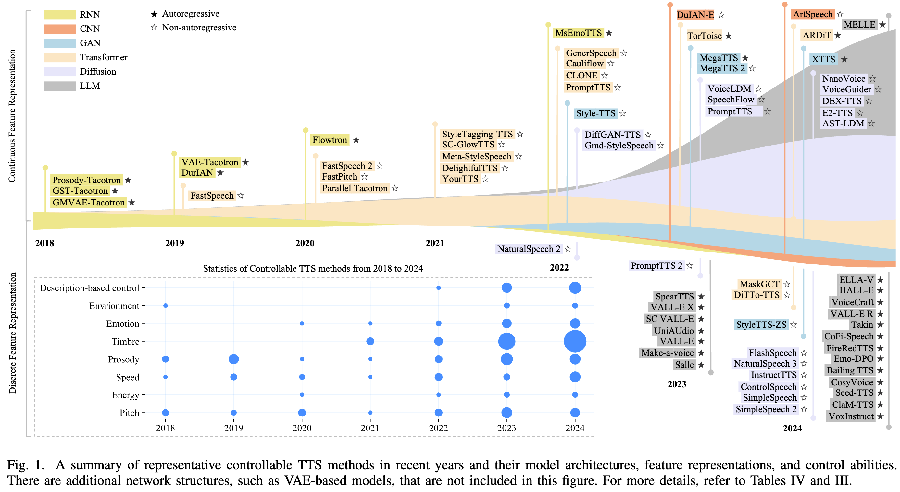

# Towards Controllable Speech Synthesis in the Era of Large Language Models: A Survey

基本信息

- 标题: "Towards Controllable Speech Synthesis in the Era of Large Language Models: A Survey"
- 作者:
  - 01 Tianxin Xie,
  - 02 Yan Rong,
  - 03 Pengfei Zhang,
  - 04 Li Liu
- 链接:
  - [ArXiv](https://arxiv.org/abs/2412.06602)
  - [Publication]()
  - [Github](https://github.com/imxtx/awesome-controllabe-speech-synthesis)
  - [Demo]()
- 文件:
  - [ArXiv](../PDF/2024.12.09__2412.06602v1__Survey__Towards_Controllable_Speech_Synthesis_in_the_Era_of_LLMs.pdf)
  - [Publication] #TODO

## Abstract: 摘要

<table><tr><td width="50%">

Text-to-speech (TTS), also known as speech synthesis, is a prominent research area that aims to generate natural-sounding human speech from text.
Recently, with the increasing industrial demand, TTS technologies have evolved beyond synthesizing human-like speech to enabling controllable speech generation.
This includes fine-grained control over various attributes of synthesized speech such as emotion, prosody, timbre, and duration.
Besides, advancements in deep learning, such as diffusion and large language models, have significantly enhanced controllable TTS over the past several years.
In this paper, we conduct a comprehensive survey of controllable TTS, covering approaches ranging from basic control techniques to methods utilizing natural language prompts, aiming to provide a clear understanding of the current state of research.
We examine the general controllable TTS pipeline, challenges, model architectures, and control strategies, offering a comprehensive and clear taxonomy of existing methods.
Additionally, we provide a detailed summary of datasets and evaluation metrics and shed some light on the applications and future directions of controllable TTS.
To the best of our knowledge, this survey paper provides the first comprehensive review of emerging controllable TTS methods, which can serve as a beneficial resource for both academic researchers and industry practitioners.

</td><td>

文本转语音 (Text-to-Speech, TTS), 也称为语音合成 (Speech Synthesis) 是旨在从文本生成自然听感的人类语音的重要研究领域.

近年来随着工业需求的增加, TTS 技术已经从合成类似人类的语音演进为实现可控语音生成.
这包括对合成的语音的各种属性进行细粒度的控制, 例如情感, 韵律, 音色以及时长.

除此之外, 深度学习的最新进展例如扩散和大语言模型, 已经在过去几年中显著地增强了可控 TTS.

在本文中, 我们对可控 TTS 进行了全面地调查, 涵盖从基础控制技术到利用自然语言模型的方法, 旨在为研究的当前状态提供清晰的理解.

我们研究了一般可控 TTS 的流程, 挑战, 模型架构和控制策略, 提供现有方法的全面且清晰的分类.

据我们所知, 本文是新兴可控 TTS 方法的首个全面综述, 这对于学术研究者和工业实践者都可以提供有益的参考.

</td></tr></table>

## 1·Introduction: 引言

<table><tr><td width="50%">

Speech synthesis, also broadly known as text-to-speech (TTS), is a long-time developed technique that aims to synthesize human-like voices from text ([^1] [^2]), and it has extensive applications in our daily lives, such as health care ([^3] [^4]), personal assistants [^5], entertainment ([^6] [^7]), and robotics ([^8] [^9]).
Recently, TTS has gained significant attention with the rise of large language model (LLM)-powered chatbots, such as ChatGPT [^10] and [LLaMA [11]](../../Models/TextLM/2023.02.27_LLaMA.md), due to its naturalness and convenience for human-computer interaction.
Meanwhile, the ability to achieve fine-grained control over synthesized speech attributes, such as emotion, prosody, timbre, and duration, has become a hot research topic in both academia and industry, driven by its vast potential for diverse applications.

[^1]: Website - Speech Synthesis - Wikipedia [1] https://en.wikipedia.org/wiki/Speech_synthesis
[^2]: Book - An Introduction to Text-to-Speech Synthesis (1997)
[^3]: Speech Technology for Healthcare: Opportunities, Challenges, and State of The Art (2020)
[^4]: Speech Synthesis from Neural Decoding of Spoken Sentences (2019)
[^5]: Alexa vs. Siri vs. Cortana vs. Google Assistant: A Comparison of Speech-Based Natural User Interfaces (2018)
[^6]: Speech-Driven Cartoon Animation with Emotions (2001)
[^7]: Comic-Guided Speech Synthesis (2019)
[^8]: Spoken Language Interaction with Robots: Recommendations for Future Research (2022)
[^9]: Towards Expressive Speech Synthesis in English on A Robotic Platform (2006)
[^10]: Website - Introducing ChatGPT - OpenAI https://openai.com/index/chatgpt/

Deep learning [^12] has made great progress in the past decade due to exponentially growing computational resources like GPUs [^13], leading to the explosion of numerous great works on TTS ([NaturalSpeech [14]](../../Models/E2E/2022.05.09_NaturalSpeech.md); [FastSpeech [15]](../../Models/Acoustic/2019.05.22_FastSpeech.md); [Deep Voice [16]](../../Models/System/2017.02.25_DeepVoice.md); [CosyVoice [17]](../../Models/SpeechLM/ST2S/2024.07.07_CosyVoice.md)).
These methods can synthesize human speech with better quality ([NaturalSpeech [14]](../../Models/E2E/2022.05.09_NaturalSpeech.md)) and can achieve fine-grained control of the generated voice ([Zhang et al. [18]](../../Models/Acoustic/2018.12.11_Learning_Latent_Representations_for_Style_Control_and_Transfer_in_End-to-End_Speech_Synthesis.md); [GST [19]](../../Models/Style/2018.03.23_GST.md); [I2I [20]](../../Models/Style/2019.11.05_I2I.md); [Li et al. [21]](../../Models/Style/2020.11.17_Controllable_Emotion_Transfer_for_End-to-End_Speech_Synthesis.md); [iEmoTTS [22]](../../Models/Style/2022.06.29_iEmoTTS.md)).
Besides, some recent works synthesize speech given multi-modal input, such as face images ([FR-PSS [23]](../../Models/_Basis/2022.04.01_FR-PSS.md); [Face2Speech [24]](../../Models/_Basis/2020.10.25_Face2Speech.md)), cartoons [^7], and videos ([DiffV2S [25]](../../Models/CV/2023.08.15_DiffV2S.md)).
Moreover, with the fast development of open-source LLMs ([LLaMA [11]](../../Models/TextLM/2023.02.27_LLaMA.md); [Mistral [26]](../../Models/TextLM/2023.10.10_Mistral-7B.md); [Qwen [27]](../../Models/TextLM/2023.09.28_Qwen.md); [DeepSeek [28]](../../Models/TextLM/DeepSeek.md); [ChatGLM [29]](../../Models/TextLM/ChatGLM.md)), some researchers propose to synthesize fine-grained controllable speech with natural language description ([LLM+VALL-E [30]](../../Models/SpeechLM/2023.12.30_LLM&VALL-E.md); [Emo-DPO [31]](../../Modules/RLHF/2024.09.16_Emo-DPO.md); [T5-TTS [32]](../../Models/SpeechLM/2024.06.25_T5-TTS.md)), coining a new way to generate custom speech voices.
Meanwhile, powering LLMs with speech synthesis has also been a hot topic in the last few years ([LLaMA-Omni [33]](../../Models/SpokenDialogue/2024.09.10_LLaMA-Omni.md); [SpeechGPT [34]](../../Models/SpokenDialogue/2023.05.18_SpeechGPT.md); [IntrinsicVoice [35]](../../Models/SpokenDialogue/2024.10.09_IntrinsicVoice.md)).
In recent years, a wide range of TTS methods has emerged, making it essential for researchers to gain a comprehensive understanding of current research trends, particularly in controllable TTS, to identify promising future directions in this rapidly evolving field.
Consequently, there is a pressing need for an up-to-date survey of TTS techniques.
While several existing surveys address parametric-based approaches ([Survey by Klatt et al. (1987) [36]](../S19870501.md); [Survey by Dutoit et al. (1997) [37]](../S19970000.md); [Survey by Breen et al. (1992) [38]](../S19920000.md); [Survey by Olive (1985) [39]](../S19851105.md); [Survey by King et al. (2014) [40]](../S20140630.md); [Survey by Zen et al. (2009) [41]](../S20090114.md)) and deep learning-based TTS ([Survey by Tan et al. (2021) [42]](../2021.06.29_A_Survey_on_Neural_Speech_Synthesis_63P/Main.md); [Survey by Ning et al. (2019) [43]](../S20190801.md); [Survey by Kaur et al. (2023) [44]](../S20221113.md); [Survey by Mattheyses et al. (2014) [45]](../S20140221.md); [Survey by Triantafyllopoulos et al. (2023) [46]](../S20221006.md); [Survey by Mu et al. (2021) [47]](../2021.04.20_Review_of_End-to-End_Speech_Synthesis_Technology_Based_on_Deep_Learning_40P.md); [Survey by Mehrish et al. (2023) [48]](../2023.04.30_A_Review_of_DL_Techniques_for_Speech_Processing_55P/Main.md)), they largely overlook the controllability of TTS.
Additionally, these surveys do not cover the advancements in recent years, such as natural language description-based TTS methods.

[^12]: Deep Learning (2015)
[^13]: GPU Computing (2008)

This paper provides a comprehensive and in-depth survey of existing and emerging TTS technologies, with a particular focus on controllable TTS methods.
Fig.01 demonstrates the development of controllable TTS methods in recent years, showing their backbones, feature representations, and control abilities.
The remainder of this section begins with a brief comparison between this survey and previous ones, followed by an overview of the history of controllable TTS technologies, ranging from early milestones to state-of-the-art advancements.
Finally, we introduce the taxonomy and organization of this paper.

</td><td>

语音合成 (Speech Synthesis), 也称为文本转语音 (Text-to-Speech, TTS), 是一项长期发展的技术, 旨在从文本合成类似人类的声音 ([^1] [^2]), 并且在日常生活中有广泛的应用, 如医疗保健 ([^3] [^4]), 个性化助手 [^5], 娱乐 ([^6] [^7]), 以及机器人 ([^8] [^9]).
近期, 随着大语言模型驱动的聊天机器人 (如 ChatGPT [^10] 和 [LLaMA [11]](../../Models/TextLM/2023.02.27_LLaMA.md)) 的兴起, TTS 获得了广泛关注, 因为它在人机交互中的自然性和便利性.
同时, 对合成语音的属性进行细粒度的控制, 如情感, 韵律, 音色, 以及时长, 已经成为学术界和工业界热门研究话题, 其潜在的多样化应用吸引了广泛的注意力.

深度学习 [^12] 在过去十年内由于指数增长的计算资源 (如 GPU [^13]) 取得了巨大的进步, 也促使了 TTS 领域的众多优秀工作的出现 ([NaturalSpeech [14]](../../Models/E2E/2022.05.09_NaturalSpeech.md); [FastSpeech [15]](../../Models/Acoustic/2019.05.22_FastSpeech.md); [Deep Voice [16]](../../Models/System/2017.02.25_DeepVoice.md); [CosyVoice [17]](../../Models/SpeechLM/ST2S/2024.07.07_CosyVoice.md)).

这些方法可以合成更高质量的人类语音 ([NaturalSpeech [14]](../../Models/E2E/2022.05.09_NaturalSpeech.md)) 并且可以实现对生成声音的细粒度控制 ([Zhang et al. [18]](../../Models/Acoustic/2018.12.11_Learning_Latent_Representations_for_Style_Control_and_Transfer_in_End-to-End_Speech_Synthesis.md); [GST [19]](../../Models/Style/2018.03.23_GST.md); [I2I [20]](../../Models/Style/2019.11.05_I2I.md); [Li et al. [21]](../../Models/Style/2020.11.17_Controllable_Emotion_Transfer_for_End-to-End_Speech_Synthesis.md); [iEmoTTS [22]](../../Models/Style/2022.06.29_iEmoTTS.md)).

除此之外, 一些近期工作给定多模态输入来合成语音, 例如面部图像 ([FR-PSS [23]](../../Models/_Basis/2022.04.01_FR-PSS.md); [Face2Speech [24]](../../Models/_Basis/2020.10.25_Face2Speech.md)), 卡通[^7], 以及视频 ([DiffV2S [25]](../../Models/CV/2023.08.15_DiffV2S.md)).

此外, 随着开源大语言模型的快速发展 ([LLaMA [11]](../../Models/TextLM/2023.02.27_LLaMA.md); [Mistral [26]](../../Models/TextLM/2023.10.10_Mistral-7B.md); [Qwen [27]](../../Models/TextLM/2023.09.28_Qwen.md); [DeepSeek [28]](../../Models/TextLM/DeepSeek.md); [ChatGLM [29]](../../Models/TextLM/ChatGLM.md)), 一些研究人员提出使用自然语言描述来合成细粒度可控语音, 创造了一种生成自定义语音声音的新方式 ([LLM+VALL-E [30]](../../Models/SpeechLM/2023.12.30_LLM&VALL-E.md); [Emo-DPO [31]](../../Modules/RLHF/2024.09.16_Emo-DPO.md); [T5-TTS [32]](../../Models/SpeechLM/2024.06.25_T5-TTS.md)).

同时, 赋予大语言模型语音合成能力也已经成为过去几年的热门话题 ([LLaMA-Omni [33]](../../Models/SpokenDialogue/2024.09.10_LLaMA-Omni.md); [SpeechGPT [34]](../../Models/SpokenDialogue/2023.05.18_SpeechGPT.md); [IntrinsicVoice [35]](../../Models/SpokenDialogue/2024.10.09_IntrinsicVoice.md)).

近年来, 出现了很多 TTS 方法, 这使得研究人员必须全面理解当前研究趋势, 特别是在可控 TTS 方面, 以确定这一快速发展领域的有前景的未来方向.

因此, 迫切需要一份最新的 TTS 技术综述.

尽管现有的综述关注了
- 基于参数的方法
  - [Survey by Klatt et al. (1987) [36]](../S19870501.md);
  - [Survey by Dutoit et al. (1997) [37]](../S19970000.md);
  - [Survey by Breen et al. (1992) [38]](../S19920000.md);
  - [Survey by Olive (1985) [39]](../S19851105.md);
  - [Survey by King et al. (2014) [40]](../S20140630.md);
  - [Survey by Zen et al. (2009) [41]](../S20090114.md),
- 基于深度学习的 TTS
  - [Survey by Tan et al. (2021) [42]](../2021.06.29_A_Survey_on_Neural_Speech_Synthesis_63P/Main.md);
  - [Survey by Ning et al. (2019) [43]](../S20190801.md);
  - [Survey by Kaur et al. (2023) [44]](../S20221113.md);
  - [Survey by Mattheyses et al. (2014) [45]](../S20140221.md);
  - [Survey by Triantafyllopoulos et al. (2023) [46]](../S20221006.md);
  - [Survey by Mu et al. (2021) [47]](../2021.04.20_Review_of_End-to-End_Speech_Synthesis_Technology_Based_on_Deep_Learning_40P.md);
  - [Survey by Mehrish et al. (2023) [48]](../2023.04.30_A_Review_of_DL_Techniques_for_Speech_Processing_55P/Main.md).

但它们大多忽略了 TTS 的可控性.
此外, 这些综述没有涵盖最近几年的进展, 例如基于自然语言描述的 TTS 方法.

本文提供了对现有和新兴 TTS 技术的全面且深入的调查, 特别关注可控 TTS 方法.
图 01 展示了近年来可控 TTS 方法的发展, 展示了它们的骨干, 特征表示和控制能力.

本节的剩余部分
- 首先简要比较了本文和之前综述,
- 随后介绍可控 TTS 技术的历史, 从早期里程碑到最先进的进展.
- 最后, 我们介绍了本文的分类体系和组织结构.

</td></tr>
<tr><td colspan="2">

</td></tr></table>

### A·Comparison with Existing Surveys: 与现有综述的比较

<table><tr><td width="50%">

Several survey papers have reviewed TTS technologies, spanning early approaches from previous decades ([Survey by Klatt et al. (1987) [36]](../S19870501.md); [Survey by Dutoit et al. (1997) [37]](../S19970000.md); [Survey by King et al. (2014) [40]](../S20140630.md); [Survey by Tabet et al. (2011) [49]](../S20110509.md)) to more recent advancements ([Survey by Ning et al. (2019) [43]](../S20190801.md); [Survey by Tan et al. (2021) [42]](../2021.06.29_A_Survey_on_Neural_Speech_Synthesis_63P/Main.md); [Survey by Zhang et al. (2023) [50]](../2023.03.23_A_Survey_on_Audio_Diffusion_Models__TTS_Synthesis_&_Enhancement_in_Generative_AI/Main.md)).
However, to the best of our knowledge, this paper is the first to focus specifically on controllable TTS.
The key differences between this survey and prior work are summarized as follows:

</td><td>

多篇综述论文已经回顾了 TTS 技术的发展历程, 涵盖了从几十年前的早期方法到近年来的最新进展.
- 早期方法:
  - [Survey by Klatt et al. (1987) [36]](../S19870501.md);
  - [Survey by Dutoit et al. (1997) [37]](../S19970000.md);
  - [Survey by King et al. (2014) [40]](../S20140630.md);
  - [Survey by Tabet et al. (2011) [49]](../S20110509.md)
- 近期进展:
  - [Survey by Ning et al. (2019) [43]](../S20190801.md);
  - [Survey by Tan et al. (2021) [42]](../2021.06.29_A_Survey_on_Neural_Speech_Synthesis_63P/Main.md);
  - [Survey by Zhang et al. (2023) [50]](../2023.03.23_A_Survey_on_Audio_Diffusion_Models__TTS_Synthesis_&_Enhancement_in_Generative_AI/Main.md)

然而据我们所知, 本文是首篇专门聚焦于可控 TTS 的论文.

本综述与之前工作的主要区别总结如下:

</td></tr></table>

#### Different Scope: 不同范围

<table><tr><td width="50%">

[Survey by Klatt et al. (1987) [36]](../S19870501.md) provided the first comprehensive survey on formant, concatenative, and articulatory TTS methods, with a strong emphasis on text analysis.
In the early 2010s, [Survey by Tabet et al. (2011) [49]](../S20110509.md) and [Survey by King et al. (2014) [40]](../S20140630.md) explored rule-based, concatenative, and HMM-based techniques.
Later, the advent of deep learning catalyzed the emergence of numerous neural-based TTS methods.
Therefore, [Survey by Ning et al. (2019) [43]](../S20190801.md) and [Survey by Tan et al. (2021) [42]](../2021.06.29_A_Survey_on_Neural_Speech_Synthesis_63P/Main.md) have conducted extensive surveys on neural-based acoustic models and vocoders, while [Survey by Zhang et al. (2023) [50]](../2023.03.23_A_Survey_on_Audio_Diffusion_Models__TTS_Synthesis_&_Enhancement_in_Generative_AI/Main.md) presented the first review of diffusion model-based TTS techniques.
However, these studies offer limited discussion on the controllability of TTS systems.
To address this gap, we present the first comprehensive survey of TTS methods through the lens of controllability, providing an in-depth analysis of model architectures and strategies for controlling synthesized speech.

</td><td>

- [Klatt 等人 (1987) [36]](../S19870501.md) 的综述首次全面探讨了共振峰, 拼接式, 发音式 TTS 方法, 并特别强调了文本分析的重要性.
- 到了 2010 年代初期, [Tabet 等人 (2011) [49]](../S20110509.md) 和 [King 等人 (2014) [40]](../S20140630.md) 的综述进一步研究了基于规则, 拼接式以及隐马尔可夫模型 (HMM) 的 TTS 技术.
- 随后, 深度学习的兴起催生了众多基于神经网络的 TTS 方法.
- 因此 [Ning 等人 (2019) [43]](../S20190801.md) 和 [Tan 等人 (2021) [42]](../2021.06.29_A_Survey_on_Neural_Speech_Synthesis_63P/Main.md) 的综述对基于神经网络的声学模型和声码器进行了广泛探讨, 而 [Zhang 等人 (2023) [50]](../2023.03.23_A_Survey_on_Audio_Diffusion_Models__TTS_Synthesis_&_Enhancement_in_Generative_AI/Main.md) 的综述则首次对基于扩散模型的 TTS 技术进行了回顾.

然而, 这些研究对 TTS 系统可控性的讨论较为有限.

为了填补这一空白, 本文首次从可控性的角度对 TTS 方法进行了全面综述, 深入分析了模型架构以及控制合成语音的策略.

</td></tr></table>

#### Close to Current Demand: 接近当前需求

<table><tr><td width="50%">

With the rapid development of hardware (i.e., GPUs) and artificial intelligence techniques (i.e., transformers, LLMs, diffusion models) in the last few years, the demand for controllable TTS is becoming increasingly urgent due to its broad applications in industries such as filmmaking, gaming, robots, and personal assistants.
Despite this growing need, existing surveys pay little attention to control methods in TTS technologies.
To bridge this gap, we propose a systematic analysis of current controllable TTS methods and the associated challenges, offering a comprehensive understanding of the research state in this field.

</td><td>

近年来随着硬件 (如 GPU) 和人工智能技术 (如 Transformer, 大语言模型, 扩散模型) 的快速发展, 可控 TTS 的需求日益迫切, 因为其在影视制作, 游戏, 机器人以及个人助手等领域的应用越来越广泛.
尽管这种需求不断增长, 但现有的综述对 TTS 技术中的控制方法关注甚少.
为了填补这一空白, 本文提出对当前可控 TTS 方法及其相关挑战进行系统性分析, 旨在为该领域的研究现状提供全面深入的理解.

</td></tr></table>

#### New Insights & Directions: 新见解与方向

<table><tr><td width="50%">

This survey offers new insights through a comprehensive analysis of model architectures and control methods in controllable TTS systems.
Additionally, it provides an in-depth discussion of the challenges associated with various controllable TTS tasks.
Furthermore, we address the question: "Where are we on the path to fully controllable TTS technologies?", by examining the relationship and gap between current TTS methods and industrial requirements.
Based on these analyses, we identify promising directions for future research on TTS technologies.

Table.01 summarizes representative surveys and this paper in terms of main focus and publication year.

</td><td>

本综述
- 通过对可控 TTS 系统中模型架构和控制方法的全面分析, 提供了新的见解.
- 此外, 本文深入探讨了与各种可控 TTS 任务相关的挑战.
- 更进一步, 我们通过审视当前 TTS 方法与工业需求之间的关系与差距, 回答了这样一个问题：**"我们在实现完全可控TTS技术的道路上处于什么位置?"**
- 基于这些分析，我们为TTS技术的未来研究指明了有前景的方向.

</td></tr>
<tr><td colspan="2">

表 01 总结了代表性综述及本文的主要关注点和发表年份。

| 综述 | 主要关注点 | 发表年份 |
|---|---|:-:|
|[Klatt et al. (1987) [36]](../S19870501.md)| 基于规则和拼接的 TTS | 1987 |
|[Tabet et al. (2011) [49]](../S20110509.md)| 基于规则, 拼接, 参数的 TTS | 2011 |
|[King et al. (2014) [40]](../S20140630.md)|参数 TTS 与性能度量 | 2014 |
|[Tan et al. (2021) [42]](../2021.06.29_A_Survey_on_Neural_Speech_Synthesis_63P/Main.md)|神经网络, 高效, 表达性 TTS | 2021 |
|[Zhang et al. (2023) [50]](../2023.03.23_A_Survey_on_Audio_Diffusion_Models__TTS_Synthesis_&_Enhancement_in_Generative_AI/Main.md)|扩散模型 TTS, 语音增强|2023|
|本文|可控 TTS, 评估 | 2024 |

</td></tr></table>

### B·The History of Controllable TTS: 可控 TTS 的历史

<table><tr><td width="50%">

Controllable TTS aims to control various aspects of synthesized speech, such as pitch, energy, speed/duration, prosody, timbre, emotion, gender, or high-level styles.
This subsection briefly reviews the history of controllable TTS ranging from early approaches to the state-of-arts in recent years.

</td><td>

可控性 TTS 的目标是控制合成语音的各个方面, 如音高, 能量, 速度/时长, 韵律, 音色, 情感, 性别, 或高级风格.
本小节简要回顾了可控 TTS 的历史, 从早期方法到近年来工业界的最新技术.

</td></tr></table>

#### Early Approaches: 早期方法

<table><tr><td width="50%">

Before the prevalence of deep neural networks (DNNs), controllable TTS technologies were built primarily on rule-based, concatenative, and statistical methods.
These approaches enable some degree of customization and control, though they were constrained by the limitations of the underlying models and available computational resources.
1) Rule-based TTS systems ([Rbiner et al. [51]](../../Models/_Early/1967.11.01_Digital‐Formant_Synthesizer_for_Speech‐Synthesis_Studies.md); [Allen et al. [52]](../../Models/_Early/1987.04.01_From_Text_to_Speech__The_MITalk_System.md); [Purcell et al. [53]](../../Models/_Early/2006.02.10_Adaptive_Control_of_Vowel_Formant_Frequency__Evidence_from_Real-Time_Formant_Manipulation.md); [Klatt et al. [54]](../../Models/_Early/1980.03.01_Software_for_a_Cascade_or_Parallel_Formant_Synthesizer.md)), such as formant synthesis, were among the earliest methods for speech generation.
These systems use manually crafted rules to simulate the speech generation process by controlling acoustic parameters such as pitch, duration, and formant frequencies, allowing explicit manipulation of prosody and phonetic details through rule adjustments.
1) Concatenative TTS [55] [56] [57] [58] ~\cite{wouters2001control,bulut2002expressive,bulyko2001joint,Stylianou200121}, which dominated the field in the late 1990s and early 2000s, synthesize speech by concatenating pre-recorded speech segments, such as phonemes or diphones, stored in a large database~\cite{Hunt1996373} [59].
These methods can modify the prosody by manipulating the pitch, duration, and amplitude of speech segments during concatenation.
They also allow limited voice customization by selecting speech units from different speakers.
1) Parametric methods, particularly HMM-based TTS [60] [61] [62] [63]~\cite{nose2007style,ling2009integrating,nose2009hmm,yoshimura1998duration,[Yoshimura et al.(1999) [64]](../../Models/_Early/Simultaneous_Modeling_of_Spectrum_Pitch_&_Duration_in_HMM-Based_Speech_Synthesis.md); [Tokuda et al. (2000) [65]](../../Models/_Early/Speech_Parameter_Generation_Algorithms_for_HMM-Based_Speech_Synthesis.md)}, gained prominence in the late 2000s.
These systems model the relationships between linguistic features and acoustic parameters, providing more flexibility in controlling prosody, pitch, speaking rate, and timbre by adjusting statistical parameters.
Some HMM-based systems also supported speaker adaptation [66] [67]~\cite{yamagishi2009robust,yamagishi2009analysis} and voice conversion [68] [69]~\cite{masuko1997voice,wu2006voice}, enabling voice cloning to some extent.
Besides, emotion can also be limitedly controlled by some of these methods~\cite{yamagishi2003modeling,[Yamagishi et al. (2005) [71]](../../Models/_Early/Acoustic_Modeling_of_Speaking_Styles_and_Emotional_Expressions_in_HMM-Based_Speech_Synthesis.md),nose2007style, [Lorenzo et al. (2015) [72]](../../Models/_Early/Emotion_Transplantation_through_Adaptation_in_HMM-Based_Speech_Synthesis.md)} [70].
In addition, they required less storage compared to concatenative TTS and allowed smoother transitions between speech units.

</td><td>

在深度神经网络盛行之前, 可控 TTS 技术主要建立在基于规则, 拼接, 统计方法之上.
这些方法实现了一定程度上的定制和控制, 但它们受到底层模型和可用计算资源的局限性约束.
1. 基于规则的 TTS 系统 (例如共振峰合成, 几乎是最早的语音生成方法)
  - 这些系统使用手工制作的规则来模拟语音生成过程, 通过控制声学参数 (如音高, 时长, 共振峰频率), 允许通过规则调整来实现对韵律和音素细节的显式操作.
2. 拼接式 TTS (1990 年代末到 2000 年代初占据主导地位, 通过预录制的语音片段进行拼接, 如音素或双音节, 存储在大型数据库中)
   - 这些方法可以在拼接时通过操作语音片段的音高, 时长, 幅度来修改韵律.
   - 它们还允许通过选择不同发音人的语音单元来实现有限的语音自定义.
3. 参数方法, 特别是基于 HMM 的 TTS (2000 年代末突出)
   - 这些系统建模语言特征和声学参数之间的关系, 通过调整统计参数提供了在控制韵律, 音高, 说话速率, 音色方面更大的灵活性.
   - 一些基于 HMM 的系统也支持说话人适应和声音转换, 在一定程度上实现了语音克隆.
   - 除此之外, 其中一些方法还可以有限地控制情感.
   - 另外, 它们比起拼接式 TTS 所需存储更少, 且能在语音单元之间实现更平滑的过渡.

</td></tr></table>

#### Neural-Based Synthesis: 基于神经网络合成

<table><tr><td width="50%">

Neural-based TTS technologies emerged with the advent of deep learning, significantly advancing the field by enabling more flexible, natural, and expressive speech synthesis.
Unlike traditional methods, neural-based TTS leverages DNNs to model complex relationships between input text and speech, facilitating nuanced control over various speech characteristics.
Early neural TTS systems, such as [WaveNet [73]](../../Models/Vocoder/2016.09.12_WaveNet.md) and [Tacotron [74]](../../Models/Acoustic/2017.03.29_Tacotron.md) laid the groundwork for controllability.
1) Controlling prosody features like rhythm and intonation is vital for generating expressive and contextually appropriate speech.
Neural-based TTS models achieve prosody control through explicit conditioning or learned latent representations~\cite{shen2018tacotron2,[FastSpeech [15]](../../Models/Acoustic/2019.05.22_FastSpeech.md),ren2020fastspeech2,lancucki2021fastpitch,[MaskGCT [78]](../../Models/SpeechLM/ST2S/2024.09.01_MaskGCT.md)} [75] [76] [77].
1) Speaker control has also gained significant improvement in neural-based TTS through speaker embeddings or adaptation techniques [79] [80] [81] [82]~\cite{fan2015multi,huang2022meta,chen2020multispeech,casanova2022yourtts}.
2) Besides, emotionally controllable TTS [83]~\cite{lei2022msemotts,[Emo-DPO [31]](../../Modules/RLHF/2024.09.16_Emo-DPO.md); [I2I [20]](../../Models/Style/2019.11.05_I2I.md); [iEmoTTS [22]](../../Models/Style/2022.06.29_iEmoTTS.md); [T5-TTS [32]](../../Models/SpeechLM/2024.06.25_T5-TTS.md)} has become a hot topic due to the strong modeling capability of DNNs, enabling the synthesis of speech with specific emotional tones such as happiness, sadness, anger, or neutrality.
These systems go beyond producing intelligible and natural-sounding speech, focusing on generating expressive output that aligns with the intended emotional context.
1) Neural-based TTS can also manipulate timbre (vocal quality)~\cite{[MaskGCT [78]](../../Models/SpeechLM/ST2S/2024.09.01_MaskGCT.md); elias2021paralleltacotron,wang2023neural,[NaturalSpeech [14]](../../Models/E2E/2022.05.09_NaturalSpeech.md),shen2023naturalspeech2,[NaturalSpeech3 [87]](../../Models/Diffusion/2024.03.05_NaturalSpeech3.md)} [84] [85] [86] and style (speech mannerisms)~\cite{li2022styletts,li2024styletts2,huang2022generspeech} [88] [89] [90], allowing for creative and personalized applications.
These techniques lead to one of the most popular research topics, i.e., zero-shot TTS (particularly voice cloning)~\cite{casanova2022yourtts,[MaskGCT [78]](../../Models/SpeechLM/ST2S/2024.09.01_MaskGCT.md),jiang2023megavoic,cooper2020zero} [91] [92].
1) Fine-grained content and linguistic control also become more powerful~\cite{peng2024voicecraft,tan2021editspeech,tae2021editts,seshadri2021emphasis} [93] [94] [95] [96].
These methods can emphasize or de-emphasize specific words or adjust the pronunciation of phonemes through speech editing or generation techniques.

Neural-based TTS technologies represent a significant leap in the flexibility and quality of speech synthesis.
From prosody and emotion to speaker identity and style, these systems empower diverse applications in fields such as entertainment, accessibility, and human-computer interaction.

</td><td>

</td></tr></table>

#### LLM-Based Synthesis: 基于大语言模型合成

<table><tr><td width="50%">

Here we pay special attention to LLM-based synthesis methods due to their superior context modeling capabilities compared to other neural-based TTS methods.
LLMs, such as GPT ([GPT-3 [97]](../../Models/TextLM/2020.05.28_GPT-3.md); )~\cite{achiam2023gpt4}, T5~\cite{raffel2020t5} [98] [99], and PaLM [100]~\cite{chowdhery2023palm}, have revolutionized various natural language processing (NLP) tasks with their ability to generate coherent, context-aware text.
Recently, their utility has expanded into controllable TTS technologies ~\cite{[PromptTTS [101]](../../Models/Acoustic/2022.11.22_PromptTTS.md),leng2023prompttts2,[VoxInstruct [103]](../../Models/SpeechLM/2024.08.28_VoxInstruct.md);shimizu2024promptttspp,[CosyVoice [17]](../../Models/SpeechLM/ST2S/2024.07.07_CosyVoice.md)} [102] [104].
For example, users can synthesize the target speech by describing its characteristics, such as: "A young girl says `I really like it, thank you!' with a happy voice", making speech generation significantly more intuitive and user-friendly.
Specifically, an LLM can detect emotional intent in sentences (e.g., "I’m thrilled" → happiness, "This is unfortunate" → sadness).
The detected emotion is encoded as an auxiliary input to the TTS model, enabling modulation of acoustic features like prosody, pitch, and energy to align with the expressed sentiment.
By leveraging LLMs' capabilities in understanding and generating rich contextual information, these systems can achieve enhanced and fine-grained control over various speech attributes such as prosody, emotion, style, and speaker characteristics ([InstructTTS [105]](../../Models/Acoustic/2023.01.31_InstructTTS.md),[Emo-DPO [31]](../../Modules/RLHF/2024.09.16_Emo-DPO.md); [ControlSpeech [106]](../../Models/SpeechLM/2024.06.03_ControlSpeech.md)).
Integrating LLMs into TTS systems represents a significant step forward, enabling more dynamic and expressive speech synthesis.

</td><td>

</td></tr></table>

### C·Organization of This Survey: 本文结构

<table><tr><td width="50%">

This paper first presents a comprehensive and systematic review of controllable TTS technologies, with a particular focus on model architectures, control methodologies, and feature representations.
To establish a foundational understanding, this survey begins with an introduction to the TTS pipeline in [Section 2](Sec.02_Pipeline.md).
While our focus remains on controllable TTS, [Section 3](Sec.03_UnControllableTTS.md) examines seminal works in uncontrollable TTS that have significantly influenced the field's development.
[Section 4](Sec.04_ControllableTTS.md) provides a thorough investigation into controllable TTS methods, analyzing both their model architectures and control strategies.
[Section 5](Sec.05_Datasets&Evaluation.md) presents a comprehensive review of datasets and evaluation metrics.
[Section 6](Sec.06_Challenges.md) provides an in-depth analysis of the challenges encountered in achieving controllable TTS systems and discusses future directions.
[Section 7](#Sec.07) explores the broader impacts of controllable TTS technologies and identifies promising future research directions, followed by the conclusion in [Section 8](#Sec.08).

</td><td>

本文首次展示了一份全面且系统化的可控 TTS 技术综述, 着重分析模型架构, 控制策略, 和特征表示.
- [第二节](Sec.02_Pipeline.md) 介绍 TTS 流程, 以建立起基础的理解.
- [第三节](Sec.03_UnControllableTTS.md) 仔细研究了不可控 TTS, 其对整个研究领域的发展有极大影响.
- [第四节](Sec.04_ControllableTTS.md) 详细调查了可控 TTS 方法, 分析了其模型架构和控制策略.
- [第五节](Sec.05_Datasets&Evaluation.md) 展示了数据集和评价指标的全面综述.
- [第六节](Sec.06_Challenges.md) 深入分析了实现可控 TTS 系统的挑战, 并提出了未来研究方向.
- [第七节](#Sec.07) 探讨了可控 TTS 技术的广泛影响, 并提出了有前途的研究方向.
- [第八节](#Sec.08) 总结了本文.

</td></tr></table>

# 2·TTS Pipeline: 文本转语音流程

<table><tr><td width="50%">

In this section, we elaborate on the general pipeline that supports controllable TTS technologies, including acoustic models, speech vocoders, and feature representations.
Fig.02 depicts the general pipeline of controllable TTS, containing various model architectures and feature representations, but the control strategies will be discussed in [Section 4](Sec.04_ControllableTTS.md).
Readers can jump to [Section 3](Sec.03_UnControllableTTS.md) if familiar with TTS pipelines.

</td><td>

在本节中, 我们详细介绍支持可控 TTS 技术的一般流程, 包括声学模型, 语音声码器和特征表示.

图 02 展示了可控 TTS 的一般流程, 包含各种模型架构和特征表示, 但控制策略将在 [第 4 节](Sec.04_ControllableTTS.md) 中讨论.

如果读者熟悉 TTS 流程, 可以直接跳转到 [第 3 节](Sec.03_UnControllableTTS.md).

</td></tr>
<tr><td colspan="2">

</td></tr></table>

## A·Overview: 总览

<table><tr><td width="50%">

A TTS pipeline generally contains three key components, i.e., linguistic analyzer, acoustic model, speech vocoder, and with a conditional input, e.g., prompts, for controllable speech synthesis.
Besides, some end-to-end methods use a single model to encode the input and decode the speech waveforms without generating intermediate features like mel-spectrograms ([Spectrogram [110] [URL]](https://en.wikipedia.org/wiki/Spectrogram)).
- **Linguistic analyzer** aims to extract linguistic features, e.g., phoneme duration and position, syllable stress, and utterance level, from the input text, which is a necessary step in HMM-based methods ([Yoshimura et al.(1999) [64]](../../Models/_Early/Simultaneous_Modeling_of_Spectrum_Pitch_&_Duration_in_HMM-Based_Speech_Synthesis.md); [Tokuda et al. (2000) [65]](../../Models/_Early/Speech_Parameter_Generation_Algorithms_for_HMM-Based_Speech_Synthesis.md)) and a few neural-based methods ([Statistical Parametric Speech Synthesis Using DNNs [111]](../../Models/_Early/2013.05.26_Statistical_Parametric_Speech_Synthesis_Using_DNNs.md); [DBLSTM-RNN [112]](../../Models/_Early/DBLSTM-RNN.md)), but is time-consuming and error-prone.
- **Acoustic model** is a parametric or neural model that predicts the acoustic features from the input texts.
Modern neural-based acoustic models like [Tacotron [74]](../../Models/Acoustic/2017.03.29_Tacotron.md) and later works ([FastSpeech [15]](../../Models/Acoustic/2019.05.22_FastSpeech.md); [FastSpeech2 [76]](../../Models/Acoustic/2020.06.08_FastSpeech2.md); [Diff-TTS [113]](../../Models/Acoustic/2021.04.03_Diff-TTS.md)) directly take character ([CWE[114]](../../Models/SpeechRepresentation/CWE.md)) or word embeddings ([Survey by Almeida et al. (2019) [115]](../S20190125.md)) as the input, which is much more efficient than previous methods.
- **Speech vocoder** is the last component that converts the intermediate acoustic features into a waveform that can be played back.
This step bridges the gap between the acoustic features and the actual sounds produced, helping to generate high-quality, natural-sounding speech ([WaveNet [73]](../../Models/Vocoder/2016.09.12_WaveNet.md); [HiFi-GAN [116]](../../Models/Vocoder/2020.10.12_HiFi-GAN.md)).
[Survey by Tan et al. (2021) [42]](../S20210629.md) have presented a comprehensive and detailed review of acoustic models and vocoders.
Therefore, the following subsections will briefly introduce some representative acoustic models and speech vocoders, followed by a discussion of acoustic feature representations.

</td><td>

文本转语音流程通常包含三个关键组件, 即语言分析器, 声学模型, 语音声码器, 以及条件化输入 (如用于可控语音合成的提示).
除此之外, 一些端到端的模型使用单个模型来编码输入并解码出语音波形, 而无需生成中间特征 (如梅尔频谱图 [Spectrogram [110] [URL]](https://en.wikipedia.org/wiki/Spectrogram)).
- **语言分析器 (Linguistic Analyzer)** 的目的是从输入文本中提取语言学特征 (如音素时长和位置, 音节重音, 句子级别等), 这是基于 HMM 的方法 ([Yoshimura et al.(1999) [64]](../../Models/_Early/Simultaneous_Modeling_of_Spectrum_Pitch_&_Duration_in_HMM-Based_Speech_Synthesis.md); [Tokuda et al. (2000) [65]](../../Models/_Early/Speech_Parameter_Generation_Algorithms_for_HMM-Based_Speech_Synthesis.md)) 和一些神经网络方法 ([Statistical Parametric Speech Synthesis Using DNNs [111]](../../Models/_Early/2013.05.26_Statistical_Parametric_Speech_Synthesis_Using_DNNs.md); [DBLSTM-RNN [112]](../../Models/_Early/DBLSTM-RNN.md)) 的必要步骤, 但耗时且容易出错.
- **声学模型 (Acoustic Model)** 是参数化或神经模型, 从输入文本预测声学特征.
现代基于神经网络的声学模型如 [Tacotron [74]](../../Models/Acoustic/2017.03.29_Tacotron.md) 及后续工作 ([FastSpeech [15]](../../Models/Acoustic/2019.05.22_FastSpeech.md); [FastSpeech2 [76]](../../Models/Acoustic/2020.06.08_FastSpeech2.md); [Diff-TTS [113]](../../Models/Acoustic/2021.04.03_Diff-TTS.md)) 直接采用字符 ([CWE[114]](../../Models/SpeechRepresentation/CWE.md)) 或词嵌入 ([Survey by Almeida et al. (2019) [115]](../S20190125.md)) 作为输入, 这比以前的方法要更高效.
- **语音声码器 (Speech Vocoder)** 是将中间声学特征转换为可以播放的波形的最后一个组件.
这一步弥合声学特征和实际发出的声音之间的差距, 以生成高质量, 听感自然的语音 ([WaveNet [73]](../../Models/Vocoder/2016.09.12_WaveNet.md); [HiFi-GAN [116]](../../Models/Vocoder/2020.10.12_HiFi-GAN.md)).

[Survey by Tan et al. (2021) [42]](../S20210629.md) 展示了关于声学模型和声码器的全面且详细的综述.
因此, 下面的章节将简要介绍一些代表性的声学模型和语音声码器, 并对声学特征表示进行讨论.

</td></tr></table>

## B·Acoustic Models: 声学模型

<table><tr><td width="50%">

Acoustic modeling is a crucial step in TTS because it ensures the generated acoustic features capture the subtleties of human speech.
By accurately modeling acoustic features, modern TTS systems can help generate high-quality and expressive audio that sounds close to human speech.

</td><td>

声学建模是 TTS 中的关键一步, 因为它确保生成的声学特征能够捕获人类语音的微妙之处.
通过精确建模声学特征, 现代 TTS 系统能够生成高质量且富有表现力的音频, 听起来和人类语音接近.

</td></tr></table>

### Parametric Models: 参数模型

<table><tr><td width="50%">

Early acoustic models rely on parametric approaches, where predefined rules and mathematical functions are utilized to model speech generation.
These models often utilize HMMs to capture acoustic features from linguistic input and generate acoustic features by parameterizing the vocal tract and its physiological properties such as pitch and prosody ([Tokuda et al. (2000) [65] [117]](../../Models/_Early/Speech_Parameter_Generation_Algorithms_for_HMM-Based_Speech_Synthesis.md); [Yamagishi et al. (2005) [71]](../../Models/_Early/Acoustic_Modeling_of_Speaking_Styles_and_Emotional_Expressions_in_HMM-Based_Speech_Synthesis.md); [Lorenzo et al. (2015) [72]](../../Models/_Early/Emotion_Transplantation_through_Adaptation_in_HMM-Based_Speech_Synthesis.md); [Zen et al. (2007) [118]](../../Models/_Early/The_HMM-based_Speech_Synthesis_System_(HTS)_Version_2.0.md); [Nose et al. (2012) [119]](../../Models/_Early/An_Intuitive_Style_Control_Technique_in_HMM-Based_Expressive_Speech_Synthesis_Using_Subjective_Style_Intensity_and_Multiple-Regression_Global_Variance_Model.md); [Nishigaki et al. (2015) [120]](../../Models/_Early/Prosody-Controllable_HMM-Based_Speech_Synthesis_Using_Speech_Input.md)).
These methods have relatively low computational costs and can produce a range of voices by adjusting model parameters.
However, the speech quality of these methods is robotic and lacks natural intonation, and the expressiveness is also limited ([Lorenzo et al. (2015) [72]](../../Models/_Early/Emotion_Transplantation_through_Adaptation_in_HMM-Based_Speech_Synthesis.md); [Nishigaki et al. (2015) [120]](../../Models/_Early/Prosody-Controllable_HMM-Based_Speech_Synthesis_Using_Speech_Input.md)).

</td><td>

早期声学模型依赖参数化方法, 使用预定义规则和数学函数来建模语音生成.
这些模型通常使用隐马尔可夫模型来从语言输入中捕获声学特征, 并通过参数化声带及其生理特性 (如音高和语调) 来生成声学特征.
- [Tokuda et al. (2000) [65] [117]](../../Models/_Early/Speech_Parameter_Generation_Algorithms_for_HMM-Based_Speech_Synthesis.md);
- [Yamagishi et al. (2005) [71]](../../Models/_Early/Acoustic_Modeling_of_Speaking_Styles_and_Emotional_Expressions_in_HMM-Based_Speech_Synthesis.md);
- [Lorenzo et al. (2015) [72]](../../Models/_Early/Emotion_Transplantation_through_Adaptation_in_HMM-Based_Speech_Synthesis.md);
- [Zen et al. (2007) [118]](../../Models/_Early/The_HMM-based_Speech_Synthesis_System_(HTS)_Version_2.0.md);
- [Nose et al. (2012) [119]](../../Models/_Early/An_Intuitive_Style_Control_Technique_in_HMM-Based_Expressive_Speech_Synthesis_Using_Subjective_Style_Intensity_and_Multiple-Regression_Global_Variance_Model.md);
- [Nishigaki et al. (2015) [120]](../../Models/_Early/Prosody-Controllable_HMM-Based_Speech_Synthesis_Using_Speech_Input.md).

这些方法拥有相当低的计算成本, 别难过且可以通过调整模型参数来产生广泛的声音.
然而, 这些方法的语音质量是机械的, 缺乏自然的语调, 表达力也有限.

- [Lorenzo et al. (2015) [72]](../../Models/_Early/Emotion_Transplantation_through_Adaptation_in_HMM-Based_Speech_Synthesis.md);
- [Nishigaki et al. (2015) [120]](../../Models/_Early/Prosody-Controllable_HMM-Based_Speech_Synthesis_Using_Speech_Input.md).

</td></tr></table>

### RNN-Based Models: 基于 RNN 的模型

<table><tr><td width="50%">

Recurrent Neural Networks (RNNs) proved particularly effective in early neural-based TTS due to their ability to model sequential data and long-range dependencies, which helps in capturing the sequential nature of speech, such as the duration and natural flow of phonemes.
Typically, these models have an encoder-decoder architecture, where an encoder encodes input linguistic features, such as phonemes or text, into a fixed-dimensional representation, and the decoder sequentially decodes this representation into acoustic features (e.g., mel-spectrogram frames) that capture the frequency and amplitude of sound over time.
[Tacotron2 [75]](../../Models/Acoustic/2017.12.16_Tacotron2.md) is one of the pioneering TTS models that uses RNNs with an attention mechanism, which helps align the text sequence with the generated acoustic features.
It takes raw characters as input and produces mel-spectrogram frames, which are subsequently converted to waveforms.
Another example is [MelNet [121]](../../Models/Acoustic/2019.06.04_MelNet.md), which leverages autoregressive modeling to generate high-quality mel-spectrograms, demonstrating versatility in generating both speech and music, achieving high fidelity and coherence across temporal scales.

</td><td>

循环神经网络在早期基于神经网络的 TTS 中特别有效, 这是因为它们建模序列数据和长期依赖的能力, 有助于捕获语音的序列性质, 例如时长和音素的自然流动.
通常这些模型具有编码器-解码器架构, 编码器将输入语言特征 (如音素或文本) 编码为固定维度的表示, 解码器顺序地将这一表示解码为声学特征 (如梅尔频谱帧), 这些特征捕获声音在时间上的频率和幅度.

- [Tacotron2 [75]](../../Models/Acoustic/2017.12.16_Tacotron2.md) 是一项开创性的 TTS 模型, 它使用带有注意力机制的 RNNs, 这有助于对齐文本序列和生成的声学特征.
它将原始字符作为输入并生成梅尔频谱帧, 随后将其转换为波形.
- [MelNet [121]](../../Models/Acoustic/2019.06.04_MelNet.md) 利用自回归建模来生成高质量梅尔频谱, 展示了生成语音和音乐的多样性, 达到高保真度和时间尺度上的连贯性.

</td></tr></table>

### CNN-Based Models: 基于 CNN 的模型

<table><tr><td width="50%">

Unlike RNNs, which process sequential data frame by frame, CNNs process the entire sequence at once by applying filters across the input texts.
This parallel approach enables faster training and inference, making CNN-based TTS particularly appealing for real-time and low-latency applications.
Furthermore, by stacking multiple convolutional layers with varying kernel sizes or dilation rates, CNNs can capture both short-range and long-range dependencies, which are essential for natural-sounding speech synthesis.
[Deep Voice [16] [122]](../../Models/System/2017.02.25_DeepVoice.md) is one of the first prominent CNN-based TTS models by Baidu, designed to generate mel-spectrograms directly from phoneme or character input.
[ParaNet [123]](../../Models/Acoustic/2019.05.21_ParaNet.md) also utilizes a RNN model to achieve sequence-to-sequence mel-spectrogram generation.
It uses a non-autoregressive architecture, which enables significantly faster inference by predicting multiple time steps simultaneously.

</td><td>

和 RNN 逐帧处理序列数据不同, CNN 通过对输入文本应用滤波器来一次性处理整个序列.
这种并行方法的训练和推理速度更快, 使得基于 CNN 的 TTS 特别适合实时和低延迟应用.
此外, 通过堆叠多个具有不同卷积核大小或膨胀率的卷积层, CNN 可以捕获短期和长期依赖, 对于自然听感语音合成至关重要.
- [Deep Voice [16] [122]](../../Models/System/2017.02.25_DeepVoice.md) 是百度提出的首个卓越的基于 CNN 的 TTS 模型, 它直接从音素或字符输入生成梅尔频谱图.
- [ParaNet [123]](../../Models/Acoustic/2019.05.21_ParaNet.md) 也使用 CNN 模型来实现序列到序列的梅尔频谱图生成.
它使用非自回归架构, 这使得多步预测可以显著加快推理速度.

</td></tr></table>

### Transformer-Based Models: 基于 Transformer 的模型

<table><tr><td width="50%">

[Transformer model [124]](../../Models/_Transformer/2017.06.12_Transformer.md) uses self-attention layers to capture relationships within the input sequence, making them well-suited for tasks requiring an understanding of global contexts, such as prosody and rhythm in TTS.
Transformer-based TTS models often employ an encoder-decoder architecture, where the encoder processes linguistic information (e.g., phonemes or text) and captures contextual relationships, and the decoder generates acoustic features (like mel-spectrograms) from these encoded representations, later converted to waveforms by a vocoder.
[TransformerTTS [125]](../../Models/Acoustic/2018.09.19_TransformerTTS.md) is one of the first TTS models that apply transformers to synthesize speech from text.
It utilizes a standard encoder-decoder transformer architecture and relies on multi-head self-attention mechanisms to model long-term dependencies, which helps maintain consistency and natural flow in speech over long utterances.
[FastSpeech [15]](../../Models/Acoustic/2019.05.22_FastSpeech.md) is a non-autoregressive model designed to overcome the limitations of autoregressive transformers in TTS, achieving faster synthesis than previous methods.
It introduces a length regulator to align text with output frames, enabling the control of phoneme duration.
[FastSpeech2 [76]](../../Models/Acoustic/2020.06.08_FastSpeech2.md) extends FastSpeech by adding pitch, duration, and energy predictors, resulting in more expressive and natural-sounding speech.

</td><td>

[Transformer [124]](../../Models/_Transformer/2017.06.12_Transformer.md) 模型使用自注意力层来捕获输入序列内的联系, 适合需要理解全局上下文的任务, 例如 TTS 中的韵律和节奏.
基于 Transformer 的 TTS 模型通常采用编码器-解码器架构, 编码器处理语言信息 (如音素或文本) 并捕获上下文关系, 解码器生成声学特征 (如梅尔频谱图), 随后由声码器转换为波形.
- [TransformerTTS [125]](../../Models/Acoustic/2018.09.19_TransformerTTS.md) 是首先使用 Transformer 从文本合成语音的 TTS 模型之一, 它采用标准的编码器-解码器 Transformer 架构, 并依赖多头自注意力机制来建模长期依赖, 这有助于保持语音的一致性和自然流动.
- [FastSpeech [15]](../../Models/Acoustic/2019.05.22_FastSpeech.md) 是一种非自回归模型, 旨在克服自回归 Transformer 在 TTS 中的限制, 实现更快的语音合成.
它引入长度调节器来对齐文本和输出帧, 使得音素时长的控制成为可能.
- [FastSpeech2 [76]](../../Models/Acoustic/2020.06.08_FastSpeech2.md) 扩展了 FastSpeech, 增加了音高, 时长, 能量预测器, 产生更富有表现力和听感自然的语音.

</td></tr></table>

### LLM-Based Models: 基于大语言模型的模型

<table><tr><td width="50%">

LLMs ([BERT [126]](../../Models/TextLM/2018.10.11_BERT.md); [GPT-3 [97]](../../Models/TextLM/2020.05.28_GPT-3.md); [LLaMA [11]](../../Models/TextLM/2023.02.27_LLaMA.md); [Mistral [26]](../../Models/TextLM/2023.10.10_Mistral-7B.md)), known for their large-scale pre-training on text data, have shown remarkable capabilities in natural language understanding and generation.
LLM-based TTS models generally use a text description to guide the mel-spectrogram generation, where the acoustic model processes the input text to generate acoustic tokens that capture linguistic and contextual information, such as tone, sentiment, and prosody.
For example, [PromptTTS [101]](../../Models/Acoustic/2022.11.22_PromptTTS.md) uses a textual prompt encoded by [BERT [126]](../../Models/TextLM/2018.10.11_BERT.md) to guide the acoustic model on the timbre, tone, emotion, and prosody desired in the speech output.
PromptTTS first generates mel-spectrograms with token embeddings and then converts them to audio using a vocoder.
[InstructTTS [105]](../../Models/Acoustic/2023.01.31_InstructTTS.md) generates expressive and controllable speech using natural language style prompts.
It leverages discrete latent representations of speech and integrates natural language descriptions to guide the synthesis process, which bridges the gap between TTS systems and natural language interfaces, enabling fine-grained style control through intuitive prompts.

</td><td>

大语言模型 ([BERT [126]](../../Models/TextLM/2018.10.11_BERT.md); [GPT-3 [97]](../../Models/TextLM/2020.05.28_GPT-3.md); [LLaMA [11]](../../Models/TextLM/2023.02.27_LLaMA.md); [Mistral [26]](../../Models/TextLM/2023.10.10_Mistral-7B.md)) 以它们在文本数据上的大规模预训练而著称, 在自然语言理解和生成方面展现出了惊人的能力.
基于大语言模型的 TTS 模型通常使用文本描述来引导梅尔频谱生成, 其中声学模型处理输入文本来生成声学 Token 以捕获语言和上下文信息, 例如声调, 感情, 以及韵律.
- [PromptTTS [101]](../../Models/Acoustic/2022.11.22_PromptTTS.md) 使用 [BERT [126]](../../Models/TextLM/2018.10.11_BERT.md) 编码的文本提示来引导声学模型生成具有特定音色, 声调, 情感, 以及韵律的语音输出.
PromptTTS 首先使用 Token 嵌入生成梅尔频谱, 随后使用声码器将其转换为音频.
- [InstructTTS [105]](../../Models/Acoustic/2023.01.31_InstructTTS.md) 使用自然语言风格提示来生成具有丰富表现力和可控性的语音.
它利用语音的离散潜在表示, 并集成自然语言描述以引导合成过程, 这将 TTS 系统与自然语言接口之间的差距缩小, 使得通过直观的提示实现细粒度的风格控制成为可能.

</td></tr></table>

### Other Acoustic Models: 其他声学模型

<table><tr><td width="50%">

In TTS, GANs ([Multi-SpectroGAN [127]](../../Models/Acoustic/2020.12.14_Multi-SpectroGAN.md); [Ma et al. (2018) [128]](../../Models/Acoustic/TTS-GAN.md); [Guo et al. (2019) [129]](../../Models/Acoustic/2019.04.09_A_New_GAN-Based_End-to-End_TTS_Training_Algorithm.md)), VAEs ([Zhang et al. [18]](../../Models/Acoustic/2018.12.11_Learning_Latent_Representations_for_Style_Control_and_Transfer_in_End-to-End_Speech_Synthesis.md); [GMVAE-Tacotron [130]](../../Models/Acoustic/2018.10.16_GMVAE-Tacotron.md)), and diffusion models ([Diff-TTS [113]](../../Models/Acoustic/2021.04.03_Diff-TTS.md); [Grad-TTS [131]](../../Models/Acoustic/2021.05.13_Grad-TTS.md)) can also be used as acoustic models.
Flow-based methods ([Flow-TTS [132]](../../Models/Acoustic/2020.04.09_Flow-TTS.md); [Glow-TTS [133]](../../Models/Acoustic/2020.05.22_Glow-TTS.md)) are also popular in waveform generation.
Refer to the survey paper from [Survey by Tan et al. (2021) [42]](../S20210629.md) for more details.

The choice of an acoustic model depends on the specific requirements and is a trade-off between synthesis quality, computational efficiency, and flexibility.
For real-time applications, CNN-based or lightweight transformer-based models are preferable, while for high-fidelity, expressive speech synthesis, transformer-based and LLM-based models are better suited.

</td><td>

在 TTS 中, 还有一些其他声学模型:
- 基于 GAN:
  - [Multi-SpectroGAN [127]](../../Models/Acoustic/2020.12.14_Multi-SpectroGAN.md);
  - [Ma et al. (2018) [128]](../../Models/Acoustic/TTS-GAN.md);
  - [Guo et al. (2019) [129]](../../Models/Acoustic/2019.04.09_A_New_GAN-Based_End-to-End_TTS_Training_Algorithm.md);
- 基于 VAE:
  - [Zhang et al. [18]](../../Models/Acoustic/2018.12.11_Learning_Latent_Representations_for_Style_Control_and_Transfer_in_End-to-End_Speech_Synthesis.md);
  - [GMVAE-Tacotron [130]](../../Models/Acoustic/2018.10.16_GMVAE-Tacotron.md);
- 基于扩散:
  - [Diff-TTS [113]](../../Models/Acoustic/2021.04.03_Diff-TTS.md);
  - [Grad-TTS [131]](../../Models/Acoustic/2021.05.13_Grad-TTS.md);
- 基于流:
  - [Flow-TTS [132]](../../Models/Acoustic/2020.04.09_Flow-TTS.md);
  - [Glow-TTS [133]](../../Models/Acoustic/2020.05.22_Glow-TTS.md);

可以从 [Survey by Tan et al. (2021) [42]](../S20210629.md) 获得更多细节.

声学模型的选择取决于具体需求, 是合成质量, 计算效率和灵活性之间的权衡.
- 对于实时应用, 基于 CNN 或轻量 Transformer 的模型更适合;
- 对于高保真, 表达性语音合成, 基于 Transformer 和 LLM 的模型更适合.

</td></tr></table>

## C·Speech Vocoders: 语音声码器

<table><tr><td width="50%">

Vocoders are essential for converting acoustic features such as mel-spectrograms into intelligible audio waveforms and are vital in determining the naturalness and quality of synthesized speech.
We broadly categorize existing vocoders according to their model architectures, i.e., RNN-, CNN-, GAN-, and diffusion-based vocoders.

</td><td>

声码器是将声学特征 (如梅尔频谱图) 转换为可理解的音频波形的必要组件, 它们在确定合成语音的自然度和质量方面扮演着重要角色.
我们将现有的声码器根据其模型架构大致分为以下几类: 基于 RNN, CNN, GAN, 和扩散模型的声码器.

</td></tr></table>

### RNN-Based Vocoders: 基于 RNN 的声码器

<table><tr><td width="50%">

Unlike traditional vocoders ([STRAIGHT [134]](../../Models/Vocoder/2006_STRAIGHT.md); [WORLD [135]](../../Models/Vocoder/2015.11.11_WORLD.md)) that depend on manually designed signal processing pipelines, RNN-based vocoders ([SampleRNN [136]](../../Models/Vocoder/2016.12.22_SampleRNN.md); [WaveRNN [137]](../../Models/Vocoder/2018.02.23_WaveRNN.md); [LPCNet [138]](../../Models/Vocoder/2018.10.28_LPCNet.md); [Multi-Band WaveRNN [139]](../../Models/Vocoder/2019.09.04_Multi-Band_WaveRNN.md)) leverage the temporal modeling capabilities of RNNs to directly learn the complex patterns in speech signals, enabling the synthesis of natural-sounding waveforms with improved prosody and temporal coherence.
For instance, [WaveRNN [137]](../../Models/Vocoder/2018.02.23_WaveRNN.md) generates speech waveforms sample-by-sample using a single-layer recurrent neural network, typically with Gated Recurrent Units (GRU).
It improves upon earlier neural vocoders like [WaveNet [73]](../../Models/Vocoder/2016.09.12_WaveNet.md) by significantly reducing the computational requirements without sacrificing audio quality.
[MB-WaveRNN [139]](../../Models/Vocoder/2019.09.04_Multi-Band_WaveRNN.md) extends WaveRNN by incorporating a multi-band decomposition strategy, where the speech waveform is divided into multiple sub-bands, with each sub-band synthesized at a lower sampling rate.
These sub-bands are then combined to reconstruct the full-band waveform, thereby accelerating the synthesis process while preserving audio quality.

</td><td>

和传统声码器 ([STRAIGHT [134]](../../Models/Vocoder/2006_STRAIGHT.md); [WORLD [135]](../../Models/Vocoder/2015.11.11_WORLD.md)) 依赖于手动设计的信号处理流程不同, 基于 RNN 的声码器 ([SampleRNN [136]](../../Models/Vocoder/2016.12.22_SampleRNN.md); [WaveRNN [137]](../../Models/Vocoder/2018.02.23_WaveRNN.md); [LPCNet [138]](../../Models/Vocoder/2018.10.28_LPCNet.md); [Multi-Band WaveRNN [139]](../../Models/Vocoder/2019.09.04_Multi-Band_WaveRNN.md)) 利用 RNN 的时序建模能力来直接学习语音信号中的复杂模式, 能够合成具有改善韵律和时序连贯性的自然听感波形.
- [WaveRNN [137]](../../Models/Vocoder/2018.02.23_WaveRNN.md) 使用单层循环神经网络, 通常带有门控循环单元 (GRU) 来逐个样本地生成语音波形.
它在更早的神经声码器如 [WaveNet [73]](../../Models/Vocoder/2016.09.12_WaveNet.md) 之上, 显著降低了计算需求, 但不牺牲了音频质量.
- [MB-WaveRNN [139]](../../Models/Vocoder/2019.09.04_Multi-Band_WaveRNN.md) 扩展了 WaveRNN, 采用多带分解策略, 将语音波形分解为多个子带, 其中每个子带以较低的采样率合成.
这些子带随后被合并以重构完整带宽波形, 加快合成过程, 同时保持音频质量.

</td></tr></table>

### CNN-Based Vocoders: 基于 CNN 的声码器

<table><tr><td width="50%">

By leveraging the parallel nature of convolutional operations, CNN-based vocoders ([WaveNet [73]](../../Models/Vocoder/2016.09.12_WaveNet.md); [Parallel WaveNet [140]](../../Models/Vocoder/2017.11.28_Parallel_WaveNet.md); [FFTNet [141]](../../Models/Vocoder/2018.04.15_FFTNet.md)) can generate high-quality speech more efficiently, making them ideal for real-time applications.
A key strength of CNN-based vocoders is their ability to balance synthesis quality and efficiency.
However, they often require extensive training data and careful hyperparameter tuning to achieve optimal performance.
[WaveNet [73]](../../Models/Vocoder/2016.09.12_WaveNet.md) is a probabilistic autoregressive model that generates waveforms sample by sample conditioned on all preceding samples and auxiliary inputs, such as linguistic features and mel-spectrograms.
It employs stacks of dilated causal convolutions, enabling long-range dependence modeling in speech signals without relying on recurrent connections.
[Parallel WaveNet [140]](../../Models/Vocoder/2017.11.28_Parallel_WaveNet.md) addresses WaveNet's inference speed limitations while maintaining comparable synthesis quality.
It introduces a non-autoregressive mechanism based on a teacher-student framework, where the original WaveNet (teacher) distills knowledge into a student model.
The student generates samples in parallel, enabling real-time synthesis without waveform quality degradation.

</td><td>

通过利用卷积操作的并行性, 基于 CNN 的声码器 ([WaveNet [73]](../../Models/Vocoder/2016.09.12_WaveNet.md); [Parallel WaveNet [140]](../../Models/Vocoder/2017.11.28_Parallel_WaveNet.md); [FFTNet [141]](../../Models/Vocoder/2018.04.15_FFTNet.md)) 能够更高效地生成高质量语音, 适用于实时应用.
基于 CNN 的声码器的关键长处是它们能够平衡合成质量和效率.
然而, 它们往往需要大量训练数据和仔细的超参数调整才能达到最佳性能.
- [WaveNet [73]](../../Models/Vocoder/2016.09.12_WaveNet.md) 是一种概率自回归模型, 基于所有先前样本和辅助输入作为条件逐个样本点生成波形, 如语言特征和梅尔频谱图.
它采用了膨胀因果卷积堆叠, 能够不依赖于循环连接进行语音信号的长范围依赖性的建模.
- [Parallel WaveNet [140]](../../Models/Vocoder/2017.11.28_Parallel_WaveNet.md) 解决了 WaveNet 的推理速度限制且保持了相当的合成质量.
它基于教师-学生框架引入了非自回归机制, 其中原始 WaveNet 作为教师模型蒸馏知识到学生模型中.
学生模型并行地生成样本点, 实现实时合成而无波形质量退化.

</td></tr></table>

### GAN-Based Vocoders: 基于 GAN 的声码器

<table><tr><td width="50%">

GANs have been widely adopted in vocoders for high-quality speech generation ([WaveGAN [142]](../../Models/Vocoder/2018.02.12_WaveGAN.md); [GAN-TTS [143]](../../Models/Vocoder/2019.09.25_GAN-TTS.md); [HiFi-GAN [116]](../../Models/Vocoder/2020.10.12_HiFi-GAN.md); [Parallel WaveGAN [144]](../../Models/Vocoder/2019.10.25_Parallel_WaveGAN.md); [MelGAN [145]](../../Models/Vocoder/2019.10.08_MelGAN.md)), leveraging adversarial losses to improve realism.
GAN-based vocoders typically consist of a generator that produces waveforms conditioned on acoustic features, such as mel-spectrograms, and a discriminator that distinguishes between real and synthesized waveforms.
Models like [Parallel WaveGAN [144]](../../Models/Vocoder/2019.10.25_Parallel_WaveGAN.md) and [HiFi-GAN [116]](../../Models/Vocoder/2020.10.12_HiFi-GAN.md) have demonstrated the effectiveness of GANs in vocoding by introducing tailored loss functions, such as multi-scale and multi-resolution spectrogram losses, to ensure naturalness in both time and frequency domains.
These models can efficiently handle the complex, non-linear relationships inherent in speech signals, resulting in high-quality synthesis.
A key advantage of GAN-based vocoders is their parallel inference capability, enabling real-time synthesis with lower computational costs compared to autoregressive models.
However, training GANs can be challenging due to instability and mode collapse.
Despite these challenges, GAN-based vocoders continue to advance the state-of-the-art in neural vocoding, offering a compelling combination of speed and audio quality.

</td><td>

GAN 被广泛应用于声码器进行高质量语音生成 ([WaveGAN [142]](../../Models/Vocoder/2018.02.12_WaveGAN.md); [GAN-TTS [143]](../../Models/Vocoder/2019.09.25_GAN-TTS.md); [HiFi-GAN [116]](../../Models/Vocoder/2020.10.12_HiFi-GAN.md); [Parallel WaveGAN [144]](../../Models/Vocoder/2019.10.25_Parallel_WaveGAN.md); [MelGAN [145]](../../Models/Vocoder/2019.10.08_MelGAN.md))，利用对抗损失提高真实感.
基于 GAN 的声码器通常由一个以声学特征 (如梅尔频谱图) 为条件来生成波形的生成器, 和一个区分真实波形和合成波形的判别器组成.
模型如 [Parallel WaveGAN [144]](../../Models/Vocoder/2019.10.25_Parallel_WaveGAN.md) 和 [HiFi-GAN [116]](../../Models/Vocoder/2020.10.12_HiFi-GAN.md) 已经证明了 GAN 在声码中的有效性, 通过引入特别设计的损失函数 (如多尺度和多分辨率频谱图损失) 来确保时域和频域的自然性.
这些模型能够有效地处理语音信号内在的复杂非线性关联, 以实现高质量合成.
基于 GAN 的声码器的关键优势是它们的并行推理能力, 能够比自回归模型更低的计算成本来实现实时合成.
然而, 训练 GAN 仍然面临着不稳定和模式崩溃的挑战.
尽管如此, 基于 GAN 的声码器仍然在神经声码领域取得了领先地位, 提供了速度和音频质量之间的强有力组合.

</td></tr></table>

### Diffusion-Based Vocoders: 基于扩散的声码器

<table><tr><td width="50%">

Inspired by [diffusion probabilistic models [146]](../../Models/Diffusion/2020.06.19_DDPM.md) that have shown success in visual generation tasks, diffusion-based vocoders ([FastDiff [147]](../../Models/Vocoder/2022.04.21_FastDiff.md); [DiffWave [148]](../../Models/Vocoder/2020.09.21_DiffWave.md); [WaveGrad [149]](../../Models/Vocoder/2020.09.02_WaveGrad.md); [PriorGrad [150]](../../Models/Vocoder/2021.06.11_PriorGrad.md)) present a novel approach to natural-sounding speech synthesis.
The core mechanism of diffusion-based vocoders involves two stages: a forward process and a reverse process.
In the forward process, clean speech waveforms are progressively corrupted by adding noise in a controlled manner, creating a sequence of intermediate noisy representations.
During training, the model learns to reverse this process, progressively denoising the corrupted signal to reconstruct the original waveform.
Diffusion-based vocoders, such as [WaveGrad [149]](../../Models/Vocoder/2020.09.02_WaveGrad.md) and [DiffWave [148]](../../Models/Vocoder/2020.09.21_DiffWave.md), have demonstrated remarkable performance in generating high-fidelity waveforms while maintaining temporal coherence and natural prosody.
They offer advantages over previous vocoders, including robustness to over-smoothing ([Revisiting Over-Smoothness in Text to Speech [151]](../../Models/_Full/2022.02.26_Revisiting_Over-Smoothness_in_Text_to_Speech.md)) and the ability to model complex data distributions.
However, their iterative sampling process can be computationally intensive, posing challenges for real-time applications.

</td><td>

受到[扩散概率模型 [146]](../../Models/Diffusion/2020.06.19_DDPM.md) 在视觉生成任务中的成功的启发, 基于扩散的声码器 ([FastDiff [147]](../../Models/Vocoder/2022.04.21_FastDiff.md); [DiffWave [148]](../../Models/Vocoder/2020.09.21_DiffWave.md); [WaveGrad [149]](../../Models/Vocoder/2020.09.02_WaveGrad.md); [PriorGrad [150]](../../Models/Vocoder/2021.06.11_PriorGrad.md)) 展示了一种全新的自然语音合成方法.
基于扩散的声码器的核心机制由两阶段组成: 前向过程和逆向过程.
在前向过程中, 干净的语音波形被有控制地添加噪声进行逐步损坏, 形成一系列地中间噪声表示.
在训练时, 模型学习逆向这一过程, 逐步去噪破坏信号来重构原始波形.

基于扩散的声码器, 例如 [WaveGrad [149]](../../Models/Vocoder/2020.09.02_WaveGrad.md) 和 [DiffWave [148]](../../Models/Vocoder/2020.09.21_DiffWave.md), 在生成高保真波形的同时保持时域一致性和自然语调, 展示了卓越的性能.
与之前的声码器相比, 它们提供了一些优势, 包括对过度平滑 ([Revisiting Over-Smoothness in Text to Speech [151]](../../Models/_Full/2022.02.26_Revisiting_Over-Smoothness_in_Text_to_Speech.md)) 的鲁棒性和建模复杂数据分布的能力.
然而, 它们迭代式的采样过程可能计算代价高昂, 对于实时应用来说是个挑战.

</td></tr></table>

### Other Vocoders: 其他声码器

<table><tr><td width="50%">

There are also many other types of vocoders such as flow-based ([P-Flow [152]](../../Models/Flow/P-Flow.md); [VoiceFlow [153]](../../Models/Diffusion/2023.09.10_VoiceFlow.md); [PeriodWave [154]](../../Models/Vocoder/2024.08.14_PeriodWave.md); [WaveFlow [155]](../../Models/Vocoder/2019.12.03_WaveFlow.md); [FloWaveNet [156]](../../Models/Vocoder/2018.11.06_FloWaveNet.md)) and VAE-based vocoders ([ParaNet [157]](../../Models/Acoustic/2019.05.21_ParaNet.md); [MSMC-TTS [158]](../../Models/_tmp/2023.05.02_MSMC-TTS.md); [VITS [159]](../../Models/E2E/2021.06.11_VITS.md)).
These methods provide unique strengths for speech synthesis such as efficiency and greater flexibility in modeling complex speech variations.
Readers can refer to the survey paper from [Tan et al. (2021) [42]](../S20210629.md) for more details.

The choice of vocoder depends on various factors.
While high-quality models like GAN-based and diffusion-based vocoders excel in naturalness, they may not be suitable for real-time scenarios.
On the other hand, models like [Parallel WaveNet [140]](../../Models/Vocoder/2017.11.28_Parallel_WaveNet.md) balance quality and efficiency for practical use cases.
The best choice will ultimately depend on the specific use case, available resources, and the importance of factors such as model size, training data, and inference speed.

</td><td>

还有许多其他类型的声码器, 如
- 基于流:
  - [P-Flow [152]](../../Models/Flow/P-Flow.md);
  - [VoiceFlow [153]](../../Models/Diffusion/2023.09.10_VoiceFlow.md); ?
  - [PeriodWave [154]](../../Models/Vocoder/2024.08.14_PeriodWave.md);
  - [WaveFlow [155]](../../Models/Vocoder/2019.12.03_WaveFlow.md);
  - [FloWaveNet [156]](../../Models/Vocoder/2018.11.06_FloWaveNet.md)
- 基于 VAE:
  - [ParaNet [157]](../../Models/Acoustic/2019.05.21_ParaNet.md);
  - [MSMC-TTS [158]](../../Models/_tmp/2023.05.02_MSMC-TTS.md);
  - [VITS [159]](../../Models/E2E/2021.06.11_VITS.md) ?

这些方法为语音合成提供了独特的优势, 如效率和更强的建模复杂语音变化的灵活性.

读者可以参考 [Tan et al. (2021) [42]](../S20210629.md) 的综述论文获取更多细节.

声码器的选择依赖于各种因素.
虽然基于 GAN 和基于扩散的声码器在自然度方面都取得了卓越的成果, 但它们可能不适用于实时场景.
另一方面, 像 [Parallel WaveNet [140]](../../Models/Vocoder/2017.11.28_Parallel_WaveNet.md) 这样的模型在实际用例中平衡质量和效率.
最好的选择将取决于具体的用例, 可用资源, 以及模型大小, 训练数据, 和推理速度等因素的重要性.

</td></tr></table>

## D·Fully End-to-end TTS models: 完全端到端 TTS 模型

<table><tr><td width="50%">

Fully end-to-end TTS methods ([FastSpeech2s [76]](../../Models/Acoustic/2020.06.08_FastSpeech2.md); [VITS [159]](../../Models/E2E/2021.06.11_VITS.md); [Char2Wav [160]](../../Models/E2E/2017.02.18_Char2Wav.md); [ClariNet [161]](../../Models/E2E/2018.07.19_ClariNet.md); [EATS [162]](../../Models/E2E/2020.06.05_EATS.md)) directly generate speech waveforms from textual input, simplifying the "acoustic model → vocoder" pipeline and achieving efficient speech generation.
[Char2Wav [160]](../../Models/E2E/2017.02.18_Char2Wav.md) is an early neural text-to-speech (TTS) system that directly synthesizes speech waveforms from character-level text input.
It integrates two components and jointly trains them: a recurrent sequence-to-sequence model with attention, which predicts acoustic features (e.g., mel-spectrograms) from text, and a [SampleRNN-based neural vocoder [136]](../../Models/Vocoder/2016.12.22_SampleRNN.md) that generates waveforms from these features.
Similarly, [FastSpeech2s [76]](../../Models/Acoustic/2020.06.08_FastSpeech2.md) directly synthesizes speech waveforms from texts by extending [FastSpeech2 [76]](../../Models/Acoustic/2020.06.08_FastSpeech2.md) with a waveform decoder, achieving high-quality and low-latency synthesis.
[VITS [159]](../../Models/E2E/2021.06.11_VITS.md) is another fully end-to-end TTS framework.
It integrates a [variational autoencoder (VAE) with normalizing flows [163]](../../Models/_Full/2015.05.21_Variational_Inference_with_Normalizing_Flows.md) and adversarial training, enabling the model to learn latent representations that capture the intricate variations in speech, such as prosody and style.
VITS combines non-autoregressive synthesis with stochastic latent variable modeling, achieving real-time waveform generation without compromising naturalness.
There are more end-to-end TTS models such as [Tacotron [74]](../../Models/Acoustic/2017.03.29_Tacotron.md), [ClariNet [161]](../../Models/E2E/2018.07.19_ClariNet.md), and [EATS [162]](../../Models/E2E/2020.06.05_EATS.md), refer to another survey ([Survey by Tan et al. (2021) [42]](../S20210629.md)) for more details.
End-to-end controllable methods that emerged in recent years will be discussed in [Section 4](Sec.04_ControllableTTS.md).

</td><td>

完全端到端的 TTS 方法 ([FastSpeech2s [76]](../../Models/Acoustic/2020.06.08_FastSpeech2.md); [VITS [159]](../../Models/E2E/2021.06.11_VITS.md); [Char2Wav [160]](../../Models/E2E/2017.02.18_Char2Wav.md); [ClariNet [161]](../../Models/E2E/2018.07.19_ClariNet.md); [EATS [162]](../../Models/E2E/2020.06.05_EATS.md)) 从文本输入直接生成语音波形, 简化了 "声学模型 → 声码器" 流程, 并实现了高效的语音生成.
- [Char2Wav [160]](../../Models/E2E/2017.02.18_Char2Wav.md) 是早期的神经文本转语音系统, 直接从字符级文本输入合成语音波形.
它集成了两个组件并进行联合训练: 带注意力的循环序列到序列模型, 从文本预测声学特征 (如梅尔频谱图), 以及基于 [SampleRNN [136]](../../Models/Vocoder/2016.12.22_SampleRNN.md) 的神经声码器, 从这些特征生成波形.
- [FastSpeech2s [76]](../../Models/Acoustic/2020.06.08_FastSpeech2.md) 类似地直接从文本生成语音波形, 通过向 [FastSpeech2 [76]](../../Models/Acoustic/2020.06.08_FastSpeech2.md) 添加一个波形解码器来实现, 达到高质量和低延迟的语音合成.
- [VITS [159]](../../Models/E2E/2021.06.11_VITS.md) 是另一种完全端到端 TTS 框架.
它集成了[带标准化流的变分自编码器 [163]](../../Models/_Full/2015.05.21_Variational_Inference_with_Normalizing_Flows.md) 和对抗训练, 使得模型学习到能够捕获语音中复杂变化 (如声调和风格) 的潜在表示.
VITS 将非自回归合成和随机潜在变量建模相结合, 实现了实时波形生成而不损失自然度.

还有其他一些端到端模型例如 [Tacotron [74]](../../Models/Acoustic/2017.03.29_Tacotron.md), [ClariNet [161]](../../Models/E2E/2018.07.19_ClariNet.md), [EATS [162]](../../Models/E2E/2020.06.05_EATS.md).

参考综述论文 ([Survey by Tan et al. (2021) [42]](../S20210629.md)) 获取更多细节.

近年来出现的端到端的可控方法将在[第 4 节](Sec.04_ControllableTTS.md)中讨论.

</td></tr></table>

## E·Acoustic Feature Representations: 声学特征表示

<table><tr><td width="50%">

In TTS, the choice of acoustic feature representations impacts the model's flexibility, quality, expressiveness, and controllability.
This subsection investigates continuous representations and discrete tokens as shown in Fig.02, along with their pros and cons for TTS applications.

</td><td>

在 TTS 中, 声学特征表示的选择影响着模型的灵活性, 质量, 表现力, 以及可控性.
本小节研究了图 02 中所示的连续表示和离散 Token, 以及它们在 TTS 应用中的优缺点.

</td></tr></table>

### Continuous Representations: 连续表示

<table><tr><td width="50%">

Continuous representations (e.g., mel-spectrograms) of intermediate acoustic features use a continuous feature space to represent speech signals.
These representations often involve acoustic features that capture frequency, pitch, and other characteristics without discretizing the signal.
The advantages of continuous features are:
1) Continuous representations retain fine-grained detail, enabling more expressive and natural-sounding speech synthesis.
2) Since continuous features inherently capture variations in tone, pitch, and emphasis, they are well-suited for prosody control and emotional TTS.
3) Continuous representations are more robust to information loss and can avoid quantization artifacts, allowing smoother, less distorted audio.

GAN-based ([HiFi-GAN [116]](../../Models/Vocoder/2020.10.12_HiFi-GAN.md); [Parallel WaveGAN [144]](../../Models/Vocoder/2019.10.25_Parallel_WaveGAN.md); [MelGAN [145]](../../Models/Vocoder/2019.10.08_MelGAN.md)) and diffusion-based methods ([FastDiff [147]](../../Models/Vocoder/2022.04.21_FastDiff.md); [DiffWave [148]](../../Models/Vocoder/2020.09.21_DiffWave.md)) often utilize continuous feature representations, i.e., mel-spectrograms.
However, continuous representations are typically more computationally demanding and require larger models and memory, especially in high-resolution audio synthesis.

</td><td>

中间声学特征的连续表示 (如梅尔频谱图) 使用连续特征空间来表示语音信号.
这些表示往往涉及到捕捉频率, 音高和其他特性的声学特征而不离散化信号.

连续特征的优点有:
1) 连续表示保留细粒度细节, 允许更富有表现力和听感自然的语音合成.
2) 因为连续表示固有地捕捉音调音高和重音的变化, 它们很适合用于韵律控制和情感 TTS.
3) 连续表示对信息损失更鲁棒, 可以避免量化失真, 能获得更光滑, 更少失真的音频.

基于 GAN ([HiFi-GAN [116]](../../Models/Vocoder/2020.10.12_HiFi-GAN.md); [Parallel WaveGAN [144]](../../Models/Vocoder/2019.10.25_Parallel_WaveGAN.md); [MelGAN [145]](../../Models/Vocoder/2019.10.08_MelGAN.md)) 和基于扩散 ([FastDiff [147]](../../Models/Vocoder/2022.04.21_FastDiff.md); [DiffWave [148]](../../Models/Vocoder/2020.09.21_DiffWave.md)) 的模型通常使用连续特征表示, 即梅尔频谱图.
然而, 连续表示通常需要更多的计算需求和更大的模型和内存, 尤其是在高分辨率语音合成中.

</td></tr></table>

### Discrete Tokens: 离散 Tokens

<table><tr><td width="50%">

In discrete token-based TTS, the intermediate acoustic features (e.g., quantized units or phoneme-like tokens) are discrete values, similar to words or phonemes in languages.
These are often produced using quantization techniques or learned embeddings, such as [HuBERT [166]](../../Models/SpeechRepresentation/2021.06.14_HuBERT.md) and [SoundStream [168]](../../Models/SpeechCodec/2021.07.07_SoundStream.md).
The advantages of discrete tokens are:
1) Discrete tokens can encode phonemes or sub-word units, making them concise and less computationally demanding to handle.
2) Discrete tokens often allow TTS systems to require fewer samples to learn and generalize, as the representations are compact and simplified.
3) Using discrete tokens simplifies cross-modal TTS applications like voice cloning or translation-based TTS, as they map well to text-like representations such as LLM tokens.

LLM-based ([MaskGCT [78]](../../Models/SpeechLM/ST2S/2024.09.01_MaskGCT.md); [VoxInstruct [103]](../../Models/SpeechLM/2024.08.28_VoxInstruct.md); [InstructTTS [105]](../../Models/Acoustic/2023.01.31_InstructTTS.md); [ControlSpeech [106]](../../Models/SpeechLM/2024.06.03_ControlSpeech.md)) and zero-shot TTS methods ([CosyVoice [17]](../../Models/SpeechLM/ST2S/2024.07.07_CosyVoice.md); [MaskGCT [78]](../../Models/SpeechLM/ST2S/2024.09.01_MaskGCT.md); [NaturalSpeech3 [87]](../../Models/Diffusion/2024.03.05_NaturalSpeech3.md)) often adopt discrete tokens as their acoustic features.
However, discrete representation learning may result in information loss or lack the nuanced details that can be captured in continuous representations.

Table.04 and Table.03 summarize the types of acoustic features of representative methods.
Table.02 summarizes popular open-source speech quantization methods.

</td><td>

在基于离散 Token 的 TTS 中, 中间声学特征 (如量化单元或类似音素的 Token) 是离散值, 类似于语言中的词或音素.
它们通常使用量化技术或学习到的嵌入来产生, 如 [HuBERT [166]](../../Models/SpeechRepresentation/2021.06.14_HuBERT.md) 和 [SoundStream [168]](../../Models/SpeechCodec/2021.07.07_SoundStream.md).
离散 Token 的优点有:
1) 离散 Token 可以编码音素或子词单元, 使得它们更简洁, 并降低处理的计算需求.
2) 离散 Token 往往允许 TTS 系统学习和泛化所需的样本更少, 因为表示是紧凑和简化的.
3) 使用离散 Token 简化了跨模态 TTS 应用, 如声音克隆或基于翻译的 TTS, 因为它们可以很好地映射到类似于文本的表示 (如 LLM Token).

基于 LLM 的方法 ([MaskGCT [78]](../../Models/SpeechLM/ST2S/2024.09.01_MaskGCT.md); [VoxInstruct [103]](../../Models/SpeechLM/2024.08.28_VoxInstruct.md); [InstructTTS [105]](../../Models/Acoustic/2023.01.31_InstructTTS.md); [ControlSpeech [106]](../../Models/SpeechLM/2024.06.03_ControlSpeech.md)) 和零样本 TTS 方法 ([CosyVoice [17]](../../Models/SpeechLM/ST2S/2024.07.07_CosyVoice.md); [MaskGCT [78]](../../Models/SpeechLM/ST2S/2024.09.01_MaskGCT.md); [NaturalSpeech3 [87]](../../Models/Diffusion/2024.03.05_NaturalSpeech3.md)) 都使用离散 Token 来作为声学特征.

然而, 离散表示学习可能会导致信息损失或缺乏连续表示中可以捕获的细节.

表 4 和表 3 总结了代表性方法的声学特征类型.

表 2 总结了流行的开源语音量化方法. #TODO CSV

</td></tr></table>

## 3·[Uncontrollable TTS: 非可控 TTS](Sec.03_UnControllableTTS.md)

## 4·[Controllable TTS: 可控 TTS](Sec.04_ControllableTTS.md)

## 5·[Datasets & Evaluation: 数据集和评估](Sec.05_Datasets&Evaluation.md)

## 6·[Challenges & Future Directions: 挑战与未来方向](Sec.06_Challenges.md)

## 7·Discussion: 讨论

### A·Impacts of Controllable TTS: 可控 TTS 的影响

#### Applications: 应用

<table><tr><td width="50%">

Controllable TTS systems allow fine-grained manipulation of speech attributes such as pitch, emotion, speaking rate, and style, enabling a wide range of applications across industries.
One major application is in virtual assistants and customer support systems, where controllable TTS ensures tailored and context-aware responses.
For instance, a virtual assistant can speak in a calm tone for technical support but switch to an enthusiastic tone when presenting promotional offers, enhancing user experience.

In the entertainment industry, controllable TTS is invaluable for creating dynamic voiceovers, audiobooks, and gaming characters.
It enables precise adjustments in tone and delivery, allowing audiobooks to reflect character emotions and gaming characters to exhibit personality traits that align with their roles.
Similarly, in education, TTS systems can adapt speaking styles to suit different learners, such as adopting a slow, clear tone for language learning or an engaging, storytelling style for children’s content.

Controllable TTS is also transformative in assistive technologies, where it can generate speech that reflects the user’s intended emotion or personality.
This is particularly impactful for individuals with speech impairments, enabling more expressive and natural communication.

In content localization, controllable TTS systems adjust speech characteristics to suit regional and cultural preferences, ensuring a natural fit for global audiences.
Additionally, it finds applications in human-computer interaction research, enabling adaptive dialogue systems that modify speech dynamically based on user mood or environment.
By offering this flexibility, controllable TTS systems enhance accessibility, personalization, and engagement across various domains.

</td><td>

</td></tr></table>

#### Deepfakes: 深度伪造

<table><tr><td width="50%">

A deepfake is a type of synthetic media in which a person in an existing image, video, or audio recording is replaced with someone else’s likeness or voice.
This technology uses deep learning, particularly GANs~\cite{zhang2022deepfake}, to create highly realistic, but fabricated, content.
While deepfakes are most commonly associated with video manipulation, such as face swapping~\cite{nirkin2019fsgan}, they can also apply to audio, enabling the creation of synthetic speech that mimics a specific person’s voice, which is well known as voice cloning.

Voice cloning, especially few-shot~\cite{arik2018neural} and zero-shot TTS~\cite{wang2023neural,[MaskGCT [78]](../../Models/SpeechLM/ST2S/2024.09.01_MaskGCT.md)}, poses a significant threat to systems that rely on voice authentication, such as banking, customer service, and other identity verification processes.
With a convincing clone of someone’s voice, attackers could potentially impersonate individuals to gain unauthorized access to sensitive information or accounts.

To address these concerns, it’s essential to establish robust security protocols, consent-based regulations, and public awareness around voice cloning.
Furthermore, advancements in detecting voice clones are equally important to help distinguish genuine voices from synthesized ones, protecting both individuals and organizations from potential misuse.

</td><td>

</td></tr></table>

### B·Limitation of this Survey: 本综述的局限性

<table><tr><td width="50%">

Although we conduct a comprehensive survey of controllable TTS in this paper, there are some limitations we want to address in the future:
1) A unified benchmark method will be provided to evaluate controllable TTS methods.
2) Detailed analysis and control strategies of each specific speech attribute will be provided in an updated version of this paper.
3) The methodologies for feature disentanglement are crucial for controllable TTS but are not adequately discussed.

</td><td>

</td></tr></table>

## 8·Conclusions: 结论

<table><tr><td width="50%">

In this survey paper, we first elaborate on the general pipeline for controllable TTS, followed by a glimpse of uncontrollable TTS methods.
Then we comprehensively review existing controllable methods from the perspectives of model architectures and control strategies.
Popular datasets and commonly used evaluation metrics for controllable TTS are also summarized in this paper.
Besides, the current challenges are deeply analyzed and the promising future directions are also pointed out.
To the best of our knowledge, this is the first comprehensive survey for controllable TTS.

Writing a comprehensive survey is a challenging task and an iterative process.
Hence, we will regularly update this survey to offer researchers and practitioners a continuously evolving resource for understanding controllable speech synthesis.

</td><td>

在本综述中, 我们
- 首次阐述了可控 TTS 的一般流程, 并简要介绍了不可控 TTS 方法.
- 从模型架构和控制策略的角度全面回顾了现有的可控方法.
- 总结了可控 TTS 常用的数据集和评价指标.
- 深度分析了现有挑战, 并指出了未来发展方向.

据我们所知, 这是关于可控 TTS 的首篇全面综述.

撰写一篇全面综述是一个具有挑战性的任务, 也是一项迭代式的过程.
因此, 我们将不断更新本综述, 为研究者和从业者提供可持续发展的可控语音合成资源.

</td></tr></table>
